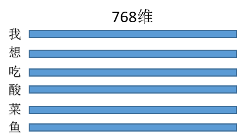
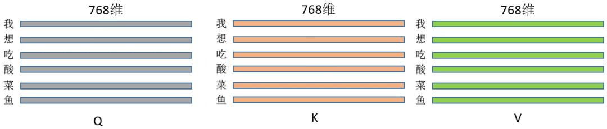
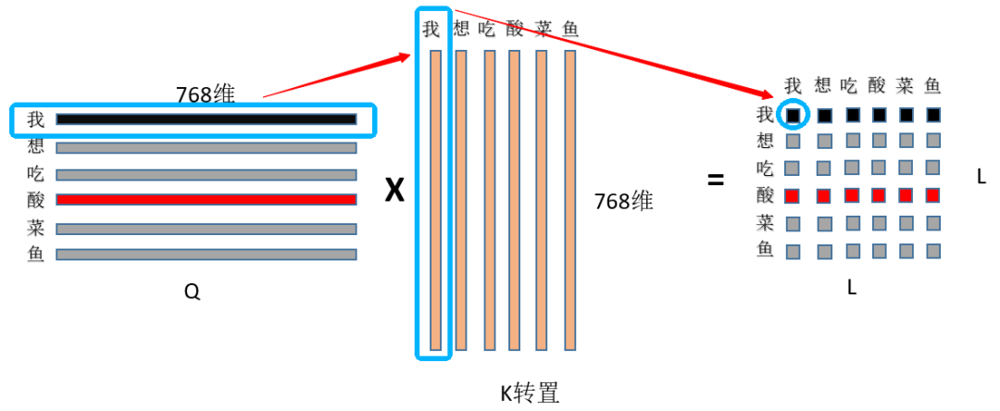
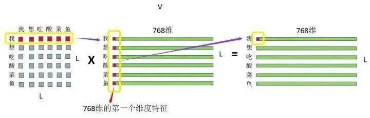
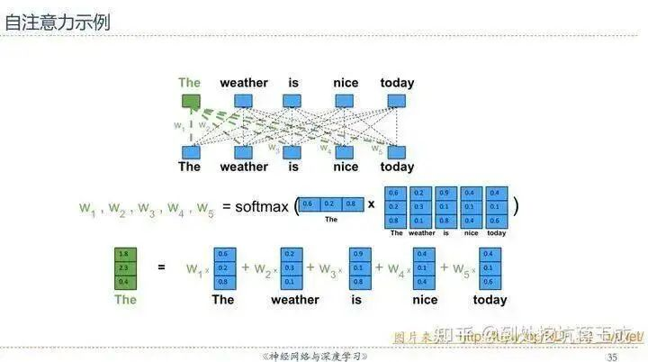

# Transformer | 如何理解attention中的Q,K,V？


## 解答一

我们直接用torch实现一个SelfAttention来说一说：

1. 首先定义三个线性变换矩阵，query, key, value：
  ```python
  class BertSelfAttention(nn.Module):
    self.query = nn.Linear(config.hidden_size, self.all_head_size) # 输入768， 输出768
    self.key = nn.Linear(config.hidden_size, self.all_head_size) # 输入768， 输出768
    self.value = nn.Linear(config.hidden_size, self.all_head_size)
  ```
  注意，这里的query, key, value只是一种操作(线性变换)的名称，实际的Q/K/V是它们三个的输出
2. 假设三种操作的输入都是同一个矩阵(暂且先别管为什么输入是同一个矩阵)，这里暂且定为长度为L的句子，每个token的特征维度是768，那么输入就是(L, 768)，每一行就是一个字，像这样：
   
   乘以上面三种操作就得到了Q/K/V，(L, 768)*(768,768) = (L,768)，维度其实没变，即此刻的Q/K/V分别为：
   
   代码为:
   ```python
   class BertSelfAttention(nn.Module):
    def __init__(self, config):
        self.query = nn.Linear(config.hidden_size, self.all_head_size) # 输入768， 输出768
        self.key = nn.Linear(config.hidden_size, self.all_head_size) # 输入768， 输出768
        self.value = nn.Linear(config.hidden_size, self.all_head_size) # 输入768， 输出768

    def forward(self, hidden_states): # hidden_states 维度是(L, 768)
        Q = self.query(hidden_states)
        K = self.key(hidden_states)
        V = self.value(hidden_states)
   ```
3. 然后来实现这个操作:
   $$Attention(Q,K_i,V_i)\color{red}{\boxed{=softmax(\frac{Q^TK_i}{\sqrt{d_k}})V_i}}$$
   ① 首先是Q和K矩阵乘，(L, 768)*(L, 768)的转置=(L,L)，看图：
   
   首先用Q的第一行，即“我”字的768特征和K中“我”字的768为特征点乘求和，得到输出(0，0)位置的数值，这个数值就代表了“我想吃酸菜鱼”中“我”字对“我”字的注意力权重，然后显而易见输出的第一行就是“我”字对“我想吃酸菜鱼”里面每个字的注意力权重；整个结果自然就是“我想吃酸菜鱼”里面每个字对其它字(包括自己)的注意力权重(就是一个数值)了~

   ② 然后是除以根号dim，这个dim就是768，至于为什么要除以这个数值？主要是为了缩小点积范围，确保softmax梯度稳定性，具体推导可以看这里：[莲生三十二：Self-attention中dot-product操作为什么要被缩放](https://zhuanlan.zhihu.com/p/149903065)，然后就是为什么要softmax，一种解释是为了保证注意力权重的非负性，同时增加非线性，还有一些工作对去掉softmax进行了实验，如[PaperWeekly：线性Attention的探索：Attention必须有个Softmax吗？](https://zhuanlan.zhihu.com/p/157490738)

   ③ 然后就是刚才的注意力权重和V矩阵乘了，如图：
   

   注意力权重 x VALUE矩阵 = 最终结果 </br>
   首先是“我”这个字对“我想吃酸菜鱼”这句话里面每个字的注意力权重，和V中“我想吃酸菜鱼”里面每个字的第一维特征进行相乘再求和，这个过程其实就相当于用每个字的权重对每个字的特征进行加权求和，然后再用“我”这个字对对“我想吃酸菜鱼”这句话里面每个字的注意力权重和V中“我想吃酸菜鱼”里面每个字的第二维特征进行相乘再求和，依次类推~最终也就得到了(L,768)的结果矩阵，和输入保持一致~

   整个过程在草稿纸上画一画简单的矩阵乘就出来了，一目了然~最后上代码：
   ```python
   class BertSelfAttention(nn.Module):
    def __init__(self, config):
        self.query = nn.Linear(config.hidden_size, self.all_head_size) # 输入768， 输出768
        self.key = nn.Linear(config.hidden_size, self.all_head_size) # 输入768， 输出768
        self.value = nn.Linear(config.hidden_size, self.all_head_size) # 输入768， 输出768

    def forward(self,hidden_states): # hidden_states 维度是(L, 768)
        Q = self.query(hidden_states)
        K = self.key(hidden_states)
        V = self.value(hidden_states)

        attention_scores = torch.matmul(Q, K.transpose(-1, -2))
        attention_scores = attention_scores / math.sqrt(self.attention_head_size)
        attention_probs = nn.Softmax(dim=-1)(attention_scores)

        out = torch.matmul(attention_probs, V)
        return out
   ```

4. 为什么叫**自注意力网络**？</br>
   因为可以看到Q/K/V都是通过同一句话的输入算出来的，按照上面的流程也就是一句话内每个字对其它字(包括自己)的权重分配；那如果不是自注意力呢？简单来说，Q来自于句A，K、V来自于句B即可~</br>

5. 注意，K/V中，如果同时替换任意两个字的位置，对最终的结果是不会有影响的，至于为什么，可以自己在草稿纸上画一画矩阵乘；也就是说注意力机制是没有位置信息的，不像CNN/RNN/LSTM；这也是为什么要引入positional embeding的原因。


## 解答二

其实直接用邱锡鹏老师PPT里的一张图就可以直观理解——假设D是输入序列的内容，完全忽略线性变换的话可以近似认为Q=K=V=D(所以叫做Self-Attention，因为这是输入的序列对它自己的注意力)，于是序列中的每一个元素经过Self-Attention之后的表示就可以这样展现：



也就是说，The这个词的表示，实际上是整个序列加权求和的结果——权重从哪来？点积之后Softmax得到——这里Softmax(QK)就是求权重的体现。我们知道，向量点积的值可以表征词与词之间的相似性，而此处的“整个序列”包括The这个词自己(再一次强调这是Self-Attention)，所以最后输出的词的表示，其“主要成分”就主要地包含它自身和跟它相似的词的表示，其他无关的词的表示对应的权重就会比较低。


## 解答三

首先附上链接：[张俊林：深度学习中的注意力模型(2017版)](https://zhuanlan.zhihu.com/p/37601161) 。这个几乎是我读到过的讲解Attention最为透彻的篇章之一了。

Q(Querry)代表查询值，对应Decoder的H(t-1)状态。这里要正确理解H(t-1)，想要解码出t时刻的输出，你送入Decoder的必然有前一时刻计算出的隐状态。好了，所谓查询，就是你要拿着这个Decoder中的H(t-1)去和Encoder中各个时刻的隐状态[H(1), H(2), ... , H(T)](也就是各个Key)去比，也就是二者计算相似度(对应于文献中的各种energy函数)。最后算出来的结果用Softmax归一化，这个算出来的权重就是带有注意力机制的权重，其实在翻译任务中，Key和Value是相等的。在Transformer的实现源码中，Key和Value的初始值也是相等的。有了这个权重之后，就可以用这个权重对Value进行加权求和，生成的这个新的向量就是带有注意力机制的语义向量 Context vector，而这个语义向量会权衡Target与Source的token与token的关系，从而实现解码输出时，与Source中“真正有决定意义”的token关联。

姑且画蛇添足的再说几句：
首先，Attention机制是由Encoder-Decoder架构而来，且最初是用于完成NLP领域中的翻译(Translation)任务。那么输入输出就是非常明显的 Source-Target的对应关系，经典的Seq2Seq结构是从Encoder生成出一个语义向量(Context vector)而不再变化，然后将这个语义向量送入Decoder配合解码输出。这种方法的最大问题就是这个语义向量，我们是希望它一成不变好呢？还是它最好能配合Decoder动态调整自己，来使Target中的某些token与Source中的真正“有决定意义”的token关联起来好呢？
这就是为什么会有Attention机制的原因。说到底，Attention机制就是想生成会动态变化的语义向量来配合解码输出。而新贵 Self-Attention则是为了解决Target与Source各自内部token与token的关系。在Transformer中，这两种注意力机制得到了有机的统一，释放出了异常惊人的潜力。


ref:</br>
[1]. https://mp.weixin.qq.com/s/v7N3lhMBSdoGCz4K3TmsmA

---

> 作者: [Jian YE](https://github.com/jianye0428)  
> URL: https://jianye0428.github.io/posts/attentionaqkv/  

