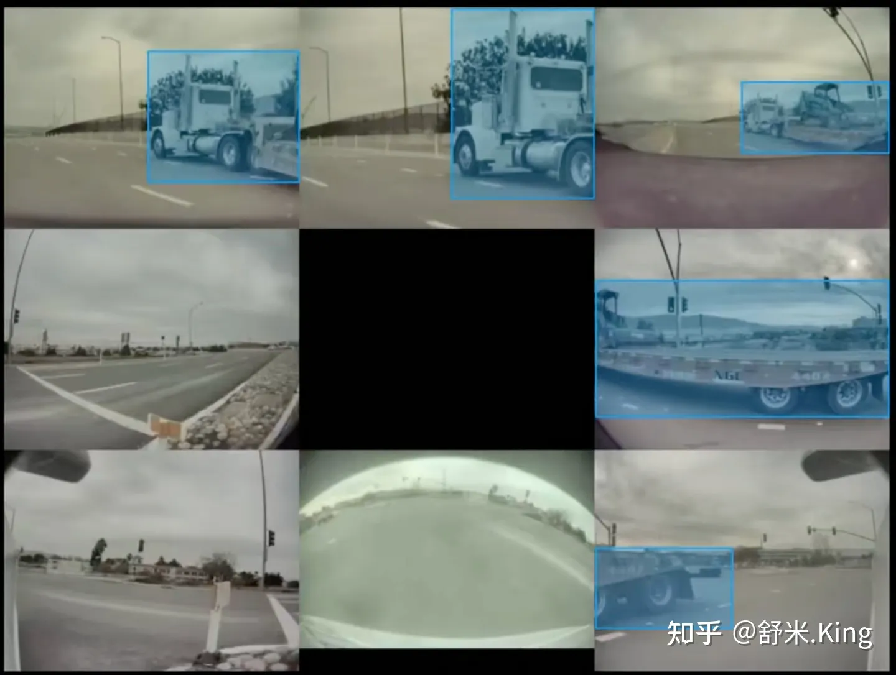

# BEVFormer 论文解读

## 1. 背景/Motivation

### 1.1 为什么视觉感知要用BEV？

相机图像描述的是一个2D像素世界，然而自动驾驶中利用相机感知结果的后续决策、路径规划都是在车辆所处的3D世界下进行。由此引入的2D和3D维度不匹配，就导致基于相机感知结果直接进行自动驾驶变得异常困难。

这种感知和决策规划的空间维度不匹配的矛盾，也体现在学开车的新手上。倒车泊车时，新手通过后视镜观察车辆周围，很难直观地构建车子与周围障碍物的空间联系，容易导致误操作剐蹭或需要尝试多次才能泊车成功，本质上还是新手从2D图像到3D空间的转换能力较弱。基于相机图像平面感知结果进行决策规划的自动驾驶AI，就好比缺乏空间理解力的驾驶新手，很难把车开好。

实际上，利用感知结果进行决策和路径规划，问题还出现在多视角融合过程中: 在每个相机上进行目标检测，然后对目标进行跨相机融合。如2021 TESLA AI Day给出的图1，带拖挂的卡车分布在多个相机感知野内，在这种场景下试图通过目标检测和融合来真实地描述卡车在真实世界中的姿态，存在非常大的挑战。

为了解决这些问题，很多公司采用硬件补充深度感知能力，如引入毫米波雷达或激光雷达与相机结合，辅助相机把图像平面感知结果转换到自车所在的3D世界，描述这个3D世界的专业术语叫做BEV map或BEV features(鸟瞰图或鸟瞰图特征)，如果忽略高度信息，就把拍扁后的自车坐标系叫做BEV坐标系(即鸟瞰俯视图坐标系)。

但另外一些公司则坚持不引入深度感知传感器，他们尝试从本质入手，基于视觉学习得到从图像理解空间的能力，让自动驾驶AI系统更像老司机，例如TESLA。Elon Musk认为: 人类不是超人，也不是蝙蝠侠，不能够眼放激光，也没安装雷达，但是通过眼睛捕捉到的图像，人类反复练习就可以构建出对周围世界的3D空间理解能力从而很好地掌握驾驶这项能力，那么要像人一样单纯利用眼睛(相机)进行自动驾驶就必须具备从2D图像平面到3D自车空间(BEV)的转换能力。

传统获取BEV map/features的方法有局限性，它一般是利用相机外参以及地面平面假设，即IPM(Inverse Perspective Mapping)方法，将图像平面的感知结果反投影到自车BEV坐标系。Tesla以前的方案也是这样，然而当车辆周围地面不满足平面假设，且多相机视野关联受到各种复杂环境影响的时候，这类方法就难以应付。

针对IPM方法获取BEV遇到的困难，TESLA自动驾驶感知负责人Andrej Karparthy的团队**直接在神经网络中完成图像平面到BEV的空间变换**，这一改变成为了2020年10月发布的FSD Beta与之前Autopilot产品最显著的差别。TESLA利用Transformer生成BEV Featrues，得到的Features通道数是256(IPM方法最多保留RGB3个channel)，这样能极大程度地保留图像信息，用于后续基于BEV Features的各种任务，如动、静态目标检测和线检测等。

### 1.2 生成BEV视角的方法有哪些？为何选用Transformer呢？

**把相机2D平面图像转换成BEV视角的方法有两种: <u>视觉几何方法</u>和<u>神经网络方法</u>。**

**视觉几何方法**: 基于IPM进行逐像素几何投影转换为BEV视角，再对多个视角的部分BEV图拼接形成完整BEV图。此方法有两个假设: 1.路面与世界坐标系平行，2.车辆自身的坐标系与世界坐标系平行。前者在路面非平坦的情况下并不满足，后者依赖车辆姿态参数(Pitch和Roll)实时校正，且精度要求较高，不易实现。

**神经网络方法**: 用神经网络生成BEV，其中的关键要找到合适的方法实现神经网络内部Feature Map空间尺寸上的变换。

实现空间尺寸变换的神经网络主流操作有两种方法，如图2所示: MLP中的Fully Connected Layer和Transformer Cross Attention(图片引用自[《超长延迟的特斯拉AI Day解析: 讲明白FSD车端感知》](https://zhuanlan.zhihu.com/p/458076977))

**MLP Fully Connected Layer方法:**

$$O=Act(W_{mlp}*X+b)$$

忽略非线性激活函数和bias后，可以写成:

$$O=W_{mlp}*X$$

**Transformer Cross Attention方法:**

$$O=Softmax(Q*K^T)*V$$

其中，K和V是输入图像特征X经线性变换后得到的；在最终输出的BEV视角下，把自车周围空间中的索引量称作 $\boldsymbol{\Phi}$

$$O=Softmax(\Phi W_q*(XW_K)^T)*XW_V=W_{transformer}(X,\Phi)*XW_V$$

BEV变换的本质是将输入的2D图像空间特征图转换成BEV特征图。在进行BEV转换之前，先通过多层CNN(或者任一图像处理backbone网络)在图像上提取特征，得到图像空间特征图层尺寸($h * w$)，即$X$的尺寸。 BEV变换输出O所在的BEV空间尺寸，是以自车位置为原点的前后左右各若干米范围内建立的栅格空间($x * y$)。

MLP Fully Connect Layer和Cross Attention的**显著差别**在于作用于输入量X的系数W: 全联接层的W，一旦训练结束后在Inference阶段是固定不变的；而Cross Attention的Transformer的系数W，是输入量X和索引量的函数，在Inference阶段会根据输入量X和索引量的不同发生改变。从这个角度来讲，使用Cross Attention来进行空间变换可能使模型获得更强的表达能力。

TESLA在2021年AI Day上仅介绍了用Transformer转换BEV Features的技术思想，并未披露更多实现细节。**论文BEVFormer充分研究了TESLA的技术思想后，利用Transformer融合图像的时、空特征，得到BEV Features，与TESLA的关键方法、实现效果都非常接近**。BEVFormer既通过论文披露了详尽方法，又在2022年6月开源了工程，接下来就围绕BEVFormer介绍如何通过Transformer获取BEV Features。

## 2. Method/Strategy——BEVFormer
### 2.1 Overall Architecture

如下图3所示: BEVFormer主体部分有6层结构相同的`BEVFormer encoder layers`，每一层都是由以transformer为核心的modules(TSA+SCA)，再加上FF、Add和Norm组成。BEVFormer encoder layer结构中有3个特别的设计: **BEV Queries**， **Spatial Cross-attention(SCA)**和**Temporal Self-attention(TSA)**。其中BEV Queries是栅格形可学习参数，承载着通过attention机制在multi-camera views中查询、聚合的features。SCA和TSA是以BEV Queries作为输入的注意力层，负责实施查询、聚合空间features(来自multi-camera images)和时间features(来自历史BEV)的过程。

下面分步骤观察BEV完整模型的前向推理过程:

- 在t时刻，输入车上多个视角相机的图像到backbone，输出各图像的多尺度特征(multi-scale features): $x = 1$, $F_t = {\{F^i_t\}}^a_b$, $F_t={\{{F_t^i}\}}_{i=1}^{N_{\text{view}}}$，其中 $F^i_t$ 是第i个视角相机的feature，$N_{view}$ 是多个相机视角的总数。同时，还要保留t-1时刻的BEV Features ${\boldsymbol{B}}_{t-1}$。
- 在每个BEVFormer Encoder layer中，首先用BEV Queries Q通过TSA模块从 ${\boldsymbol{B}}_{t-1}$ 中查询并融合时域信息(the temporal information)，得到修正后的BEV Queries $Q^{\prime}$；
- 然后在同一个BEVFormer Encoder layer中，对TSA“修证”过的BEV Queries $Q^{\prime}$ ，通过SCA模块从multi-camera features $F_{t}$ 查询并融合空域信息(spatial information)，得到进一步修正的BEV Queries $Q^{^{\prime\prime}}$ 。
- 这一层encoder layer把经过两次修正的BEV features $Q^{^{\prime\prime}}$ (也可以叫做BEV Queries)进行FF计算，然后输出，作为下一个encoder layer的输入。
- 如此堆叠6层，即经过6轮微调，t时刻的统一BEV features $B_{t}$ 就生成了。
- 最后，以BEV Features $B_{t}$ 作为输入，3D detection head和map segmentation head预测感知结果，例如3D bounding boxes和semantic map。

### 2.2 BEV Queries

BEVFormer采用显性定义BEV的方式，BEV Queries就是其中的显性BEV features。

可从3个概念循序渐进地认识/理解BEV Queries: **BEV平面 → BEV 感知空间 → BEV Queries**。

- **BEV 平面**
BEV平面($R^{H\times W\times1}$)是以自车为中心的栅格化二维平面，H、W是BEV平面在x、y方向的栅格尺寸，此平面显性地与车辆周围横、纵向物理空间关联，一个栅格表示s米，论文中把BEV平面中的栅格叫做2D参考点(2D reference points)。例如论文中定义nuScenes数据集栅格尺寸200x200，对应[-51.2米, 51.2米]，那么s就是0.512米。

- **BEV 感知空间**
BEV感知空间( $R^{H\times W\times N_{ref}}$ )把BEV平面在z轴方向选取 $N_{ref}$个**3D参考点**进行扩展，表示车辆周围有限空间。查看BEV开源工程可知，BEV感知空间的精确表示范围: 在nuScenes数据集中，是以Lidar作为中心点，前后各51.2m、左右各51.2m、向上3m、向下5m的矩形空间。
仔细深究作者这样设置的用意，会发现蛮有意思/意义: nuScenes采集车上安装的Lidar距地面高约1.84m，[-5m, 3m]的设置让BEV Queries感知空间在自车轮胎接地点平面以上部分约4.84m，接地点平面以下部分约3.16m。前者确保不仅能感知高大目标物，如货车等，还能感知覆盖坡度9.5%(4.84m/51.2m100%)上坡场景，后者保证感知覆盖坡度6.2%(3.16m/51.2m100%)下坡场景。备注: 坡度=(高程差/水平距离)x100%，车辆前进100m的垂直上升/下降高度，我国规定城市道路最大纵坡8％，公路9％。

- **BEV Queries**
BEV Queries是预定义的一组栅格形(grid-shaped)可学习参数，简称 $Q\in R^{H\times W\times C}$，它是对上述BEV 感知空间的特征描述，可直白地理解为学习完成了，它就变成了BEV features。
BEV Queries的H、W与BEV平面在x、y方向的栅格尺寸定义一致，因此也继承了BEV平面显性地与车辆周围横、纵向物理空间关联的特性。但C是BEV Queries作为features时在channel维度的尺寸，并不显性地对应于BEV平面z轴的物理空间尺寸。特别指出，位于 $p=(x,y)$ 处的某个query $Q_{p}\in R^{1\times C}$，表示BEV queries中的一个栅格。在输入到BEVFormer之前，BEV Queries加上了可学习的位置编码(learnable positional embedding)。
论文中多处提及BEV Queries和BEV features，它俩什么关系？本质上描述的是同一个东西么？
先说答案: 两者本质上是同一个东西。模型中预定义参数BEV Queries 输入到BEV Encoder layer，输出的就是经过1次微调过的BEV features，它作为下一层的输入时，又被看作下一层的BEV Queries。经过所有layers的多次微调，最后一个layer输出的就是BEV features ${\mathit{B}}_{t}$ ，作为各类感知task heads的输入。

### 2.3 SCA: Spatial cross-attention

如上图(b)所示，作者设计了一种空间交叉注意力机制，使 BEV queries 从多个相机的image Features中提取所需信息并转换为BEV Features。

每个BEV栅格的query在image features的哪些范围提取信息呢？这里有3个方案:

一、从image features的所有点上提取信息，即global attention。

二、从BEV栅格在image features的投影点上提取信息。

三、从BEV栅格在image features的投影点及其周围提取信息，即deformable attention。

由于使用了多尺度图像特征和高分辨率 BEV 特征(200x200)，如果采用方案一 global attention ，会带来无法负担的计算代价(显存和计算复杂度)。但是，方案一完全<u>用不到相机内外参</u>，这算是它**独有的优势**。

方案二依赖非常精确的相机内、外参，且不能充分利用image features上的局部区域信息。

因此作者选用了方案三，基于deformable attention 的**稀疏注意力机制**，使BEV Queries中的每个Query 只与其所代表世界坐标系物理空间投影到图像上的部分区域进行交互，且解除了对相机内、外参的高精度依赖。注意，这里复数BEV Queries表示整个BEV图，而单数Query表示BEV 图中位于 $(x, y)$的一个栅格。

$$\mathrm{SCA}(Q_p,F_t)=\frac1{|\mathcal{V}_\mathrm{hit}|}\sum_{i\in\mathcal{V}_\mathrm{hit}}\sum_{j=1}^{N_\mathrm{ref}}\mathrm{Deform}\mathrm{Attn}(Q_p,\mathcal{P}(p,i,j),F_t^i)\quad\quad\quad\quad(2)$$

在DeformAttn()中，$Q_{p}$、$P(p,i,j)$ 和 $F_{t}^{i}$ 分别表示query, reference points和输入特征。

通俗理解公式: **在BEV Query对应的图像2D features 有效区域附近计算注意力，把图像2D features加权融合到BEV Query作为SCA的输出**。

参考图(b)和上述公式2，总结Spatial cross-attention的实现方式:

1. 对于每一个位于 $(x, y)$ 位置的 BEV query $Q_{p}$ ，计算其对应真实世界的坐标 $(x^{'},y^{'})$。然后将 BEV query 在z方向进行 lift 操作，设置 $N_{ref}$ 个 3D参考点，即对应 $N_{ref}$ 个世界坐标系下的3D空间参考点。
2. 通过相机内外参，把第j个3D参考点投影到 $v_{hit}$ 个相机图像上。受相机感知范围限制，每个3D参考点一般只在 1-2 个相机上找到有效的投影点(反过来描述，每个相机的features只与部分BEV queries构成有效投影关系)。
3. 基于 Deformable Attention，把像平面上的这些投影点作为2D图像参考点，在其周围对 $F_{t}^{i}$ 进行特征采样，得到sampled features。
4. 最后，对 $V_{hit}$ 、$N_{ref}$ 个sampled features进行加权求和，作为spatial cross-attention的输出来更新BEV query，从而完成 spatial 空间的特征聚合。

详细介绍一下第2步中如何把3D参考点投影到相机图像上获得2D参考点:

- 首先计算位于 $p = (x, y)$ 的query $Q_{p}$ 在以车辆为中心世界坐标 $(x^{'},y^{'})$
$$x^{^{\prime}}=(x-W/2)*s; \quad y^{^{\prime}}=(y-{H}/2)*s$$
  其中H和W是BEV queries的尺寸，s是BEV中一个栅格所代表的物理空间尺寸;
- 计算第j个3D参考点投影到第i个相机图像上的2D参考点坐标:
$$P(p,i,j)=(x_{i,j},y_{i,j})$$
  其中，
$$z_{i,j}[x_{i,j},y_{i,j},1]^T=T_i*[x^{'},y^{'},z^{'},1]^T$$
  $T_i$ 是第 $i$ 个相机的投影矩阵。

### 2.4 TSA: Temporal self-attention

从经典 RNN 网络获得启发，将 BEV 特征 $B_t$ 视为能够传递序列信息的 memory。每一时刻生成的 BEV 特征 $B_t$ 都从上一时刻的 BEV 特征  $B_{t-1}$ 获取所需的时序信息，这样能保证动态地获取所需的时序特征，而非像堆叠不同时刻 BEV 特征那样只能获取定长的时序信息。

$$\text{TSA}(Q_p,\{Q,B'_{t-1}\})=\sum_{V\in\{Q,B'_{t-1}\}}\text{DeformAttn}(Q_p,p,V),\quad(5)$$

参考图4和上述公式5，总结temporal self-attention的实现方法:

1. 给定t-1时刻的 BEV 特征 $B_{t-1}$ ，先根据 ego motion 将 $B_{t-1}$ 对齐到 $t$ 时刻，来确保 $B_{t-1}$ 和 $B_{t}$ 在相同index位置的栅格对应于现实世界的同一位置，把时间对齐后的BEV特征记作 $B_{t-1}^{'}$ 。
2. $t$ 时刻位于 $(x, y)$ 处的 BEV query所表征的物体可能静态或者动态，它在t-1时刻会出现在 $B_{t-1}^{'}$ 的 $(x, y)$ 周围，因此利用 deformable attention 以 $(x, y)$ 作为参考点在其周围进行特征采样。

上述方法**没有显式地设计遗忘门**，而是通过 attention 机制中的 attention weights 来平衡历史时序特征和当前 BEV 特征的融合过程。

**关于TSA的后记**: BEVFormer V2对 BEVFormer的时域融合方法TSA做了修改。

BEVFormer中TSA采用了继承式的时域信息融合方式: 利用attention机制在t时刻融合了t-1时刻的BEV features信息，由于t-1时刻的BEV features 也融合了更早时刻(t-2)的信息，因此t时刻BEV features间接地融合了比t-1时刻更早的信息。

但是这种继承式时域融合方式有遗忘的特点，即不能有效利用较长时间的历史信息。

BEVFormer V2把时域融合改成了: 根据ego motion，把过去多个时刻的BEV features 对齐到当前时刻，然后在channel 维度把这些对齐后的BEV features 与当前时刻BEV features串联，然后用Residual 模块降低channel数，就完成了时域融合。

综合2.3和2.4节，观察6个 BEVFormer Encoder Layers的完整结构会发现， BEV query 既能通过 spatial cross-attention 聚合空间特征，又能通过 temporal self-attention 聚合时序特征，这个过程会重复多次，让时空特征融合能够相互促进，最终得到更好的融合BEV features。

### 2.5 Application of BEV Features

BEV Features $B_{t}\in R^{H\times W\times C}$ 是可用于多种自动驾驶感知任务的2D feature map， 基于2D 感知方法稍加改动就可在 $B_t$ 上开发3D目标检测和map segmentation任务。

**3D object detection**

参考2D 目标检测器Deformable DETR，论文设计了end-to-end的3D目标检测head，修改部分包括: 用single-scale 的BEV features $B_t$ 作为检测头的输入，预测输出3D b-boxes和速度而不是2D b-boxes，仅用 $L_1$ loss监督3D b-boxes的回归。继承DETR方法的优势，预测有限数目的候选目标集合(开源工程中设为300个)，这种end-to-end的检测头不需要NMS后处理。

**map segmentation**

参考2D segmentation 方法Panoptic SegFormer，论文设计了map segmentation head。因为基于BEV的map segmentation基本上与常见语义分割相同，作者利用了参考文章[22]中的mask decoder和class-fixed queries设计head来查找每个语义类别，包括car、vehicle、road(可通行区域)和车道线。

### 2.6 Implementation details

训练时的实施细节:

- 对于时间t，在过去2s中随机选取3个时刻t-3、t-2和t-1；
- 在初始3个时刻，循环生成BEV features $\{B_{t-3},B_{t-2},B_{t-1}\}$，且在此阶段不计算梯度；
- 计算第一个时刻t-3的temporal self-attention输出时，它并没有前序BEV features，就用它自身作为前序时刻输入，那么temporal self-attention暂时退化成了self-attention。

inference时的实施细节:

按照时间顺序计算图像序列中的每一帧，前序时刻的BEV features被保持下来并用于后一时刻，这种online的inference策略在应用中比较高效。

## 3. Experiments

### 3.1 experimental settings

1. 采用两种Backbone: ResNet101-DCN，采用来自FCOS3D训练得到的参数；VoVnet-99，采用来自DD3D训练得到的参数。
2. 默认情况下，使用FPN输出的多尺度 features的尺寸包含1/16，1/32，1/64(注意，代码中实际用好的1/8尺寸的features，即nuScenes中的116*200的FPN输出)，同时把dimension C设为256。
3. 在nuScenes数据集试验中，BEV queries尺寸设为200x200，对应感x和y方向的知范围都是[-51.2m, 51.2m]，对应BEV Grid尺寸精度是0.512m。
4. 在Waymo数据集试验中，BEV queries尺寸设为300x220，对应感x方向的感知范围是[-35.0m, 75.0m]，y方向的知范围是[-75.0m, 75.0m]，对应BEV Grid尺寸精度是0.5m。自车中心位于 BEV的(70，150)处。
5. 对每个BEV query，在 spatial cross-attention模块中，设置 $N_{ref}=4$ 个3D参考点，预定义它们对应的高度范围是-5m到3m。
6. 对每个2D图像参考点(3D参考点投影到2D view上的点)，在其周围选取4个采样点送入SCA。
7. 默认情况下，训练24epoches，学习率设为 $12\times10^{-4}$。
8. **Baselines**: 为了合理评估task heads的影响，公平地与其它生成BEV方法对比。选择VPN和Lift-Splat作为baselines，对它们head之前的部分替换BEVFormer，保留task heads和其它设置。
论文中，通过把temporal self-attention修改为普通的self-attention，这样就使BEVFormer变成了一个静态模型，命名为**BEVFormer-S**，它不使用历史BEV Features。

### 3.2 3D目标检测结果

BEVFormer的3D检测性能，如Table1、Table2和Table3所示，远超之前最优方法DETR3D。

BEVFormer引入了temporal information，因此它在估计目标速度方面效果也很好。从速度估计指标mean Average Velocity (mAVE)来看，BEVFormer误差为0.378m/s，效果远好于同类基于相机的方法，甚至逼近了基于激光的方法。

### 3.3 multi-tasks perception results
联合训练3D detection和map segmentation任务，与单独训练比较训练效果，如Table4所示: 对3D目标检测和分割中的车辆类语义感知，联合训练效果有提升；对分割中的road、lane类的语义感知，联合训练效果反而会下降。

### 3.4 消融试验
Spatial Cross-attention有效性

为了验证SCA的有效性，利用不包含TSA的BEVFormer-S来设计消融试验，结果如Table5所示。

默认的SCA基于deformable attention，在对比试验中构建了基于2种不同attention机制的baselines: 1. 用global attention取代deformable attention；2. 让每个query仅与它的图像参考点交互，而不是像SCA那样query与图像参考点周围区域交互。为了扩大对比范围，把BEVFormer中的BEV生成方法替换为了VPN和Lift-Spalt中的方法。从Table5结果可见Deformable Attention方法显著优于其它方法，且在GPU Memory使用量和query兴趣区域大小之间实现了balance。

**Temporal Self-attention有效性**

从Table1和Table4可见，在相同的设置下，BEVFormer相比于BEVFormer-S的性能大幅提升，针对有挑战性的检测任务提升更明显。TSA主要是在以下方面影响性能提升的: 1.temporal information的引入对提高目标速度估计精度非常有益；2.利用temporal information，目标预测的location和orientations更精确；3.受益于temporal information包含过去时刻object的信息，如图4所示，严重遮挡目标的recall 更高。根据nuScenes标注的遮挡程度把验证数据集进行划分成4部分，来评估BEVFormer对各种程度遮挡的性能，针对每个数据子集都会计算average recall(匹配时把中心距离的阈值设为2m)。

**Model Scale and Latency**

针对不同Scale Settings的BEVFormer，对比检测性能和latency，结果如Table6所示。在3方面进行BEVFormer的Scale配置: 1. 输入到BEVFormer Encoder的features是multi-scale还是single-scale；2.BEV Queries/features的尺寸；3. encoder layer数目。

从实验结果看来: Backbone的Latency远大于BEVFormer，因此Latency优化的主要瓶颈在于Backbone而不是BEVFormer(这里指BEVFormer Encoder部分)，BEVFormer可以采用不同的Scale，具备支持灵活平衡性能和efficiency的特性。

## 4. Discussion
理论上视觉图像的数据比激光数据稠密，但基于视觉的BEV效果还是比基于激光的方法性能差，那么也说明了理论上视觉还有可提升空间。
BEV Features能用于泊车位检测么？ 可能可以用BEVFormer在环视鱼眼相机上生成BEV features，用于泊车位检测或近距离目标的精确检测。
显性地引入BEV 特征，限制了最大检测距离，在高速公路场景，检测远处目标非常重要，如何权衡BEV的大小与检测距离是一个需要考虑的问题。
如何在检测精度和grid大小之间做平衡是一个问题。
针对2、3问题的一个优化方向: 设计自适应尺寸的BEV特征。这里的自适应是指根据场景来调整BEV尺寸或精度。

## 5. References

论文: [《BEVFormer: Learning Bird’s-Eye-View Representation from Multi-Camera Images via Spatiotemporal Transformers》](https://link.zhihu.com/?target=https%3A//arxiv.org/pdf/2203.17270.pdf)

开源工程: https://github.com/zhiqi-li/BEVFormer

参考中文解读

1. [使用Transformer融合时空信息的自动驾驶感知框架](https://zhuanlan.zhihu.com/p/495819042)
2. [3d camera-only detection: BEVFormer](https://zhuanlan.zhihu.com/p/491890969)
3. [BEVFormer，通过一个时空Transformer学习 BEV表征](https://zhuanlan.zhihu.com/p/496284695)

类似工作:
Cross-view Transformers for real-time Map-view Semantic Segmentation
论文: https://arxiv.org/pdf/2205.02833v1.pdf

代码: https://github.com/bradyz/cross

REF:
[1]. [一文读懂BEVFormer论文](https://zhuanlan.zhihu.com/p/538490215)
https://zhuanlan.zhihu.com/p/543335939
https://zhuanlan.zhihu.com/p/629792598

---

> 作者: [Jian YE](https://github.com/jianye0428)  
> URL: https://jianye0428.github.io/posts/bevformer/  

