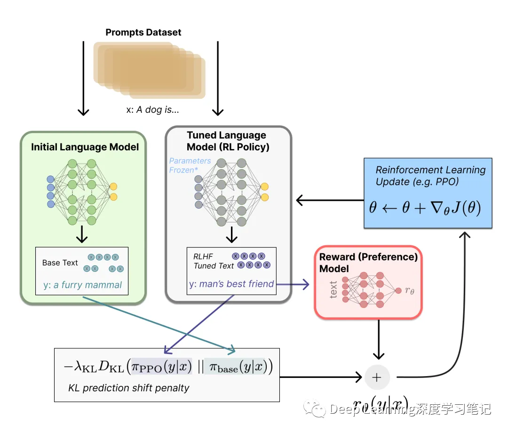
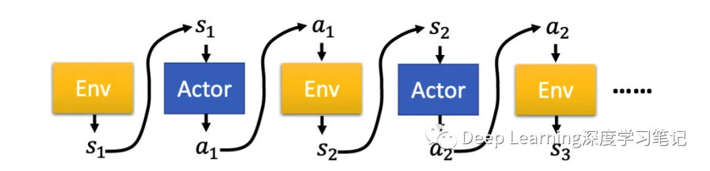
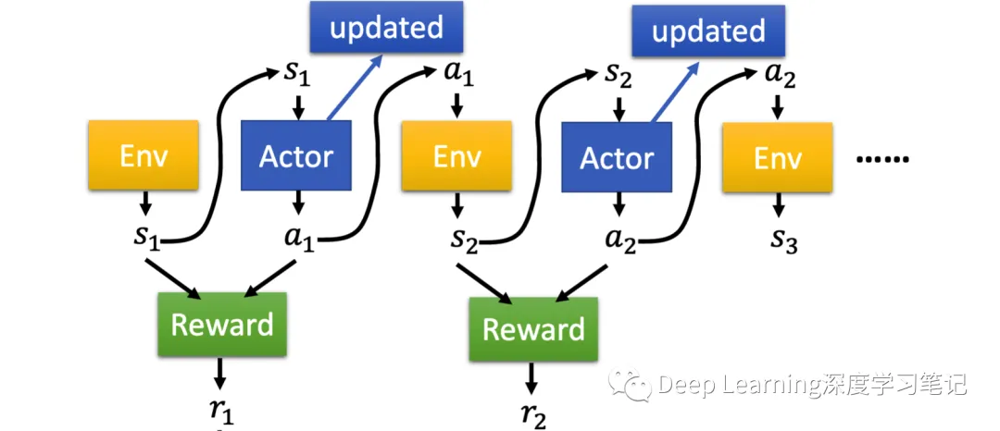
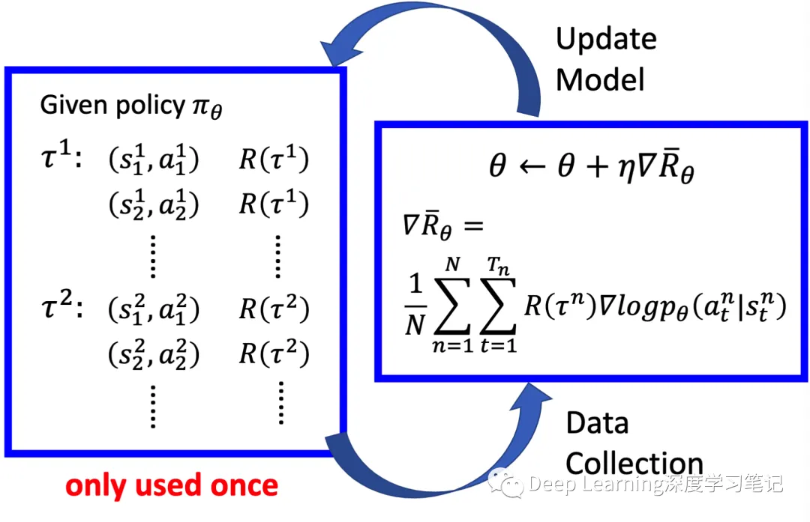
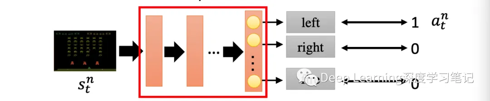
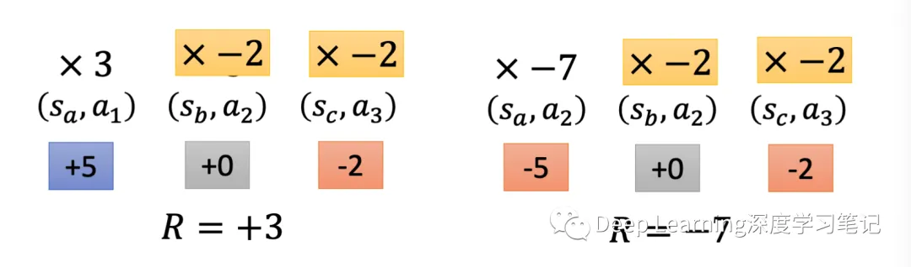
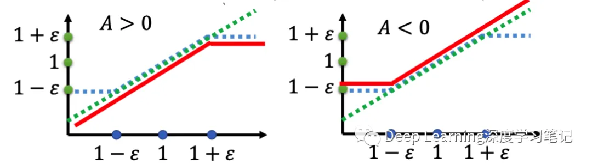

# 一文详解 ChatGPT RLHF 背后的 PPO 强化学习训练

## 0. 引言

 

  
   
  
BP Network

 

最近火出圈的🚀 ChatGPT 中 RLHF 主要采用了就是 PPO 进行强化学习训练

> 主要运用在微调阶段（微调整个 10B～100B+ 参数的成本其实也非常高 ）使用**策略梯度**强化学习 (Policy Gradient RL) 算法、近端策略优化 (PPO) 微调初始 LM 的部分或全部参数。

 

  
   
  
BP Network

 

> 以下主要参考台大李宏毅的推导过程

## 01. Vanilla policy gradient

- 动作/环境/奖励之间的关系：

 

  
   
  
BP Network

 

轨迹可表示为集合

$$\begin{aligned}p\_{\theta}(\tau)&=p(s\_1)p\_\theta(a\_1|s\_1)p(s\_2|s\_1,a\_1)p\_\theta(a\_1|s\_1)p(s\_3|s\_2,a\_2)\ldots\\\\&=p(s\_1)\prod\_{t=1}^Tp\_\theta(a\_t|s\_t)p(s\_{t+1}|s\_t,a\_t)\end{aligned}$$

 

  
   
  
BP Network

 

一个轨迹的奖励总和为：

$$R(\tau)=\sum\_{t=1}^Tr\_t$$

则奖励的期望为：

$$\bar{R}\_\theta=\sum\_\tau R(\tau)p\_\theta(\tau)=E\_{\tau\sim p\_\theta(\tau)}[R(\tau)]$$

将 $R(\tau)$ 看成常量，对其求微分：

$$\begin{aligned}
\nabla\bar{R}\_{\theta}& =\sum\_{\tau}R(\tau)\nabla p\_{\theta}(\tau) \\\\
&=\sum\_{\tau}R(\tau)p\_{\theta}(\tau)\frac{\nabla p\_{\theta}(\tau)}{p\_{\theta}(\tau)} \\\\
&=\sum\_{\tau}R(\tau)p\_{\theta}(\tau)\nabla\log p\_{\theta}(\tau)\quad\nabla f(x)=f(x)\nabla\log f(x) \\\\
&=E\_{\tau\sim p\_{\theta}(\tau)}[R(\tau)\nabla\log p\_{\theta}(\tau)]& \left(2\right) \\\\
&\approx\frac1N\sum\_{n=1}^{N}R(\tau^{n})\nabla\log p\_{\theta}(\tau^{n}) \\\\
&=\frac1N\sum\_{n=1}^N\sum\_{t=1}^{T\_n}R(\tau^n)\nabla\log p\_\theta(a\_t^n|s\_t^n)
\end{aligned}$$

策略网络梯度更新：

 

  
   
  
BP Network

 

可以看成一个分类问题（游戏中通过键盘输入来互动，分类类别为所有可操作的键位）：

 

  
   
  
BP Network

 

- 理想情况下， 并不一直为正数，增加一个 baseline:

$$\nabla\bar{R}\_{\theta}=\frac{1}{N}\sum\_{n=1}^{N}\sum\_{t=1}^{{T\_{n}}}(R(\tau^{n})-b)\nabla\log p\_{\theta}(a\_{t}^{n}|s\_{t}^{n})b\approx E[R(\tau)]$$

> 在电子游戏中，奖励值常常为正（通常为游戏分数）。这时需要增加一个偏置来保证同时有正样本和负样本

- 分配合适的学分

一个高分的游戏轨迹中也可能存在错误的动作，同样的，一个低分的游戏轨迹也可能存在正确的动作，而上文中的计算将最后的奖励值（最后的游戏分数）都一视同仁视为该游戏轨迹每个动作的学分。

为了更准确地描述每个动作所得到的学分，将一个动作执行后对应的学分为后续的所有奖励值的总和

 

  
   
  
BP Network

 

$$\begin{aligned}
\nabla\bar{R}\_\theta& =\frac1N\sum\_{n=1}^N\sum\_{t=1}^{T\_n}(R(\tau^n)-b)\nabla\log p\_\theta(a\_t^n|s\_t^n) \Downarrow\nabla\bar{R}\_\theta \\\\
&= \frac1N\sum\_{n=1}^N\sum\_{t=1}^{T\_n}(\sum\_{t^{\prime}=t}^{T\_n}r\_{t^{\prime}}^n-b)\nabla\log p\_\theta(a\_t^n|s\_t^n)
\end{aligned}$$

当某个动作执行以后，其对后续的奖励分数的影响在慢慢减少，再增加一个衰减因子：

$$\begin{aligned}
\nabla\bar{R}\_\theta& =\frac1N\sum\_{n=1}^N\sum\_{t=1}^{T\_n}(\sum\_{t^{\prime}=t}^{T\_n}r\_{t^{\prime}}^n)\nabla\log p\_\theta(a\_t^n|s\_t^n)\Downarrow\nabla\bar{R}\_\theta \\\\
& = \frac{1}{N}\sum\_{n=1}^{N}\sum\_{t=1}^{T\_{n}}(\sum\_{t^{\prime}=t}^{T\_{n}}\gamma^{t^{\prime}-t}r\_{t^{\prime}}^{n}-b)\nabla\log p\_{\theta}(a\_{t}^{n}|s\_{t}^{n}),\gamma<1
\end{aligned}$$

## 02. 从on-policy到off-policy

两者区别:
  - On-policy: 学习到的 agent 和与环境交互的 agent 是相同的，每一次梯度更新都需要重新采样
  - Off-policy: 学习到的 agent 和与环境交互的 agent 是不同的，每次梯度更新不需要重新采样

重新看看 的表达式：
  $$\nabla\bar{R}\_\theta=E\_{\tau\sim p\_\theta(\tau)}[R(\tau)\nabla\log p\_\theta(\tau)]$$
  - 使用策略网络 收集数据。当 更新后，则需要重新收集训练样本
  - 目标：使用相同的样本（通过 采样）训练 。其中 为固定的，因此我们可以重复使用其样本数据

### 2.1 重要性采样（Importance Sampling）

考虑一个场景，假如正在尝试计算函数 $f(x)$ 的期望值，其中 $x \sim f(x)$ 服从某种分布。则对 $E(f(x))$ 有以下估计：

$$E\_{x\sim p}[f(x)]=\int f(x)p(x)dx\approx\frac{1}{n}\sum\_{i}f(x\_{i})$$

蒙特卡洛抽样方法是简单地从分布 $p(x)$ 中抽出 ，然后取所有样本的平均值来得到期望值的估计。那么问题来了，如果  $p(x)$  非常难取样怎么办？是否能够根据一些已知的、容易抽样的分布来估计期望值？

答案是肯定的。公式的一个简单转换就可以做到

$$E\_{x\sim p}[f(x)]=\int f(x)p(x)dx=\int f(x)\frac{p(x)}{q(x)}q(x)dx=E\_{x\sim q}[f(x)\frac{p(x)}{q(x)}]$$

其中$x$从分布$q(x)$中采样，$q(x)$不应为 0。通过这种方式，估计期望能够从另一个分布$q(x)$中采样，$p(x)/q(x)$是称为采样率或采样权重，它作为校正权重以抵消来自不同分布的概率采样。

- 重要性采样的缺陷

虽然重要性采样保证了期望的一致，但是这里来计算一下方差是否一致

方差的计算：

$$Var[X]=E[X^2]-(E[X])^2$$

分别计算方差：

$$\begin{aligned}Var\_{x\sim p}[f(x)]&=E\_{x\sim p}[f(x)^2]-(E\_{x\sim p}[f(x)])^2\\\\Var\_{x\sim q}[f(x)\frac{p(x)}{q(x)}]&=E\_{x\sim q}[(f(x)\frac{p(x)}{q(x)})^2]-(E\_{x\sim q}[f(x)\frac{p(x)}{q(x)}])^2\\\\&=E\_{x\sim p}[f(x)^2\frac{p(x)}{q(x)}]-(E\_{x\sim p}[f(x)])^2\end{aligned}$$

可以发现两者虽然期望相等但方差并不一致

### 2.2 从 on-policy 到 off-policy

我们使用重要性采样将 on-policy 调整为 off-policy

$$\nabla\bar{R}\_\theta=E\_{\tau\sim p\_{\theta^{\prime}}(\tau)}[\frac{p\_\theta(\tau)}{p\_{\theta^{\prime}}(\tau)}R(\tau)\nabla\log p\_\theta(\tau)]$$

- 从 $\theta'$ 采样得到数据集
- 使用该 数据集多次训练 $\theta$

梯度更新过程：

$$\begin{aligned}
&=E\_{(s\_t,a\_t)\sim\pi\_\theta}[A^\theta(s\_t,a\_t)\nabla\log p\_\theta(a\_t^n|s\_t^n)] \\\\
&=E\_{(s\_t,a\_t)\sim\pi\_{\theta^{\prime}}}[\frac{p\_\theta(s\_t,a\_t)}{p\_{\theta^{\prime}}(s\_t,a\_t)}A^{\theta^{\prime}}(s\_t,a\_t)\nabla\log p\_\theta(a\_t^n|s\_t^n)] \\\\
&=E\_{(s\_t,a\_t)\sim\pi\_{\theta^{\prime}}}[\frac{p\_\theta(a\_t|s\_t)}{p\_{\theta^{\prime}}(a\_t|s\_t)}\frac{p\_\theta(s\_t)}{p\_{\theta^{\prime}}(s\_t)}A^{\theta^{\prime}}(s\_t,a\_t)\nabla\log p\_\theta(a\_t^n|s\_t^n)]& \text{(4)} \\\\
&=E\_{(s\_t,a\_t)\sim\pi\_{\theta^{\prime}}}[\frac{p\_\theta(a\_t|s\_t)}{p\_{\theta^{\prime}}(a\_t|s\_t)}A^{\theta^{\prime}}(s\_t,a\_t)\nabla\log p\_\theta(a\_t^n|s\_t^n)]
\end{aligned}$$

- 其中 $A^\theta(s\_t,a\_t)$ 指的是 advantage 函数,其计算方式为加上衰减机制后的奖励值并减去基线。
- 由于 $\frac{p\_\theta(s\_t)}{p\_{\theta'}(s\_t)}$ 的值难以计算，将其设置为 1，简化计算

目标函数可以表示为：

由于 $\nabla f(x)=f(x)\nabla\log f(x)$ 再结合不定积分，目标函数可以表示为:

$$J^{\theta'}(\theta)=E\_{(s\_t,a\_t)\sim\pi\_{\theta'}}[\frac{p\_\theta(a\_t|s\_t)}{p\_{\theta'}(a\_t|s\_t)}A^{\theta'}(s\_t,a\_t)]$$

## 03. PPO/TRPO

为了消除重要性采样的缺陷的影响，以下为两种方式

- PPO（Proximal Policy Optimization）
  - 初始化策 略网络参数
  - 在每次迭代过程中:
  - 目标函数:
  - 使用 与环境互动以收集 ，并计算出 advantage 值
  - 更新 优化
  - 算法:

$$\begin{aligned}
PPO algorithm: \\\\
J\_{PPO}^{\theta^k}(\theta) & = J^{\theta^k}(\theta)-\beta KL(\theta,\theta^k)J^{\theta^k}(\theta) \\\\
& = E\_{(s\_{t},a\_{t})\sim\pi\_{\theta^{k}}}[\frac{p\_{\theta}(a\_{t}|s\_{t})}{p\_{\theta^{k}}(a\_{t}|s\_{t})}A^{\theta^{k}}(s\_{t},a\_{t})] \\\\
& \approx \sum\_{(s\_{t},a\_{t})}\frac{p\_{\theta}(a\_{t}|s\_{t})}{p\_{\theta^{k}}(a\_{t}|s\_{t})}A^{\theta^{k}}(s\_{t},a\_{t})
\end{aligned}$$

自适应 KL 惩罚：如果 $KL(\theta,\theta^k)>KL\_{\max}$ ,增大 $\beta$; 如果 $KL(\theta,\theta^k) <KL\_{\min}$,减小 $\beta$。

 

  
   
  
BP Network

 

- TRPO（Trust Region Policy Optimizatio）

$$J\_{TRPO}^{\theta'}(\theta)=E\_{(s\_t,a\_t)\sim\pi\_{\theta'}}[\frac{p\_\theta(a\_t|s\_t)}{p\_{\theta'}(a\_t|s\_t)}A^{\theta'}(s\_t,a\_t)]KL(\theta,\theta')<\delta $$

TRPO 和 PPO 在各个测试上性能差不多。但相比 PPO ，TRPO 计算要更复杂

**参考文献**:

[1] https://spinningup.openai.com/en/latest/algorithms/ppo.html

[2] https://openai.com/research/openai-baselines-ppo

[3] https://huggingface.co/blog/deep-rl-ppo

[4] https://huggingface.co/blog/rlhf

[5] https://mp.weixin.qq.com/s/zhkNDNDEJV3BEdcgeuHkOA

---

> 作者: [Jian YE](https://github.com/jianye0428)  
> URL: https://jianye0428.github.io/posts/chatgpt_rlhf/  

