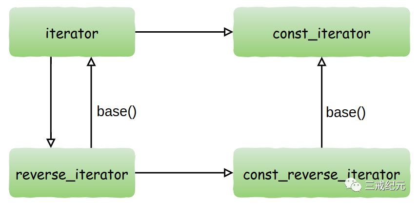

# Effective STL [26] | 尽量用iterator代替const_iterator，reverse_iterator和const_reverse_iterator


## 4种迭代器

每个标准容器类都提供4种迭代器类型:`iterator`,`const_iterator`，`reverse_iterator`和`const_reverse_iterator`

对于`container<T>`而言，`iterator`的作用相当于`T*`，而`const_iterator`则相当于`const T*`。

增加一个`iterator`或者`const_iterator`可以在一个从容器开头趋向尾部的遍历中让你移动到容器的下一个元素。

`reverse_iterator`与`const_reverse_iterator`同样相当于对应的`T`和`const T`，所不同的是，增加`reverse_iterator`或者`const_reverse_iterator`会在从尾到头的遍历中让你移动到容器的下一个元素。


## vector<T>的insert和erase的样式

```c++
iterator insert(iterator position, const T& x);
iterator erase(iterator position);
iterator erase(iterator rangeBegin, iterator rangeEnd);
```

这些方法只接受`iterator`类型的参数，而不是`const_iterator`、`reverse_iterator`或`const_reverse_iterator`。总是`iterator`。

## 迭代器之间存在的转换关系



图中显示了从`iterator`到`const_iterator`、从`iterator`到`reverse_iterator`和从`reverse_iterator`到`const_reverse_iterator`可以进行隐式转换。

并且，`reverse_iterator`可以通过调用其`base成员函数`转换为`iterator`。`const_reverse_iterator`也可以类似地通过`base`转换成为`const_iterator`。

通过base得到的也许并非你所期待的iterator。

而且，**没有办法从一个const_iterator转换得到一个iterator，也无法从const_reverse_iterator得到reverse_iterator**。

所以，当你需要指出插入位置或删除的元素时，const迭代器几乎没有用。

## 尽量使用iterator取代const或者reverse类型的迭代器

1. `insert`和`erase`的一些版本要求`iterator`。如果你需要调用这些函数，你就必须产生`iterator`，而不能用`const`或`reverse iterators`。

2. 不可能把`const_iterator`隐式转换成`iterator`。从一个`const_iterator`产生一个`iterator`的技术并不普遍适用，而且不保证高效。

3. 从`reverse_iterator`转换而来的`iterator`在转换之后可能需要相应的调整。

`iterator`与`reverse_iterator`之间的选择显而易见——依赖于从前到后或从后到前的遍历。

**迭代器比较**

当在`iterator`和`const_iterator`之间作选择的时候，你有更充分的理由选择`iterator`，即使`const_iterator`同样可行而且即使你并不需要调用容器类的任何成员函数。其中的令人讨厌的原因包括`iterator`与`const_iterator`之间的比较：

```c++
typedef deque<int> IntDeque; // typedef可以极大地简化STL容器类和iterator的操作。
typedef IntDeque::iterator Iter;
typedef IntDeque::const_iterator ConstIter;
Iter i;
ConstIter ci;
... // 同一个容器
if (i == ci) ... // 比较iterator和const_iterator
```

唯一的变化是等号的一边的类型是`iterator`，而另一边的类型是`const_iterator`。

**因为`iterator`应该在比较之前隐式的转换成`const_iterator`，真正的比较应该在两个`const_iterator`之间进行。**

**如果一些实现将`const_iterator`的`operator==`作为`const_iterator`的一个成员函数而不是非成员函数。**

而问题的解决之道显得非常有趣：只要像这样交换两个`iterator`的位置：

```c++
if (ci == i)... // 当上面比较无法通过编译时的解决方法
```

**迭代器混用**

不仅是比较是否相等，只要你在同一个表达式中混用`iterator`和`const_iterator`（或者`reverse_iterator`和`const_reverse_iterator`），这样的问题就可能会出现:

```c++
if (i - ci >= 3) ... // 如果i与ci之间至少有三个元素...
```

如果迭代器的类型不同，你的正确的代码可能会被错误地拒绝。

本例中最简单的解决方法是**通过一个（安全的）映射把iterator转换为const_iterator**:

```c++
if (static_cast<ConstIter>(i) - ci >= 3) ... // 当上面的代码无法通过编译时的解决方法
```

**避免这类问题的最简单的方法是减少混用不同类型的迭代器的机会。**

---

> 作者: [Jian YE](https://github.com/jianye0428)  
> URL: https://jianye0428.github.io/posts/clause_26/  

