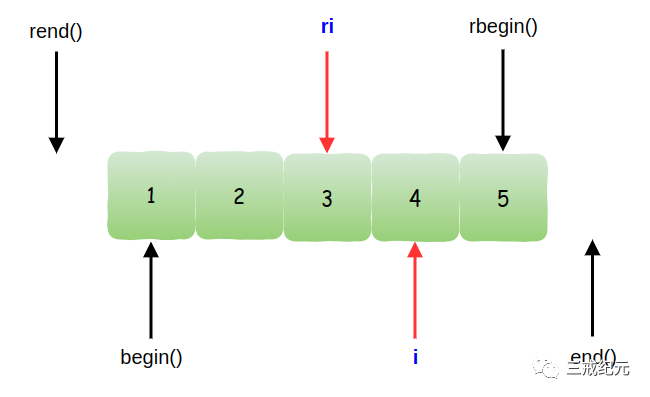

# Effective STL [28] | 了解如何通过reverse_iterator的base得到iterator


## Example

通过reverse_iterator的base初始化一个iterator:

```c++
vector<int> v;
v.reserve(5); // 参见条款14
for(int i = 0；i < 5; ++ i) { // 向vector插入1到5
 v.push_back(i);
}
vector<int>::reverse_iterator ri = find(v.rbegin(), v.rend(), 3); // 使ri指向3
vector<int>::iterator i(ri.base()); // 使i和ri的base一样
```

执行上述代码后，可以想到产生的结果就像这样:



上图显示了`reverse_iterator`和它对应的`base iterator`之间特有的偏移量，就像`rbegin()`和`rend()`与相关的`begin()`和`end()`一样，但是它并没有解释怎样在`ri`上实现你在i上想要完成的操作。

正如条款26解释的，有些容器的成员函数只接受`iterator`类型的参数，所以如果你想要在`ri`所指的位置插入一个新元素，你不能直接这么做，因为`vector`的`insert`函数不接受`reverse_iterator`。

如果你想要删除ri所指位置上的元素也会有同样的问题。`erase`成员函数会拒绝`reverse_iterator`，坚持要求`iterator`。

## reverse_iterator转换成iterator

为了完成删除和一些形式的插入操作，你必须先通过base函数将reverse_iterator转换成iterator，然后用iterator来完成工作。

**插入操作**

假设你要在ri指出的位置上把一个新元素插入v。假设你要插入的值是99。

**ri在上图中遍历的顺序是自右向左，而且插入操作会将新元素插入到ri位置，并且将原先ri位置的元素移到遍历过程的“下一个”位置，我们认为3应该出现在99的左侧。**插入操作之后，v看起来像这样:


我们不能用`ri`来指定插入的地方，因为它不是一个`iterator`。我们必须用`i`来代替。如上所述，当`ri`指向3时，`i`（就是`ri.base()`）指向4。

如果我们用`ri`来指定插入位置，那么用i指向插入位置，那个假设就是正确的。

**结论**

> 要实现在一个reverse_iterator ri指出的位置上插入新元素，在ri.base()指向的位置插入就行了。
> 对于insert操作而言，ri和ri.base()是等价的，而且ri.base()真的是ri对应的iterator。


**删除操作**

如果你要删除ri指向的元素，你不能直接使用i了，因为i与ri不是指向同一个元素。因此，你要删除的是i的前一个元素。

```c++
vector<int> v;
... // 向v插入1到5，同上
vecot<int>::reverse_iterator ri =
find(v.rbegin(), v.rend(), 3); // 同上，ri指向3
v.erase(--ri.base()); // 尝试删除ri.base()前面的元素；
// 对于vector，一般来说编译不通过
```

表达式`--ri.base()`确实能够指出我们需要删除的元素。而且，它们能够处理除了`vector`和`string`之外的其他所有容器。

它可能也能处理vector和string，但对于大多数vector和string的实现，它无法通过编译。

在这样的实现下，`iterator`(和`const_iterator`)会采用内建的指针来实现，所以`ri.base()`的结果是一个指针。

**原因剖析**

C和C++都规定了不能直接修改函数返回的指针，所以在string和vector的迭代器是指针的STL平台上，像`--ri.base()`这样的表达式无法通过编译。

要移植从一个由`reverse_iterator`指出的位置删除元素时，你应该尽量避免修改base的返回值。

所以，如果你不能减少调用`base`的返回值，只需要先增加`reverse_iterator`的值，然后再调用`base`！

```c++
... // 同上
v.erase((++ri).base()); // 删除ri指向的元素；
// 这下编译没问题了！
```
**这个方法适用于所有的标准容器，这是删除一个由reverse_iterator指出的元素时首选的技巧**

## 结论

`reverse_iterator`的`base`成员函数返回一个“对应的”`iterator`的说法并不准确：对于插入操作而言，的确如此; 但是对于删除操作，并非如此。

当需要把`reverse_iterator`转换成`iterator`的时候，有一点非常重要的是你必须知道你准备怎么处理返回的`iterator`，因为只有这样你才能决定你得到的`iterator`是否是你需要的。

---

> 作者: [Jian YE](https://github.com/jianye0428)  
> URL: https://jianye0428.github.io/posts/clause_28/  

