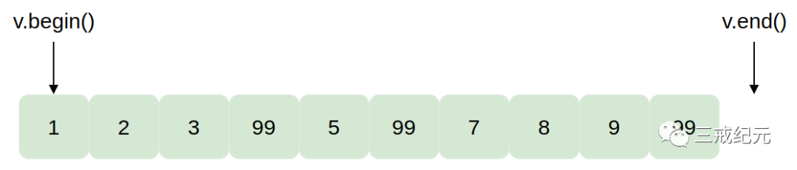
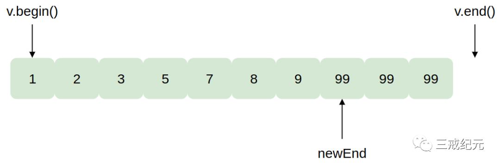

# Effective STL [32] | 如果你真的想删除东西的话就在类似remove的算法后接上erase


## remove实际作用

### remove的声明
```c++
template<class ForwardIterator, class T>
ForwardIterator remove(ForwardIterator first, ForwardIterator last, const T& value);
```

remove接收指定它操作的元素区间的一对迭代器。它不接收一个容器，所以**remove不知道它作用于哪个容器**。

此外，remove也不可能发现容器，因为没有办法从一个迭代器获取对应于它的容器。

### remove不做什么

从容器中除去一个元素，唯一的方法是调用那个容器的一个成员函数，几乎都是erase的某个形式，(list有几个除去元素的成员函数不叫erase，但它们仍然是成员函数。)因为唯一从容器中除去一个元素的方法是在那个容器上调用一个成员函数，而且因为remove无法知道它正在操作的容器，所以remove不可能从一个容器中除去元素。

从一个容器中remove元素不会改变容器中元素的个数：

```c++

vector<int> v;
v.reserve(10);
// 建立一个vector<int> 用1-10填充它(调用reserve的解释在条款14)
for (int i = 1; i <= 10; ++i) {
 v.push_back(i);
}
cout << v.size();
// 打印10
v[3] = v[5] = v[9] = 99;
// 设置3个元素为99
remove(v.begin(), v.end(), 99); // 删除所有等于99的元素
cout << v.size(); // 仍然是10！
```

<font color=blue>remove并不“真的”删除东西，因为它做不到。</font>

**remove不知道它要从哪个容器删除东西，而没有容器，它就没有办法调用成员函数。**

### remove 做了什么

remove移动指定区间中的元素直到所有“不删除的”元素在区间的开头(相对位置和原来它们的一样)。它返回一个指向最后一个的下一个“不删除的”元素的迭代器。返回值是区间的“新逻辑终点”。

举个例子，这是v在调用remove前看起来的样子：



如果我们把remove的返回值存放在一个叫做newEnd的新迭代器中:

```c++
vector<int>::iterator newEnd(remove(v.begin(), v.end(), 99));
```

这是调用后v看起来的样子:



如果“不删除的”元素在v中的v.begin()和newEnd之间，“删除的”元素就必须在newEnd和v.end()之间。

**remove并没有改变区间中元素的顺序，所以不会把所有“删除的”元素放在结尾，并安排所有“不删除的”值在开头。**

如果你不想失去任何值，你可能应该调用partition或stable_partition而不是remove。

### remove 实际操作流程

在内部，remove遍历这个区间，把要“删除的”值覆盖为后面要保留的值。这个覆盖通过对持有被覆盖的值的元素赋值来完成。

1. remove检测v[0]，发现它的值不是要被删除的，然后移动到v[1]。同样的情况发生在v[1]和v[2]。
2. 发现v[3]应该被删除，所以它记录下v[3]的值应该被覆盖，然后它移动到v[4]。这类似记录v[3]是一个需要填充的“洞”。
3. 发现v[4]的值应该被保持，所以它把v[4]赋给v[3]，记录下v[4]应该被覆盖，然后移动到v[5]。继续类似的压缩，它用v[4]“填充”v[3]而且记录v[4]现在是一个洞。
4. 发现v[5]应该被删除，所以忽略并它移动到v[6]。仍然记得v[4]是一个等待填充的洞。
5. 发现v[6]是一个应该保留的值，所以把v[6]赋给v[4]。记得v[5]现在是下一个要被填充的洞，然后移到v[7]。
6. 在某种意义上类似上面的，检查v[7]、v[8]和v[9]。把v[7]赋给v[5]，v[8]赋给v[6]，忽略v[9]，因为v[9]的值是要被删除的。
7. 返回指定下一个要被覆盖的元素的迭代器，在这个例子中这个元素是v[7]。


事实上当remove在删除时覆盖的值是指针时，会有重要的影响。但是对于本条款，知道remove不从容器中除去任何元素因为它做不到就够了。

## 应该在remove后面接上erase

只有容器成员函数可以除去容器元素，而那是本条款的整个要点：**如果你真的要删除东西的话，你应该在remove后面接上erase**。

要除去那些元素，你要做的所有事情就是用那两个迭代器调用erase的区间形式。因为remove本身很方便地返回了区间新逻辑终点的迭代器:

```c++
vector<int> v;
// 正如从前
v.erase(remove(v.begin(), v.end(), 99), v.end());
cout << v.size();
// 真的删除所有等于99的元素，现在返回7
```

事实上，remove和erase是亲密联盟，这两个整合到list成员函数remove中。这是STL中唯一名叫remove又能从容器中除去元素的函数：

```c++
list<int> li;  // 建立一个list放一些值进去
li.remove(99); // 除去所有等于99的元素：真的删除元素，所以它的大小可能改变了
```

调用这个remove函数是一个STL中的矛盾。在关联容器中类似的函数叫erase，list的remove也可以叫做erase。但它没有，所以我们都必须习惯它。

**对于list，调用remove成员函数比应用erase-remove惯用法更高效。**

## 类似remove的算法

`remove_if`和`unique`。 remove和remove_if之间的相似性很直截了当。

unique行为也像remove。它用来从一个区间删除东西(邻近的重复值)而不用访问持有区间元素的容器。如果你真的要从容器中删除元素，你也必须成对调用unique和erase，unique在list中也类似于remove。正像list::remove真的删除东西(而且比erase-remove惯用法高效得多)。

`list::unique`也真的删除邻近的重复值(也比erase-unique高效)。


---

> 作者: [Jian YE](https://github.com/jianye0428)  
> URL: https://jianye0428.github.io/posts/clause_32/  

