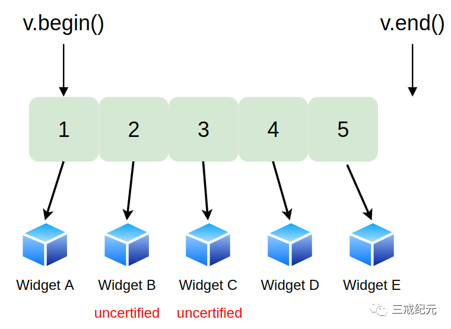
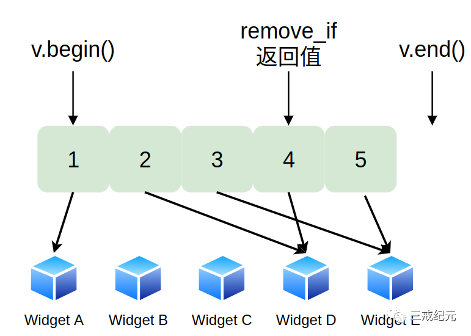
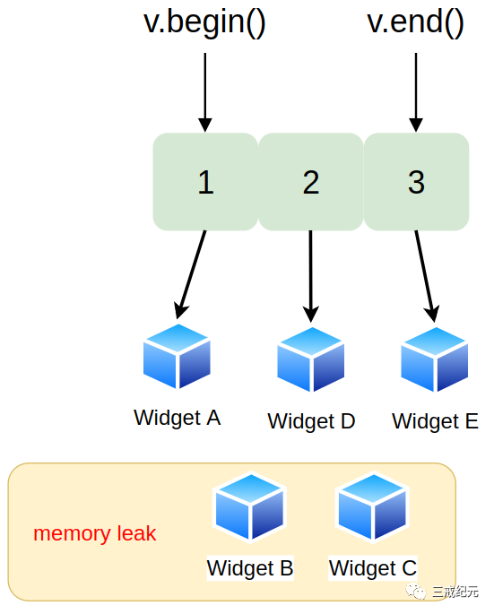

# Effective STL [33] | 提防在指针的容器上使用类似remove的算法


## 删除含有指针的容器元素

如果你在管理一堆动态分配的Widgets，每一个都可能通过检验，你把结果指针保存在一个vector中：

```c++
class Widget{
public:
...
    // 这个Widget是否通过检验
    bool isCertified() const;
...
};

// 建立一个vector然后用动态分配的Widget的指针填充
vector<Widget*> v;
...
v.push_back(new Widget);
```

当和v工作一段时间后，你决定除去未通过检验的Widget，因为你不再需要它们了。

**尽量用算法调用代替显式循环和关于remove和erase之间关系的描述**，你自然会想到转向erase-remove惯用法，虽然这次你使用了remove_if：

```C++
v.erase(remove_if(v.begin(), v.end(),
// 删除未通过检验的Widget指针
not1(mem_fun(&Widget::isCertified))),
v.end());
// 关于mem_fun的信息参见条款41
```

条款7介绍过摧毁容器中的一个指针也不会删除指针指向的东西的讨论，所以这里当调用erase时，极可能你已经泄漏了资源。

## 资源泄露分析

我们假设在调用remove_if前，v看起来像这样：



在调用remove_if后，一般来说v看起来像这样（包含从remove_if返回的迭代器）：



资源泄漏的理由现在很明朗了。指向Widget B和C的“删除的”指针被vector中后面的“不删除的”指针覆盖。没有什么指向两个未通过检验的Widget，它们也没有被删除，它们的内存和其他资源泄漏了。

一旦remove_if和erase返回后，情况看起来像这样：



现在你也很清楚为什么应该努力避免在动态分配的指针的容器上使用remove和类似算法（remove_if和unique）。

在很多情况下，你会发现**partition算法是合理的替代品**。


## 正确删除做法

如果你无法避免在那样的容器上使用remove，排除这个问题一种方法是在**应用erase-remove惯用法之前先删除指针并设置它们为空，然后除去容器中的所有空指针**：

```c++
void delAndNullifyUncertified(Widget *&pWidget) {
  // 如果*pWidget是一个未通过检验Widget，
  if (!pWidget->isCertified()) {
    // 删除指针
    delete pWidget;
    // 并且设置它为空
    pWidget = 0;
  }
}

// 把所有指向未通过检验Widget的指针删除并且设置为空
for_each(v.begin(), v.end(), delAndNullifyUncertified);
// 从v中除去空指针0必须映射到一个指针，
v.erase(remove(v.begin(), v.end(),
               static_cast<Widget *>(0)),
        v.end());
// 让C++可以正确地推出remove的第三个参数的类型
```

当然，这假设vector并不容纳任何你想保留的空指针。如果有的话，你可能必须自己写循环来按你的方式删除指针。

### 智能指针

如果你把指针的容器替换成**执行引用计数的智能指针的容器**，删除相关的困难就不存在了，你可以直接使用erase-remove惯用法：

```c++
template<typename T>
// RCSP = “引用计数智能指针”
class RCSP { ...};
// RCSPW = “RCSP to Widget”
typedef RCSP< Widget> RCSPW;

// 建立一个vector，用动态分配Widget的智能指针填充它
vector<RCSPW > v;
v.push_back(RCSPW(new Widget));

...
// erase未通过检验的Widget的指针
v.erase(remove_if(v.begin(), v.end(),
  not1 (mem_fun(&Widget::isCertified))),
  v.end());
// 没有资源泄漏
```

要让这些工作，你的**智能指针类型就必须可以（比如`RCSP<Widget>`）隐式转换为相应的内建指针类型（比如`Widget*`）**。那是因为容器持有智能指针，但被调用的成员函数（比如`Widget::isCertified`）要的是内建指针。如果不存在隐式转换，你的编译器会抗议的。


---

> 作者: [Jian YE](https://github.com/jianye0428)  
> URL: https://jianye0428.github.io/posts/clause_33/  

