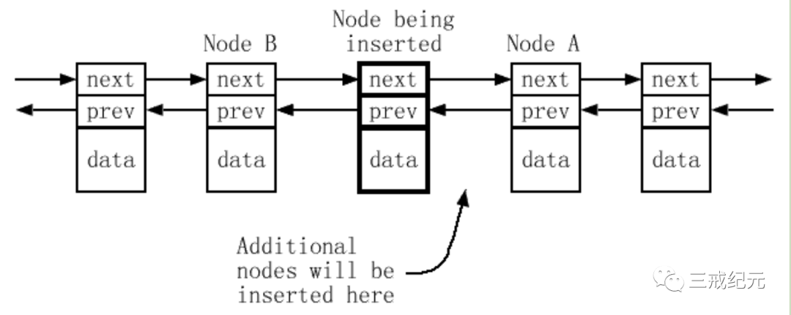

# Effective STL [5] | 尽量使用区间成员函数代替它们的单元素兄弟


<!-- 
note abstract info tip success question warning failure danger bug example quote
 -->

<!--more-->

ref:</br>
[1]. https://mp.weixin.qq.com/s?__biz=MzUyMDc2MDMxNg==&mid=2247490705&idx=1&sn=830797e69b61fe9693bf4aaea72df4b3&chksm=f9e42202ce93ab1437ad36c37e141b0794328495c0c584d808d0f4ad36251680dbfba257b060&cur_album_id=3009999611861975043&scene=189#wechat_redirect

## Example

Q：给定两个vector，v1和v2，使v1的内容和v2的后半部分一样的最简单方式是什么？

A：
```c++
v1.assign(v2.begin() + v2.size() / 2, v2.end());
```

这个测验设计为做两件事:

1. 它提供给我一个机会来提醒你assign成员函数的存在

太多的程序员没注意到这是一个很方便的方法。**它对于所有标准序列容器（vector，string，deque和list）都有效。**

无论何时你必须完全代替一个容器的内容，你就应该想到赋值。

如果你只是拷贝一个容器到另一个同类型的容器，`operator=`就是选择的赋值函数，但对于示范的那个例子，当你想要给一个容器完全的新数据集时，assign就可以利用，但`operator=`做不了。

2. 演示为什么区间成员函数优先于它们的单元素替代品。

区间成员函数是一个像STL算法的成员函数，使用两个迭代器参数来指定元素的一个区间来进行某个操作。

不用区间成员函数来解决这个条款开头的问题，你就必须写一个显式循环，可能就像这样:

```c++
vector<Randy> v1, v2; // 假设v1和v2是Randy的vector
v1.clear();
for (vector<Randy>::const_iterator ci = v2.begin() + v2.size() / 2;
ci != v2.end(); ++ci) {
    v1.push_back(*ci);
}
```
写这段代码比写assign的调用要做多得多的工作。

**copy 替代循环**

```c++
v1.clear();
copy(v2.begin() + v2.size() / 2, v2.end(), back_inserter(v1))
```

虽然在这段代码中没有表现出循环，在copy中的确存在一个循环 。

效率损失仍然存在。

几乎所有目标区间是通过插入迭代器（比如，通过inserter，back_inserter或front_inserter）指定的copy的使用都可以——应该——通过调用区间 成员函数来代替。

比如这里，这个copy的调用可以用一个insert的区间版本代替：

```c++
v1.insert(v1.end(), v2.begin() + v2.size() / 2, v2.end());
```

这个输入量稍微比调用copy少，但它发生的也比说的要直接：数据插入v1。

这里insert 也比 copy 好，因为字面上insert 表示有数据插入到了 v1中，而copy 的使用把它变得晦涩。

**关于东西被拷贝这个事实并没有什么好关注的，因为STL构建在东西会被拷贝的假定上。拷贝对STL来说很基本。**

**小结**

我们已经确定3个尽量使用区间成员函数代替它们的单元素兄弟的理由。 ● 一般来说使用区间成员函数可以输入更少的代码。 ● 区间成员函数会导致代码更清晰更直接了当。


## 效率


当处理标准序列容器时，应用单元素成员函数比完成同样目的的区间成员函数需要更多地内存分配，更频繁地拷贝对象，而且/或者造成多余操作。

对此，我之前还做了个单元素兄弟插入和批量插入的效率比较的文章[《vector 用 insert 批量插入效率高还是emplace_back效率高》](https://mp.weixin.qq.com/s?__biz=MzUyMDc2MDMxNg==&mid=2247490268&idx=1&sn=fcf5b24ec09e544f1f0fea544e59bfd6&chksm=f9e4244fce93ad5988926b2cba002426ada65b79d4672b7bad565fff633c52a29f9f451d6494&token=855912511&lang=zh_CN&scene=21#wechat_redirect)，也证实了这个观点。

标准要求区间`insert`函数直接把现有元素移动到它们最后的位置，也就是，开销是每个元素一次移动。总共开销是n次移动，numValues次容器中的对象类型的拷贝构造函数，剩下的是类型的赋值操作符。

相比单元素插入策略，区间insert少执行了n*(numValues-1)次移动。

花一分钟想想。这意味着如果numValues是100，insert的区间形式会比重复调用insert的单元素形式的代码少花费99%的移动！

仅当可以不用失去两个迭代器的位置就能决定它们之间的距离时，一个区间insert函数才能在一次移动中把一个元素移动到它的最终位置。

这几乎总是可能的，因为所有前向迭代器提供了这个功能，而且前向迭代器几乎到处都是。

所有用于标准容器的迭代器都提供了前向迭代器的功能。非标准的散列容器的迭代器也是。

在数组中表现为迭代器的指针也提供了这样的功能。事实上，唯一不提供前向迭代器能力的标准迭代器是输入和输出迭代器。

**单元素插入的问题**

- 当你试图去把一个元素插入内存已经满了的vector时，这个vector会分配具有更多容量的新内存，从旧内存把它的元素拷贝到新内存，销毁旧内存里的元素，回收旧内存。然后它添加插入的元素。

- 每当用完内存时，大部分vector实现都使它们的容量翻倍，所以插入numValues个新元素会导致最多$\log_2{numValues}$次新内存的分配。

- 每次一个地插入1000个元素会导致10次新的分配（包括它们负责的元素拷贝）。

与之对比的是，一个区间插入可以在开始插入东西前计算出需要多少新内存（假设给的是前向迭代器），所以它不用多于一次地重新分配vector的内在内存。

刚才进行分析是用于vector的，但同样的理由也作用于string。

**deque**

对于deque，理由也很相似，但deque管理它们内存的方式和vector和string不同，所以重复内存分配的论点不能应用。

但是，关于**很多次不必要的元素移动**的论点通常通过对函数调用次数的观察也应用到了（虽然细节不同）。

**list**

在这里使用insert区间形式代替单元素形式也有一个性能优势。

关于重复函数调用的论点当然继续有效，但因为链表的工作方式，拷贝和内存分配问题没有发生。

取而代之的是，这里有一个新问题：过多重复地对list中的一些节点的next和prev指针赋值。

每当一个元素添加到一个链表时，持有元素的链表节点必须有它的next和prev指针集，而且当然新节点前面的节点（我们叫它B，就是“before”）必须设置它的next指针，新节点后面的节点（我们叫它A，就是“after”）必须设置它的prev指针



当一系列新节点通过调用list的单元素insert一个接一个添加时，除了最后一个以外的其他新节点都会设置它的next指针两次，第一次指向A，第二次指向在它后面插入的元素。每次在A前面插入时，它都会设置它的prev指针指向一个新节点。

如果numValues个节点插入A前面，插入节点的next指针会发生次多余的赋值，而且A的prev指针会发生numValues-1次多余的赋值。合计次没有必要的指针赋值。当然，指针赋值很轻量，但如果不是必须，为什么要为它们花费呢？

**避免开销的关键是使用list的insert区间形式。**因为那个函数知道最后有多少节点会被插入，它可以避免多余的指针赋值，对每个指针只使用一次赋值就能设置它正确的插入后的值

## 区间函数

参数类型iterator意思是容器的迭代器类型，也就是container::iterator。

参数类型InputIterator意思是可以接受任何输入迭代器。

- **区间构造**

所有标准容器都提供这种形式的构造函数：

```c++
container::container(InputIterator begin, // 区间的起点
InputIterator end); // 区间的终点
```

如果传给这个构造函数的迭代器是`istream_iterators`或`istreambuf_iterators`，你可能会遇到C++的最惊异的解析，原因之一是你的编译器可能会因为把这个构造看作一个函数声明而不是一个新容器对象的定义而中断。

- **区间插入**

所有标准序列容器都提供这种形式的insert:
```c++
void container::insert(iterator position, // 区间插入的位置
InputIterator begin, // 插入区间的起点
InputIterator end); // 插入区间的终点
```

关联容器使用它们的比较函数来决定元素要放在哪里，所以它们了省略position参数。

```c++
void container::insert(lnputIterator begin, InputIterator end);
```

当寻找用区间版本代替单元素插入的方法时，不要忘记有些单元素变量用采用不同的函数名伪装它们自己。比如，`push_front`和`push_back`都把单元素插入容器，即使它们不叫`insert`。如果你看见一个循环调用`push_front`或`push_back`，或如果你看见一个算法——比如copy——的参数是`front_inserter`或者`back_inserter`，你就发现了一个`insert`的区间形式应该作为优先策略的地方。

- **区间删除**

每个标准容器都提供了一个区间形式的`erase`，但是序列和关联容器的返回类型不同。

**序列容器**提供了这个：

```c++
iterator container::erase(iterator begin, iterator end);
```

关联容器提供这个:
```c++
void container::erase(iterator begin, iterator end);
```

Q：为什么不同？

A：解释是，如果erase的关联容器版本返回一个迭代器（被删除的那个元素的下一个）会**招致一个无法接受的性能下降**。

这个条款的对insert的性能分析大部分也同样可以用于erase。单元素删除的函数调用次数仍然大于一次调用区间删除。当使用单元素删除时，每一次元素值仍然必须向它们的目的地移动一位，而区间删除可以在一个单独的移动中把它们移动到目标位置。

关于vector和string的插入和删除的一个论点是必须做很多重复的分配。（当然对于删除，会发生重复的回收。）那是因为用于vector和string的内存自动增长来适应于新元素，但当元素的数目减少时它不自动收缩。

- **区间赋值**

所有标准列容器都提供了区间形式的assign:
```c++
void container::assign(InputIterator begin, InputIterator end);
```

## 结论

几乎所有目标区间被插入迭代器指定的copy的使用都可以用调用的区间成员函数的来代替 。

尽量使用区间成员函数来代替单元素兄弟的三个可靠的论点。区间成员函数更容易写，它们更清楚地表达你的意图，而且它们提供了更高的性能。那是很难打败的三驾马车。

---

> 作者: [Jian YE](https://github.com/jianye0428)  
> URL: https://jianye0428.github.io/posts/clause_5/  

