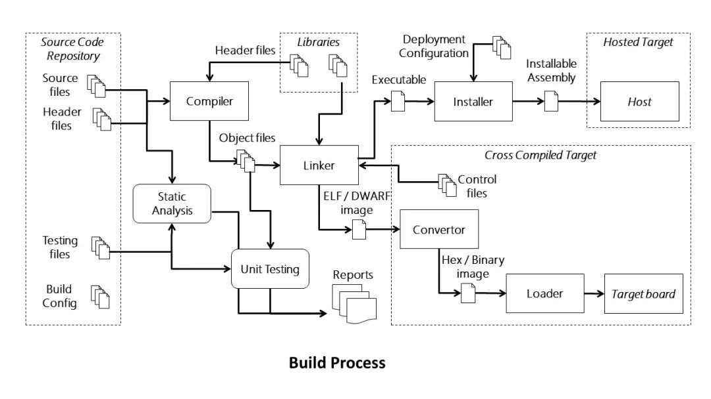
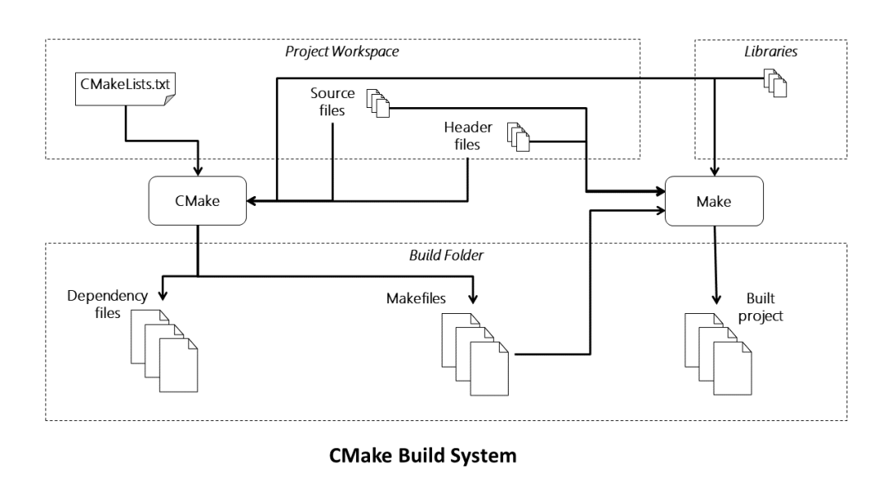
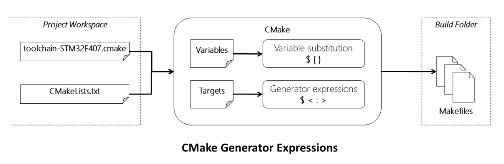
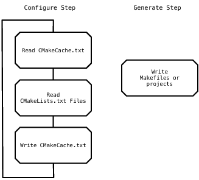
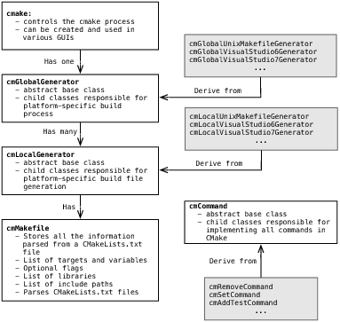
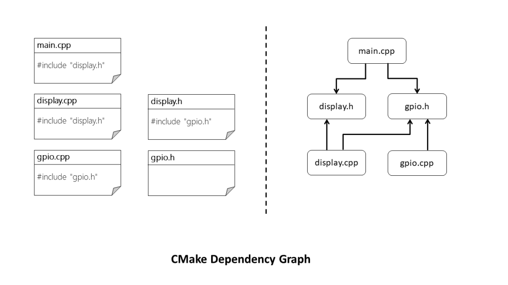

# CMake 简介

## 1. 总览

**什么是CMake？**
> CMake是个一个开源的跨平台自动化建构系统，用来管理软件建置的程序，并不相依于某特定编译器。并可支持多层目录、多个应用程序与多个库。 它用配置文件控制建构过程（build process）的方式和Unix的make相似，只是CMake的配置文件取名为CMakeLists.txt。
> CMake并不直接建构出最终的软件，而是产生标准的建构档（如Unix的Makefile或Windows Visual C++的projects/workspaces），然后再依一般的建构方式使用。
> 这使得熟悉某个集成开发环境（IDE）的开发者可以用标准的方式建构他的软件，这种可以使用各平台的原生建构系统的能力是CMake和SCons等其他类似系统的区别之处。
> 它首先允许开发者编写一种平台无关的CMakeList.txt 文件来定制整个编译流程，然后再根据目标用户的平台进一步生成所需的本地化 Makefile 和工程文件，如 Unix的 Makefile 或 Windows 的 Visual Studio 工程。从而做到“Write once, run everywhere”。
> 显然，CMake 是一个比上述几种 make 更高级的编译配置工具。“CMake”这个名字是"Cross platform MAke"的缩写。虽然名字中含有"make"，但是CMake和Unix上常见的“make”系统是分开的，而且更为高端。 它可与原生建置环境结合使用，例如：make、苹果的Xcode与微软的Visual Studio。

CMake is not a build system like Unix Make but a build system generator. Its purpose is to take your description of a project and generate a set of configuration files to build that project.

CMake 是构建系统的生成器。它的目标是：根据你对项目的描述信息，去生成一系列的配置文件，来编译构建项目。

As part of the generation of build configuration files, CMake also analyses source code to create a dependency graph of components so that when building the project unnecessary recompilation steps can be omitted to reduce build times. For larger projects this can reduce build times down from tens of minutes or hours, to a few minutes, perhaps even less than one minute.

作为构建配置文件生成的一部分，CMake 还会去分析源码，来创建各个部分之间的依赖图，所以在构建项目时，不必要的重编步骤就会被省略掉。这样节省了大量构建的时间。

 

  
   
  
CMake Build Process

 

In addition to a build system, over the years CMake has evolved into a family of development tools: **CMake**, **CTest**, **CPack**, and **CDash**. CMake is the build tool responsible for building software. CTest is a test driver tool, used to run regression tests. CPack is a packaging tool used to create platform-specific installers for software built with CMake. CDash is a web application for displaying testing results and performing continuous integration testing.

除了构建系统，CMake 还发展出一系列工具：CMake 是构建工具，CTest 是用于回归测试的测试工具，CPack 是用于为用 CMake 构建的软件创建指定平台安装器的打包工具，CDash 是展示测试结构和执行持续集成测试的 web 端应用。

## 2. Notion

The build tree is the directory hierarchy in which all generated files are placed. Generated files consist of the makefile, the compiled object files, and a dependency file (with a . d extension) for each source file.

构建树是放置所有生成文件的目录层级结构。生成文件包括 makefile、编译出来的目标文件、每个源文件的依赖文件。

## 3. Requirements

When CMake was being developed, the normal practice for a project was to have a configure script and Makefiles for Unix platforms, and Visual Studio project files for Windows. This duality of build systems made cross-platform development very tedious for many projects: the simple act of adding a new source file to a project was painful. The obvious goal for developers was to have a single unified build system. The developers of CMake had experience with two approaches of solving the unified build system problem.

在 CMake 被开发之时，常规的项目操作是：一个配置脚本，以及 Makefiles (Unix 平台) 或 Visual Studio 项目文件(Windows 平台)。这样的构建系统导致跨平台开发非常地难受：简单地添加一个文件到项目的操作都很痛苦。对于开发者而言，一个显然的目标就是一个统一的构建系统。

The basic constraints of the new build system would be as follows: 对于新的构建系统的限制如下:
  - Depend only on a C++ compiler being installed on the system. 只依赖系统安装的 c++ 编译器
  - It must be able to generate Visual Studio IDE input files. 可以生成 VS IDE 的输入文件
  - It must be easy to create the basic build system targets, including static libraries, shared libraries, executables, and plugins. 很容易创建目标文件
  - It must be able to run build time code generators. 可以运行编译时代码生成器
  - It must support separate build trees from the source tree. 可以支持独立于源树的构建树
  - It must be able to perform system introspection, i.e., be able to determine automatically what the target system could and could not do. 反映系统问题
  - It must do dependency scanning of C/C++ header files automatically. 自动地进行 C/C++ 头文件的依赖扫描
  - All features would need to work consistently and equally well on all supported platforms. 所有特性需要协调工作，且良好运行在所有支持的平台

In order to avoid depending on any additional libraries and parsers, CMake was designed with only one major dependency, the C++ compiler (which we can safely assume we have if we’re building C++ code). This did limit CMake to creating its own simple language, which is a choice that still causes some people to dislike CMake. However, at the time the most popular embedded language was Tcl. If CMake had been a Tcl-based build system, it is unlikely that it would have gained the popularity that it enjoys today.

为了避免依赖额外的库或解析器，CMake 只存在一种主要的依赖：C++ 编译器。这限制了 CMake 创建属于自己的语言，引起大家的不满。

The ability to generate IDE project files is a strong selling point for CMake, but it also limits CMake to providing only the features that the IDE can support natively. However, the benefits of providing native IDE build files outweigh the limitations. Although this decision made the development of CMake more difficult, it made the development of ITK and other projects using CMake much easier. Developers are happier and more productive when using the tools they are most familiar with. By allowing developers to use their preferred tools, projects can take best advantage of their most important resource: the developer.

可以生成 IDE 项目文件的能力是 CMake 的一大卖点，但同样也限制了 CMake 只去提供 IDE 本地支持的一些特性。但是，利大于弊。

Another early CMake requirement also came from autotools: the ability to create build trees that are separate from the source tree. This allows for multiple build types to be performed on the same source tree. It also prevents the source tree from being cluttered with build files, which often confuses version control systems.

支持创建独立于源树的构建树。这个可以使相同的源树拥有众多的构建类型，同时也防止源树被构建文件污染，导致版本控制系统的混乱。
 

  
   
  
CMake Build System

 

## 4. Implementation

**Environment Variables (or Not)**
The trouble with this approach is that for the build to work, all of these external variables need to be set each time a build is performed. To solve this problem CMake has a cache file that stores all of the variables required for a build in one place. These are not shell or environment variables, but CMake variables. The first time CMake is run for a particular build tree, it creates a CMakeCache.txt file which stores all the persistent variables for that build. Since the file is part of the build tree, the variables will always be available to CMake during each run.

难点在于在每次编译时，所有的外部变量都需要设置一遍。为了解决这个问题，CMake 用一个 cache 文件保存所有编译所需的变量。这些不是 shell 或环境变量，只是 CMake 的变量。第一次 CMake 运行时，它会创建 CMakeCache.txt 文件来保存这些变量。这个文件就是构建树的一部分，所以对于 CMake 的每次运行都是有效的。

**The Configure Step**
During the configure step, CMake first reads the `CMakeCache.txt` if it exists from a prior run. It then reads CMakeLists.txt, found in the root of the source tree given to CMake. During the configure step, the `CMakeLists.txt` files are parsed by the CMake language parser. Each of the CMake commands found in the file is executed by a command pattern object. Additional `CMakeLists.txt` files can be parsed during this step by the `include` and `add_subdirectory` CMake commands. CMake has a C++ object for each of the commands that can be used in the CMake language. Some examples of commands are `add_library`, `if`, `add_executable`, `add_subdirectory`, and include. In effect, the entire language of CMake is implemented as calls to commands. The parser simply converts the CMake input files into command calls and lists of strings that are arguments to commands.

在配置阶段，CMake 首先读取 CMakeCache.txt 文件(如果存在的话)，然后读取 CMakeLists.txt 来查找源树的根。在配置阶段，CMakeLists.txt 文件会被 CMake 语言解析器解析。每当有 CMake 命令在这个文件中被找到就会被参数模版对象执行。额外的 CMakeLists.txt 文件会在处理 include 和 add_subdirectory 命令之时解析。

The configure step essentially “runs” the user-provided CMake code. After all of the code is executed, and all cache variable values have been computed, CMake has an in-memory representation of the project to be built. This will include all of the libraries, executables, custom commands, and all other information required to create the final build files for the selected generator. At this point, the `CMakeCache.txt` file is saved to disk for use in future runs of CMake.

配置阶段本质上会运行用户提供的 CMake 的代码。在所有代码执行完成，以及所有变量值计算完成之后，CMake 会有一个项目的内存表示需要构建，它会包含所有的库、可执行文件、指定的命令和所有其他需要去创建最终的构建文件的信息。在此，CMakeCache.txt 文件会被保存到磁盘中，作为 CMake 之后的使用。

**The Generate Step**

 

  
   
  
CMake Generator Expression

 

Once the configure step has been completed, the generate step can take place. The generate step is when CMake creates the build files for the target build tool selected by the user. At this point the internal representation of targets (libraries, executables, custom targets) is converted to either an input to an IDE build tool like Visual Studio, or a set of Makefiles to be executed by `make`. CMake’s internal representation after the configure step is as generic as possible so that as much code and data structures as possible can be shared between different built tools.

一旦配置完成，就到生成阶段了。这个阶段 CMake 会创建用户选择的目标构建工具的构建文件。在此，目标的内部表示会被转成 IDE 的构建工具，或者 make 用到的一系列 Makefiles。CMake 的内部表示需要尽可能通用，这样代码和数据结构可以被不同的构建工具所共享。

 

  
   
  
Generation

 

## 5. The code
CMake is an object-oriented system using inheritance, design patterns and encapsulation

CMake 是使用了继承的面向对象的系统

 

  
   
  
Cmake Inheritage System

 

The results of parsing each `CMakeLists.txt` file are stored in the `cmMakefile` object. In addition to storing the information about a directory, the `cmMakefile` object controls the parsing of the `CMakeLists.txt` file. The parsing function calls an object that uses a lex/yacc-based parser for the CMake language. Since the CMake language syntax changes very infrequently, and lex and yacc are not always available on systems where CMake is being built, the lex and yacc output files are processed and stored in the `Source` directory under version control with all of the other handwritten files.

解析 CMakeLists.txt 文件的结果被保存到 cmMakefile 对象当中。除了保存目录信息，它还控制文件的解析。解析函数可以使用 CMake 语言的解析器。CMake 语法不怎么变化，解析器在 CMake 构建时并非总是活跃的，解析的结果会被保存在 Source 目录下。

Another important class in CMake is cmCommand. This is the base class for the implementation of all commands in the CMake language. Each subclass not only provides the implementation for the command, but also its documentation.

另一个重要的类是 cmCommand。这是 CMake 命令的基类。每个子类不仅提供命令的实现，还有它们的文档说明。

## 6. Dependency Analysis

Since Integrated Development Environments (IDEs) support and maintain file dependency information, CMake skips this step for those build systems. For IDE builds, CMake creates a native IDE input file, and lets the IDE handle the file level dependency information. The target level dependency information is translated to the IDE’s format for specifying dependency information.

由于 IDE 本身支持和持有文件依赖信息，CMake 就可以跳过这个步骤。IDE 构建时，CMake 创建一个本地的 IDE 输入文件，然后让 IDE 去处理文件级别的依赖信息。目标级别的依赖信息会被转成 IDE 的格式来指明依赖信息。

With Makefile-based builds, native make programs do not know how to automatically compute and keep dependency information up-to-date. For these builds, CMake automatically computes dependency information for C, C++ and Fortran files. Both the generation and maintenance of these dependencies are automatically done by CMake. Once a project is initially configured by CMake, users only need to run make and CMake does the rest of the work.

在使用 Makefile 构建，本地 make 程序不需要知道怎么自动计算和保存依赖信息为最新。构建时，CMake 自动的计算这些依赖信息，包括生成和保存。一旦 CMake 初始配置好了项目，用户只需要去运行 make，然后 CMake 会把剩下的工作完成。

CMake does more than just generate the build files used to create object files and executable programs. It will generate a dependency file for each source file in the project. For example a main.cpp file will have a generated main.cpp.d file saved in the build folder hierarchy honouring the directory structure of the source files.

CMake 不只是生成构建文件，它会为项目里的每个源文件生成依赖文件。比如 main.cpp 会促使生成 main.cpp.d 文件。

Although users do not need to know how CMake does this work, it may be useful to look at the dependency information files for a project. This information for each target is stored in four files called depend.make, flags.make, build.make, and DependInfo.cmake. depend.make stores the dependency information for all the object files in the directory. flags.make contains the compile flags used for the source files of this target. If they change then the files will be recompiled. DependInfo.cmake is used to keep the dependency information up-to-date and contains information about what files are part of the project and what languages they are in. Finally, the rules for building the dependencies are stored in build.make. If a dependency for a target is out of date then the depend information for that target will be recomputed, keeping the dependency information current. This is done because a change to a .h file could add a new dependency.

依赖信息会被保存在 4 个文件当中，depend.make, flags.make, build.make, DependInfo.cmake 文件。depend.make 保存所有目录下的目标文件的依赖信息。flags.make 含有从源文件到目标的编译参数，如果参数被更改，这个文件也会被重新编译。DependInfo.cmake 是用来保证依赖信息是最新的，保存有哪些文件是项目的一部分以及它们是什么语言的信息。最后，构建这些依赖的规则会被保存在 build.make 文件中。如果目标的依赖过期了，那么依赖信息会被重新计算，保证依赖信息最新。这样做是因为头文件可能会添加新的依赖。

 

  
   
  
Cmake Dependency Graph

 

## 7. CTest and CPack

The `ctest` executable is used to run regression tests. A project can easily create tests for CTest to run with the `add_test` command. The tests can be run with CTest, which can also be used to send testing results to the CDash application for viewing on the web. CTest and CDash together are similar to the Hudson testing tool. They do differ in one major area: CTest is designed to allow a much more distributed testing environment. Clients can be setup to pull source from version control system, run tests, and send the results to CDash. With Hudson, client machines must give Hudson ssh access to the machine so tests can be run.

ctest 可执行文件用于跑回归测试。一个项目可以通过 `add_test` 命令很方便地创建测试。由 CTest 来执行，所以也可以把测试结果发给 CDash 来做 web 端展示。

The `cpack` executable is used to create installers for projects. CPack works much like the build part of CMake: it interfaces with other packaging tools. For example, on Windows the NSIS packaging tool is used to create executable installers from a project. CPack runs the install rules of a project to create the install tree, which is then given to a an installer program like NSIS. CPack also supports creating RPM, Debian `.deb` files, `.tar`, `.tar.gz` and self-extracting tar files.

cpack 可执行文件用来创建项目的安装器。

## 8. Reference
[1]. [CMake 构建工具](https://mp.weixin.qq.com/s/d3wFZoyDwah5qO4UWvvXtg) 
[2]. https://aosabook.org/en/cmake.html 
[3]. https://blog.feabhas.com/2021/07/cmake-part-1-the-dark-arts/ 
[4]. https://blog.feabhas.com/2021/07/cmake-part-2-release-and-debug-builds/ 
[5]. [深入理解CMake：优化构建过程，提升开发效率](https://mp.weixin.qq.com/s/chn-sEBob9Dxo10cJoaUgg)

---

> 作者: [Jian YE](https://github.com/jianye0428)  
> URL: https://jianye0428.github.io/posts/cmake_introduction/  

