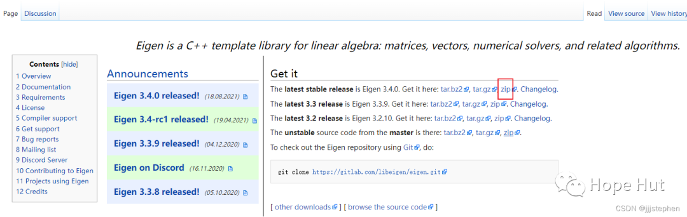
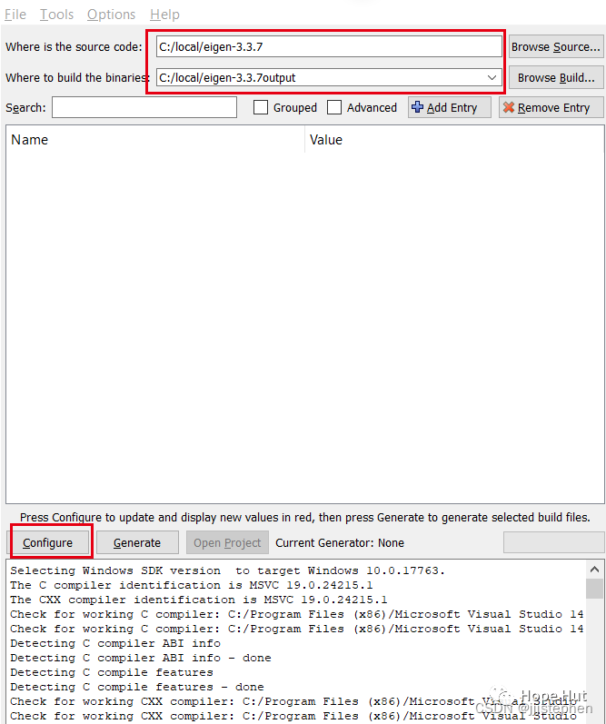
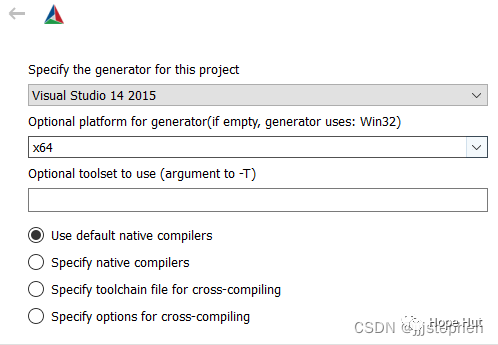
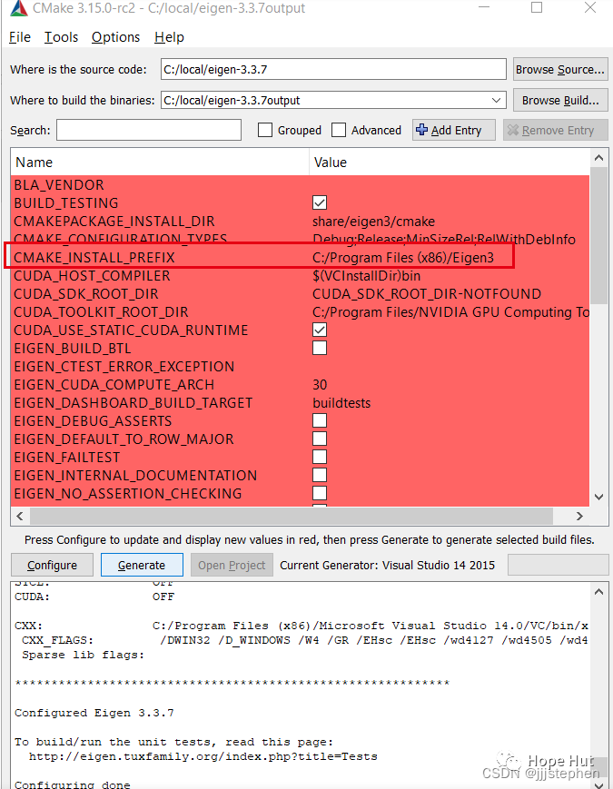
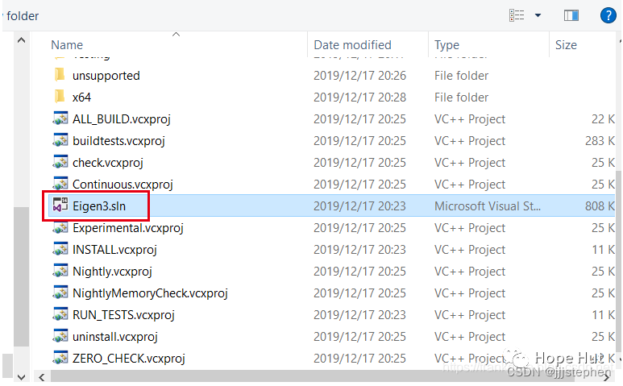
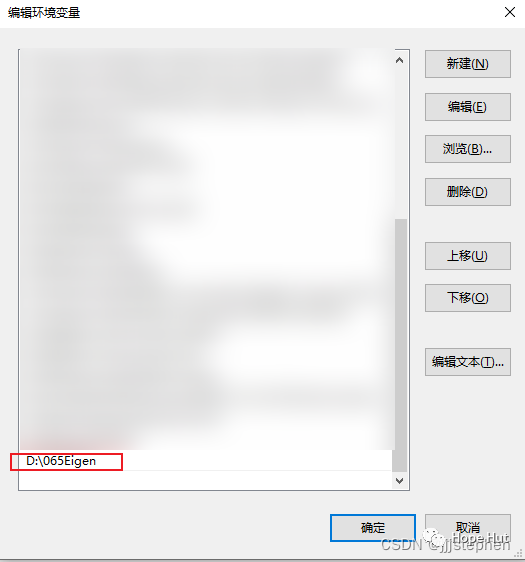
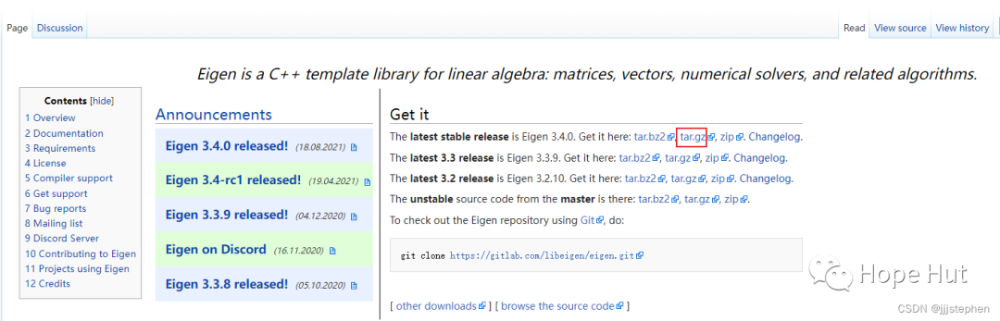

# CMake 笔记 | [12] 检测环境


## 一、CMake:为Eigen库使能向量化



**本篇开始将涉及检测外部库相关的内容，期间会穿插着一些其他的内容。为了能够使得系统在系统中运行Eigen库，我们首先需要在系统中配置好Eigen库。然后介绍与Eigen库相关的CMake配置。**



## 二、构建Eigen


**Windows**

- 从官网下载安装包(下载ZIP格式)：

  > https://eigen.tuxfamily.org/index.php?title=Main_Page
  > <br>
  > <center>
  >   
  >   <br>
  >   <div style="color:orange; border-bottom: 1px solid #d9d9d9; display: inline-block; color: #999; padding: 2px;">Eigen 下载官网截图</div>
  > </center>
  > <br>

- 解压到某一路径中,使用cmake编译。这里以vs15以及x64为例：
  > <br>
  > <center>
  >   
  >   <br>
  >   <div style="color:orange; border-bottom: 1px solid #d9d9d9; display: inline-block; color: #999; padding: 2px;">Cmake 编译截图</div>
  > </center>
  > <br>

  > <br>
  > <center>
  >   
  > <br>
  > <div style="color:orange; border-bottom: 1px solid #d9d9d9; display: inline-block; color: #999; padding: 2px;">Cmake 编译截图</div>
  > </center>
  > <br>
- 选择输出路径并点击generate：
  > <br>
  > <center>
  >   
  >   <br>
  >   <div style="color:orange; border-bottom: 1px solid #d9d9d9; display: inline-block; color: #999; padding: 2px;">CMake 编译截图</div>
  > </center>
  > <br>
- VS打开项目
  > <br>
  > <center>
  > 
  > <br>
  > <div style="color:orange; border-bottom: 1px solid #d9d9d9; display: inline-block; color: #999; padding: 2px;">打开项目</div>
  > </center>
  > <br>
- 在vs2015中生成INSTALL。右键点击“生成”：
  > <br>
  > <center>
    > 
    > <br>
    > <div style="color:orange; border-bottom: 1px solid #d9d9d9; display: inline-block; color: #999; padding: 2px;">生成eigen库</div>
  > </center>
  > <br>
- 将生成后的库添加到环境变量中：
  > <br>
  > <center>
    > 
    > <br>
    > <div style="color:orange; border-bottom: 1px solid #d9d9d9; display: inline-block; color: #999; padding: 2px;">添加环境变量</div>
  > </center>
  > <br>

**ubuntu**

- 从官网下载安装包(下载tar.gz格式)：

> https://eigen.tuxfamily.org/index.php?title=Main_Page
> <br>
> <center>
  > 
  > <br>
  > <div style="color:orange; border-bottom: 1px solid #d9d9d9; display: inline-block; color: #999; padding: 2px;">下载Eigen</div>
> </center>
> <br>

- Eigen包安装
  下载完成后，对压缩包进行解压后（解压在home目录即可），运行如下命令进行安装：

  ```shell
  cd (eigen文件夹中)
  mkdir build
  cd build
  cmake ..
  sudo make install
  ```

- 将eigen文件复制到本地调用文件夹中（/usr/include）

  ```shell
  sudo cp -r /usr/local/include/eigen3 /usr/include
  ```

## 三、Linear_algebra项目举例

**项目结构**

```
.
├── CMakeLists.txt
└── linear_algebra.cpp
```

项目地址：

> https://gitee.com/jiangli01/tutorials/tree/master/cmake-tutorial/chapter2/05


**CMakeLists.txt文件**

```c++
cmake_minimum_required(VERSION 3.10 FATAL_ERROR)

project(eigen_tensor LANGUAGES CXX)

set(CMAKE_CXX_STANDARD 11)
set(CMAKE_CXX_EXTENSIONS OFF)
set(CMAKE_CXX_STANDARD_REQUIRED ON)

find_package(Eigen3 3.4 REQUIRED CONFIG)

include(CheckCXXCompilerFlag)

check_cxx_compiler_flag("-march=native" _march_native_works)
check_cxx_compiler_flag("-xHost" _xhost_works)

set(_CXX_FLAGS)
if(_march_native_works)
    message(STATUS "Using processor's vector instructions (-march=native compiler flag set)")
    set(_CXX_FLAGS "-march=native")
elseif(_xhost_works)
    message(STATUS "Using processor's vector instructions (-xHost compiler flag set)")
    set(_CXX_FLAGS "-xHost")
else()
    message(STATUS "No suitable compiler flag found for vectorization")
endif()

add_executable(linear-algebra-unoptimized linear_algebra.cpp)
target_link_libraries(linear-algebra-unoptimized
  PRIVATE Eigen3::Eigen
)

add_executable(linear-algebra linear_algebra.cpp)
target_compile_options(linear-algebra
  PRIVATE ${_CXX_FLAGS}
)
target_link_libraries(linear-algebra
  PRIVATE Eigen3::Eigen
)
```
<table><tr><td bgcolor=yellow>```find_package(Eigen3 3.4 REQUIRED CONFIG)```</td></tr></table>

- `find_package` 是`CMake`中的一个命令，<u>用于查找和加载特定的第三方库</u>（例如`Eigen3`）的`CMake`配置文件。

- `Eigen3` 是一个用于线性代数计算的`C++`模板库，它提供了矩阵、向量、矢量计算等功能。通过在`CMake`中使用 `find_package(Eigen3 3.4 REQUIRED CONFIG)` 命令，告诉`CMake`去查找`Eigen3`库，并且要求它的版本至少是`3.4`。`REQUIRED` 参数表示如果找不到`Eigen3`库，`CMake`将会报错并停止构建。

- `CONFIG` 参数指示`CMake`查找`Eigen3`的`CMake`配置文件（通常是 `Eigen3Config.cmake` 或类似名称），其中包含有关库的信息和设置。

- 一旦找到`Eigen3`库的`CMake`配置文件，`CMake`会加载该配置文件并设置相关的变量，例如 `EIGEN3_INCLUDE_DIR`，其中包含了`Eigen3`库的头文件路径。在接下来的`CMake`构建中，你可以使用这些设置的变量来链接和包含`Eigen3`库。


<table><tr><td bgcolor=yellow>```include(CheckCXXCompilerFlag)```</td></tr></table>


在`CMake`中，`include(CheckCXXCompilerFlag)` 是一个用于检查`C++`编译器标志是否可用的`CMake`命令。

这个命令的作用是为了检查特定的`C++`编译器标志是否受支持。在某些情况下，需要根据编译器的不同来启用或禁用一些特性或优化选项。

使用这个命令的一般形式是：

```
include(CheckCXXCompilerFlag <flag>)
```

其中`<flag>`是你要检查的`C++`编译器标志，例如` -std=c++11`、`-fPIC` 等。

此命令将尝试将指定的编译器标志添加到`C++`源代码，并编译一个简单的测试程序来检查编译器是否支持该标志。如果支持，那么`CMake`将定义一个`CMake`变量，例如 `CMAKE_REQUIRED_FLAGS` 或 `CMAKE_REQUIRED_LIBRARIES`，来表示该标志是可用的。

通过这种方式，可以在`CMake`脚本中根据编译器支持情况进行条件编译或设置不同的选项。

例如，假设我们要检查编译器是否支持`C++11`标准：

```c++
include(CheckCXXCompilerFlag)
check_cxx_compiler_flag("-std=c++11" COMPILER_SUPPORTS_CXX11)
if (COMPILER_SUPPORTS_CXX11)
    # 设置C++11标准
    set(CMAKE_CXX_STANDARD 11)
    message(STATUS "C++11 supported by the compiler.")
else ()
    message(FATAL_ERROR "C++11 is not supported by the compiler.")
endif ()
check_cxx_compiler_flag("-march=native" _march_native_works)
check_cxx_compiler_flag("-xHost" _xhost_works)

set(_CXX_FLAGS)
if(_march_native_works)
    message(STATUS "Using processor's vector instructions (-march=native compiler flag set)")
    set(_CXX_FLAGS "-march=native")
elseif(_xhost_works)
    message(STATUS "Using processor's vector instructions (-xHost compiler flag set)")
    set(_CXX_FLAGS "-xHost")
else()
    message(STATUS "No suitable compiler flag found for vectorization")
endif()
```

这段`CMake`代码片段用于检查编译器是否支持特定的矢量指令优化标志，并根据结果设置 `_CXX_FLAGS` 变量以启用适当的矢量化优化。

`-march=native` 是一个编译器标志，用于告诉编译器根据当前主机的处理器架构来优化生成的机器码。这个标志会让编译器针对当前的 `CPU` 架构生成最优化的代码，以充分利用处理器的特性和指令集。

例如，在使用 `-march=native` 标志编译代码时，如果你的计算机的处理器支持 `AVX2` 指令集，编译器将会针对 `AVX`2 进行优化。如果运行这个优化过的代码在支持 `AVX2` 的处理器上，它将能够获得更高的性能。

请注意，使用 `-march=native` 标志编译代码可能会导致生成的可执行文件在其他不同架构的计算机上运行不正确或不稳定。因此，在分发或共享可执行文件时，最好使用更加通用的编译选项，除非确实需要充分利用特定处理器架构的优化。

`-xHost` 是 `Intel` 编译器的编译选项，用于指示编译器使用主机处理器支持的最高级别的指令集来优化生成的机器码。

类似于 `-march=native`，`-xHost` 也会让编译器根据当前主机的处理器架构来选择最优化的指令集。它会自动根据当前系统的处理器类型来决定使用最高级别的指令集，以充分利用处理器的性能和功能。

然而，与 `-march=native` 不同的是，`-xHost` 是特定于 `Intel` 编译器的选项，而不是在其他编译器中通用的标志。

请注意，与 `-march=native` 一样，使用 `-xHost` 也可能会导致生成的可执行文件在其他不同架构的计算机上运行不正确或不稳定，因此在分发或共享可执行文件时需谨慎使用。


**<font color=red>相关源码</font>**

**linear_algebra.cpp**

```c++
#include <eigen3/Eigen/Dense>
#include <chrono>
#include <iostream>
EIGEN_DONT_INLINE

double simple_function(Eigen::VectorXd &va, Eigen::VectorXd &vb) {
  // this simple function computes the dot product of two vectors
  // of course it could be expressed more compactly
  double d = va.dot(vb);
  return d;
}

int main() {
  int len = 1000000;
  int num_repetitions = 100;
  // generate two random vectors
  Eigen::VectorXd va = Eigen::VectorXd::Random(len);
  Eigen::VectorXd vb = Eigen::VectorXd::Random(len);

  double result;
  auto start = std::chrono::system_clock::now();
  for (auto i = 0; i < num_repetitions; i++) {
    result = simple_function(va, vb);
  }
  auto end = std::chrono::system_clock::now();
  auto elapsed_seconds = end - start;
  std::cout << "result: " << result << std::endl;
  std::cout << "elapsed seconds: " << elapsed_seconds.count() << std::endl;
}
```

**输出结果**

```shell
./linear-algebra-unoptimized
result: -261.505
elapsed seconds: 1.97964

./linear-algebra
result: -261.505
elapsed seconds: 1.05048
```


---

> 作者: [Jian YE](https://github.com/jianye0428)  
> URL: https://jianye0428.github.io/posts/cmake_note_12/  

