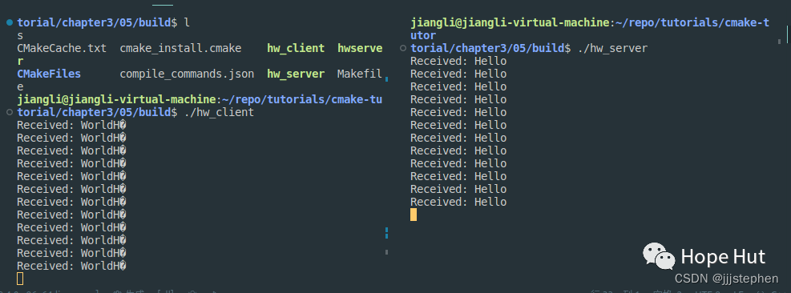

# CMake 笔记 | [16] 检测外部库---使用pkg-config


# 一、检测外部库---使用pkg-config


**前面几篇内容的学习，我们基本上了解了如何链接一个三方库的方法。本篇以及下一篇将补充两个检测外部库的方法。**

**目前为止，我们已经学习了两种检测外部依赖关系的方法：**

- **使用`CMake`自带的`find-module`，但并不是所有的包在`CMake`的`find`模块都找得到。**
- 使用`<package>Config.cmake` ,`<package>ConfigVersion.cmake`和`<package>Targets.cmake`，这些文件由软件包供应商提供，并与软件包一起安装在标准位置的`cmake`文件夹下。

**如果某个依赖项既不提供查找模块，也不提供供应商的CMake文件，在这种情况下：**

- **依赖`pkg-config`程序，来找到系统上的包。这依赖于包供应商在`.pc`配置文件中，其中有关于发行包的元数据。**
- **为依赖项编写自己的`find-package`模块。**

**接下来，我们通过ZMQ的使用，来演示第一种方法的使用。**



## 二、ZMQ的安装


ZMQ下载：

> https://github.com/zeromq

下载好后解压, 并进入目录：：

```
tar -xzvf  libzmq-4.3.4.tar.gz .

cd libzmq-4.3.4
```

开始安装

```
./autogen.sh
```

使用`prefix`来指定安装目录

```
./configure --prefix=/opt/zmq/ --without-libsodium
make
sudo make install
```

## 三、项目结构

```shell
.
├── CMakeLists.txt
├── zmq_client.cpp
└── zmq_server.cpp
```

项目地址：

> https://gitee.com/jiangli01/tutorials/tree/master/cmake-tutorial/chapter3/05


<table><body text=red><tr><td style="text-align:right;font-weight:bold" bgcolor=yellow><font size="3" color="red">CMakeLists.txt</font></td></tr></body></table>


```c++
cmake_minimum_required(VERSION 3.10 FATAL_ERROR)

project(test_zmq LANGUAGES CXX)

set(CMAKE_CXX_STANDARD 11)
set(CMAKE_CXX_EXTENSIONS OFF)
set(CMAKE_CXX_STANDARD_REQUIRED ON)
set(CMAKE_PREFIX_PATH /opt/zmq)

find_package(PkgConfig REQUIRED QUIET)

pkg_search_module(
  ZeroMQ
  REQUIRED libzeromq libzmq lib0mq
  IMPORTED_TARGET
)

if(TARGET PkgConfig::ZeroMQ)
    message(STATUS "Found ZeroMQ")
endif()

add_executable(hw_server zmq_server.cpp)
target_link_libraries(hw_server PkgConfig::ZeroMQ)

add_executable(hw_client zmq_client.cpp)
target_link_libraries(hw_client PkgConfig::ZeroMQ)
```

使用`pkg_search_module`通搜索任何附带包配置`.pc`文件的库或程序来查找和导入`ZeroMQ`库。这个命令会在`CMake`中通过`PkgConfig`工具查找和配置`ZeroMQ`库。

```
pkg_search_module(
  ZeroMQ
  REQUIRED libzeromq libzmq lib0mq
  IMPORTED_TARGET
)
```

`ZeroMQ`的信息将会被存储在一个导入目标中，其名称是`PkgConfig::ZeroMQ`，可以将这个目标链接到可执行文件或库。

<br>
<center>
  
  <br>
  <div style="color:orange; border-bottom: 1px solid #d9d9d9; display: inline-block; color: #999; padding: 2px;">导入目标</div>
</center>
<br>

<table><body text=red><tr><td style="text-align:right;font-weight:bold" bgcolor=yellow><font size="3" color="red">相关源码</font></td></tr></body></table>

**zmq_client.cpp**

```c++
#include <stdio.h>
#include <string.h>
#include <unistd.h>
#include <zmq.h>

int main() {
  void *context = zmq_ctx_new();
  void *requester = zmq_socket(context, ZMQ_REQ);
  int rc = zmq_connect(requester, "tcp://localhost:5555");

  if (rc != 0) {
    perror("Failed to connect to server");
    return 1;
  }

  while (true) {
    char buffer[] = "Hello";
    zmq_send(requester, buffer, sizeof(buffer), 0);

    char reply[10];
    zmq_recv(requester, reply, sizeof(reply), 0);
    printf("Received: %s\n", reply);

    sleep(10);
  }

  zmq_close(requester);
  zmq_ctx_destroy(context);

  return 0;
}
```

**zmq_server.cpp**

```c++
include <stdio.h>
#include <string.h>
#include <unistd.h>
#include <zmq.h>

int main() {
  void *context = zmq_ctx_new();
  void *responder = zmq_socket(context, ZMQ_REP);
  int rc = zmq_bind(responder, "tcp://*:5555");

  if (rc != 0) {
    perror("Failed to bind socket");
    return 1;
  }

  while (1) {
    char buffer[10];
    zmq_recv(responder, buffer, sizeof(buffer), 0);
    printf("Received: %s\n", buffer);

    zmq_send(responder, "World", 5, 0);
  }

  zmq_close(responder);
  zmq_ctx_destroy(context);

  return 0;
}
```

构建项目，并执行

```
$ mkdir -p build
$ cd build
$ cmake ..
$ cmake --build .
```

执行生成的两个进程结果：

<br>
<center>
  
  <br>
  <div style="color:orange; border-bottom: 1px solid #d9d9d9; display: inline-block; color: #999; padding: 2px;">输出结果</div>
</center>
<br>


' fill='%23FFFFFF'%3E%3Crect x='249' y='126' width='1' height='1'%3E%3C/rect%3E%3C/g%3E%3C/g%3E%3C/svg%3E)


' fill='%23FFFFFF'%3E%3Crect x='249' y='126' width='1' height='1'%3E%3C/rect%3E%3C/g%3E%3C/g%3E%3C/svg%3E)


cmake44

cmake · 目录

上一篇CMake: 检测并使用OpenMP的并行环境下一篇CMake:检测外部库---自定义find模块


People who liked this content also liked

CMake:超级构建模式


Hope Hut

不喜欢

不看的原因

OK

- 内容质量低
- 不看此公众号


CMake:使用函数和宏重用代码


Hope Hut

不喜欢

不看的原因

OK

- 内容质量低
- 不看此公众号


用C#开发Excel插件的强大开源工具


编程乐趣

不喜欢

不看的原因

OK

- 内容质量低
- 不看此公众号


Scan to Follow

people underline

---

> 作者: [Jian YE](https://github.com/jianye0428)  
> URL: https://jianye0428.github.io/posts/cmake_note_16/  

