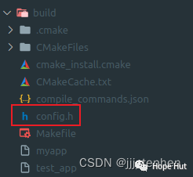

# CMake 笔记 | [25] 构建时为特定目标运行自定义命令


## 一、导言


**add_custom_command 是 CMake 中用于添加自定义构建规则的命令，通常用于在编译项目时执行一些自定义操作，例如生成文件、运行脚本等。**



## 二、项目结构

```shell
.
├── CMakeLists.txt
├── generate_config.cmake
└── main.cpp
```

项目地址：

> https://gitee.com/jiangli01/tutorials/tree/master/cmake-tutorial/chapter5/03


<table><body text=red><tr><td style="text-align:left;font-weight:bold" bgcolor=yellow><font size="3" color="red">相关源码</font></td></tr></body></table>

**CMakeLists.txt**

```c++
cmake_minimum_required(VERSION 3.10)

project(test_command)

# 设置需要生成的头文件的路径
set(CONFIG_HEADER ${CMAKE_BINARY_DIR}/config.h)

# 添加一个自定义命令来生成头文件
add_custom_command(
    OUTPUT ${CONFIG_HEADER}
    COMMAND ${CMAKE_COMMAND}
        -DOUTPUT_FILE=${CONFIG_HEADER}
        -P ${CMAKE_CURRENT_SOURCE_DIR}/generate_config.cmake
    COMMENT "Generating config.h"
)

# 将生成的头文件的路径添加到包含目录
include_directories(${CMAKE_BINARY_DIR})

# 添加可执行文件
add_executable(test_app main.cpp)

# 将自定义命令的输出文件添加为依赖项
add_dependencies(test_app config_h_target)

# 定义一个自定义目标以便其他目标可以依赖它
add_custom_target(config_h_target DEPENDS ${CONFIG_HEADER})

# 将自定义目标添加到 ALL 阶段，以确保在每次构建时都生成 config.h
add_dependencies(test_app config_h_target)
```

**generate_config.cmake**

```c++
# 你可以在这里定义所需的宏
set(APP_NAME "TJUApp")
set(APP_VERSION "1.0.0")
set(DEBUG_MODE 1)

# 生成 config.h 头文件
file(WRITE ${OUTPUT_FILE} "#ifndef CONFIG_H\n")
file(APPEND ${OUTPUT_FILE} "#define CONFIG_H\n")
file(APPEND ${OUTPUT_FILE} "\n")

# 添加宏定义
file(APPEND ${OUTPUT_FILE} "#define APP_NAME \"${APP_NAME}\"\n")
file(APPEND ${OUTPUT_FILE} "#define APP_VERSION \"${APP_VERSION}\"\n")

if (DEBUG_MODE)
    file(APPEND ${OUTPUT_FILE} "#define DEBUG_MODE 1\n")
else ()
    file(APPEND ${OUTPUT_FILE} "#define DEBUG_MODE 0\n")
endif ()

# 结束文件
file(APPEND ${OUTPUT_FILE} "\n#endif\n")
#include <iostream>
#include "config.h"
int main() {
#ifdef DEBUG_MODE
  std::cout << "DEBUG_MODE: " << DEBUG_MODE << std::endl;
#endif
  return 0;
}
```

**结果**

```shell
mkdir build & cd build
cmake ..
make
```

<br>
<center>
  
  <br>
  <div style="color:orange; border-bottom: 1px solid #d9d9d9; display: inline-block; color: #999; padding: 2px;">生成config.h文件</div>
</center>
<br>
```
DEBUG_MODE: 1
```


---

> 作者: [Jian YE](https://github.com/jianye0428)  
> URL: https://jianye0428.github.io/posts/cmake_note_25/  

