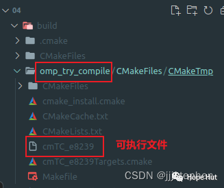

# CMake 笔记 | [26] 探究编译和编译命令


## 一、导言



**本篇通过展示如何使用来自对应的CheckSourceCompiles.cmake标准模块的check_<LANG>_source_compiles函数，以评估给定编译器是否可以将预定义的代码编译成可执行文件。该命令可帮助确定:**

- **编译器支持所需的特性。**
- **链接器工作正常，并理解特定的标志。**
- **可以使用find_package找到的包含目录和库。**

**我们将展示如何检测OpenMP 4.5标准的循环特性，以便在C++可执行文件中使用。使用一个C++源文件，来探测编译器是否支持这样的特性。CMake提供了一个附加命令try_compile来探究编译。**



## 二、项目结构


```shell
├── CMakeLists.txt
└── task_loop.cpp
```

项目地址：

> https://gitee.com/jiangli01/tutorials/tree/master/cmake-tutorial/chapter5/04


<table><body text=red><tr><td style="text-align:left;font-weight:bold" bgcolor=yellow><font size="3" color="red">相关源码</font></td></tr></body></table>


**CMakeLists.txt**

```c++
cmake_minimum_required(VERSION 3.10 FATAL_ERROR)

project(test LANGUAGES CXX)

set(CMAKE_CXX_STANDARD 11)
set(CMAKE_CXX_EXTENSIONS OFF)
set(CMAKE_CXX_STANDARD_REQUIRED ON)

find_package(OpenMP)

if(OpenMP_FOUND)
  # this will get wiped unless you run cmake with --debug-trycompile
  set(scratch_dir ${CMAKE_CURRENT_BINARY_DIR}/omp_try_compile)

  try_compile(
    omp_task_loop_test_1
    ${scratch_dir}
    SOURCES
      ${CMAKE_CURRENT_SOURCE_DIR}/task_loop.cpp
    LINK_LIBRARIES
      OpenMP::OpenMP_CXX
    )
  message(STATUS "Result of try_compile: ${omp_task_loop_test_1}")

  include(CheckCXXSourceCompiles)

  file(READ ${CMAKE_CURRENT_SOURCE_DIR}/task_loop.cpp snippet)

  set(CMAKE_REQUIRED_LIBRARIES OpenMP::OpenMP_CXX)

  check_cxx_source_compiles("${snippet}" omp_task_loop_test_2)

  unset(CMAKE_REQUIRED_LIBRARIES)

  message(STATUS "Result of check_cxx_source_compiles: ${omp_task_loop_test_2}")
else()
  message(STATUS "OpenMP not found: no test for taskloop is run")
endif()
```

**方式一**：

```c++
set(scratch_dir ${CMAKE_CURRENT_BINARY_DIR}/omp_try_compile)
```

如果找到`OpenMP`，再检查所需的特性是否可用。为此，设置了一个临时目录，`try_compile`将在这个目录下来生成中间文件。我们把它放在前面步骤中引入的`if`语句中。如果我们构建时使用如下命令，则会在`omp_try_compile`文件夹中产生中间文件。

```
cmake .. --debug-trycompile
```
<br>
<center>
  
  <br>
  <div style="color:orange; border-bottom: 1px solid #d9d9d9; display: inline-block; color: #999; padding: 2px;">生成可执行文件cmTC_e8239</div>
</center>
<br>


```c++
try_compile(
    omp_task_loop_test_1
    ${scratch_dir}
    SOURCES
      ${CMAKE_CURRENT_SOURCE_DIR}/task_loop.cpp
    LINK_LIBRARIES
      OpenMP::OpenMP_CXX
    )
  message(STATUS "Result of try_compile: ${omp_task_loop_test_1}")
```

调用`try_compile`生成一个小项目，以尝试编译源文件`task_loop.cpp`。编译成功或失败的状态，将保存到`omp_task_loop_test_1`变量中。需要为这个示例编译设置适当的编译器标志、包括目录和链接库。因为使用导入的目标`OpenMP::OpenMP_CXX`，所以只需将`LINK_LIBRARIES`选项设置为`OpenMP::OpenMP_CXX`即可。如果编译成功，则任务循环特性可用，我们打印一条消息。

**方式二**：

```c++
include(CheckCXXSourceCompiles)
```

要使用`check_cxx_source_compiles`函数，需要包含`CheckCXXSourceCompiles.cmake`模块文件。其他语言也有类似的模块文件，`C`(`CheckCSourceCompiles.cmake`)和`Fortran`(`CheckFortranSourceCompiles.cmake`)。

```c++
file(READ ${CMAKE_CURRENT_SOURCE_DIR}/task_loop.cpp snippet)
```

复制源文件的内容，通过`file(READ ...)`命令读取内容到一个变量中，试图编译和连接这个变量。

```c++
set(CMAKE_REQUIRED_LIBRARIES OpenMP::OpenMP_CXX)
```

设置了`CMAKE_REQUIRED_LIBRARIES`。对于下一步正确调用编译器是必需的。注意使用导入的`OpenMP::OpenMP_CXX`目标，它还将设置正确的编译器标志和包含目录。

```c++
check_cxx_source_compiles("${snippet}" omp_task_loop_test_2)
```

使用代码片段作为参数，调用`check_cxx_source_compiles`函数。检查结果将保存到`omp_task_loop_test_2`变量中。

```c++
unset(CMAKE_REQUIRED_LIBRARIES)
message(STATUS "Result of check_cxx_source_compiles: ${omp_task_loop_test_2}"
```

调用`check_cxx_source_compiles`并向用户打印消息之前，取消变量的设置。


**task_loop.cpp**

```c++
#include <cmath>
#include <iostream>

void LongRunningTask() {
  double number = 5.0;
  double result = std::pow(number, 2);

  std::cout << "长时间运行的任务结果：" << result << std::endl;
}

void LoopBody(int i, int j) {
  double calculation_result = std::sin(i) * std::cos(j);
  std::cout << "在循环体中计算结果：" << calculation_result << std::endl;
}

void ParallelWork() {
  int i, j;
#pragma omp taskgroup
  {
#pragma omp task
    LongRunningTask();

#pragma omp taskloop private(j) grainsize(500) nogroup
    for (i = 0; i < 10000; i++) {
      for (j = 0; j < i; j++) {
        LoopBody(i, j);
      }
    }
  }
}

int main() {
  ParallelWork();
  return 0;
}
```


**结果**


```c++
$ mkdir -p build
$ cd build
$ cmake ..
-- ...
-- Found OpenMP_CXX: -fopenmp (found version "4.5")
-- Found OpenMP: TRUE (found version "4.5")
-- Result of try_compile: TRUE
-- Performing Test omp_taskloop_test_2
-- Performing Test omp_taskloop_test_2 - Success
-- Result of check_cxx_source_compiles: 1
```


---

> 作者: [Jian YE](https://github.com/jianye0428)  
> URL: https://jianye0428.github.io/posts/cmake_note_26/  

