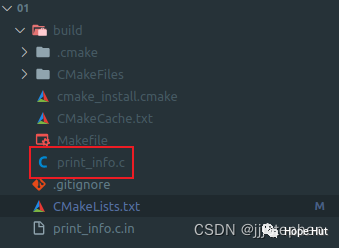

# CMake 笔记 | [27] 配置时生成源码


## 一、导言


**代码生成在配置时发生，如 CMake可以检测操作系统和可用库；基于这些信息，可以定制构建的源代码。本篇我们将探索如何生成一个简单源文件，该文件定义了一个函数，用于报告构建系统配置。**



## 二、项目结构

```shell
.
├── CMakeLists.txt
└── print_info.c.in
```

项目地址：

> https://gitee.com/jiangli01/tutorials/tree/master/cmake-tutorial/chapter6/01


<table><body text=red><tr><td style="text-align:left;font-weight:bold" bgcolor=yellow><font size="3" color="red">相关源码</font></td></tr></body></table>


**CMakeLists.txt**

```c++
cmake_minimum_required(VERSION 3.10 FATAL_ERROR)

project(config_generator LANGUAGES C)

execute_process(
  COMMAND
      whoami
  TIMEOUT
      1
  OUTPUT_VARIABLE
      _user_name
  OUTPUT_STRIP_TRAILING_WHITESPACE
)

# host name information
cmake_host_system_information(RESULT _host_name QUERY HOSTNAME)
cmake_host_system_information(RESULT _fqdn QUERY FQDN)
# processor information
cmake_host_system_information(RESULT _processor_name QUERY PROCESSOR_NAME)
cmake_host_system_information(RESULT _processor_description QUERY PROCESSOR_DESCRIPTION)
# os information
cmake_host_system_information(RESULT _os_name QUERY OS_NAME)
cmake_host_system_information(RESULT _os_release QUERY OS_RELEASE)
cmake_host_system_information(RESULT _os_version QUERY OS_VERSION)
cmake_host_system_information(RESULT _os_platform QUERY OS_PLATFORM)

string(TIMESTAMP _configuration_time "%Y-%m-%d %H:%M:%S [UTC]" UTC)

configure_file(print_info.c.in print_info.c @ONLY)
```



```c++
execute_process(
  COMMAND
      whoami
  TIMEOUT
      1
  OUTPUT_VARIABLE
      _user_name
  OUTPUT_STRIP_TRAILING_WHITESPACE
)
```

使用 `execute_process`为项目获取当前使用者的信息。



```c++
# host name information
cmake_host_system_information(RESULT _host_name QUERY HOSTNAME)
cmake_host_system_information(RESULT _fqdn QUERY FQDN)
# processor information
cmake_host_system_information(RESULT _processor_name QUERY PROCESSOR_NAME)
cmake_host_system_information(RESULT _processor_description QUERY PROCESSOR_DESCRIPTION)
# os information
cmake_host_system_information(RESULT _os_name QUERY OS_NAME)
cmake_host_system_information(RESULT _os_release QUERY OS_RELEASE)
cmake_host_system_information(RESULT _os_version QUERY OS_VERSION)
cmake_host_system_information(RESULT _os_platform QUERY OS_PLATFORM)
```

使用`cmake_host_system_information()`函数查询系统信息。




```
string(TIMESTAMP _configuration_time "%Y-%m-%d %H:%M:%S [UTC]" UTC)
```

捕获配置时的时间戳，并通过使用字符串操作函数。



```
configure_file(print_info.c.in print_info.c @ONLY)
```

通过`configure_file`函数生成代码。注意，这里只要求以`@`开头和结尾的字符串被替换。



**print_info.c.in**

```c++
#include <stdio.h>
#include <unistd.h>

void print_info(void) {
  printf("\n");
  printf("Configuration and build information\n");
  printf("-----------------------------------\n");
  printf("\n");
  printf("Who compiled | %s\n", "@_user_name@");
  printf("Compilation hostname | %s\n", "@_host_name@");
  printf("Fully qualified domain name | %s\n", "@_fqdn@");
  printf("Operating system | %s\n",
         "@_os_name@, @_os_release@, @_os_version@");
  printf("Platform | %s\n", "@_os_platform@");
  printf("Processor info | %s\n",
         "@_processor_name@, @_processor_description@");
  printf("CMake version | %s\n", "@CMAKE_VERSION@");
  printf("CMake generator | %s\n", "@CMAKE_GENERATOR@");
  printf("Configuration time | %s\n", "@_configuration_time@");
  printf("Fortran compiler | %s\n", "@CMAKE_Fortran_COMPILER@");
  printf("C compiler | %s\n", "@CMAKE_C_COMPILER@");
  printf("\n");
  fflush(stdout);
}
```

<table><body text=red><tr><td style="text-align:left;font-weight:bold" bgcolor=yellow><font size="3" color="red">结果展示:</font></td></tr></body></table>

<br>
<center>
  
  <br>
  <div style="color:orange; border-bottom: 1px solid #d9d9d9; display: inline-block; color: #999; padding: 2px;">生成print_info.c</div>
</center>
<br>

**print_info.c**

```c++
#include <stdio.h>
#include <unistd.h>

void print_info(void) {
  printf("\n");
  printf("Configuration and build information\n");
  printf("-----------------------------------\n");
  printf("\n");
  printf("Who compiled | %s\n", "jiangli");
  printf("Compilation hostname | %s\n", "jiangli-virtual-machine");
  printf("Fully qualified domain name | %s\n", "jiangli-virtual-machine.lan");
  printf("Operating system | %s\n",
         "Linux, 5.15.0-89-generic, #99~20.04.1-Ubuntu SMP Thu Nov 2 15:16:47 UTC 2023");
  printf("Platform | %s\n", "x86_64");
  printf("Processor info | %s\n",
         "Unknown AMD family, 16 core AMD Ryzen 7 4800H with Radeon Graphics");
  printf("CMake version | %s\n", "3.16.3");
  printf("CMake generator | %s\n", "Unix Makefiles");
  printf("Configuration time | %s\n", "2023-11-24 01:01:31 [UTC]");
  printf("Fortran compiler | %s\n", "");
  printf("C compiler | %s\n", "/usr/bin/gcc");
  printf("\n");
  fflush(stdout);
}
```

**补充**

用值替换占位符时，`CMake`中的变量名应该与将要配置的文件中使用的变量名完全相同，并放在`@`之间。可以在调用`configure_file`时定义的任何`CMake`变量。


---

> 作者: [Jian YE](https://github.com/jianye0428)  
> URL: https://jianye0428.github.io/posts/cmake_note_27/  

