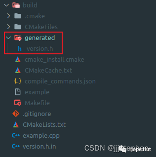

# CMake 笔记 | [28] 记录项目版本信息以便报告


## 一、导言


**代码版本很重要，不仅是为了可重复性，还为了记录API功能或简化支持请求和bug报告。源代码通常处于某种版本控制之下，例如可以使用Git标记附加额外版本号。然而，不仅需要对源代码进行版本控制，而且可执行文件还需要记录项目版本，以便将其打印到代码输出或用户界面上。**

**本篇，将在CMake源文件中定义版本号。我们的目标是在配置项目时将程序版本记录到头文件中。然后，生成的头文件可以包含在代码的正确位置和时间，以便将代码版本打印到输出文件或屏幕上。**




## 二、项目结构

```shell
.
├── CMakeLists.txt
├── version.h.in
└── example.cpp
```

项目地址：

> https://gitee.com/jiangli01/tutorials/tree/master/cmake-tutorial/chapter6/02


## 三、相关源码

**example.cpp**

```c++
#include "version.h"

#include <iostream>

int main() {
  std::cout << "This is output from code " << PROJECT_VERSION << std::endl;
  std::cout << "Major version number: " << PROJECT_VERSION_MAJOR << std::endl;
  std::cout << "Minor version number: " << PROJECT_VERSION_MINOR << std::endl;

  std::cout << "Hello CMake world!" << std::endl;
}
```

这里，假设`PROJECT_VERSION_MAJOR`、`PROJECT_VERSION_MINOR`和`PROJECT_VERSION`是在`version.h`中定义的。
目标是从以下模板中生成`version.h.in`:

**version.h.in**

```c++
#pragma once

#define PROJECT_VERSION_MAJOR @PROJECT_VERSION_MAJOR@
#define PROJECT_VERSION_MINOR @PROJECT_VERSION_MINOR@
#define PROJECT_VERSION_PATCH @PROJECT_VERSION_PATCH@
#define PROJECT_VERSION "v@PROJECT_VERSION@"
```

这里使用预处理器定义，也可以使用字符串或整数常量来提高类型安全性。

**CMakeLists.txt**

```c++
cmake_minimum_required(VERSION 3.10 FATAL_ERROR)

project(example VERSION 2.0.1 LANGUAGES CXX)

configure_file(
  version.h.in
  generated/version.h
  @ONLY
)

add_executable(${PROJECT_NAME} example.cpp)
target_include_directories(${PROJECT_NAME}
  PRIVATE
      ${CMAKE_CURRENT_BINARY_DIR}/generated
)
```

当使用版本参数调用`CMake`的`project`时，`CMake`将为项目设置`PROJECT_VERSION_MAJOR`、`PROJECT_VERSION_MINOR`和`PROJECT_VERSION_PATCH`。

`configure_file`接受一个输入文件(本例中是`version.h.in`)，通过将`@`之间的占位符替换成对应的`CMake`变量，生成一个输出文件(本例中是`generate/version.h`)。它将`@PROJECT_VERSION_MAJOR@`替换为`2`，以此类推。使用关键字`@ONLY`，我们将`configure_file`限制为只替换`@variables@`，而不修改`${variables}`。

## 四、结果

```shell
mkdir build & cd build
cmake ..
cmake --build .
./example

This is output from code v2.0.1
Major version number: 2
Minor version number: 0
Hello CMake world!
```
<br>
<center>
  
  <br>
  <div style="color:orange; border-bottom: 1px solid #d9d9d9; display: inline-block; color: #999; padding: 2px;">生成版本信息</div>
</center>
<br>

```c++
#pragma once

#define PROJECT_VERSION_MAJOR 2
#define PROJECT_VERSION_MINOR 0
#define PROJECT_VERSION_PATCH 1
#define PROJECT_VERSION "v2.0.1"
```

## 五、补充内容

`CMake`以`x.y.z`格式给出的版本号，并将变量`PROJECT_VERSION`和`<project-name>_VERSION`设置为给定的值。此外,`PROJECT_VERSION_MAJOR`(`<project-name>_VERSION_MAJOR`),`PROJECT_VERSION_MINOR`(`<project-name>_VERSION_MINOR`) `PROJECT_VERSION_PATCH`(`<project-name>_VERSION_PATCH`)和`PROJECT_VERSION_TWEAK`(`<project-name>_VERSION_TWEAK`),将分别设置为`X`, `Y`, `Z`和`t`。

为了确保只有当`CMake`变量被认为是一个真正的常量时，才定义预处理器变量，可以使用`configure_file`，在配置的头文件中使用`#cmakedefin`而不是`#define`。

根据是否定义了`CMake`变量并将其计算为一个真正的常量，`#cmakedefine YOUR_VARIABLE`将被替换为`#define YOUR_VARIABLE …`或者`/* #undef YOUR_VARIABLE */`。还有`#cmakedefine01`，将根据变量是否定义，将变量设置为`0`或`1`。


---

> 作者: [Jian YE](https://github.com/jianye0428)  
> URL: https://jianye0428.github.io/posts/cmake_note_28/  

