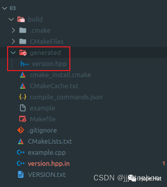

# CMake 笔记 | [29] 从文件中记录项目版本


## 一、 导言


**本篇内容目的和上一篇相似，但是出发点不同。我们计划是从文件中读取版本信息，而不是将其设置在CMakeLists.txt中。将版本保存在单独文件中的目的，是允许其他构建框架或开发工具使用独立于****`CMake`的信息，而不需要将信息复制到多个文件中。**



## 二、项目结构

```shell
.
├── CMakeLists.txt
├── example.cpp
├── version.hpp.in
└── VERSION.txt
```

> https://gitee.com/jiangli01/tutorials/tree/master/cmake-tutorial/chapter6/03


## 三、相关源码

**VERSION.txt**

```
2.0.1-rc-2
```

**version.hpp.in**

```c++
#pragma once

#include <string>

const std::string PROGRAM_VERSION = "@PROGRAM_VERSION@";
```

**example.cpp**

```c++
#include "version.hpp"

#include <iostream>

int main() {
  std::cout << "This is output from code v" << PROGRAM_VERSION << std::endl;

  std::cout << "Hello CMake world!" << std::endl;
}
```

**CMakeLists.txt**

```c++
cmake_minimum_required(VERSION 3.10 FATAL_ERROR)

project(example LANGUAGES CXX)

set(CMAKE_CXX_STANDARD 11)
set(CMAKE_CXX_EXTENSIONS OFF)
set(CMAKE_CXX_STANDARD_REQUIRED ON)

if(EXISTS "${CMAKE_CURRENT_SOURCE_DIR}/VERSION.txt")
  file(READ "${CMAKE_CURRENT_SOURCE_DIR}/VERSION.txt" PROGRAM_VERSION)
  string(STRIP "${PROGRAM_VERSION}" PROGRAM_VERSION)
else()
  message(FATAL_ERROR "File ${CMAKE_CURRENT_SOURCE_DIR}/VERSION.txt not found")
endif()

configure_file(
  version.hpp.in
  generated/version.hpp
  @ONLY
)

add_executable(example example.cpp)

target_include_directories(example
  PRIVATE
    ${CMAKE_CURRENT_BINARY_DIR}/generated
)
```


```c++
if(EXISTS "${CMAKE_CURRENT_SOURCE_DIR}/VERSION.txt")
  file(READ "${CMAKE_CURRENT_SOURCE_DIR}/VERSION.txt" PROGRAM_VERSION)
  string(STRIP "${PROGRAM_VERSION}" PROGRAM_VERSION)
else()
  message(FATAL_ERROR "File ${CMAKE_CURRENT_SOURCE_DIR}/VERSION.txt not found")
endif()
```

首先，检查文件`VERSION.txt`文件是否存在，如果不存在，则发出错误消息。如果存在，将内容读入`PROGRAM_VERSION`变量中，该变量会去掉尾部的空格。

当设置了变量`PROGRAM_VERSION`，就可以使用它来配置`version.hpp.in`，生成generated/version.hpp：

```c++
configure_file(
  version.hpp.in
  generated/version.hpp
  @ONLY
)
```


## 四、结果展示

```shell
$ mkdir -p build
$ cd build
$ cmake ..
$ cmake --build .
$ ./example

This is output from code v2.0.1-rc-2
Hello CMake world!
```
<br>
<center>
  
  <br>
  <div style="color:orange; border-bottom: 1px solid #d9d9d9; display: inline-block; color: #999; padding: 2px;">生成版本文件</div>
</center>
<br>


**version.hpp**

```c++
#pragma once

#include <string>

const std::string PROGRAM_VERSION = "2.0.1-rc-2";
```

---

> 作者: [Jian YE](https://github.com/jianye0428)  
> URL: https://jianye0428.github.io/posts/cmake_note_29/  

