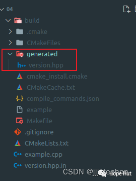

# CMake 笔记 | [30] 配置时记录Git Hash值


## 一、导言


**大多数现代源代码存储库都使用****`Git`作为版本控制系统进行跟踪，提交的`Git Hash`决定了源代码的状态。因此，为了标记可执行文件，尝试将`Git Hash`记录到可执行文件中，方法是将哈希字符串记录在一个头文件中，该头文件可以包含在代码中。**


## 二、项目结构

```shell
.
├── CMakeLists.txt
├── example.cpp
└── version.hpp.in
```

> https://gitee.com/jiangli01/tutorials/tree/master/cmake-tutorial/chapter6/04


<table><body text=red><tr><td style="text-align:left;font-weight:bold" bgcolor=yellow><font size="3" color="red">相关源码</font></td></tr></body></table>

**version.hpp.in**

```c++
#pragma once

#include <string>

const std::string GIT_HASH = "@GIT_HASH@";
```

**example.cpp**

```c++
#include "version.hpp"

#include <iostream>

int main() {
  std::cout << "This code has been configured from version " << GIT_HASH
            << std::endl;
}
```

**CMakeLists.txt**

```c++
cmake_minimum_required(VERSION 3.10 FATAL_ERROR)

project(example LANGUAGES CXX)

set(CMAKE_CXX_STANDARD 11)
set(CMAKE_CXX_EXTENSIONS OFF)
set(CMAKE_CXX_STANDARD_REQUIRED ON)
set(GIT_HASH "unknown")
find_package(Git QUIET)
if(GIT_FOUND)
  execute_process(
    COMMAND ${GIT_EXECUTABLE} log -1 --pretty=format:%h
    OUTPUT_VARIABLE GIT_HASH
    OUTPUT_STRIP_TRAILING_WHITESPACE
    ERROR_QUIET
    WORKING_DIRECTORY
      ${CMAKE_CURRENT_SOURCE_DIR}
  )
endif()

message(STATUS "Git hash is ${GIT_HASH}")

configure_file(
  version.hpp.in
  generated/version.hpp
  @ONLY
)

add_executable(example example.cpp)

target_include_directories(example
  PRIVATE
    ${CMAKE_CURRENT_BINARY_DIR}/generated
)
```



```c++
set(GIT_HASH "unknown")
```

由于`Git`命令可能会失败(源代码已经分发到`Git`存储库之外)，或者`Git`在系统上不可用，我们希望为这个变量设置一个默认值。




```c++
find_package(Git QUIET)
if(GIT_FOUND)
  execute_process(
    COMMAND ${GIT_EXECUTABLE} log -1 --pretty=format:%h
    OUTPUT_VARIABLE GIT_HASH
    OUTPUT_STRIP_TRAILING_WHITESPACE
    ERROR_QUIET
    WORKING_DIRECTORY
      ${CMAKE_CURRENT_SOURCE_DIR}
  )
endif()
```

使用`find_package(Git QUIET)`来检测系统上是否有可用的`Git`。如果有(`GIT_FOUND`为`True`)，运行一个`Git`命令:`${GIT_EXECUTABLE} log -1 --pretty=format:%h`。这个命令给出了当前提交`Hash`的简短版本。

当然，这里我们可以灵活地运行`Git`命令。

要求`execute_process`命令将结果放入名为`GIT_HASH`的变量中，然后删除任何尾随的空格。使用`ERROR_QUIET`，如果`Git`命令由于某种原因失败，不会停止配置。



## 三、结果展示

```shell
$ mkdir -p build
$ cd build
$ cmake ..
$ cmake --build .
$ ./example
This code has been configured from version 74e4aa9
```

<br>
<center>
  
  <br>
  <div style="color:orange; border-bottom: 1px solid #d9d9d9; display: inline-block; color: #999; padding: 2px;">生成保存git hash的文件</div>
</center>
<br>

**version.hpp**

```c++
#pragma once

#include <string>

const std::string GIT_HASH = "74e4aa9";
```


---

> 作者: [Jian YE](https://github.com/jianye0428)  
> URL: https://jianye0428.github.io/posts/cmake_note_30/  

