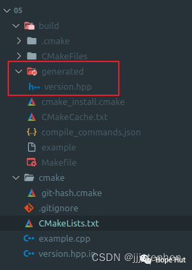

# CMake 笔记 | [31] 构建时记录Git Hash值


## 一、导言


**[上一篇](https://mp.weixin.qq.com/s?__biz=MzkxMzI5Mjk4Mg==&mid=2247485287&idx=1&sn=5188d6d93c1e2b757134be6bec3de9bd&scene=21#wechat_redirect)，在配置时记录了代码存储库(`Git Hash`)的状态。然而，该方法方法有一个令人不满意的地方，如果在配置代码之后更改分支或提交更改，则源代码中包含的版本记录可能指向错误的`Git Hash`值。本篇，我们将演示如何在构建时记录·Git Hash·(或者，执行其他操作)，以确保每次构建代码时都运行这些操作，因为实际操作中可能只配置一次，但是会构建多次。**


## 二、项目结构

```shell
.
├── cmake
│   └── git-hash.cmake
├── CMakeLists.txt
├── example.cpp
└── version.hpp.in
```

> https://gitee.com/jiangli01/tutorials/tree/master/cmake-tutorial/chapter6/05


<table><body text=red><tr><td style="text-align:left;font-weight:bold" bgcolor=yellow><font size="3" color="red">相关源码</font></td></tr></body></table>

**version.hpp.in**

```c++
#pragma once

#include <string>

const std::string GIT_HASH = "@GIT_HASH@";
```

**example.cpp**

```c++
#include "version.hpp"

#include <iostream>

int main() {
  std::cout << "This code has been built from version " << GIT_HASH << std::endl;
}
```

**git-hash.cmake**

```c++
set(GIT_HASH "unknown")

# find Git and if available set GIT_HASH variable
find_package(Git QUIET)
if(GIT_FOUND)
  execute_process(
    COMMAND ${GIT_EXECUTABLE} log -1 --pretty=format:%h
    OUTPUT_VARIABLE GIT_HASH
    OUTPUT_STRIP_TRAILING_WHITESPACE
    ERROR_QUIET
  )
endif()

message(STATUS "Git hash is ${GIT_HASH}")

configure_file(
  ${CMAKE_SOURCE_DIR}/version.hpp.in
  ${TARGET_DIR}/generated/version.hpp
  @ONLY
)
```

**CMakeLists.txt**

```c++
cmake_minimum_required(VERSION 3.10 FATAL_ERROR)

project(recipe-07 LANGUAGES CXX)

set(CMAKE_CXX_STANDARD 11)
set(CMAKE_CXX_EXTENSIONS OFF)
set(CMAKE_CXX_STANDARD_REQUIRED ON)

add_executable(example example.cpp)

target_include_directories(example
  PRIVATE
    ${CMAKE_CURRENT_BINARY_DIR}/generated
)

add_custom_command(
  OUTPUT
    ${CMAKE_CURRENT_BINARY_DIR}/generated/version.hpp
    ALL
  COMMAND
    ${CMAKE_COMMAND} -D TARGET_DIR=${CMAKE_CURRENT_BINARY_DIR} -P ${CMAKE_CURRENT_SOURCE_DIR}/cmake/git-hash.cmake
  WORKING_DIRECTORY
    ${CMAKE_CURRENT_SOURCE_DIR}
  )

# rebuild version.hpp every time
add_custom_target(
  get_git_hash
  ALL
  DEPENDS
    ${CMAKE_CURRENT_BINARY_DIR}/generated/version.hpp
)

# version.hpp has to be generated before we start building example
add_dependencies(example get_git_hash)
```


```c++
add_custom_command(
  OUTPUT
    ${CMAKE_CURRENT_BINARY_DIR}/generated/version.hpp
    ALL
  COMMAND
    ${CMAKE_COMMAND} -D TARGET_DIR=${CMAKE_CURRENT_BINARY_DIR} -P ${CMAKE_CURRENT_SOURCE_DIR}/cmake/git-hash.cmake
  WORKING_DIRECTORY
    ${CMAKE_CURRENT_SOURCE_DIR}
  )
```

自定义命令调用`CMake`来执行`git-hash.cmake`脚本。这里使用`CLI`的`-P`开关，通过传入脚本的位置实现的。请注意，可以像往常一样使用`CLI`开关`-D`传递选项。`git-hash.cmake`脚本生成`${TARGET_DIR}/generated/version.hpp`。自定义目标被添加到`ALL`目标中，并且依赖于自定义命令的输出。换句话说，当构建默认目标时，我们确保自定义命令已经运行。此外，自定义命令将`ALL`目标作为输出。这样，我们就能确保每次都会生成`version.hpp`了。




## 三、结果展示

```shell
$ mkdir -p build
$ cd build
$ cmake ..
$ cmake --build .
$ ./example
This code has been configured from version c66f02
```
<br>
<center>
  
  <br>
  <div style="color:orange; border-bottom: 1px solid #d9d9d9; display: inline-block; color: #999; padding: 2px;">生成git hash版本文件</div>
</center>
<br>

## 四、补充内容

可以改进配置，以便在记录的`Git Hash`外，包含其他的信息。检测构建环境是否`污染`(即是否包含未提交的更改和未跟踪的文件)，或者`干净`。可以使用`git describe --abbrev=7 --long --always --dirty --tags`检测这些信息。根据可重现性，甚至可以将`Git`的状态，完整输出记录到头文件中。


---

> 作者: [Jian YE](https://github.com/jianye0428)  
> URL: https://jianye0428.github.io/posts/cmake_note_31/  

