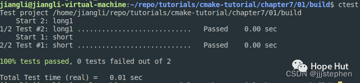

# CMake 笔记 | [32] 使用函数和宏重用代码


## 一、导言


**任何编程语言中，函数允许我们抽象(隐藏)细节并避免代码重复，****`CMake`也不例外。我们将以宏和函数为例进行讨论，并介绍一个宏，以便方便地定义测试和设置测试的顺序。我们的目标是定义一个宏，能够替换`add_test`和`set_tests_properties`，用于定义每组和设置每个测试的预期开销。**



## 二、项目结构


```shell
.
├── CMakeLists.txt
├── src
│   ├── CMakeLists.txt
│   ├── main.cpp
│   ├── sum_integers.cpp
│   └── sum_integers.hpp
└── tests
    ├── catch.hpp
    ├── CMakeLists.txt
    └── test.cpp
```

> https://gitee.com/jiangli01/tutorials/tree/master/cmake-tutorial/chapter7/01


<table><body text=red><tr><td style="text-align:left;font-weight:bold" bgcolor=yellow><font size="3" color="red">相关源码</font></td></tr></body></table>


**CMakeLists.txt**

```
cmake_minimum_required(VERSION 3.10 FATAL_ERROR)

project(example LANGUAGES CXX)

set(CMAKE_CXX_STANDARD 11)
set(CMAKE_CXX_EXTENSIONS OFF)
set(CMAKE_CXX_STANDARD_REQUIRED ON)

include(GNUInstallDirs)
set(CMAKE_ARCHIVE_OUTPUT_DIRECTORY
    ${CMAKE_BINARY_DIR}/${CMAKE_INSTALL_LIBDIR})
set(CMAKE_LIBRARY_OUTPUT_DIRECTORY
    ${CMAKE_BINARY_DIR}/${CMAKE_INSTALL_LIBDIR})
set(CMAKE_RUNTIME_OUTPUT_DIRECTORY
    ${CMAKE_BINARY_DIR}/${CMAKE_INSTALL_BINDIR})

add_subdirectory(src)
enable_testing()
add_subdirectory(tests)
```

```c++
include(GNUInstallDirs)
set(CMAKE_ARCHIVE_OUTPUT_DIRECTORY
    ${CMAKE_BINARY_DIR}/${CMAKE_INSTALL_LIBDIR})
set(CMAKE_LIBRARY_OUTPUT_DIRECTORY
    ${CMAKE_BINARY_DIR}/${CMAKE_INSTALL_LIBDIR})
set(CMAKE_RUNTIME_OUTPUT_DIRECTORY
    ${CMAKE_BINARY_DIR}/${CMAKE_INSTALL_BINDIR})
```

根据`GNU`标准定义`binary`和`library`路径。



```
add_subdirectory(src)
enable_testing()
add_subdirectory(tests)
```

使用`add_subdirectory`调用`src/CMakeLists.txt`和`tests/CMakeLists.txt`。



**src/CMakeLists.txt**

```c++
set(CMAKE_INCLUDE_CURRENT_DIR_IN_INTERFACE ON)

add_library(sum_integers sum_integers.cpp)

add_executable(sum_up main.cpp)
target_link_libraries(sum_up sum_integers)
```


```c++
set(CMAKE_INCLUDE_CURRENT_DIR_IN_INTERFACE ON)
```

这个命令会将当前目录，添加到`CMakeLists.txt`中定义的所有目标的`interface_include_directory`属性中。换句话说，我们不需要使用`target_include_directory`来添加`cpp_test`所需头文件的位置。


**src/sun_integers.hpp**

```c++
#ifndef SUM_INTEGERS_H
#define SUM_INTEGERS_H
#include <vector>
int sum_integers(const std::vector<int> &integers);
#endif // ! SUM_INTEGERS_H
```

**src/sun_integers.cpp**

```c++
#include "sum_integers.hpp"

int sum_integers(const std::vector<int>& integers) {
  auto sum = 0;
  for (auto i : integers) {
    sum += i;
  }
  return sum;
}
```

**src/main.cpp**

```c++
#include <iostream>
#include <string>

#include "sum_integers.hpp"

int main(int argc, char *argv[]) {
  std::vector<int> integers;
  for (auto i = 1; i < argc; i++) {
    integers.push_back(std::stoi(argv[i]));
  }
  auto sum = sum_integers(integers);
  std::cout << sum << std::endl;

  return 0;
}
```

**tests/CMakeLists.txt**

```c++
add_executable(cpp_test test.cpp)
target_link_libraries(cpp_test sum_integers)

macro(add_catch_test _name _cost)
  math(EXPR num_macro_calls "${num_macro_calls} + 1")
  message(STATUS "add_catch_test called with ${ARGC} arguments: ${ARGV}")

  set(_argn "${ARGN}")
  if(_argn)
    message(STATUS "oops - macro received argument(s) we did not expect: ${ARGN}")
  endif()

  add_test(
    NAME
      ${_name}
    COMMAND
      $<TARGET_FILE:cpp_test>
      [${_name}] --success --out
      ${PROJECT_BINARY_DIR}/tests/${_name}.log --durations yes
    WORKING_DIRECTORY
      ${CMAKE_CURRENT_BINARY_DIR}
    )

  set_tests_properties(
    ${_name}
    PROPERTIES
      COST ${_cost}
    )
endmacro()

set(num_macro_calls 0)

add_catch_test(short 1.5)
add_catch_test(long1 2.5)
add_catch_test(long2 3.0 extra_argument)

message(STATUS "in total there were ${num_macro_calls} calls to add_catch_test")
```

```c++
macro(add_catch_test _name _cost)
  math(EXPR num_macro_calls "${num_macro_calls} + 1")
  message(STATUS "add_catch_test called with ${ARGC} arguments: ${ARGV}")

  set(_argn "${ARGN}")
  if(_argn)
    message(STATUS "oops - macro received argument(s) we did not expect: ${ARGN}")
  endif()

  add_test(
    NAME
      ${_name}
    COMMAND
      $<TARGET_FILE:cpp_test>
      [${_name}] --success --out
      ${PROJECT_BINARY_DIR}/tests/${_name}.log --durations yes
    WORKING_DIRECTORY
      ${CMAKE_CURRENT_BINARY_DIR}
    )

  set_tests_properties(
    ${_name}
    PROPERTIES
      COST ${_cost}
    )
endmacro()
```

这个配置中新添加了`add_catch_test`宏。这个宏需要两个参数`_name`和`_cost`，可以在宏中使用这些参数来调用`add_test`和`set_tests_properties`。参数前面的下划线，是为了表明这些参数只能在宏中访问。另外，宏自动填充了`${ARGC}`(参数数量)和`${ARGV}`(参数列表)，我们可以在输出中验证了这一点:

```
-- add_catch_test called with 2 arguments: short;1.5
-- add_catch_test called with 3 arguments: long;2.5;extra_argument
```

宏还定义了`${ARGN}`，用于保存最后一个参数之后的参数列表。此外，我们还可以使用`${ARGV0}`、`${ARGV1}`等来处理参数。我们演示一下，如何捕捉到调用中的额外参数(`extra_argument`):

```
add_catch_test(long 2.5 extra_argument)
```

使用了以下方法:

```
set(_argn "${ARGN}")
if(_argn)
    message(STATUS "oops - macro received argument(s) we did not expect: ${ARGN}")
endif()
```

这个`if`语句中，我们引入一个新变量，但不能直接查询`ARGN`，因为它不是通常意义上的`CMake`变量。使用这个宏，我们可以通过它们的名称和命令来定义测试，还可以指示预期的开销，这会让耗时长的测试在耗时短测试之前启动，这要归功于`COST`属性。

为了演示作用域，我们在定义宏之后编写了以下调用:

```c++
set(num_macro_calls 0)
add_catch_test(short 1.5)
add_catch_test(long 2.5 extra_argument)
message(STATUS "in total there were ${num_macro_calls} calls to add_catch_test")
```

在宏内部，将`num_macro_calls`加`1`:

```c++
math(EXPR num_macro_calls "${num_macro_calls} + 1")
```

产生的输出:

```shell
-- in total there were 2 calls to add_catch_test
```



**tests/test.cpp**

```c++
#include <vector>

#include "sum_integers.hpp"
// this tells catch to provide a main()
// only do this in one cpp file
#define CATCH_CONFIG_MAIN
#include "catch.hpp"

TEST_CASE("Sum of integers for a short vector", "[shirt]") {
  auto integers = {1, 2, 3, 4, 5};
  REQUIRE(sum_integers(integers) == 15);
}

TEST_CASE("Sum of integers for a longer vector", "[long]") {
  std::vector<int> integers;
  for (int i = 1; i < 1001; ++i) {
    integers.push_back(i);
  }
  REQUIRE(sum_integers(integers) == 500500);
}
```

## 三、结果展示

```shell
$ mkdir -p build
$ cd build
$ cmake ..
-- ...
-- add_catch_test called with 2 arguments: short;1.5
-- add_catch_test called with 3 arguments: long;2.5;extra_argument
-- oops - macro received argument(s) we did not expect: extra_argument
-- in total there were 2 calls to add_catch_test
-- ...
```

构建并运行测试

```shell
$ cmake --build .
$ ctest
```
<br>
<center>
  
  <br>
  <div style="color:orange; border-bottom: 1px solid #d9d9d9; display: inline-block; color: #999; padding: 2px;">测试结果展示</div>
</center>
<br>

## 四、补充内容

上述内容中的使用宏定义的方法替换`add_test`、`add_tests_properties`的方法可以使用一个函数来实现：

```c++
function(add_catch_test _name _cost)
    ...
endfunction()
```

宏和函数之间的区别在于它们的变量范围。宏在调用者的范围内执行，而函数有自己的变量范围。换句话说，如果我们使用宏，需要设置或修改对调用者可用的变量。如果不去设置或修改输出变量，最好使用函数。我们注意到，可以在函数中修改父作用域变量，但这必须使用`PARENT_SCOPE`显式表示:

```c++
set(variable_visible_outside "some value" PARENT_SCOPE)
```

如果我们将宏更改为函数，测试仍然可以工作，但是`num_macro_calls`在父范围内的所有调用中始终为0。将`CMake`宏想象成类似函数是很有用的，这些函数被直接替换到它们被调用的地方(在`C`语言中内联)。将`CMake`函数想象成黑盒函数很有必要。黑盒中，除非显式地将其定义为`PARENT_SCOPE`，否则不会返回任何内容。`CMake`中的函数没有返回值。


---

> 作者: [Jian YE](https://github.com/jianye0428)  
> URL: https://jianye0428.github.io/posts/cmake_note_32/  

