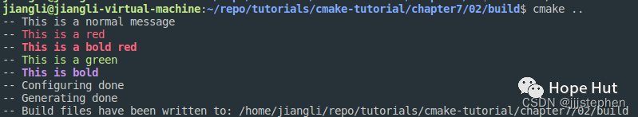

# CMake 笔记 | [32] 将源码分成模块


## 一、导言


**项目通常从单个****`CMakeLists.txt`文件开始，随着时间的推移，这个文件会逐渐增长。本篇，我们将演示一种将`CMakeLists.txt`分割成更小单元的机制。将`CMakeLists.txt`拆分为模块的动机：**

- **主CMakeLists.txt更易于阅读；**
- **CMake模块可以在其他项目中重用**
- **与函数相结合，模块可以帮助我们限制变量的作用范围。**

**本篇，我们将演示如何定义和包含一个宏，该宏允许我们获得****`CMake`的彩色输出(用于重要的状态消息或警告)。**


## 二、项目结构

```shell
.
├── cmake
│     └── colors.cmake
└── CMakeLists.txt
```

> https://gitee.com/jiangli01/tutorials/tree/master/cmake-tutorial/chapter7/02


<table><body text=red><tr><td style="text-align:left;font-weight:bold" bgcolor=yellow><font size="3" color="red">相关源码</font></td></tr></body></table>


**cmake/color.cmake**

```c++
# colorize CMake output
macro(define_colors)
  if(WIN32)
    # has no effect on WIN32
    set(ColourReset "")
    set(ColourBold "")
    set(Red "")
    set(Green "")
    set(Yellow "")
    set(Blue "")
    set(Magenta "")
    set(Cyan "")
    set(White "")
    set(BoldRed "")
    set(BoldGreen "")
    set(BoldYellow "")
    set(BoldBlue "")
    set(BoldMagenta "")
    set(BoldCyan "")
    set(BoldWhite "")
  else()
    string(ASCII 27 Esc)
    set(ColourReset "${Esc}[m")
    set(ColourBold "${Esc}[1m")
    set(Red "${Esc}[31m")
    set(Green "${Esc}[32m")
    set(Yellow "${Esc}[33m")
    set(Blue "${Esc}[34m")
    set(Magenta "${Esc}[35m")
    set(Cyan "${Esc}[36m")
    set(White "${Esc}[37m")
    set(BoldRed "${Esc}[1;31m")
    set(BoldGreen "${Esc}[1;32m")
    set(BoldYellow "${Esc}[1;33m")
    set(BoldBlue "${Esc}[1;34m")
    set(BoldMagenta "${Esc}[1;35m")
    set(BoldCyan "${Esc}[1;36m")
    set(BoldWhite "${Esc}[1;37m")
  endif()
endmacro()
```

**CMakeLists.txt**

```c++
cmake_minimum_required(VERSION 3.10 FATAL_ERROR)

project(example LANGUAGES NONE)

list(APPEND CMAKE_MODULE_PATH "${CMAKE_CURRENT_SOURCE_DIR}/cmake")

include(colors)
define_colors()

message(STATUS "This is a normal message")
message(STATUS "${Red}This is a red${ColourReset}")
message(STATUS "${BoldRed}This is a bold red${ColourReset}")
message(STATUS "${Green}This is a green${ColourReset}")
message(STATUS "${BoldMagenta}This is bold${ColourReset}")
```



```c++
list(APPEND CMAKE_MODULE_PATH "${CMAKE_CURRENT_SOURCE_DIR}/cmake")
```

将`cmake`子目录添加到`CMake`模块搜索的路径列表中。



```c++
include(colors)
define_colors()
```

包括`colors.cmake`模块，调用其中定义的宏。



```c++
message(STATUS "This is a normal message")
message(STATUS "${Red}This is a red${ColourReset}")
message(STATUS "${BoldRed}This is a bold red${ColourReset}")
message(STATUS "${Green}This is a green${ColourReset}")
message(STATUS "${BoldMagenta}This is bold${ColourReset}")
```

打印了不同颜色的信息。


## 三、结果展示

```shell
mkdir build
cd build
cmake ..
```

<br>
<center>
  
  <br>
  <div style="color:orange; border-bottom: 1px solid #d9d9d9; display: inline-block; color: #999; padding: 2px;">结果展示</div>
</center>
<br>


---

> 作者: [Jian YE](https://github.com/jianye0428)  
> URL: https://jianye0428.github.io/posts/cmake_note_33/  

