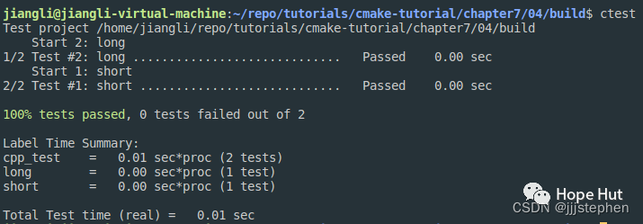

# CMake 笔记 | [36] 用指定参数定义函数或宏


## 一、导言


**前面的笔记中，我们研究了函数和宏，并使用了位置参数。本篇，我们将定义一个带有命名参数的函数。我们将复用**[**第1节中**](https://mp.weixin.qq.com/s?__biz=MzkxMzI5Mjk4Mg==&mid=2247485318&idx=1&sn=32ab4668164e2cb5419a8af6c0acf8e0&scene=21#wechat_redirect)**的代码，使用函数和宏重用代码。**


## 二、项目结构

```shell
.
├── cmake
│   └── testing.cmake
├── CMakeLists.txt
├── src
│   ├── CMakeLists.txt
│   ├── main.cpp
│   ├── sum_integers.cpp
│   └── sum_integers.hpp
└── tests
    ├── catch.hpp
    ├── CMakeLists.txt
    └── test.cpp
```

> https://gitee.com/jiangli01/tutorials/tree/master/cmake-tutorial/chapter7/04


## 三、相关源码

**cmake/testing.cmake**

```c++
function(add_catch_test)
  set(options)
  set(oneValueArgs NAME COST)
  set(multiValueArgs LABELS DEPENDS REFERENCE_FILES)
  cmake_parse_arguments(add_catch_test
    "${options}"
    "${oneValueArgs}"
    "${multiValueArgs}"
    ${ARGN}
    )

  message(STATUS "defining a test ...")
  message(STATUS "    NAME: ${add_catch_test_NAME}")
  message(STATUS "    LABELS: ${add_catch_test_LABELS}")
  message(STATUS "    COST: ${add_catch_test_COST}")
  message(STATUS "    REFERENCE_FILES: ${add_catch_test_REFERENCE_FILES}")

  add_test(
    NAME
      ${add_catch_test_NAME}
    COMMAND
      $<TARGET_FILE:cpp_test>
      [${add_catch_test_NAME}] --success --out
      ${PROJECT_BINARY_DIR}/tests/${add_catch_test_NAME}.log --durations yes
    WORKING_DIRECTORY
      ${CMAKE_CURRENT_BINARY_DIR}
    )

  set_tests_properties(${add_catch_test_NAME}
    PROPERTIES
      LABELS "${add_catch_test_LABELS}"
    )

  if(add_catch_test_COST)
    set_tests_properties(${add_catch_test_NAME}
      PROPERTIES
        COST ${add_catch_test_COST}
      )
  endif()

  if(add_catch_test_DEPENDS)
    set_tests_properties(${add_catch_test_NAME}
      PROPERTIES
        DEPENDS ${add_catch_test_DEPENDS}
      )
  endif()

  if(add_catch_test_REFERENCE_FILES)
    file(
      COPY
        ${add_catch_test_REFERENCE_FILES}
      DESTINATION
        ${CMAKE_CURRENT_BINARY_DIR}
      )
  endif()
endfunction()
```

```c++
function(add_catch_test)
  set(options)
  set(oneValueArgs NAME COST)
  set(multiValueArgs LABELS DEPENDS REFERENCE_FILES)
  cmake_parse_arguments(add_catch_test
    "${options}"
    "${oneValueArgs}"
    "${multiValueArgs}"
    ${ARGN}
    )
...
endfunction()
```

`CMake`提供`cmake_parse_arguments`命令，我们使用函数名(`add_catch_test`)选项(我们的例子中是`none`)、单值参数(`NAME`和`COST`)和多值参数(`LABELS`、`DEPENDS`和`REFERENCE_FILES`)调用该命令。
`options`、`oneValueArgs` 和 `multiValueArgs` 定义了函数可以接受的不同参数类型。`options`是布尔标志，`oneValueArgs` 接受一个值，而 `multiValueArgs` 可以接受多个值。

`cmake_parse_arguments`命令解析选项和参数，并定义如下:

- add_catch_test_NAME
- add_catch_test_COST
- add_catch_test_LABELS
- add_catch_test_DEPENDS
- add_catch_test_REFERENCE_FILES

这种方法使我们有机会用更健壮的接口和更具有可读的函数/宏调用，来实现函数和宏。



```c++
  add_test(
    NAME
      ${add_catch_test_NAME}
    COMMAND
      $<TARGET_FILE:cpp_test>
      [${add_catch_test_NAME}] --success --out
      ${PROJECT_BINARY_DIR}/tests/${add_catch_test_NAME}.log --durations yes
    WORKING_DIRECTORY
      ${CMAKE_CURRENT_BINARY_DIR}
    )
```

`NAME` 和 `COMMAND` 参数分别指定测试名称和运行测试的命令。
测试被配置为将结果输出到项目二进制目录下的日志文件中。




`set_tests_properties` 用于为测试分配属性。这些属性包括:

  - LABELS （标签），用于对测试进行分类。
  - COST(成本)，用于指定测试的相对资源使用量。
  - DEPENDS 指定必须在该测试之前运行的其他测试。

```c++
if(add_catch_test_DEPENDS)
    set_tests_properties(${add_catch_test_NAME}
      PROPERTIES
        DEPENDS ${add_catch_test_DEPENDS}
      )
  endif()
```
如果指定了任何参考文件，则使用 `file(COPY ... DESTINATION ...)` 命令将这些文件复制到当前二进制目录。这对需要将其输出与已知良好输出进行比较的测试非常有用。



**tests/CMakeLists.txt**

```c++
add_executable(cpp_test test.cpp)
target_link_libraries(cpp_test sum_integers)

include(testing)

add_catch_test(
  NAME
    short
  LABELS
    short
    cpp_test
  COST
    1.5
  )

add_catch_test(
  NAME
    long
  LABELS
    long
    cpp_test
  COST
    2.5
  )
```

**CMakeLists.txt**

```c++
cmake_minimum_required(VERSION 3.10 FATAL_ERROR)

project(example LANGUAGES CXX)

set(CMAKE_CXX_STANDARD 11)
set(CMAKE_CXX_EXTENSIONS OFF)
set(CMAKE_CXX_STANDARD_REQUIRED ON)

list(APPEND CMAKE_MODULE_PATH "${CMAKE_CURRENT_SOURCE_DIR}/cmake")

include(GNUInstallDirs)
set(CMAKE_ARCHIVE_OUTPUT_DIRECTORY ${CMAKE_BINARY_DIR}/${CMAKE_INSTALL_LIBDIR})
set(CMAKE_LIBRARY_OUTPUT_DIRECTORY ${CMAKE_BINARY_DIR}/${CMAKE_INSTALL_LIBDIR})
set(CMAKE_RUNTIME_OUTPUT_DIRECTORY ${CMAKE_BINARY_DIR}/${CMAKE_INSTALL_BINDIR})

add_subdirectory(src)

enable_testing()
add_subdirectory(tests)
```

## 四、结果展示

```shell
$ mkdir -p build
$ cd build
$ cmake ..
-- ...
-- defining a test ...
-- NAME: short
-- LABELS: short;cpp_test
-- COST: 1.5
-- REFERENCE_FILES:
-- defining a test ...
-- NAME: long
-- LABELS: long;cpp_test
-- COST: 2.5
-- REFERENCE_FILES:
-- ...
```

```c++
cmake --build .
ctest
```
<br>
<center>
  
  <br>
  <div style="color:orange; border-bottom: 1px solid #d9d9d9; display: inline-block; color: #999; padding: 2px;">输出结果</div>
</center>
<br>

---

> 作者: [Jian YE](https://github.com/jianye0428)  
> URL: https://jianye0428.github.io/posts/cmake_note_36/  

