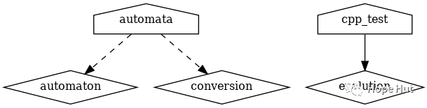

# CMake 笔记 | [38] 构建项目的策略及限制变量的范围和副作用


## 一、导言


**我们将讨论构建项目的策略，并限制变量的范围和副作用，目的是降低代码的复杂性和简化项目的维护。本篇，我们将把一个项目分割成几个范围有限的`CMakeLists.txt`文件，这些文件将使用`add_subdirectory`命令进行处理。**

**将源文件分割成更小、更易于管理的单元是有意义的。可以将所有源代码都编译成一个库或可执行文件。实际上，项目更喜欢将源代码编译分成更小的、定义良好的库。这样做既是为了本地化和简化依赖项，也是为了简化代码维护。这意味着如在这里所做的那样，由许多库构建一个项目是一种常见的情况。**


## 二、项目结构

```shell
.
├── CMakeLists.txt
├── external
│    ├── CMakeLists.txt
│    ├── conversion.cpp
│    └── conversion.hpp
├── src
│    ├── CMakeLists.txt
│    ├── evolution
│    │    ├── CMakeLists.txt
│    │    ├── evolution.cpp
│    │    └── evolution.hpp
│    ├── initial
│    │    ├── CMakeLists.txt
│    │    ├── initial.cpp
│    │    └── initial.hpp
│    ├── io
│    │    ├── CMakeLists.txt
│    │    ├── io.cpp
│    │    └── io.hpp
│    ├── main.cpp
│    └── parser
│        ├── CMakeLists.txt
│        ├── parser.cpp
│        └── parser.hpp
└── tests
    ├── catch.hpp
    ├── CMakeLists.txt
    └── test.cpp
```

项目地址：

> https://gitee.com/jiangli01/tutorials/tree/master/cmake-tutorial/chapter7/07

## 三、相关源码

本篇的代码以及项目结构比较简单，并未涉及到新的内容，所以以下代码都没有具体讲解，相关代码的知识点都在前面笔记中。

**CMakeLists.txt**

```c++
cmake_minimum_required(VERSION 3.5 FATAL_ERROR)
project(recipe-07 LANGUAGES CXX)
set(CMAKE_CXX_STANDARD 11)
set(CMAKE_CXX_EXTENSIONS OFF)
set(CMAKE_CXX_STANDARD_REQUIRED ON)
include(GNUInstallDirs)
set(CMAKE_ARCHIVE_OUTPUT_DIRECTORY
${CMAKE_BINARY_DIR}/${CMAKE_INSTALL_LIBDIR})
set(CMAKE_LIBRARY_OUTPUT_DIRECTORY
${CMAKE_BINARY_DIR}/${CMAKE_INSTALL_LIBDIR})
set(CMAKE_RUNTIME_OUTPUT_DIRECTORY
${CMAKE_BINARY_DIR}/${CMAKE_INSTALL_BINDIR})
# defines targets and sources
add_subdirectory(src)
# contains an "external" library we will link to
add_subdirectory(external)
# enable testing and define tests
enable_testing()
add_subdirectory(tests)
```

**external/conversion.hpp**

```c++
#pragma once

#include <string>

std::string BinaryRepresentation(const int decimal);
```

**external/conversion.cpp**

```c++
#include "conversion.hpp"

#include <bitset>

std::string BinaryRepresentation(const int decimal) {
  return std::bitset<8>(decimal).to_string();
}
```

**external/CMakeLists.txt**

```c++
add_library(conversion "")

target_sources(conversion
  PRIVATE
    ${CMAKE_CURRENT_LIST_DIR}/conversion.cpp
  PUBLIC
    ${CMAKE_CURRENT_LIST_DIR}/conversion.hpp
  )

target_include_directories(conversion
  PUBLIC
    ${CMAKE_CURRENT_LIST_DIR}
  )
```

**src/CMakeLists.txt**

```c++
add_executable(automata main.cpp)

add_subdirectory(evolution)
add_subdirectory(initial)
add_subdirectory(io)
add_subdirectory(parser)

target_link_libraries(automata
  PRIVATE
    conversion
    evolution
    initial
    io
    parser
  )
```

**src/evolution/evolution.hpp**

```c++
#pragma once

#include <string>
#include <vector>

std::vector<int> Evolve(const std::vector<int> row,
                        const std::string rule_binary);
```

**src/evolution/evolution.cpp**

```c++
#include "evolution.hpp"

#include <vector>

std::vector<int> Evolve(const std::vector<int> row,
                        const std::string rule_binary) {
  std::vector<int> result;

  for (auto i = 0; i < row.size(); ++i) {

    auto left = (i == 0 ? row.size() : i) - 1;
    auto center = i;
    auto right = (i + 1) % row.size();

    auto ancestors = 4 * row[left] + 2 * row[center] + 1 * row[right];
    ancestors = 7 - ancestors;

    auto new_state = std::stoi(rule_binary.substr(ancestors, 1));

    result.push_back(new_state);
  }

  return result;
}
```

**src/evolution/CMakeLists.txt**

```c++
add_library(evolution "")

target_sources(evolution
  PRIVATE
    evolution.cpp
  PUBLIC
    ${CMAKE_CURRENT_LIST_DIR}/evolution.hpp
  )

target_include_directories(evolution
  PUBLIC
    ${CMAKE_CURRENT_LIST_DIR}
  )
```

**src/initial/initial.hpp**

```c++
#pragma once

#include <vector>

std::vector<int> InitialDistribution(const int length);
```

**src/initial/initial.cpp**

```c++
#include "initial.hpp"

#include <vector>

std::vector<int> InitialDistribution(const int length) {
  // we start with a vector which is zeroed out
  std::vector<int> result(length, 0);

  // more or less in the middle we place a living cell
  result[length / 2] = 1;

  return result;
}
```

**src/initial/CMakeLists.txt**

```c++
add_library(initial "")

target_sources(initial
  PRIVATE
    initial.cpp
  PUBLIC
    ${CMAKE_CURRENT_LIST_DIR}/initial.hpp
  )

target_include_directories(initial
  PUBLIC
    ${CMAKE_CURRENT_LIST_DIR}
  )
```

**src/io/io.hpp**

```c++
#pragma once

#include <vector>

void PrintRow(const std::vector<int> row);
```

**src/io/io.cpp**

```c++
#include "io.hpp"

#include <algorithm>
#include <iostream>
#include <vector>

void PrintRow(const std::vector<int> row) {
  std::for_each(row.begin(), row.end(), [](int const &value) {
    std::cout << (value == 1 ? '*' : ' ');
  });
  std::cout << std::endl;
}
```

**src/io/CMakeLists.txt**

```c++
add_library(io "")

target_sources(io
  PRIVATE
    io.cpp
  PUBLIC
    ${CMAKE_CURRENT_LIST_DIR}/io.hpp
  )

target_include_directories(io
  PUBLIC
    ${CMAKE_CURRENT_LIST_DIR}
  )
```

**src/parser/parser.hpp**

```c++
#pragma once

#include <tuple>

std::tuple<int, int, int> ParseArguments(int argc, char *argv[]);
```

**src/parser/parser.cpp**

```c++
#include "parser.hpp"

#include <cassert>
#include <string>
#include <tuple>

std::tuple<int, int, int> ParseArguments(int argc, char *argv[]) {
  assert(argc == 4 && "program called with wrong number of arguments");

  auto length = std::stoi(argv[1]);
  auto num_steps = std::stoi(argv[2]);
  auto rule_decimal = std::stoi(argv[3]);

  return std::make_tuple(length, num_steps, rule_decimal);
}
```

**src/parser/CMakeLists.txt**

```c++
add_library(parser "")

target_sources(parser
  PRIVATE
    parser.cpp
  PUBLIC
    ${CMAKE_CURRENT_LIST_DIR}/parser.hpp
  )

target_include_directories(parser
  PUBLIC
    ${CMAKE_CURRENT_LIST_DIR}
  )
```

**main.cpp**

```c++
#include "conversion.hpp"
#include "evolution.hpp"
#include "initial.hpp"
#include "io.hpp"
#include "parser.hpp"

#include <iostream>

int main(int argc, char *argv[]) {

  // parse arguments
  int length, num_steps, rule_decimal;
  std::tie(length, num_steps, rule_decimal) = ParseArguments(argc, argv);

  // print information about parameters
  std::cout << "length: " << length << std::endl;
  std::cout << "number of steps: " << num_steps << std::endl;
  std::cout << "rule: " << rule_decimal << std::endl;

  // obtain binary representation for the rule
  std::string rule_binary = BinaryRepresentation(rule_decimal);

  // create initial distribution
  std::vector<int> row = InitialDistribution(length);

  // print initial configuration
  PrintRow(row);

  // the system evolves, print each step
  for (int step = 0; step < num_steps; step++) {
    row = Evolve(row, rule_binary);
    PrintRow(row);
  }

  return 0;
}
```

**tests/test.cpp**

```c++
#include "evolution.hpp"

// this tells catch to provide a main()
// only do this in one cpp file
#define CATCH_CONFIG_MAIN
#include "catch.hpp"

#include <string>
#include <vector>

TEST_CASE("Apply rule 90", "[rule-90]") {
  std::vector<int> row = {0, 1, 0, 1, 0, 1, 0, 1, 0};
  std::string rule = "01011010";
  std::vector<int> expected_result = {1, 0, 0, 0, 0, 0, 0, 0, 1};
  REQUIRE(Evolve(row, rule) == expected_result);
}

TEST_CASE("Apply rule 222", "[rule-222]") {
  std::vector<int> row = {0, 0, 0, 0, 1, 0, 0, 0, 0};
  std::string rule = "11011110";
  std::vector<int> expected_result = {0, 0, 0, 1, 1, 1, 0, 0, 0};
  REQUIRE(Evolve(row, rule) == expected_result);
}
```

**tests/CMakeLists.txt**

```c++
add_executable(cpp_test test.cpp)
target_link_libraries(cpp_test evolution)

add_test(
  NAME
    test_evolution
  COMMAND
    $<TARGET_FILE:cpp_test>
  )
```

## 四、结果展示

```shell
$ mkdir -p build
$ cd build
$ cmake ..
$ cmake --build .
Scanning dependencies of target conversion
[ 7%] Building CXX object external/CMakeFiles/conversion.dir/conversion.cpp.o
[ 14%] Linking CXX static library ../lib64/libconversion.a
[ 14%] Built target conversion
Scanning dependencies of target evolution
[ 21%] Building CXX object src/evolution/CMakeFiles/evolution.dir/evolution.cpp.o
[ 28%] Linking CXX static library ../../lib64/libevolution.a
[ 28%] Built target evolution
Scanning dependencies of target initial
[ 35%] Building CXX object src/initial/CMakeFiles/initial.dir/initial.cpp.o
[ 42%] Linking CXX static library ../../lib64/libinitial.a
[ 42%] Built target initial
Scanning dependencies of target io
[ 50%] Building CXX object src/io/CMakeFiles/io.dir/io.cpp.o
[ 57%] Linking CXX static library ../../lib64/libio.a
[ 57%] Built target io
Scanning dependencies of target parser
[ 64%] Building CXX object src/parser/CMakeFiles/parser.dir/parser.cpp.o
[ 71%] Linking CXX static library ../../lib64/libparser.a
[ 71%] Built target parser
Scanning dependencies of target automata
[ 78%] Building CXX object src/CMakeFiles/automata.dir/main.cpp.o
[ 85%] Linking CXX executable ../bin/automata
[ 85%] Built target automata
Scanning dependencies of target cpp_test
[ 92%] Building CXX object tests/CMakeFiles/cpp_test.dir/test.cpp.o
[100%] Linking CXX executable ../bin/cpp_test
[100%] Built target cpp_test
$ ctest
Running tests...
Start 1: test_evolution
1/1 Test #1: test_evolution ................... Passed 0.00 sec
100% tests passed, 0 tests failed out of 1
```

**补充内容**

`CMake`可以使用`Graphviz`图形可视化软件生成项目的依赖关系图:

```
$ cd build
$ cmake --graphviz=example.dot ..
$ dot -T png example.dot -o example.png
```

<br>
<center>
  
  <br>
  <div style="color:orange; border-bottom: 1px solid #d9d9d9; display: inline-block; color: #999; padding: 2px;">cmake 项目关系依赖图</div>
</center>
<br>

---

> 作者: [Jian YE](https://github.com/jianye0428)  
> URL: https://jianye0428.github.io/posts/cmake_note_38/  

