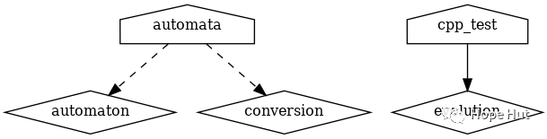

# CMake 笔记 | [39] 构建项目策略及限制变量范围2


## 一、导言

**本篇，我们将讨论上一篇的另一种方法，并不使用`add_subdirectory`的情况下，使用`module include`组装不同的`CMakeLists.txt`文件。其允许我们使用`target_link_libraries`链接到当前目录之外定义的目标。**

**就项目架构而言，不推荐本篇的构建方式。**



## 二、项目结构

```shell
.
├── CMakeLists.txt
├── external
│   ├── CMakeLists.txt
│   ├── conversion.cpp
│   └── conversion.hpp
├── src
│   ├── CMakeLists.txt
│   ├── evolution
│   │   ├── CMakeLists.txt
│   │   ├── evolution.cpp
│   │   └── evolution.hpp
│   ├── initial
│   │   ├── CMakeLists.txt
│   │   ├── initial.cpp
│   │   └── initial.hpp
│   ├── io
│   │   ├── CMakeLists.txt
│   │   ├── io.cpp
│   │   └── io.hpp
│   ├── main.cpp
│   └── parser
│       ├── CMakeLists.txt
│       ├── parser.cpp
│       └── parser.hpp
└── tests
    ├── catch.hpp
    ├── CMakeLists.txt
    └── test.cpp
```

项目地址：

> https://gitee.com/jiangli01/tutorials/tree/master/cmake-tutorial/chapter7/08


## 三、相关源码

将使用与上一篇相同的源代码。唯一的更改将出现在`CMakeLists.txt`文件中，我们将在下面的部分中讨论这些更改。
**CMakeLists.txt**

```c++
cmake_minimum_required(VERSION 3.10 FATAL_ERROR)
project(example LANGUAGES CXX)
set(CMAKE_CXX_STANDARD 11)
set(CMAKE_CXX_EXTENSIONS OFF)
set(CMAKE_CXX_STANDARD_REQUIRED ON)
include(GNUInstallDirs)
set(CMAKE_ARCHIVE_OUTPUT_DIRECTORY
${CMAKE_BINARY_DIR}/${CMAKE_INSTALL_LIBDIR})
set(CMAKE_LIBRARY_OUTPUT_DIRECTORY
${CMAKE_BINARY_DIR}/${CMAKE_INSTALL_LIBDIR})
set(CMAKE_RUNTIME_OUTPUT_DIRECTORY
${CMAKE_BINARY_DIR}/${CMAKE_INSTALL_BINDIR})
# defines targets and sources
include(src/CMakeLists.txt)
include(external/CMakeLists.txt)
enable_testing()
add_subdirectory(tests)
```

**src/CMakeLists.txt**

```c++
add_library(automaton "")
add_library(evolution "")
include(${CMAKE_CURRENT_LIST_DIR}/evolution/CMakeLists.txt)
include(${CMAKE_CURRENT_LIST_DIR}/initial/CMakeLists.txt)
include(${CMAKE_CURRENT_LIST_DIR}/io/CMakeLists.txt)
include(${CMAKE_CURRENT_LIST_DIR}/parser/CMakeLists.txt)
add_executable(automata "")
target_sources(automata
  PRIVATE
      ${CMAKE_CURRENT_LIST_DIR}/main.cpp
  )
target_link_libraries(automata
  PRIVATE
    automaton
    conversion
  )
```

**src/evolution/CMakeLists.txt**

```c++
target_sources(automaton
  PRIVATE
      ${CMAKE_CURRENT_LIST_DIR}/evolution.cpp
  PUBLIC
      ${CMAKE_CURRENT_LIST_DIR}/evolution.hpp
  )
target_include_directories(automaton
  PUBLIC
      ${CMAKE_CURRENT_LIST_DIR}
  )
target_sources(evolution
  PRIVATE
      ${CMAKE_CURRENT_LIST_DIR}/evolution.cpp
  PUBLIC
      ${CMAKE_CURRENT_LIST_DIR}/evolution.hpp
  )
target_include_directories(evolution
  PUBLIC
      ${CMAKE_CURRENT_LIST_DIR}
  )
```

其余`CMakeLists.txt`文件和`src/initial/CMakeLists.txt`相同。

**src/initial/CMakeLists.txt**

```c++
target_sources(automaton
  PRIVATE
      ${CMAKE_CURRENT_LIST_DIR}/initial.cpp
  PUBLIC
      ${CMAKE_CURRENT_LIST_DIR}/initial.hpp
  )
target_include_directories(automaton
  PUBLIC
      ${CMAKE_CURRENT_LIST_DIR}
  )
```

定义了三个库:

- `conversion`(在`external`定义)
- `automaton`(包含除转换之外的所有源)
- `evolution`(在`src/evolution`中定义，并通过`cpp_test`链接)

我们通过使用`include()`引用`CMakeLists.txt`文件，在父范围内，仍然能保持所有目标可用。

```c++
include(src/CMakeLists.txt)
include(external/CMakeLists.txt)
```

构建一个包含树，记住当进入子目录(`src/CMakeLists.txt`)时，我们需要使用相对于父范围的路径:

```c++
include(${CMAKE_CURRENT_LIST_DIR}/evolution/CMakeLists.txt)
include(${CMAKE_CURRENT_LIST_DIR}/initial/CMakeLists.txt)
include(${CMAKE_CURRENT_LIST_DIR}/io/CMakeLists.txt)
include(${CMAKE_CURRENT_LIST_DIR}/parser/CMakeLists.txt)
```

这样，我们就可以定义并链接到通过`include()`语句访问文件树中任何位置的目标。


## 四、结果展示

```shell
$ cd build
$ cmake ..
$ cmake --build build
$ ctest
Running tests...
Start 1: test_evolution
1/1 Test #1: test_evolution ................... Passed 0.00 sec
100% tests passed, 0 tests failed out of 1
```

**补充内容**

我们可以再次使用`CMake`和`Graphviz`生成这个项目的依赖关系图:

```
$ cd build
$ cmake --graphviz=example.dot ..
$ dot -T png example.dot -o example.png
```
<br>
<center>
  
  <br>
  <div style="color:orange; border-bottom: 1px solid #d9d9d9; display: inline-block; color: #999; padding: 2px;">项目结构</div>
</center>
<br>


---

> 作者: [Jian YE](https://github.com/jianye0428)  
> URL: https://jianye0428.github.io/posts/cmake_note_39/  

