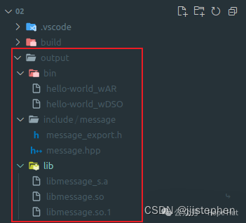

# CMake 笔记 | [42] 导出头文件


## 一、导言

**其实，本篇的相关内容已经在**[**CMake：静态库和动态库的详解(Linux/Windows)**](https://mp.weixin.qq.com/s?__biz=MzkxMzI5Mjk4Mg==&mid=2247484287&idx=1&sn=df3b9fb1c0e4c2497b114cdebb6ac2bf&scene=21#wechat_redirect)**笔记中已经详细介绍了具体使用方法，且展示了`CMake`提供了与平台无关的方式实现的功能。但是，没有处理符号可见性的问题。关于符号的可见性的最佳方式是规定动态库只公开最小的符号，从而限制代码中定义的对象和函数对外的可见性。**

**我们希望在默认情况下，动态库定义的所有符号都对外隐藏。这将使得项目的贡献者，能够清楚地划分库和外部代码之间的接口，因为他们必须显式地标记所有要在项目外部使用的符号。**



## 二、项目结构

```shell
.
├── CMakeLists.txt
├── src
│   ├── CMakeLists.txt
│   ├── hello_world.cpp
│   ├── message.cpp
│   └── message.hpp
└── test
    └── CMakeLists.txt
```

项目地址：

> https://gitee.com/jiangli01/tutorials/tree/master/cmake-tutorial/chapter9/02


## 三、相关源码

**CMakeLists.txt**

```c++
# CMake 3.6 needed for IMPORTED_TARGET option
# to pkg_search_module
cmake_minimum_required(VERSION 3.6 FATAL_ERROR)

project(
  example
  LANGUAGES CXX
  VERSION 1.0.0
)

# <<< General set up >>>

set(CMAKE_CXX_STANDARD 11)
set(CMAKE_CXX_EXTENSIONS OFF)
set(CMAKE_CXX_STANDARD_REQUIRED ON)

# 检查是否已经设置了安装前缀
if(CMAKE_INSTALL_PREFIX_INITIALIZED_TO_DEFAULT)
    # 设置安装目录为项目源目录下的output文件夹
    set(CMAKE_INSTALL_PREFIX "${CMAKE_SOURCE_DIR}/output/" CACHE PATH "..." FORCE)
endif()

message(STATUS "Project will be installed to ${CMAKE_INSTALL_PREFIX}")

if(NOT CMAKE_BUILD_TYPE)
  set(CMAKE_BUILD_TYPE Release CACHE STRING "Build type" FORCE)
endif()

message(STATUS "Build type set to ${CMAKE_BUILD_TYPE}")

include(GNUInstallDirs)

set(CMAKE_ARCHIVE_OUTPUT_DIRECTORY ${PROJECT_BINARY_DIR}/${CMAKE_INSTALL_LIBDIR})
set(CMAKE_LIBRARY_OUTPUT_DIRECTORY ${PROJECT_BINARY_DIR}/${CMAKE_INSTALL_LIBDIR})
set(CMAKE_RUNTIME_OUTPUT_DIRECTORY ${PROJECT_BINARY_DIR}/${CMAKE_INSTALL_BINDIR})

# Offer the user the choice of overriding the installation directories
set(INSTALL_LIBDIR ${CMAKE_INSTALL_LIBDIR} CACHE PATH "Installation directory for libraries")
set(INSTALL_BINDIR ${CMAKE_INSTALL_BINDIR} CACHE PATH "Installation directory for executables")
set(INSTALL_INCLUDEDIR ${CMAKE_INSTALL_INCLUDEDIR} CACHE PATH "Installation directory for header files")
if(WIN32 AND NOT CYGWIN)
  set(DEF_INSTALL_CMAKEDIR CMake)
else()
  set(DEF_INSTALL_CMAKEDIR share/cmake/${PROJECT_NAME})
endif()
set(INSTALL_CMAKEDIR ${DEF_INSTALL_CMAKEDIR} CACHE PATH "Installation directory for CMake files")

# Report to user
foreach(p LIB BIN INCLUDE CMAKE)
  file(TO_NATIVE_PATH ${CMAKE_INSTALL_PREFIX}/${INSTALL_${p}DIR} _path )
  message(STATUS "Installing ${p} components to ${_path}")
  unset(_path)
endforeach()

add_subdirectory(src)

enable_testing()

add_subdirectory(test)
```

**src/CMakeLists.txt**

```c++
# Search for pkg-config and UUID
find_package(PkgConfig QUIET)
if(PKG_CONFIG_FOUND)
  pkg_search_module(UUID uuid IMPORTED_TARGET)
  if(TARGET PkgConfig::UUID)
    message(STATUS "Found libuuid")
    set(UUID_FOUND TRUE)
  endif()
endif()

# <<< Build targets >>>

# SHARED library
add_library(message-shared SHARED "")

target_sources(message-shared
  PRIVATE
    ${CMAKE_CURRENT_LIST_DIR}/message.cpp
  )

target_compile_definitions(message-shared
  PUBLIC
    $<$<BOOL:${UUID_FOUND}>:HAVE_UUID>
  )

target_link_libraries(message-shared
  PUBLIC
    $<$<BOOL:${UUID_FOUND}>:PkgConfig::UUID>
  )

set_target_properties(message-shared
  PROPERTIES
    POSITION_INDEPENDENT_CODE 1
    CXX_VISIBILITY_PRESET hidden
    VISIBILITY_INLINES_HIDDEN 1
    SOVERSION ${PROJECT_VERSION_MAJOR}
    OUTPUT_NAME "message"
    DEBUG_POSTFIX "_d"
    PUBLIC_HEADER "message.hpp;${CMAKE_BINARY_DIR}/${INSTALL_INCLUDEDIR}/message_export.h"
    MACOSX_RPATH ON
  )

include(GenerateExportHeader)
generate_export_header(message-shared
  BASE_NAME "message"
  EXPORT_MACRO_NAME "MESSAGE_LIB_API"
  EXPORT_FILE_NAME "${CMAKE_BINARY_DIR}/${INSTALL_INCLUDEDIR}/message_export.h"
  STATIC_DEFINE "MESSAGE_STATIC_DEFINE"
  DEFINE_NO_DEPRECATED
  )

target_include_directories(message-shared
  PUBLIC
    ${CMAKE_BINARY_DIR}/${INSTALL_INCLUDEDIR}
  )

# STATIC library
add_library(message-static STATIC "")

target_sources(message-static
  PRIVATE
    ${CMAKE_CURRENT_LIST_DIR}/message.cpp
  )

target_compile_definitions(message-static
  PUBLIC
    MESSAGE_STATIC_DEFINE
    $<$<BOOL:${UUID_FOUND}>:HAVE_UUID>
  )

target_include_directories(message-static
  PUBLIC
    ${CMAKE_BINARY_DIR}/${INSTALL_INCLUDEDIR}
  )

target_link_libraries(message-static
  PUBLIC
    $<$<BOOL:${UUID_FOUND}>:PkgConfig::UUID>
  )

set_target_properties(message-static
  PROPERTIES
    POSITION_INDEPENDENT_CODE 1
    ARCHIVE_OUTPUT_NAME "message"
    DEBUG_POSTFIX "_sd"
    RELEASE_POSTFIX "_s"
    PUBLIC_HEADER "message.hpp;${CMAKE_BINARY_DIR}/${INSTALL_INCLUDEDIR}/message_export.h"
  )

# EXECUTABLES
add_executable(hello-world_wDSO hello_world.cpp)

target_link_libraries(hello-world_wDSO
  PUBLIC
    message-shared
  )

# Prepare RPATH

file(RELATIVE_PATH _rel ${CMAKE_INSTALL_PREFIX}/${INSTALL_BINDIR} ${CMAKE_INSTALL_PREFIX})
if(APPLE)
  set(_rpath "@loader_path/${_rel}")
else()
  set(_rpath "\$ORIGIN/${_rel}")
endif()
file(TO_NATIVE_PATH "${_rpath}/${INSTALL_LIBDIR}" message_RPATH)

set_target_properties(hello-world_wDSO
  PROPERTIES
    MACOSX_RPATH ON
    SKIP_BUILD_RPATH OFF
    BUILD_WITH_INSTALL_RPATH OFF
    INSTALL_RPATH "${message_RPATH}"
    INSTALL_RPATH_USE_LINK_PATH ON
  )

add_executable(hello-world_wAR hello_world.cpp)

target_link_libraries(hello-world_wAR
  PUBLIC
    message-static
  )

# <<< Install and export targets >>>

install(
  TARGETS
    message-shared
    message-static
    hello-world_wDSO
    hello-world_wAR
  ARCHIVE
    DESTINATION ${INSTALL_LIBDIR}
    COMPONENT lib
  RUNTIME
    DESTINATION ${INSTALL_BINDIR}
    COMPONENT bin
  LIBRARY
    DESTINATION ${INSTALL_LIBDIR}
    COMPONENT lib
  PUBLIC_HEADER
    DESTINATION ${INSTALL_INCLUDEDIR}/message
    COMPONENT dev
  )
```

```c++
set_target_properties(message-shared
  PROPERTIES
    POSITION_INDEPENDENT_CODE 1
    CXX_VISIBILITY_PRESET hidden
    VISIBILITY_INLINES_HIDDEN 1
    SOVERSION ${PROJECT_VERSION_MAJOR}
    OUTPUT_NAME "message"
    DEBUG_POSTFIX "_d"
    PUBLIC_HEADER "message.hpp;${CMAKE_BINARY_DIR}/${INSTALL_INCLUDEDIR}/message_export.h"
    MACOSX_RPATH ON
  )
```

- **CXX_VISIBILITY_PRESET hidden**: 设置了默认的符号可见性。在这里，它被设置为隐藏，这意味着除非显式指定，否则所有符号都不会被导出。有助于减小最终的二进制文件大小，提高加载速度，并提供一定程度的封装。
- **VISIBILITY_INLINES_HIDDEN 1**: 当使用隐藏可见性时，这个选项也隐藏了内联函数的符号。这进一步减少了导出符号的数量。
- **OUTPUT_NAME “message”**: 这指定了目标的输出名称。在这种情况下，不管目标的实际名称是什么（在这里是 `message-shared`），生成的文件将被命名为 `message`。
- **PUBLIC_HEADER message.hpp;${CMAKE_BINARY_DIR}/${INSTALL_INCLUDEDIR}/message_export.h**: 指定了公共头文件。这些文件在安装目标时会被特别对待，通常被复制到包含目录中。
- **MACOSX_RPATH ON**: 这是一个特定于macOS的选项，启用了相对路径（rpath）的使用。RPath是运行时搜索共享库的一种机制，这对于确保应用程序可以找到其依赖的共享库非常重要。





```c++
generate_export_header(message-shared
  BASE_NAME "message"
  EXPORT_MACRO_NAME "MESSAGE_LIB_API"
  EXPORT_FILE_NAME "${CMAKE_BINARY_DIR}/${INSTALL_INCLUDEDIR}/message_export.h"
  STATIC_DEFINE "MESSAGE_STATIC_DEFINE"
  DEFINE_NO_DEPRECATED
  )
```

- **BASE_NAME “message”**: 这指定了生成的宏的基础名称。生成的宏将基于 “message” 这个名称，例如 `MESSAGE_EXPORT`。
- **EXPORT_MACRO_NAME “MESSAGE_LIB_API”**: 这定义了用于导出符号的宏名称。可以使用 `MESSAGE_LIB_API` 来标记那些需要导出的类、函数或变量。
- **EXPORT_FILE_NAME “${CMAKE_BINARY_DIR}/${INSTALL_INCLUDEDIR}/message_export.h”**: 指定了生成的头文件的名称和位置。此头文件将包含必要的预处理器指令，用于根据是正在编译库本身还是正在使用库来改变宏的行为。
- **STATIC_DEFINE “MESSAGE_STATIC_DEFINE”**: 当库被静态链接时，这个宏将被定义。这对于在静态和共享链接之间透明地切换非常有用。
- **DEFINE_NO_DEPRECATED**: 这将定义一个宏，用于禁用库中已弃用函数的警告。这对于维护旧代码库非常有用，因为它允许开发者在不触发弃用警告的情况下编译旧代码(当然这个宏可以不使用)。


**src/message.hpp**

```c++
#pragma once

#include <iosfwd>
#include <string>
#include "message_export.h"
class MESSAGE_LIB_API Message {
public:
  Message(const std::string &m) : message_(m) {}

  friend std::ostream &operator<<(std::ostream &os, Message &obj) {
    return obj.PrintObject(os);
  }

private:
  std::string message_;
  std::ostream &PrintObject(std::ostream &os);
};

std::string GetUUID();
```

**src/hello_world.cpp**

```c++
#include "message.hpp"

#include <iostream>
#include <string>

#ifdef HAVE_UUID
#include <uuid/uuid.h>
#endif

std::ostream &Message::PrintObject(std::ostream &os) {
  os << "This is my very nice message: " << std::endl;
  os << message_ << std::endl;
  os << "...and here is its UUID: " << GetUUID();

  return os;
}

#ifdef HAVE_UUID
std::string GetUUID() {
  uuid_t uuid;
  uuid_generate(uuid);
  char uuid_str[37];
  uuid_unparse_lower(uuid, uuid_str);
  uuid_clear(uuid);
  std::string uuid_cxx(uuid_str);
  return uuid_cxx;
}
#else
std::string GetUUID() { return "Ooooops, no UUID for you!"; }
#endif
```

**test/CMakeLists.txt**

```c++
add_test(
  NAME test_shared
  COMMAND $<TARGET_FILE:hello-world_wDSO>
  )

add_test(
  NAME test_static
  COMMAND $<TARGET_FILE:hello-world_wAR>
  )
```
## 四、结果展示

```shell
& mkdir build
& cd build
& cmake ..
& cmake --build . --target install


Scanning dependencies of target message-static
[ 12%] Building CXX object src/CMakeFiles/message-static.dir/message.cpp.o
[ 25%] Linking CXX static library ../lib/libmessage_s.a
[ 25%] Built target message-static
Scanning dependencies of target hello-world_wAR
[ 37%] Building CXX object src/CMakeFiles/hello-world_wAR.dir/hello_world.cpp.o
[ 50%] Linking CXX executable ../bin/hello-world_wAR
[ 50%] Built target hello-world_wAR
Scanning dependencies of target message-shared
[ 62%] Building CXX object src/CMakeFiles/message-shared.dir/message.cpp.o
[ 75%] Linking CXX shared library ../lib/libmessage.so
[ 75%] Built target message-shared
Scanning dependencies of target hello-world_wDSO
[ 87%] Building CXX object src/CMakeFiles/hello-world_wDSO.dir/hello_world.cpp.o
[100%] Linking CXX executable ../bin/hello-world_wDSO
[100%] Built target hello-world_wDSO
Install the project...
-- Install configuration: "Release"
-- Installing: /home/jiangli/repo/tutorials/cmake-tutorial/chapter9/02/output/lib/libmessage.so.1
-- Up-to-date: /home/jiangli/repo/tutorials/cmake-tutorial/chapter9/02/output/lib/libmessage.so
-- Up-to-date: /home/jiangli/repo/tutorials/cmake-tutorial/chapter9/02/output/include/message/message.hpp
-- Installing: /home/jiangli/repo/tutorials/cmake-tutorial/chapter9/02/output/include/message/message_export.h
-- Installing: /home/jiangli/repo/tutorials/cmake-tutorial/chapter9/02/output/lib/libmessage_s.a
-- Up-to-date: /home/jiangli/repo/tutorials/cmake-tutorial/chapter9/02/output/include/message/message.hpp
-- Up-to-date: /home/jiangli/repo/tutorials/cmake-tutorial/chapter9/02/output/include/message/message_export.h
-- Installing: /home/jiangli/repo/tutorials/cmake-tutorial/chapter9/02/output/bin/hello-world_wDSO
-- Set runtime path of "/home/jiangli/repo/tutorials/cmake-tutorial/chapter9/02/output/bin/hello-world_wDSO" to "$ORIGIN/../lib"
-- Installing: /home/jiangli/repo/tutorials/cmake-tutorial/chapter9/02/output/bin/hello-world_wAR
```

输出：
<br>
<center>
  
  <br>
  <div style="color:orange; border-bottom: 1px solid #d9d9d9; display: inline-block; color: #999; padding: 2px;">导处头文件</div>
</center>
<br>

---

> 作者: [Jian YE](https://github.com/jianye0428)  
> URL: https://jianye0428.github.io/posts/cmake_note_42/  

