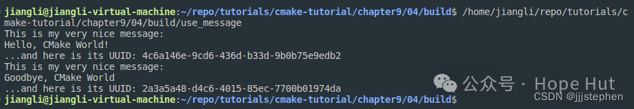

# CMake 笔记 | [44] 验证自己生成的库


## 一、导言

**经过上一篇（[CMake:输出库（像其他优秀的库一样优雅）](https://mp.weixin.qq.com/s?__biz=MzkxMzI5Mjk4Mg==&mid=2247485493&idx=1&sn=153d11f6db08ef0f70ce8bb95d7e0417&scene=21#wechat_redirect)），我们已经构建出了优雅的库。本篇，我们将基于上一篇的内容，写一个简单的使用demo进行验证！**


## 二、项目结构

```shell
.
├── CMakeLists.txt
└── use_message.cpp
```

项目地址：

> https://gitee.com/jiangli01/tutorials/tree/master/cmake-tutorial/chapter9/04


## 三、相关源码

**CMakeLists.txt**

```c++
cmake_minimum_required(VERSION 3.5 FATAL_ERROR)

project(use-message
  LANGUAGES CXX
  )

set(CMAKE_CXX_STANDARD 11)
set(CMAKE_CXX_EXTENSIONS OFF)
set(CMAKE_CXX_STANDARD_REQUIRED ON)
set(CMAKE_PREFIX_PATH /home/jiangli/repo/tutorials/cmake-tutorial/chapter9/03/output/share/cmake/example)
find_package(message REQUIRED CONFIG)

if(message_FOUND)
  message(STATUS "Found message: (found version ${message_VERSION})")
endif()

include_directories(/home/jiangli/repo/tutorials/cmake-tutorial/chapter9/03/output/include)

add_executable(use_message use_message.cpp)

target_link_libraries(use_message message::message-shared)
```


这里，我们没有对我们的库添加到环境变量中，所以为了使`find_package`命令能够找到我们的库，需要在`find_package`命令前设置库所在的`cmake`文件路径。
```
set(CMAKE_PREFIX_PATH /home/jiangli/repo/tutorials/cmake-tutorial/chapter9/03/output/share/cmake/example)
```
如果我们把生成的库设置到环境变量中，那么我们就可以省略掉这一步骤！



**use_message.cpp**

```c++
#include <cstdlib>
#include <iostream>

#include <message/message.hpp>

int main() {
  Message say_hello("Hello, CMake World!");

  std::cout << say_hello << std::endl;

  Message say_goodbye("Goodbye, CMake World");

  std::cout << say_goodbye << std::endl;

  return EXIT_SUCCESS;
}
```

## 四、结果展示

```shell
mkdir build & cd build
cmake ..
make .
./use_message
```

<br>
<center>
  
  <br>
  <div style="color:orange; border-bottom: 1px solid #d9d9d9; display: inline-block; color: #999; padding: 2px;">验证生成的库</div>
</center>
<br>


' fill='%23FFFFFF'%3E%3Crect x='249' y='126' width='1' height='1'%3E%3C/rect%3E%3C/g%3E%3C/g%3E%3C/svg%3E)


' fill='%23FFFFFF'%3E%3Crect x='249' y='126' width='1' height='1'%3E%3C/rect%3E%3C/g%3E%3C/g%3E%3C/svg%3E)


cmake45

cmake · 目录

上一篇CMake:输出库（像其他优秀的库一样优雅）下一篇CMake:使用Doxygen构建文档


People who liked this content also liked

CMake:超级构建模式


Hope Hut

不喜欢

不看的原因

OK

- 内容质量低
- 不看此公众号


CMake:使用函数和宏重用代码


Hope Hut

不喜欢

不看的原因

OK

- 内容质量低
- 不看此公众号


CMake:使用Doxygen构建文档


Hope Hut

不喜欢

不看的原因

OK

- 内容质量低
- 不看此公众号


Scan to Follow

people underline

---

> 作者: [Jian YE](https://github.com/jianye0428)  
> URL: https://jianye0428.github.io/posts/cmake_note_44/  

