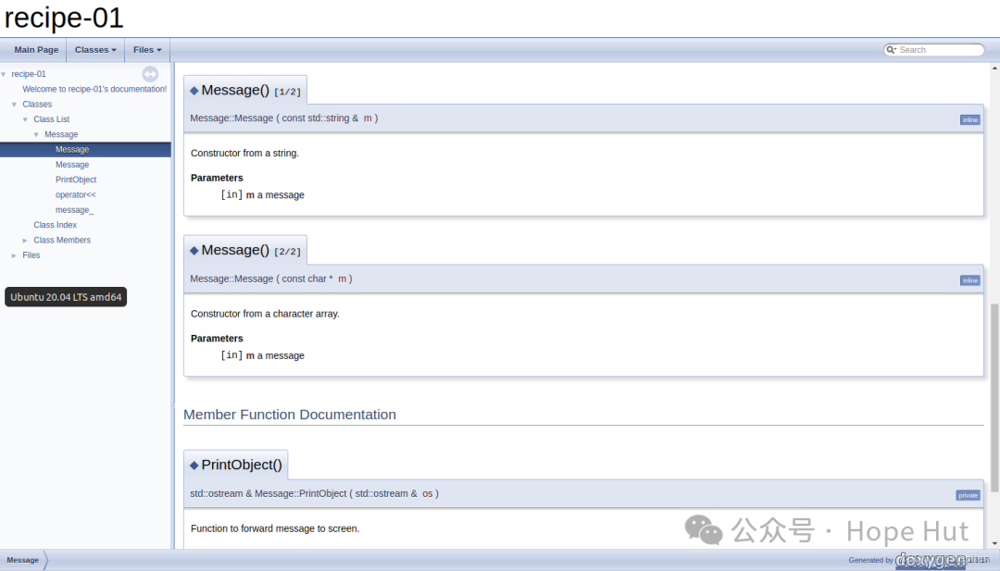

# CMake 笔记 | [45] 使用Doxygen构建文档


## 一、导言

**文档在所有的软件项目都是有必要的：**

- **对于用户来说，了解如何获得并构建代码，并且如何有效地使用源代码或库；**
- **对于开发人员来说，文档可用来描述你源码细节，并帮助其他程序员参与其中为该项目作出贡献。**

**`Doxygen`是非常流行的源代码文档工具。可以在代码中添加文档标记作为注释，而后运行`Doxygen`提取这些注释，并以`Doxyfile`配置文件中定义的格式创建文档。`Doxygen`可以输出`HTML`、`XML`，甚至`LaTeX`或`PDF`。本篇，将使用CMake来构建`Doxygen`文档。**


## 二、项目结构

```shell
.
├── cmake
│   └── UseDoxygenDoc.cmake
├── CMakeLists.txt
├── docs
│   ├── Doxyfile.in
│   └── front_page.md
└── src
    ├── CMakeLists.txt
    ├── hello_world.cpp
    ├── message.cpp
    └── message.hpp
```

项目地址

> https://gitee.com/jiangli01/tutorials/tree/master/cmake-tutorial/chapter10/01

## 三、相关源码

**CMakeLists.txt**

```c++
cmake_minimum_required(VERSION 3.10 FATAL_ERROR)

project(example LANGUAGES CXX)

set(CMAKE_CXX_STANDARD 11)
set(CMAKE_CXX_EXTENSIONS OFF)
set(CMAKE_CXX_STANDARD_REQUIRED ON)

include(GNUInstallDirs)
set(CMAKE_ARCHIVE_OUTPUT_DIRECTORY ${CMAKE_BINARY_DIR}/${CMAKE_INSTALL_LIBDIR})
set(CMAKE_LIBRARY_OUTPUT_DIRECTORY ${CMAKE_BINARY_DIR}/${CMAKE_INSTALL_LIBDIR})
set(CMAKE_RUNTIME_OUTPUT_DIRECTORY ${CMAKE_BINARY_DIR}/${CMAKE_INSTALL_BINDIR})

list(APPEND CMAKE_MODULE_PATH "${CMAKE_SOURCE_DIR}/cmake")

include(UseDoxygenDoc)

add_subdirectory(src)

add_doxygen_doc(
  BUILD_DIR
    ${CMAKE_CURRENT_BINARY_DIR}/_build
  DOXY_FILE
    ${CMAKE_CURRENT_SOURCE_DIR}/docs/Doxyfile.in
  TARGET_NAME
    docs
  COMMENT
    "HTML documentation"
  )
```



```c++
add_doxygen_doc(
  BUILD_DIR
    ${CMAKE_CURRENT_BINARY_DIR}/_build
  DOXY_FILE
    ${CMAKE_CURRENT_SOURCE_DIR}/docs/Doxyfile.in
  TARGET_NAME
    docs
  COMMENT
    "HTML documentation"
  )
```

这是一个自定义函数，该函数在`cmake/UseDoxygenDox.cmake`中被定义。有四个参数：`BUILD_DIR`,`DOXY_FILE`,`TARGET_NAME`以及`COMMENT`。具体使用方法，请参考下面的介绍。

当然，为了能够使用`Doxygen`需要事先执行以下命令安装：

```
sudo apt install doxygen
```

**cmake/UseDoxygenDoc.cmake**

```c++
find_package(Perl REQUIRED)
find_package(Doxygen REQUIRED)

function(add_doxygen_doc)
  set(options)
  set(oneValueArgs BUILD_DIR DOXY_FILE TARGET_NAME COMMENT)
  set(multiValueArgs)

  cmake_parse_arguments(DOXY_DOC
    "${options}"
    "${oneValueArgs}"
    "${multiValueArgs}"
    ${ARGN}
    )

  configure_file(
    ${DOXY_DOC_DOXY_FILE}
    ${DOXY_DOC_BUILD_DIR}/Doxyfile
    @ONLY
    )

  add_custom_target(${DOXY_DOC_TARGET_NAME}
    COMMAND
      ${DOXYGEN_EXECUTABLE} Doxyfile
    WORKING_DIRECTORY
      ${DOXY_DOC_BUILD_DIR}
    COMMENT
      "Building ${DOXY_DOC_COMMENT} with Doxygen"
    VERBATIM
    )

  message(STATUS "Added ${DOXY_DOC_TARGET_NAME} [Doxygen] target to build documentation")
endfunction()
```

- `set(options)`: 定义一个变量`options`，在这里没有列出任何选项，表示该函数没有不带值的选项参数。
- `set(oneValueArgs BUILD_DIR DOXY_FILE TARGET_NAME COMMENT)`: 定义了接受单个值的参数。这里列出了四个参数：`BUILD_DIR`是文档构建的目录，`DOXY_FILE`是Doxygen的配置文件，`TARGET_NAME`是CMake目标的名字，`COMMENT`是构建时显示的注释。
- `set(multiValueArgs)`: 定义了接受多个值的参数，但在此脚本中未使用。
- `cmake_parse_arguments(DOXY_DOC ...)`: 用于解析调用函数时传入的参数，并将解析后的值存储到`DOXY_DOC`变量中。
- `configure_file(...)`: 用于处理配置文件。它将`DOXY_DOC_DOXY_FILE`参数指定的Doxygen配置文件复制到`DOXY_DOC_BUILD_DIR`参数指定的构建目录，并替换其中的变量。
- `add_custom_target(...)`: 添加了一个自定义的目标到CMake，执行这个目标时，它会在`DOXY_DOC_BUILD_DIR`目录下运行Doxygen来生成文档。
- `COMMAND ${DOXYGEN_EXECUTABLE} Doxyfile`: 这是实际调用Doxygen命令的部分。
- `WORKING_DIRECTORY ${DOXY_DOC_BUILD_DIR}`: 指定了Doxygen命令运行的工作目录。
- `COMMENT "Building ${DOXY_DOC_COMMENT} with Doxygen"`: 设置了当执行这个CMake目标时显示的注释。
- `VERBATIM`: 保证了命令行在所有平台上以字面意义执行，没有任何变化。
- `message(STATUS "Added ${DOXY_DOC_TARGET_NAME} [Doxygen] target to build documentation")`: 这行打印一条状态消息，告诉用户已经添加了一个名为`${DOXY_DOC_TARGET_NAME}`的目标，用于构建文档。

**docs/Doxyfile.in**

```
# Doxyfile 1.8.14

#---------------------------------------------------------------------------
# Project related configuration options
#---------------------------------------------------------------------------
DOXYFILE_ENCODING      = UTF-8
PROJECT_NAME           = recipe-01
PROJECT_NUMBER         =
PROJECT_BRIEF          =
PROJECT_LOGO           =
OUTPUT_DIRECTORY       =
CREATE_SUBDIRS         = NO
OUTPUT_LANGUAGE        = English
BRIEF_MEMBER_DESC      = YES
REPEAT_BRIEF           = YES
ABBREVIATE_BRIEF       = "The $name class" \
                         "The $name widget" \
                         "The $name file" \
                         is \
                         provides \
                         specifies \
                         contains \
                         represents \
                         a \
                         an \
                         the
ALWAYS_DETAILED_SEC    = NO
INLINE_INHERITED_MEMB  = NO
FULL_PATH_NAMES        = YES
STRIP_FROM_PATH        =
STRIP_FROM_INC_PATH    =
SHORT_NAMES            = NO
JAVADOC_AUTOBRIEF      = NO
QT_AUTOBRIEF           = NO
MULTILINE_CPP_IS_BRIEF = NO
INHERIT_DOCS           = YES
SEPARATE_MEMBER_PAGES  = NO
TAB_SIZE               = 4
ALIASES                =
TCL_SUBST              =
OPTIMIZE_OUTPUT_FOR_C  = NO
OPTIMIZE_OUTPUT_JAVA   = NO
OPTIMIZE_FOR_FORTRAN   = NO
OPTIMIZE_OUTPUT_VHDL   = NO
EXTENSION_MAPPING      =
MARKDOWN_SUPPORT       = YES
AUTOLINK_SUPPORT       = YES
BUILTIN_STL_SUPPORT    = NO
CPP_CLI_SUPPORT        = NO
SIP_SUPPORT            = NO
IDL_PROPERTY_SUPPORT   = YES
DISTRIBUTE_GROUP_DOC   = NO
SUBGROUPING            = YES
INLINE_GROUPED_CLASSES = NO
INLINE_SIMPLE_STRUCTS  = NO
TYPEDEF_HIDES_STRUCT   = NO
LOOKUP_CACHE_SIZE      = 0
#---------------------------------------------------------------------------
# Build related configuration options
#---------------------------------------------------------------------------
EXTRACT_ALL            = NO
EXTRACT_PRIVATE        = YES
EXTRACT_PACKAGE        = NO
EXTRACT_STATIC         = YES
EXTRACT_LOCAL_CLASSES  = YES
EXTRACT_LOCAL_METHODS  = NO
EXTRACT_ANON_NSPACES   = NO
HIDE_UNDOC_MEMBERS     = NO
HIDE_UNDOC_CLASSES     = NO
HIDE_FRIEND_COMPOUNDS  = NO
HIDE_IN_BODY_DOCS      = NO
INTERNAL_DOCS          = NO
CASE_SENSE_NAMES       = NO
HIDE_SCOPE_NAMES       = NO
SHOW_INCLUDE_FILES     = YES
SHOW_GROUPED_MEMB_INC  = NO
FORCE_LOCAL_INCLUDES   = NO
INLINE_INFO            = YES
SORT_MEMBER_DOCS       = YES
SORT_BRIEF_DOCS        = NO
SORT_MEMBERS_CTORS_1ST = NO
SORT_GROUP_NAMES       = NO
SORT_BY_SCOPE_NAME     = NO
STRICT_PROTO_MATCHING  = NO
GENERATE_TODOLIST      = YES
GENERATE_TESTLIST      = YES
GENERATE_BUGLIST       = YES
GENERATE_DEPRECATEDLIST= YES
ENABLED_SECTIONS       =
MAX_INITIALIZER_LINES  = 30
SHOW_USED_FILES        = YES
SHOW_FILES             = YES
SHOW_NAMESPACES        = YES
FILE_VERSION_FILTER    =
LAYOUT_FILE            =
CITE_BIB_FILES         =
#---------------------------------------------------------------------------
# Configuration options related to warning and progress messages
#---------------------------------------------------------------------------
QUIET                  = NO
WARNINGS               = YES
WARN_IF_UNDOCUMENTED   = YES
WARN_IF_DOC_ERROR      = YES
WARN_NO_PARAMDOC       = NO
WARN_FORMAT            = "$file:$line: $text"
WARN_LOGFILE           =
#---------------------------------------------------------------------------
# Configuration options related to the input files
#---------------------------------------------------------------------------
INPUT                  = @PROJECT_SOURCE_DIR@/src \
                         @PROJECT_SOURCE_DIR@/docs
INPUT_ENCODING         = UTF-8
FILE_PATTERNS          = *.c \
                         *.cc \
                         *.cxx \
                         *.cpp \
                         *.c++ \
                         *.java \
                         *.ii \
                         *.ixx \
                         *.ipp \
                         *.i++ \
                         *.inl \
                         *.idl \
                         *.ddl \
                         *.odl \
                         *.h \
                         *.hh \
                         *.hxx \
                         *.hpp \
                         *.h++ \
                         *.cs \
                         *.d \
                         *.php \
                         *.php4 \
                         *.php5 \
                         *.phtml \
                         *.inc \
                         *.m \
                         *.markdown \
                         *.md \
                         *.mm \
                         *.dox \
                         *.py \
                         *.pyw \
                         *.f90 \
                         *.f95 \
                         *.f03 \
                         *.f08 \
                         *.f \
                         *.for \
                         *.tcl \
                         *.vhd \
                         *.vhdl \
                         *.ucf \
                         *.qsf
RECURSIVE              = NO
EXCLUDE                =
EXCLUDE_SYMLINKS       = NO
EXCLUDE_PATTERNS       =
EXCLUDE_SYMBOLS        =
EXAMPLE_PATH           =
EXAMPLE_PATTERNS       = *
EXAMPLE_RECURSIVE      = NO
IMAGE_PATH             =
INPUT_FILTER           =
FILTER_PATTERNS        =
FILTER_SOURCE_FILES    = NO
FILTER_SOURCE_PATTERNS =
USE_MDFILE_AS_MAINPAGE = front_page.md
#---------------------------------------------------------------------------
# Configuration options related to source browsing
#---------------------------------------------------------------------------
SOURCE_BROWSER         = NO
INLINE_SOURCES         = NO
STRIP_CODE_COMMENTS    = YES
REFERENCED_BY_RELATION = NO
REFERENCES_RELATION    = NO
REFERENCES_LINK_SOURCE = YES
SOURCE_TOOLTIPS        = YES
USE_HTAGS              = NO
VERBATIM_HEADERS       = YES
#---------------------------------------------------------------------------
# Configuration options related to the alphabetical class index
#---------------------------------------------------------------------------
ALPHABETICAL_INDEX     = YES
COLS_IN_ALPHA_INDEX    = 5
IGNORE_PREFIX          =
#---------------------------------------------------------------------------
# Configuration options related to the HTML output
#---------------------------------------------------------------------------
GENERATE_HTML          = YES
HTML_OUTPUT            = html
HTML_FILE_EXTENSION    = .html
HTML_HEADER            =
HTML_FOOTER            =
HTML_STYLESHEET        =
HTML_EXTRA_STYLESHEET  =
HTML_EXTRA_FILES       =
HTML_COLORSTYLE_HUE    = 220
HTML_COLORSTYLE_SAT    = 100
HTML_COLORSTYLE_GAMMA  = 80
HTML_TIMESTAMP         = NO
HTML_DYNAMIC_SECTIONS  = NO
HTML_INDEX_NUM_ENTRIES = 100
GENERATE_DOCSET        = NO
DOCSET_FEEDNAME        = "Doxygen generated docs"
DOCSET_BUNDLE_ID       = org.doxygen.Project
DOCSET_PUBLISHER_ID    = org.doxygen.Publisher
DOCSET_PUBLISHER_NAME  = Publisher
GENERATE_HTMLHELP      = NO
CHM_FILE               =
HHC_LOCATION           =
GENERATE_CHI           = NO
CHM_INDEX_ENCODING     =
BINARY_TOC             = NO
TOC_EXPAND             = NO
GENERATE_QHP           = NO
QCH_FILE               =
QHP_NAMESPACE          = org.doxygen.Project
QHP_VIRTUAL_FOLDER     = doc
QHP_CUST_FILTER_NAME   =
QHP_CUST_FILTER_ATTRS  =
QHP_SECT_FILTER_ATTRS  =
QHG_LOCATION           =
GENERATE_ECLIPSEHELP   = NO
ECLIPSE_DOC_ID         = org.doxygen.Project
DISABLE_INDEX          = NO
GENERATE_TREEVIEW      = YES
ENUM_VALUES_PER_LINE   = 4
TREEVIEW_WIDTH         = 250
EXT_LINKS_IN_WINDOW    = NO
FORMULA_FONTSIZE       = 10
FORMULA_TRANSPARENT    = YES
USE_MATHJAX            = NO
MATHJAX_FORMAT         = HTML-CSS
MATHJAX_RELPATH        = https://cdnjs.cloudflare.com/ajax/libs/mathjax/2.7.2/
MATHJAX_EXTENSIONS     =
MATHJAX_CODEFILE       =
SEARCHENGINE           = YES
SERVER_BASED_SEARCH    = NO
EXTERNAL_SEARCH        = NO
SEARCHENGINE_URL       =
SEARCHDATA_FILE        = searchdata.xml
EXTERNAL_SEARCH_ID     =
EXTRA_SEARCH_MAPPINGS  =
#---------------------------------------------------------------------------
# Configuration options related to the LaTeX output
#---------------------------------------------------------------------------
GENERATE_LATEX         = NO
LATEX_OUTPUT           = latex
LATEX_CMD_NAME         = latex
MAKEINDEX_CMD_NAME     = makeindex
COMPACT_LATEX          = NO
PAPER_TYPE             = a4
EXTRA_PACKAGES         =
LATEX_HEADER           =
LATEX_FOOTER           =
LATEX_EXTRA_FILES      =
PDF_HYPERLINKS         = YES
USE_PDFLATEX           = YES
LATEX_BATCHMODE        = NO
LATEX_HIDE_INDICES     = NO
LATEX_SOURCE_CODE      = NO
LATEX_BIB_STYLE        = plain
#---------------------------------------------------------------------------
# Configuration options related to the RTF output
#---------------------------------------------------------------------------
GENERATE_RTF           = NO
RTF_OUTPUT             = rtf
COMPACT_RTF            = NO
RTF_HYPERLINKS         = NO
RTF_STYLESHEET_FILE    =
RTF_EXTENSIONS_FILE    =
#---------------------------------------------------------------------------
# Configuration options related to the man page output
#---------------------------------------------------------------------------
GENERATE_MAN           = NO
MAN_OUTPUT             = man
MAN_EXTENSION          = .3
MAN_LINKS              = NO
#---------------------------------------------------------------------------
# Configuration options related to the XML output
#---------------------------------------------------------------------------
GENERATE_XML           = NO
XML_OUTPUT             = xml
XML_PROGRAMLISTING     = YES
#---------------------------------------------------------------------------
# Configuration options related to the DOCBOOK output
#---------------------------------------------------------------------------
GENERATE_DOCBOOK       = NO
DOCBOOK_OUTPUT         = docbook
#---------------------------------------------------------------------------
# Configuration options for the AutoGen Definitions output
#---------------------------------------------------------------------------
GENERATE_AUTOGEN_DEF   = NO
#---------------------------------------------------------------------------
# Configuration options related to the Perl module output
#---------------------------------------------------------------------------
GENERATE_PERLMOD       = NO
PERLMOD_LATEX          = NO
PERLMOD_PRETTY         = YES
PERLMOD_MAKEVAR_PREFIX =
#---------------------------------------------------------------------------
# Configuration options related to the preprocessor
#---------------------------------------------------------------------------
ENABLE_PREPROCESSING   = YES
MACRO_EXPANSION        = NO
EXPAND_ONLY_PREDEF     = NO
SEARCH_INCLUDES        = YES
INCLUDE_PATH           =
INCLUDE_FILE_PATTERNS  =
PREDEFINED             =
EXPAND_AS_DEFINED      =
SKIP_FUNCTION_MACROS   = YES
#---------------------------------------------------------------------------
# Configuration options related to external references
#---------------------------------------------------------------------------
TAGFILES               =
GENERATE_TAGFILE       =
ALLEXTERNALS           = NO
EXTERNAL_GROUPS        = YES
EXTERNAL_PAGES         = YES
PERL_PATH              = @PERL_EXECUTABLE@
#---------------------------------------------------------------------------
# Configuration options related to the dot tool
#---------------------------------------------------------------------------
CLASS_DIAGRAMS         = NO
MSCGEN_PATH            =
DIA_PATH               =
HIDE_UNDOC_RELATIONS   = YES
HAVE_DOT               = YES
DOT_NUM_THREADS        = 0
DOT_FONTNAME           = Helvetica
DOT_FONTSIZE           = 10
DOT_FONTPATH           =
CLASS_GRAPH            = YES
COLLABORATION_GRAPH    = YES
GROUP_GRAPHS           = YES
UML_LOOK               = NO
UML_LIMIT_NUM_FIELDS   = 10
TEMPLATE_RELATIONS     = NO
INCLUDE_GRAPH          = YES
INCLUDED_BY_GRAPH      = YES
CALL_GRAPH             = YES
CALLER_GRAPH           = YES
GRAPHICAL_HIERARCHY    = YES
DIRECTORY_GRAPH        = YES
DOT_IMAGE_FORMAT       = png
INTERACTIVE_SVG        = NO
DOT_PATH               = @DOXYGEN_DOT_PATH@
DOTFILE_DIRS           =
MSCFILE_DIRS           =
DIAFILE_DIRS           =
DOT_GRAPH_MAX_NODES    = 50
MAX_DOT_GRAPH_DEPTH    = 0
DOT_TRANSPARENT        = NO
DOT_MULTI_TARGETS      = NO
GENERATE_LEGEND        = YES
DOT_CLEANUP            = YES
```

这是一个`Doxygen`的模板！


**src/CMakeLists.txt**

```c++
add_library(message STATIC
  message.hpp
  message.cpp
  )

add_executable(hello_world hello_world.cpp)

target_link_libraries(hello_world
  PUBLIC
    message
  )
```

**src/message.hpp**

```c++
#pragma once

#include <iosfwd>
#include <string>

/**
 * @file message.hpp
 **/
/**
 * @class Message
 * @brief Forwards string to screen
 * @author jiangli
 * @date 2024
 **/
class Message {
public:
  /**
   * @brief Constructor from a string
   * @param[in] m a message
   **/
  Message(const std::string &m) : message_(m) {}

  /**
   * @brief Constructor from a character array
   * @param[in] m a message
   **/
  Message(const char *m) : message_(std::string(m)) {}

  friend std::ostream &operator<<(std::ostream &os, Message &obj) {
    return obj.PrintObject(os);
  }

private:
  // The message to be forwarded to screen
  std::string message_;

  /**
   * @brief Function to forward message to screen
   * @param[in, out] os output stream
   **/
  std::ostream &PrintObject(std::ostream &os);
};
```

**src/message.cpp**

```c++
#include "message.hpp"

#include <iostream>
#include <string>

std::ostream &Message::PrintObject(std::ostream &os) {
  os << "This is my very nice message: " << std::endl;
  os << message_;

  return os;
}
```

**src/hello_world.cpp**

```c++
#include <cstdlib>
#include <iostream>

#include "message.hpp"

int main() {
  Message say_hello("Hello, CMake World!");

  std::cout << say_hello << std::endl;

  Message say_goodbye("Goodbye, CMake World");

  std::cout << say_goodbye << std::endl;

  return EXIT_SUCCESS;
}
```


## 四、结果展示

```shell
mkdir build & cd build
cmake ..
cmake --build . --target docs
```

<br>
<center>
  
  <br>
  <div style="color:orange; border-bottom: 1px solid #d9d9d9; display: inline-block; color: #999; padding: 2px;">doxygen 文档</div>
</center>
<br>


' fill='%23FFFFFF'%3E%3Crect x='249' y='126' width='1' height='1'%3E%3C/rect%3E%3C/g%3E%3C/g%3E%3C/svg%3E)


' fill='%23FFFFFF'%3E%3Crect x='249' y='126' width='1' height='1'%3E%3C/rect%3E%3C/g%3E%3C/g%3E%3C/svg%3E)


cmake45

cmake · 目录

上一篇CMake:验证自己生成的库


People who liked this content also liked

CMake:超级构建模式


Hope Hut

不喜欢

不看的原因

OK

- 内容质量低
- 不看此公众号


值得苦练的100道Python经典练手题，（附详细答案）建议收藏


编程课代表

不喜欢

不看的原因

OK

- 内容质量低
- 不看此公众号


Deno 1.40、Shikiji 0.10、Mantine 7.5、Bun for Windows、Rsdoctor、Zed


前端仓库

不喜欢

不看


---

> 作者: [Jian YE](https://github.com/jianye0428)  
> URL: https://jianye0428.github.io/posts/cmake_note_45/  

