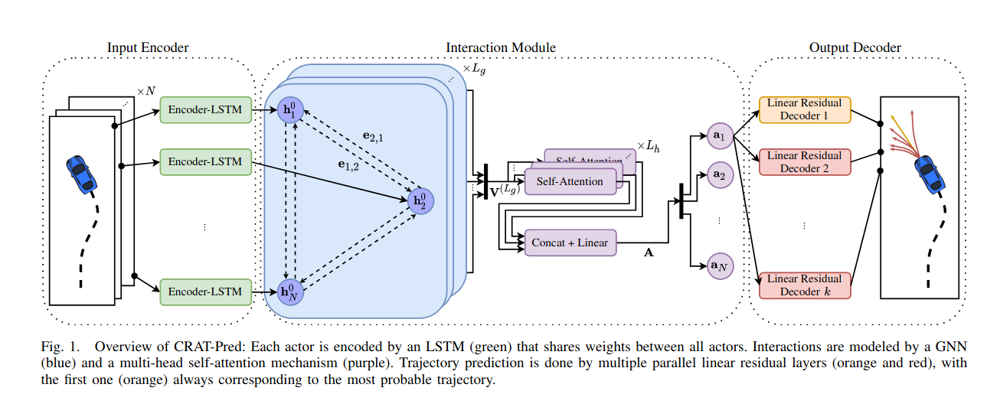

# CRAT-Prediction


##  Overview
`paper link:`https://arxiv.org/pdf/2202.04488.pdf

## 论文概览

- 文章提出了一种结合Crystal Graph Convolutional Neural Network和Multi-Head Self-Attention Mechanism对交通agent处理的方式

- 在argoverse数据集上进行验证，实现了map-free预测模型的SOTA效果; 相比较于其他模型，模型参数更少。

- 证明: 可以通过 Self-Attention Mechanism 学习到交通参与者之间的交互关系。

## 网络结构



- 数据处理: 以argoverse2数据为例，取前50帧数据，两两作差值，取49组位移向量数据为输入
- - 首先用`EncoderLSTM`作为encoder
- - 再将每一个agent作为node，通过`Crystal Graph Convolutional Neural Network`构建图神经网络
- - 通过`Multi-Head Self-Attention`学习node之间的交互关系

## 实现原理

### Input Encoder 输入编码器
输入数据为过去5秒的离散位移:
$$s_i^t = (\Delta{\tau_i^t} || b_i^t)$$

其中， $\Delta \tau_i^t = \tau_i^{t-1}$.
### Interaction Module 交互模块

### Output Decoder 输出编码器

### Training 训练过程

## 代码实现结构

**数据处理结构**
`input = dict()`</br>
`input['argo_id'] = list()`</br>
`input['city'] = list()`</br>
`input['past_trajs'] = list()`</br>
`input['fut_trajs'] = list()`</br>
`input['gt'] = list()`</br>
`input['displ'] = list()`</br>
`input['centers'] = list()`</br>
`input['origin'] = list()`</br>
`input['rotation'] = list()`</br>

29 + 32 = 61</br>
`argo_id:`</br>
['01d7deae-31e9-4657-843f-c30009b09f1c', '01ca1736-ec51-41aa-8c73-3338c574a83a']</br>
`city:`</br>
['austin', 'austin']</br>
`past_trajs:`</br>
torch.Size([29, 50, 3])</br>
torch.Size([32, 50, 3])</br>
`fut_trajs:`</br>
torch.Size([29, 60, 3])</br>
torch.Size([32, 60, 3])</br>
`gt:`</br>
torch.Size([29, 60, 2])</br>
torch.Size([32, 60, 2])</br>
`displ:`</br>
torch.Size([29, 49, 3])</br>
torch.Size([32, 49, 3])</br>
`centers:`</br>
torch.Size([29, 2])</br>
torch.Size([32, 2])</br>
`origin:`</br>
torch.Size([2])</br>
torch.Size([2])</br>
`rotation:`</br>
torch.Size([2, 2])</br>
torch.Size([2, 2])</br>

**网络输入输出结构详解**</br>
In Inference with two sample data:</br>
`displ_cat:` 61 x 49 x 3</br>
`centers_cat:` 61 x 2</br>
`agents_per_sample:` [32, 29]</br>

### encoder_lstm</br>
**input:** `displ_cat`(61 x 49 x 3), `agents_per_sample` [32,29]</br>
$\downarrow$  input_size = 3; hidden_size = 128; num_layers = 1</br>
$\downarrow$`lstm_hidden_state = torch.randn(num_layers, lstm_in.shape[0], hidden_size) = torch.randn(1, 61, 128)`</br>
$\downarrow$`lstm_cell_state = torch.randn(num_layers, lstm_in.shape[0], hidden_size) = torch.randn(1, 61, 128)`</br>
$\downarrow$`lstm_out, lstm_hidden = self.lstm(lstm_in, lstm_hidden)` => lstm((61, 49, 3), (torch((1, 61, 128)), torch(1, 61, 128)))</br>
$\downarrow$ `lstm_out`(61 x 49 x 128)</br>
**output:** `lstm_out[:,-1,:]`(61 x 128)</br>

### agent_gnn</br>
**input:** `out_encoder_lstm`(61 x 128), `centers_cat` (61 x 2) `agents_per_sample` [32,29]</br>
$\downarrow$ x = gnn_in => (61 x 128)</br>
$\downarrow$ edge_index = build_fully_connected_edge_idx(agents_per_sample).to(gnn_in.device) => (2, 1804) 1804 = (29 x 29-1) + (32 x (32-1))</br>
$\downarrow$</br>
$\downarrow$ edge_attr = build_edge_attr(edge_index, centers).to(gnn_in.device) => (1804, 2)</br>
$\downarrow$ x = F.relu(self.gcn1(x, edge_index, edge_attr)) => (61 x 128)</br>
**output:** gnn_out = F.relu(self.gcn2(x, edge_index, edge_attr)) => (61 x 128)</br>

$$\mathbf{x}^{\prime}_i = \mathbf{x}_i + \sum_{j \in \mathcal{N}(i)}
        \sigma \left( \mathbf{z}_{i,j} \mathbf{W}_f + \mathbf{b}_f \right)
        \odot g \left( \mathbf{z}_{i,j} \mathbf{W}_s + \mathbf{b}_s  \right)$$

### multihead_self_attention
**input:** `out_agent_gnn` (61 x 128) `agents_per_sample`[32,29]
$\downarrow$ max_agents = max(agents_per_sample) => 32
$\downarrow$ padded_att_in = torch.zeros((len(agents_per_sample), max_agents, self.latent_size), device=att_in[0].device) => torch: (2 x 32 x 128)
$\downarrow$ mask = torch.arange(max_agents) < torch.tensor(agents_per_sample)[:, None] && padded_att_in[mask] = att_in => torch: (2 x 32 x 128)
$\downarrow$ padded_att_in_swapped = torch.swapaxes(padded_att_in, 0, 1) => torch: (32, 2, 128)
$\downarrow$ padded_att_in_swapped, _ = self.multihead_attention(padded_att_in_swapped, padded_att_in_swapped, padded_att_in_swapped, key_padding_mask=mask_inverted) => torch: (32, 2, 128)
$\downarrow$ padded_att_in_reswapped = torch.swapaxes(padded_att_in_swapped, 0, 1) => torch: (2, 32, 128)
$\downarrow$ att_out_batch = [x[0:agents_per_sample[i]] for i, x in enumerate(padded_att_in_reswapped)] => list: 2
**output:** `att_out_batch` => list: 2 for each with shape (29, 128) and (32, 128)

### torch.stack()
**input:** `out_self_attention:` list: 2 for each with shape (29, 128) and (32, 128)</br>
$\downarrow$ out_self_attention = torch.stack([x[0] for x in out_self_attention])</br>
**output:** `out_self_attention:` torch: (2, 128)</br>

### PredictionNet(out_self_attention)

### decoder_residual
**input:** `out_self_attention`(torch: (2, 128)) `frozen = False`</br>
$\downarrow$ [condition: frozen = False] sample_wise_out.append(PredictionNet(out_self_attention)) => torch: (2, 120)</br>
$\downarrow$ decoder_out = torch.stack(sample_wise_out) => torch: (1, 2, 120)</br>
$\downarrow$ decoder_out = torch.swapaxes(decoder_out, 0, 1) => torch: (2, 1, 120)</br>
**output:** decoder_out => torch: (2, 1, 120)</br>
### out = out_linear.view(len(displ), 1, -1, self.config['num_preds'], 2)
**input:** decoder_out: torch: (2, 1, 120)</br>
$\downarrow$ out = out_linear.view(len(displ), 1, -1, self.config['num_preds'], 2) => torch: (2, 1, 1, 60, 2)</br>
**output:** out => torch: (2, 1, 1, 60, 2)</br>

### 将预测轨迹转换到全局坐标

```
for i in range(len(out)):
	out[i] = torch.matmul(out[i], rotation[i]) + origin[i].view(
                1, 1, 1, -1
            )
```


---

> 作者: [Jian YE](https://github.com/jianye0428)  
> URL: https://jianye0428.github.io/posts/crat_pred/  

