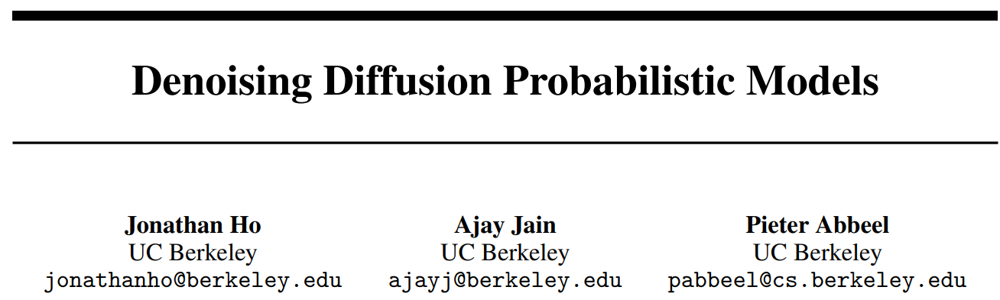

# Diffusion 扩散模型（DDPM）

<!--

note abstract info tip success question warning failure danger bug example quote
 -->

<!--more-->

## 一、引入

近年AIGC的爆火离不开人工智能在图像生成、文本生成以及多模态等领域的不断累积，其中**生成模型**的发展占据了很大功劳，如：生成对抗网络 GAN 及其一系列变体、变分自编码器 VAE 及其一系列变体、自回归模型 AR、流模型 flow ，以及近年大火的**扩散模型 Diffusion Model** 等。

扩散模型的大火并非横空出世，早在2015年就有人提出了类似的想法，直到2020年才提出了经典的 **Denoising Diffusion Probabilistic Models（DDPM）**，像OpenAI、NovelAI、NVIDIA和Google成功的训练了大规模模型之后，它们吸引了很多人注意，后续有了很多基于扩散模型的变体，比如有：GLIDE、DALLE-2、Imagen和年底爆火的完全开源的稳定扩散模型（Stable Diffusion）。

扩散模型与之前所有的生成方法有着本质的区别：

直观的说它是<mark>将图像生成过程（采样）分解为许多小的去噪步骤</mark>，其实 Diffusion 的含义本质上就是一个迭代过程，实线箭头用于扩散步骤中添加随机噪声，虚线箭头代表的是通过学习逆向扩散过程<mark>从噪声中重构所需的数据样本</mark>。**引入噪声导致了信息的衰减，再通过噪声尝试还原原始数据，多次迭代最小化损失后，能够使模型在给定噪声输入的情况下学习生成新图像。**

所以Diffusion模型和其它生成模型的区别是，它不是直接的图像->潜变量、潜变量->图像的一步到位，它是一步一步的<mark>逐渐分解、逐渐去噪</mark>的过程。

当然有关Diffusion的理解和变体有很多，但是扩散模型从本质上讲就是DDPM，所以本文主要对DDPM的原理进行讲解，并给出DDPM的扩散过程、去噪过程、训练损失的详细推导，对于掌握Diffusion算法原理只需要抓住以下四点即可：
- 前向过程（扩散）；
- 反向过程（去噪、采样）；
- 如何训练；
- 如何推断。

## 二、扩散原理阐述

扩散模型包括 **前向扩散过程** 和 **反向去噪过程(采样)**，前向阶段对图像逐步施加噪声，直至图像被破坏变成完全的高斯噪声，然后在反向阶段学习从高斯噪声还原为原始图像的过程。

### 2.1、直观理解

- 散模型的目的是什么？
学习从纯噪声生成图片的方法。
- 扩散模型是怎么做的？
训练一个UNet，接受一系列加了噪声的图片，学习预测所加的噪声。
- 前向过程在干什么？
  - 逐步向真实图片添加噪声最终得到一个纯噪声；
  - 对于训练集中的每张图片，都能生成一系列的噪声程度不同的加噪图片；
  - 在训练时，这些 【不同程度的噪声图片 + 生成它们所用的噪声】 是实际的训练样本。
- 反向过程在干什么？
训练好模型后，采样、生成图片。

### 2.2、前向过程（扩散）

前向过程在原始输入图像$x_0$上逐步添加随机噪声，这个噪声服从高斯分布$N(0, 1)$，每一步得到的图像$x_t$只和上一步的加噪结果$x_{t-1}$相关，逐步添加噪声至$T$步，可以得到趋向于纯粹噪声的图像，如下图所示：

> 后面有详细的推导，公式比较多，这里先提前把主要的列一下方便阐述。

对于将一张图片，从$x_{t-1}\rightarrow x_{t}$的逐步加噪破坏的公式为：

$$x_t=\sqrt{\alpha_t}\left.x_{t-1}+\sqrt{1-\alpha_t}\right.\varepsilon_t\quad\quad\quad\quad\quad\quad(1)$$

其中:
- $x_t$表示第$t$步的图像；
- $\varepsilon$ 是一个满足正态分布的随机噪声，$\varepsilon \sim N(0, 1)$；
- $\sqrt{\alpha_{t}}$ 是图片的权重，$\sqrt{1 - \alpha_{t}}$ 是噪声的权重；

定义：
- $\alpha_t=1-\beta_t$
- $\overline{\alpha}=\prod_{s=1}^t\alpha_s$

随着$t$的增加，**噪声的占比会越来越大**，所以添加的**噪声强度也会越来越大**，也就是说图片的权重要越来越小，噪声的权重要越来越大。因为随着扩散过程的增加，图像中噪声的占比也会越来越大，我们想要进一步破坏它的结构，就需要添加更多的噪声。

> 换句话说，一开始图像比较清晰，这个时候添加的噪声小一些，随着图像的噪声越来越多，这个时候再加一点噪声的话，对原来的图像就没什么影响了，因为它本身就有好多噪声了，所以随着图像的噪声越来越多，后面的步骤就要加更多的噪声。

实际训练过程中会比较大（DDPM原文中为1000），所以会有从$x_0$递推到$x_t$的公式：

$$x_t=\sqrt{\overline{\alpha}_t}\left.x_0+\sqrt{1-\overline{\alpha}_t}\right.\varepsilon\quad\quad\quad\quad(2)$$

其中：
- $\alpha_t$、$\beta_t$ 有一个固定的已知函数，是可以直接进行计算的；
- $\varepsilon$ 为随机产生的噪声；

所以整个式子是已知的，式 $(1)$、$(2)$ 就可以描述前向过程了，$(1)$ 用于将一张图片的逐步破坏，$(2)$ 用于一步到位的破坏。

### 2.3、反向过程（去噪）

反向过程则是不断去除噪声的过程，给定一个噪声图片 $x_T$，对它一步步的去噪还原，直至最终将原始图像 $x_0$ 给恢复出来，如下图所示：

去噪的过程，$x_t$、$\alpha_t$、$\beta_t$ 都是已知的，只有公式 $(2)$ 中的真实噪声是未知的，因为它是随机采样的。所以需要一个神经网络把 $\varepsilon$ 给学出来，也就是说训练一个由 $x_t$ 和 $t$ 估测噪声的模型：

$$x_{t-1}=\frac{1}{\sqrt{\alpha_t}}(x_t-\frac{\beta_t}{\sqrt{1-\overline{\alpha}_t}}\varepsilon_\theta(x_t,t))$$

其中 $\theta$ 就是模型的参数，通常使用UNet作为预估噪声的模型。

### 2.4、模型训练

所以说反向过程其实就是**训练网络去学习分解过程每一步的噪声**，当网络训练好之后，输入一张噪声图片，通过网络就能把加的噪声给求出来，噪声有了代入公式，就能把 $x_{t-1}$ 步的比较清晰的图给求出来了，一步步往前迭代就行了。

采用L2距离刻画相近程度就可以，DDPM的关键是训练 $\varepsilon_{\theta}(x_t, t)$，目的就是使预测的噪声与真实用于破坏的噪声相近：

$$Loss=\mid\mid\varepsilon-\varepsilon_\theta(x_t,t)\mid\mid^2=\mid\mid\varepsilon-\varepsilon_\theta(\sqrt{\overline{\alpha}_t}~x_0+\sqrt{1-\overline{\alpha}_t}~\varepsilon_t,t)\mid\mid^2$$

---

> 作者: [Jian YE](https://github.com/jianye0428)  
> URL: https://jianye0428.github.io/posts/ddpm/  

