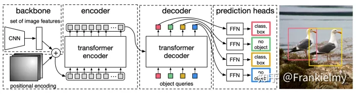
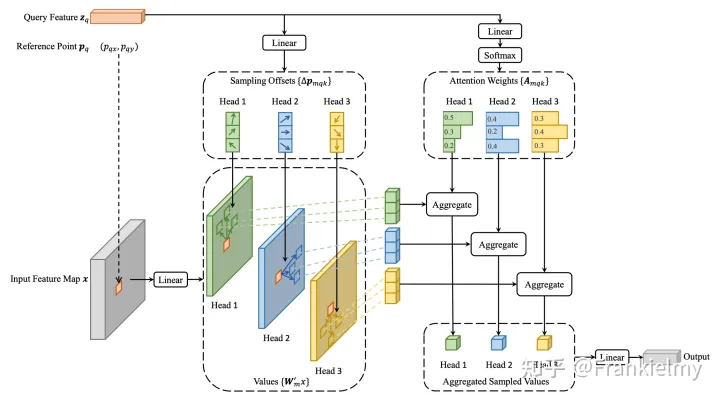
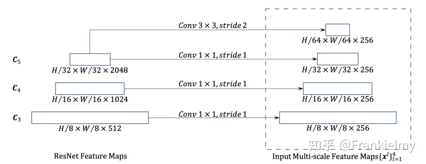
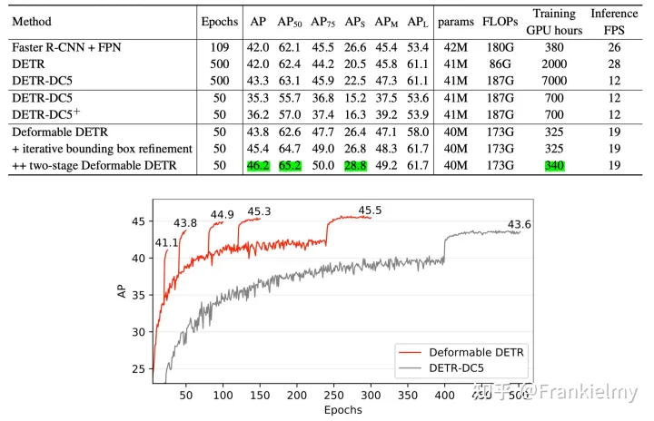

# Deformable DETR论文精读+代码详解


## Abstract
DETR消除了目标检任务中的手工设计痕迹，但是存在<font color=red>收敛慢</font>以及<font color=red>Transformer的自注意力造成的特征图分辨率不能太高</font>的问题，这就导致了小目标检测性能很差。我们的Deformable DETR只在<mark>参考点附近采样少量的key来计算注意力</mark>，因此我们的方法收敛快并且可以用到多尺度特征。

相对于Transformer那种全局(global)&密集(dense)的注意力机制，这里提出了一种新玩法: **每个参考点仅关注邻域的一组采样点，这些采样点的位置并非固定，而是可学习的**(和可变形卷积一样)，从而实现了一种局部(local)&稀疏(sparse)的高效注意力机制。

## 1、Introduction

传统目标检测任务有很多**手工设计痕迹**，所以不是端到端的网络。DETR运用到了Transformer强大的功能以及全局关系建模能力来取代目标检测中人工设计痕迹来达到端到端的目的。

DETR 的优势:
(i). 第一个端到端的目标检测器；
(ii). 不需要众多手工设计组件(如anchor、固定规则的标签分配策略、NMS后处理等)
(iii). DETR实质上相当于是给出了一个方法论，犹如“普度众生”，告诉大家Transformer可以拿到目标检测中来玩，并没有过多地追求其它方面的成就。

DETR的两大缺点:
  1. **收敛速度慢(slow convergence)**: 因为全局像素之间计算注意力要收敛到几个稀疏的像素点需要消耗很长的时间。
  2. **小目标检测差**: 目标检测基本都是在大分辨率的特征图上进行小目标的检测，但是Transformer中的Self Attention的计算复杂度是平方级别的，所以只能利用到最后一层特征图。
       - **Transformer在初始化时，分配给所有特征像素的注意力权重几乎是均等的**，这就造成了模型需要长时间去学习关注真正有意义的位置，这些位置应该是稀疏的；
       - **Transformer在计算注意力权重时，伴随着高计算量与空间复杂度**。特别是在编码器部分，与特征像素点的数量成平方级关系，因此难以处理高分辨率的特征(这点也是DETR检测小目标效果差的原因)

`可变形卷积DCN`是一种注意稀疏空间位置很好的机制，但是其<mark>缺乏元素之间关系的建模能力</mark>。

综上所述，<font color=red>`Deformable Attention`模块结合了DCN稀疏采样能力和Transformer的全局关系建模能力。这个模块可以聚合多尺度特征，不需要FPN了，我们用这个模块替换了`Transformer Encoder`中的`Multi-Head Self-Attention`模块和`Transformer Decoder`中的`Cross Attention`模块</font>。

Deformable DETR的提出可以帮助探索更多端到端目标检测方案，提出了bbox迭代微调策略和两阶段方法，其中iterative bounding box refinement类似Cascade R-CNN方法，two stage类似RPN。


## 2、Related work

Transformer中包含了**多头自注意力**和**交叉注意力机制**，其中多头自注意力机制对key的数量很敏感，平方级别的复杂度导致不能有太多的key，解决方法主要可以分为三类。

(1)第一类解决方法为在key上使用预定义稀疏注意力模式，例如将注意力限制在一个固定的局部窗口上，这将导致失去了全局信息。

(2)第二类是通过数据学习到相关的稀疏注意力。

(3)第三类是寻找自注意力中低等级的属性，类似限制关键元素的尺寸大小。

图像领域的注意力方法大多数都局限于第一种设计方法，但是因为内存模式原因速度要比传统卷积慢3倍(相同的FLOPs下)。DCN可以看作是一种自注意力机制，它比自注意力机制更加高效有效，但是其缺少元素关系建模的机制。我们的可变形注意力模块来源于DCN，并且属于第二类注意力方法。它只关注从q特征预测得到的一小部分固定数量的采样点。

目标检测任务一个难点就是高效的表征不同尺度下的物体。现在有的方法比如FPN，PA-FPN，NAS-FPN，Auto-FPN，BiFPN等。我们的多尺度可变形注意力模块可以自然的融合基于注意力机制的多尺度特征图，不需要FPN了。

## 3、Revisiting Transformers And DETR

### 3.1、Transformer中的Multi-Head Self-Attention

该模块计算复杂度为: $O(N_qC^2+N_kC^2+N_qN_kC)$ ，其中 $C$ 代表特征图维度，$N_q$ 和 $N_k$ 均为图片中的像素(pixel)，因此有 $N_{q}=N_{k}\gg C$ 。所以计算复杂度可以简化为 $O(N_{q}N_{k}C)$ ，可以得出其与图片像素的数量成平方级别的计算复杂度。

### 3.2、DETR

[DETR](https://link.zhihu.com/?target=https%3A//arxiv.org/pdf/2005.12872v3)在目标检测领域中引入了Transformer结构并且取得了不错的效果。这套范式摒弃了传统目标检测中的anchor和post processing 机制，而是先预先设定100个object queries然后进行二分图匹配计算loss。其具体流程图(pipeline)如下:



1. 输入图片`3×800×1066`的一张图片，经过卷积神经网络提取特征，长宽32倍下采样后得到`2048×25×34`，然后通过一个`1×1 Conv`进行降维最终得到输出shape为`256×25×34`.

2. positional encoding为绝对位置编码，为了和特征完全匹配形状也为`256×25×34`，然后和特征进行元素级别的相加后输入到Transformer Encoder中。

3. 输入到Encoder的尺寸为`(25×34)×256=850×256`，代表有850个token，每个token的维度为256，**Encoder不改变输入的Shape**。

4. `Encoder`的输出和`object queries`输入到Decoder中形成`cross attention`，`object queries`的维度设置为`anchor数量×token数量`。

5. `Decoder`输出到`FFN`进行分类和框定位，其中`FFN`是共享参数的。

**Tips**: 虽然DETR没有anchor，但是object queries其实就是起到了anchor的作用。


## 4、Method

### 4.1、Deformable Attention Module



Deformable Attention Module主要思想是结合了**DCN**和**自注意力**，目的就是<u>为了通过在输入特征图上的参考点(reference point)附近只采样少数点(deformable detr设置为3个点)来作为注意力的 $k$</u>。因此要解决的问题就是:
(1). 确定reference point。
(2). 确定每个reference point的偏移量(offset)。
(3). 确定注意力权重矩阵。

在Encoder和Decoder中实现方法不太一样，加下来详细叙述。

**Encoder部分**

在Encoder部分，输入的Query Feature $z_q$ 为加入了位置编码的特征图`(src+pos)`，$value(x)$ 的计算方法只使用了src而没有位置编码(`value_proj`函数)。

  (1). **reference point**确定方法为用了`torch.meshgrid`方法，调用的函数如下(get_reference_points)，有一个细节就是参考点归一化到0和1之间，因此取值的时候要用到**双线性插值**的方法。
  **不同点:** 在Decoder中，参考点的获取方法为`object queries`通过一个`nn.Linear`得到每个对应的`reference point`。

  ```python
  def get_reference_points(spatial_shapes, valid_ratios, device):
    reference_points_list = []
    for lvl, (H_, W_) in enumerate(spatial_shapes):
        # 从0.5到H-0.5采样H个点，W同理 这个操作的目的也就是为了特征图的对齐
        ref_y, ref_x = torch.meshgrid(torch.linspace(0.5, H_ - 0.5, H_, dtype=torch.float32, device=device),
                                        torch.linspace(0.5, W_ - 0.5, W_, dtype=torch.float32, device=device))
        ref_y = ref_y.reshape(-1)[None] / (valid_ratios[:, None, lvl, 1] * H_)
        ref_x = ref_x.reshape(-1)[None] / (valid_ratios[:, None, lvl, 0] * W_)
        ref = torch.stack((ref_x, ref_y), -1)
        reference_points_list.append(ref)
    reference_points = torch.cat(reference_points_list, 1)
    reference_points = reference_points[:, :, None] * valid_ratios[:, None]
    return reference_points
  ```

(2)计算offset的方法为对 $z_q$ 做一个`nn.Linear`，得到多组偏移量，每组偏移量的维度为参考点的个数，组数为注意力头的数量。

(3)计算注意力权重矩阵的方法为过一个`nn.Linear`和一个`F.softmax`，得到每个头的注意力权重。

**如图2所示**，分头计算完的注意力最终会拼接到一起，然后最后过一个nn.Linear得到输入 $x$ 的最终输出。

### 4.2、Multi-Scale Deformable Attention Module



**Multi-Scale Features & Scale-Level Embedding**

多尺度的`Deformable Attention`模块也是在多尺度特征图上计算的。多尺度的特征融合方法则是取了骨干网络(ResNet)最后三层的特征图C3，C4，C5，并且用了一个Conv3x3 Stride2的卷积得到了一个C6构成了四层特征图。下采样率对应为8、16、32， $C_6$ 由 $C_5$ 经过步长为2的3x3卷积得到。特别的是会通过卷积操作将通道数量统一为256(也就是token的数量)，然后在这四个特征图上运行`Deformable Attention Module`并且进行直接相加得到最终输出。其中`Deformable Attention Module`算子的pytorch实现如下:

```python
def ms_deform_attn_core_pytorch(value, value_spatial_shapes, sampling_locations, attention_weights):
    # for debug and test only,
    # need to use cuda version instead
    N_, S_, M_, D_ = value.shape # batch size, number token, number head, head dims
    # Lq_: number query, L_: level number, P_: sampling number采样点数
    _, Lq_, M_, L_, P_, _ = sampling_locations.shape
    # 按照level划分value
    value_list = value.split([H_ * W_ for H_, W_ in value_spatial_shapes], dim=1)
    # [0, 1] -> [-1, 1] 因为要满足F.grid_sample的输入要求
    sampling_grids = 2 * sampling_locations - 1
    sampling_value_list = []
    for lid_, (H_, W_) in enumerate(value_spatial_shapes):
        # N_, H_*W_, M_, D_ -> N_, H_*W_, M_*D_ -> N_, M_*D_, H_*W_ -> N_*M_, D_, H_, W_
        value_l_ = value_list[lid_].flatten(2).transpose(1, 2).reshape(N_*M_, D_, H_, W_)
        # N_, Lq_, M_, P_, 2 -> N_, M_, Lq_, P_, 2 -> N_*M_, Lq_, P_, 2
        sampling_grid_l_ = sampling_grids[:, :, :, lid_].transpose(1, 2).flatten(0, 1)
        # N_*M_, D_, Lq_, P_
        # 用双线性插值从feature map上获取value，因为mask的原因越界所以要zeros的方法进行填充
        sampling_value_l_ = F.grid_sample(value_l_, sampling_grid_l_,
                                          mode='bilinear', padding_mode='zeros', align_corners=False)
        sampling_value_list.append(sampling_value_l_)
    # (N_, Lq_, M_, L_, P_) -> (N_, M_, Lq_, L_, P_) -> (N_, M_, 1, Lq_, L_*P_)
    attention_weights = attention_weights.transpose(1, 2).reshape(N_*M_, 1, Lq_, L_*P_)
    # 不同scale计算出的multi head attention 进行相加，返回output后还需要过一个Linear层
    output = (torch.stack(sampling_value_list, dim=-2).flatten(-2) * attention_weights).sum(-1).view(N_, M_*D_, Lq_)
    return output.transpose(1, 2).contiguous()
```

要知道，DETR仅用了单尺度特征，于是对于特征点位置信息的编码，使用的是三角函数，不同位置的特征点会对应不同的编码值，没问题。但是，注意了，这仅能区分位于单尺度特征点的位置！而在多尺度特征中，位于不同特征层的特征点可能拥有相同的(h,w)坐标，这样就无法区分它们的位置编码了。

针对这个问题，作者增加使用一个称之为<font color=red>scale-level embedding</font>的东东，它**仅用于区分不同的特征层**，也就是同一特征层中的所有特征点会对应相同的scale-level embedding，于是有几层特征就使用几个不同的scale-level embedding。

另外，不同于三角函数那种固定地利用公式计算出来的编码方式，这个scale-level embedding是随机初始化并且是随网络一起训练的、是可学习的:

```python
# scale-level embedding
# 对4个特征层每层附加256-dim的embedding
# 目的是为了区分query对应到哪个特征层，它会与position embedding相加在一起
# 注意: 位于同一个特征的所有query都会对应到相同的scale-level embedding
self.level_embed = nn.Parameter(torch.Tensor(num_feature_levels, d_model))
```

在实际使用时，这个 scale-level embedding 与基于三角函数公式计算的 position embedding 相加在一起作为位置信息的嵌入:

```python
# 由于 position embedding仅区分h, w的位置，因此对于不同特征层有相同坐标值的特征点来说，是无法区分的，于是这里附加上scale-level embedding作为特征层的区分信息，这样，所有特征点的位置信息就各不相同了
# (bs, c, h, w) => (bs, h*w, c)
pos_embed = pos_embed.flatten(2).transpose(1, 2)
# (bs, h*w, c) + (1, 1, 256)
# note that c = 256 here

lvl_pos_embed = pos_embed + self.level_embed[lvl].view(1, 1, -1)
```

**Deformable Attention(&Multi-Scale)**

可变形注意力的道理用大白话来说很简单: query不是和全局每个位置的key都计算注意力权重，而是**对于每个query，仅在全局位置中采样部分位置的key，并且value也是基于这些位置进行采样插值得到的**，最后将这个**局部&稀疏**的注意力权重施加在对应的value上。


Transformer中多头注意力的公式如下:

$$
\text{MultiHeadAttn}(z_q,x)=\sum_{m=1}^MW_m\big[\sum_{k\in\Omega_k}A_{mqk}\cdot W_m^{\prime}x_k\big],
$$

其中，$z_q$ 看作query，由 $x$ 经过线性变换生成，$q$ 是对应的索引，$k$ 是key的索引, $\Omega_k$ 即所有的 $k$ 集合，$m$ 代表是第几个注意力头部，$W_m$ 是对注意力施加在value后的结果进行线性变换从而得到不同头部的输出结果，$W_m^{'}$用于将 $x_k$ 变换成value，$A_{mqk}$ 代表归一化的注意力权重。

Deformable Attetion公式:

$$
\text{DeformAttn}(z_q,p_q,x)=\sum_{m=1}^MW_m\big[\sum_{k=1}^KA_{mqk}\cdot W_m'x(p_q+\Delta p_{mqk})\big],
$$

和Transformer的很像是不是？(老师我没有抄作业，别凶..)可以看到，这里多了 $p_q$ 和 $\Delta p_{mqk}$。其中，前者代表 $z_q$ 的位置(理解成坐标即可)，是2d向量，作者称其为参考点(reference points)；而后者是采样集合点相对于参考点的位置偏移(offsets)。

可以看到，**每个query在每个头部中采样K个位置，只需和这些位置的特征交互**($x(p_q+\Delta p_{mqk})$ 代表基于采样点位置插值出来的value)，并不需要像Transformer般一开始先从全局位置开始学习才能逐渐过渡到关注局部(&稀疏的)的、真正有意义的位置。

需要注意的是，如可变形卷积一样，**位置偏移 $\Delta p_{mqk}$ 是可学习的，由query经过全连接层得到。并且，注意力权重也一样，直接由query经过全连接层得到(因此，在可变形注意力机制下，其实没有真正所谓的key来与query交互计算，为何可以这样做，后文CW会谈自己的看法)**！同时在K个采样点之间归一化，而非像Transformer般是由query与key交互计算得出的。

OK，顺着来，看看可变形注意力是如何应用到多尺度特征上的，依旧是公式走起:

$$
\text{MSDeformAttn}(z_{q},\hat{p}_{q},\{x^{l}\}_{l=1}^{L})=\sum_{m=1}^{M}W_{m}\big[\sum_{l=1}^{L}\sum_{k=1}^{K}A_{mlqk}\cdot W_{m}^{\prime}x^{l}(\phi_{l}(\hat{p}_{q})+\Delta p_{mlqk})\big]
$$


这个也和上面的非常想是不是！？(老师我真的没有抄作业啊..太难了~)相比于上面，这里多了 $\{x^l\}_{l=1}^{L}$, $\phi_{l}$。另外，$p_q$ 头上多了个小尖角，代表归一化到 $[0,1]$，而 $\phi_{l}$ 正是用于将归一化的坐标映射(re-scales)到各个特征层去，这样，每个参考点在所有特征层都会有一个对应的(归一化)坐标，从而方便计算在不同特征层进行采样的那些点的位置。至于 $\{x^l\}_{l=1}^{L}$ 嘛，当然就是代表多尺度特征咯，$x_l$ 代表第 $l$ 层的特征。

在这里，每个query在每个特征层都会采样K个点，共有L层特征，从而在每个头部内共采样LK个点，注意力权重也是在这LK个点之间进行归一化。

另外，作者还提到，当L=K=1且 $W_m^{'}$ 是identity矩阵时，该模块就退化成可变形卷积；相对地，当采样所有可能的位置(即全局位置)时，该模块等效于Transfomer中的注意力。

道理说完，依旧如CW的风格，是时候上代码了:

```python
class MSDeformAtten(nn.Module):
  def __init__(self, d_model=256, n_levels=4, n_heads=8, n_points=4):
    """
    Multi-Scale Deformable Attention Module
    :param d_model    hidden dimensions
    :param n_levels   number of feature levels
    :param n_heads    number of attention heads
    :param n_points   number of sampling points per attention head per feature level
    """
    super.__init__()

    if d_model % n_heads != 0:
      raise ValueError('d_model must be divisible by n_heads, but got {} and {}'.format(d_model, n_heads))
    _d_per_head = d_model // n_heads
    # you'd better set _d_per_heads to a power of 2 which is more efficient in out CUDA implementation
    if not _is_power_of_2(_d_per_head):
      warnings.warn("You'd better set d_model in MSDeformAttn to make the dimension of each attention head",
      "power of 2",
      "which is more efficient in out CUDA implementation.")
    # 用于cuda实现
    self.im2col_step = 64
    self.d_model = d_model
    self.n_levels = n_levels # 4
    self.n_heads = n_heads
    self.n_points = n_points # 4

    # 采样点的坐标偏移， 每个query在每个注意力头和每个特征层都需要采样n_points个
    # 由于x, y坐标都有对应的偏移量，因此还要*2
    self.sampling_offsets =  nn.Linear(d_model, n_heads * n_levels * n_points * 2)
    # 每个query对应的所有采样点的注意力权重
    self.attention_weights = nn.Linear(d_model, n_heads * n_levels * n_points)
    # 线性变换得到value
    self.value_proj = nn.Linear(d_model, d_model)
    # 最后经过这个线性变换得到输出结果
    self.output_proj = nn.Liear(d_model, d_model)

    self.__reset_parameters()
```

接下来有个亮点，在以上最后的 _reset_parameters() 中，是关于生成初始的采样点位置的:

```python
def _reset_parameters(self):
  constant_(self.sampling_offsets.weight.data, 0)
  """初始化偏移量预测的偏置(bias), 使得初始偏移位置犹如不同大小的方形卷积核组合"""

  # (8,) [0, pi / 4, pi / 2, 3 * pi / 2, ..., 7 * pi / 4]
  thetas = torch.arange(self.n_heads, dtype = torch.float32).(2.0 * math.pi / self.n_heads)
  # (8, 2)
  grid_init = torch.stack([thetas.cos(), thetas.sin()], -1)
  # grid_init / grid_init.abs().max(-1, keepdi=True)[0]这步计算得到8个头对应的坐标偏移:
  # (1, 0), (1, 1), (0, 1), (-1, 1), (-1, 0), (-1, -1), (0, -1), (1, -1)
  # 从图形视觉上来看， 形成的偏移位置相当于是3x3， 5x5, 7x7, 9x9正方形卷积核(出去中心，中心是参考点本身)
  for i in range(self.n_points):
    grid_init[:, :, i, :] *= i + 1
  # 注意这里取消了梯度，只是借助nn.Parameter把数值设置进去
  with torch.no_grad():
    self.sampling_offsets.bias = nn.Parameters(grid_init.view(-1))
```

具体实现以及道理看以上代码和CW的注释，最终效果就是，初始的采样点位置相当于会分布在参考点3x3、5x5、7x7、9x9方形邻域。在github上有朋友提过相关的issue，CW那时正好逛到，也给予了相应的互动:

[github相关issue](https://github.com/fundamentalvision/Deformable-DETR/issues/38)

另外，对于注意力权重的初始化，CW发现作者的源码实现和paper中描述得有出入:

```python
constant_(self.attention_weights.weight.data, 0)
# TODO: 这里与paper描述的有出入， paper中说bias初始化为1/LK, 其中L为特征层数=4， K为每层的采样点数量=4
# paper中说的那样才是在多有采样点之间归一化
# 否则， 这里所示的， weight和bias都是0， 直接导致最终的输出全为0
cosntant_(self.attention_weights.bias.data, 0)
# constant_(self.attention_weights.bias.data, 1/(self.n_levels * self.n_points))
```
若按照以上的实现，感觉明显不合理，这样会导致注意力权重为全0，从而使得这个模块的输出结果也会变为全0。CW在github上提了issue，暂未有回复:

[issue](https://link.zhihu.com/?target=https%3A//github.com/fundamentalvision/Deformable-DETR/issues/44)

接下来看看最重要的前向过程:

```python
def forward(self, query, reference_points, input_flatten, input_spatial_shapes, input_level_start_index, input_padding_mask=None):
  """
  :param query                    (N, Length_{query}, c)
  :param reference_points         (N, Length_{query}, n_levels, 2), range in
                                  [0, 1], top-left (0, 0), bottom-right (1, 1)
                                  including padding area or (N, Length_{query}, n_levels, 4),
                                  add additional (w, h) to form reference boxes
  :param input_flatten            (N, \sum_{l=0}^{L-1} H_l \cdot W_l, C)
  :param input_spatial_shapes     (n_levels, 2), [(H_0, W_0), (H_1, W_1), ..., (H_{L-1}, W_{L-1})]
  :param input_level_start_index  (n_levels, ), [0, H_0*W_0, H_0*W_0+H_1*W_1, H_0*W_0+H_1*W_1+H_2*W_2, ..., H_0*W_0+H_1*W_1+...+H_{L-1}*W_{L-1}]
  :param input_padding_mask       (N, \sum_{l=0}^{L-1} H_l \cdot W_l), True for padding elements, False for non-padding elements

  :return output                  (N, Length_{query}, C)
  """
  N, Len_q, _ = query.shape
  N, Len_in, _ = input_flatten.shape
  assert (input_spatial_shapes[:, 0] * input_spatial_shapes[:, 1]).sum() == Len_in

  value = self.value_proj(input_flatten)
  if input_padding_mask is not None:
      value = value.masked_fill(input_padding_mask[..., None], float(0))
  value = value.view(N, Len_in, self.n_heads, self.d_model // self.n_heads)


  # 以下主要是计算出采样点的位置。2-stage模式下，输入到Decoder的参考点是Encoder预测的top-k proposal boxes，也就是说是4d的(非2-stage情况下是2d)，于是需要分情况处理:
  sampling_offsets = self.sampling_offsets(query).view(N, Len_q, self.n_heads, self.n_levels, self.n_points, 2)
  attention_weights = self.attention_weights(query).view(N, Len_q, self.n_heads, self.n_levels * self.n_points)
  attention_weights = F.softmax(attention_weights, -1).view(N, Len_q, self.n_heads, self.n_levels, self.n_points)
  # N, Len_q, n_heads, n_levels, n_points, 2
  if reference_points.shape[-1] == 2:
      offset_normalizer = torch.stack([input_spatial_shapes[..., 1], input_spatial_shapes[..., 0]], -1)
      sampling_locations = reference_points[:, :, None, :, None, :] \
                            + sampling_offsets / offset_normalizer[None, None, None, :, None, :]
  elif reference_points.shape[-1] == 4:
    # reference_points 最后一维中的前两个事中心坐标xy， 后两个是宽高wh
    # 由于初始化时，offset的在-k~k(k = n_points)范围，因此这里除以n_points相当于归一化到0~1
    # 然后乘以宽和高的一半， 加上参考点的中心坐标，这样就是的偏移后采样点位于proposal bbox内
    # 相当于对采样范围进行了约束，减小了搜索空间
      sampling_locations = reference_points[:, :, None, :, None, :2] \
                            + sampling_offsets / self.n_points * reference_points[:, :, None, :, None, 2:] * 0.5
  else:
      raise ValueError(
          'Last dim of reference_points must be 2 or 4, but get {} instead.'.format(reference_points.shape[-1]))
  # 根据采样点位置拿出对应的value，并且施加预测出来的注意力权重(和value进行weighted sum)
  # (N, Len_in, 256)
  # 注意: 实质调用的是基于CUDA实现的版本，需要编译
  output = MSDeformAttnFunction.apply(
      value, input_spatial_shapes, input_level_start_index, sampling_locations, attention_weights, self.im2col_step)
  # (N， Len_in, 256)
  output = self.output_proj(output)
  return output
```

在这里，将注意力权重与value进行weighted sum的实现是调用了用CUDA来实现的版本，因为Pytorch版性能有点尴尬，不过我们也可以看看Pytorch的实现，了解其中的逻辑。

```python
def ms_deform_attn_core_pytorch(value, value_spatial_shapes, sampling_locations, attention_weights):
  """多尺度可变性注意力， 根据采样点的位置在多尺度value中插值采样出对应的特征图，最后和注意力权重进行weighted sum得到输出"""
  # for debug and test only,
  # need to use cuda version instead
  N_, S_, M_, D_ = value.shape
  _, Lq_, M_, L_, P_, _ = sampling_locations.shape
  # 由于以下使用了F.grid_sample()，要求采样位置的坐标是归一化到[-1, 1] ((-1, -1)代表左上角， (1，1)代表右下角)
  # 因此， 这里是将[0, 1]映射到[-1, 1]
  value_list = value.split([H_ * W_ for H_, W_ in value_spatial_shapes], dim=1)
  sampling_grids = 2 * sampling_locations - 1
  sampling_value_list = []
  for lid_, (H_, W_) in enumerate(value_spatial_shapes):
      # N_, H_*W_, M_, D_ -> N_, H_*W_, M_*D_ -> N_, M_*D_, H_*W_ -> N_*M_, D_, H_, W_
      value_l_ = value_list[lid_].flatten(2).transpose(1, 2).reshape(N_*M_, D_, H_, W_)
      # N_, Lq_, M_, P_, 2 -> N_, M_, Lq_, P_, 2 -> N_*M_, Lq_, P_, 2
      sampling_grid_l_ = sampling_grids[:, :, :, lid_].transpose(1, 2).flatten(0, 1)
      # 根据采样点坐标在value中插值出对应的特征
      # ps: grid_sample()用法
      # 这里value_l 充当被插值采样的特征图，是input， 维度需要时 4D/5D
      # sampling_grid_l则代表采样的位置，是grid，最后一维2对应input中的坐标(可能是小数)
      # 倒数第2，3维代表采样后输出特征图宽、高
      # input和grid的第一个维度必须一致，最终输出的通道数与input一致，是不变的
      # N_*M_, D_, Lq_, P_
      sampling_value_l_ = F.grid_sample(value_l_, sampling_grid_l_,
                                        mode='bilinear', padding_mode='zeros', align_corners=False)
      sampling_value_list.append(sampling_value_l_)
  # (N_, Lq_, M_, L_, P_) -> (N_, M_, Lq_, L_, P_) -> (N_, M_, 1, Lq_, L_*P_)
  attention_weights = attention_weights.transpose(1, 2).reshape(N_*M_, 1, Lq_, L_*P_)
  # 最后就是将注意力权重和采样特征进行weighted sum:
  output = (torch.stack(sampling_value_list, dim=-2).flatten(-2) * attention_weights).sum(-1).view(N_, M_*D_, Lq_)
  return output.transpose(1, 2).contiguous()
```


Deformable DETR有2-stage模式，后文会讲到。在2-stage模式下，输入到Decoder的参考点和object query&query embedding会有所不同。


Multi-Scale Deformable Attention 主要做以下事情:
  1. 将输入input_flatten (对于Encoder就是由backbone输出的特征图变换而来；对于Decoder就是Encoder输出的memory)，通过变换矩阵得到value，同时将padding的部分用0填充；
  2. 将query(对于Encoder就是特征图本身加上position&scale-level embedding);
     对于Decoder就是self-attention的输出加上position embedding结果；
     2-stage时这个position embedding是由Encoder预测的top-k proposal boxes进行position embedding得来，
     而1-stage时是预设的embedding分别通过两个全连接层得到采样点对应的坐标偏移和注意力权重(注意力权重会进行归一化)；
  3. 根据参考点(reference points: 对于Decoder来说， 2-stage时是Encoder预测的top-k proposal boxes；1-stage时是由预设的query embedding经过全连接层得到。两种情况下最终都经过了sigmoid函数归一化；而对于Encoder来说，就是个特征点在所有的特征层对应的归一化中心坐标和预测坐标偏移采样点的坐标)；
  4. 由采样点坐标在value中插值采样处对应的特征向量，然后施加注意力权重，最后将结果经过全连接层得到输出结果。


完整的`Multi-Scale Deformable Attention`模块代码如下:

```python
class MSDeformAttn(nn.Module):
  def __init__(self, d_model=256, n_levels=4, n_heads=8, n_points=4):
      """
      Multi-Scale Deformable Attention Module
      :param d_model      hidden dimension
      :param n_levels     number of feature levels
      :param n_heads      number of attention heads
      :param n_points     number of sampling points per attention head per feature level
      """
      super().__init__()
      if d_model % n_heads != 0:
          raise ValueError('d_model must be divisible by n_heads, but got {} and {}'.format(d_model, n_heads))
      _d_per_head = d_model // n_heads
      # you'd better set _d_per_head to a power of 2 which is more efficient in our CUDA implementation
      if not _is_power_of_2(_d_per_head):
          warnings.warn("You'd better set d_model in MSDeformAttn to make the dimension of each attention head a power of 2 "
                        "which is more efficient in our CUDA implementation.")

      self.im2col_step = 64

      self.d_model = d_model
      self.n_levels = n_levels
      self.n_heads = n_heads
      self.n_points = n_points

      self.sampling_offsets = nn.Linear(d_model, n_heads * n_levels * n_points * 2)
      self.attention_weights = nn.Linear(d_model, n_heads * n_levels * n_points)
      self.value_proj = nn.Linear(d_model, d_model)
      self.output_proj = nn.Linear(d_model, d_model)

      self._reset_parameters()

  def _reset_parameters(self):
      constant_(self.sampling_offsets.weight.data, 0.)
      thetas = torch.arange(self.n_heads, dtype=torch.float32) * (2.0 * math.pi / self.n_heads)
      grid_init = torch.stack([thetas.cos(), thetas.sin()], -1)
      grid_init = (grid_init / grid_init.abs().max(-1, keepdim=True)[0]).view(self.n_heads, 1, 1, 2).repeat(1, self.n_levels, self.n_points, 1)
      for i in range(self.n_points):
          grid_init[:, :, i, :] *= i + 1
      with torch.no_grad():
          self.sampling_offsets.bias = nn.Parameter(grid_init.view(-1))
      constant_(self.attention_weights.weight.data, 0.)
      constant_(self.attention_weights.bias.data, 0.)
      xavier_uniform_(self.value_proj.weight.data)
      constant_(self.value_proj.bias.data, 0.)
      xavier_uniform_(self.output_proj.weight.data)
      constant_(self.output_proj.bias.data, 0.)

  def forward(self, query, reference_points, input_flatten, input_spatial_shapes, input_level_start_index, input_padding_mask=None):
      """
      :param query                       (N, Length_{query}, C)
      :param reference_points            (N, Length_{query}, n_levels, 2), range in [0, 1], top-left (0,0), bottom-right (1, 1), including padding area
                                      or (N, Length_{query}, n_levels, 4), add additional (w, h) to form reference boxes
      :param input_flatten               (N, \sum_{l=0}^{L-1} H_l \cdot W_l, C)
      :param input_spatial_shapes        (n_levels, 2), [(H_0, W_0), (H_1, W_1), ..., (H_{L-1}, W_{L-1})]
      :param input_level_start_index     (n_levels, ), [0, H_0*W_0, H_0*W_0+H_1*W_1, H_0*W_0+H_1*W_1+H_2*W_2, ..., H_0*W_0+H_1*W_1+...+H_{L-1}*W_{L-1}]
      :param input_padding_mask          (N, \sum_{l=0}^{L-1} H_l \cdot W_l), True for padding elements, False for non-padding elements

      :return output                     (N, Length_{query}, C)
      """
      # query是 src + positional encoding
      # input_flatten是src，没有位置编码
      N, Len_q, _ = query.shape
      N, Len_in, _ = input_flatten.shape
      assert (input_spatial_shapes[:, 0] * input_spatial_shapes[:, 1]).sum() == Len_in
      # 根据input_flatten得到v
      value = self.value_proj(input_flatten)
      if input_padding_mask is not None:
          value = value.masked_fill(input_padding_mask[..., None], float(0))
      # 多头注意力 根据头的个数将v等分
      value = value.view(N, Len_in, self.n_heads, self.d_model // self.n_heads)
      # 根据query得到offset偏移量和attention weights注意力权重
      sampling_offsets = self.sampling_offsets(query).view(N, Len_q, self.n_heads, self.n_levels, self.n_points, 2)
      attention_weights = self.attention_weights(query).view(N, Len_q, self.n_heads, self.n_levels * self.n_points)
      attention_weights = F.softmax(attention_weights, -1).view(N, Len_q, self.n_heads, self.n_levels, self.n_points)
      # N, Len_q, n_heads, n_levels, n_points, 2
      if reference_points.shape[-1] == 2:
          offset_normalizer = torch.stack([input_spatial_shapes[..., 1], input_spatial_shapes[..., 0]], -1)
          sampling_locations = reference_points[:, :, None, :, None, :] \
                                + sampling_offsets / offset_normalizer[None, None, None, :, None, :]
      elif reference_points.shape[-1] == 4:
          sampling_locations = reference_points[:, :, None, :, None, :2] \
                                + sampling_offsets / self.n_points * reference_points[:, :, None, :, None, 2:] * 0.5
      else:
          raise ValueError(
              'Last dim of reference_points must be 2 or 4, but get {} instead.'.format(reference_points.shape[-1]))
      output = MSDeformAttnFunction.apply(
          value, input_spatial_shapes, input_level_start_index, sampling_locations, attention_weights, self.im2col_step)
      output = self.output_proj(output)
      return output
```


### 4.3 Deformable Transformer

这里的Transformer和DETR中的大体过程一致，最主要的区别在于用**可变形注意力**替代了Encoder中的自注意力(self-attention)以及Decoder中的交叉注意力(cross-attention)。在分别解析Encoder和Decoder前，CW先向大家梳理下这里Transformer的整个pipeline(有源码解析哦！)。

**1). 为Encoder的输入做准备**

主要是将一些输入元素的维度展平(flatten)，这些输入元素包括: 多尺度特征图、各尺度特征图对应的mask(指示哪些部分属于padding)、各尺度特征图对应的位置信息(position embedding + scale-level embedding)，另外还有些辅助信息，比如: 各尺度特征图的宽高、不同尺度特征对应于被flatten的那个维度的起始索引、各尺度特征图中非padding部分的边长占其边长的比例。

```python
# deformable transformer forward函数
def forward(self, srcs, masks, pos_embeds, query_embed=None):
    assert self.two_stage or query_embed is not None
    """为Encoder的输入作准备:
    (i). 将各层特征图(已映射到c=256维度)flatten并concat到一起: (bs, h_lvl1 * w_lvl1 + h_lvl2 * w_lvl2 +..., 256);
    (ii). 将各层特征图对应的mask(指示了哪些位置是padding)flatten并concat: (bs, h_lvl1 * w_lvl1 + h_lvl2 * w_lvl2 + ...,)
    (iii). 将各层特征图对应的position embedding加上scale level embedding(用于表明query属于哪个特征层)， 然后flatten并concat: (bs, h_lvl1 * w_lvl1 + h_lvl2 * w_lvl2 + ..., 256);
    (iv). 将各层特征图的宽高由list变为tensor: (n_lvl, 2);
    (v). 由于将所有特征图的特征点concat在了一起 (h_lvl1 * w_lvl1 + h_lvl2 * w_lvl2 + ...), 因此为了区分各层，需要计算对应于被flatten那个维度的起始index(第一层当然是0，后面就是累加...)
    (vi). 计算各层特征层中非padding的部分边长(高&宽)占特征图边长的比例(bs, n_lvl, 2)
    """
    # prepare input for encoder
    # 以下的flatten指的是将h，w两个维度展平为h * w
    src_flatten = []
    mask_flatten = []
    # 各层特征图对应的position embedding + scale-level embedding
    lvl_pos_embed_flatten = []
    # 各层特征图的尺寸(h, w)
    spatial_shapes = []
    for lvl, (src, mask, pos_embed) in enumerate(zip(srcs, masks, pos_embeds)):
        bs, c, h, w = src.shape
        spatial_shape = (h, w)
        spatial_shapes.append(spatial_shape)
        # (bs, c, h, w) => (bs, h*w, c)
        src = src.flatten(2).transpose(1, 2)
        # (bs, h, w) => (bs, h*w)
        mask = mask.flatten(1)

        """
        由于position embedding仅区分h，w的位置
        因此对于不同特征层有相同坐标值的特征点来说，是无法区分的，于是这里附加上scale-level embedding作为特征层的区分信息
        这样，所有特征点的位置信息就各不相同了
        """
        # (bs, c, h, w) => (bs, h * w, c)
        pos_embed = pos_embed.flatten(2).transpose(1, 2)
        # (bs, h*w, c) + (1, 1, 256)\
        # note that c = 256 here
        lvl_pos_embed = pos_embed + self.level_embed[lvl].view(1, 1, -1)
        lvl_pos_embed_flatten.append(lvl_pos_embed)
        src_flatten.append(src)
        mask_flatten.append(mask)
    # (bs, h_lvl1 * w_lvl1 + h_lvl2 * w_lvl2 + ..., c)
    src_flatten = torch.cat(src_flatten, 1)
    # (bs, h_lvl1 * w_lvl1 + h_lvl2 * w_lvl2 + ...)
    mask_flatten = torch.cat(mask_flatten, 1)
    # (bs, h_lvl1 * w_lvl1 + h_lvl2 * w_lvl2 + ..., c)
    lvl_pos_embed_flatten = torch.cat(lvl_pos_embed_flatten, 1)
    # (n_lvl,2)
    spatial_shapes = torch.as_tensor(spatial_shapes, dtype=torch.long, device=src_flatten.device)
    # .prod(dim=1)是将dim1的各个元素相乘，在这里就会得到各特征层点数量: h * w
    # .cumsum(0)代表在dim=0进行累加，在这里就会得到h_lvl1 * w_lvl1, h_lvl1 * w_lvl1 + h_lvl2 * w_lvl2, ...
    # 因此这里得到的level_start_index是各特征层起始的index(这个索引对应到被flatten的维度)
    # (n_lvl,)
    level_start_index = torch.cat((spatial_shapes.new_zeros((1, )), spatial_shapes.prod(1).cumsum(0)[:-1]))
    # (bs, n_lvl, 2) 各特征层中非padding部分的边长(高&宽)占特征图边长的比例
    valid_ratios = torch.stack([self.get_valid_ratio(m) for m in masks], 1)

    # encoder
    memory = self.encoder(src_flatten, spatial_shapes, level_start_index, valid_ratios, lvl_pos_embed_flatten, mask_flatten)
```

2). Encoder编码特征

源码对应上图最后一句。

encoder部分，输出memory(编码后的特征表示)，shape是 (bs, h_lvl1*w_lvl1+h_lvl2*w_lvl2+.., c=256)，其中h_lvli和w_lvli分别代表第i层特征图的高和宽，于是第二个维度就是所有特征点的数量。编码后，特征的最后一个维度(hidden_dim)为256。

3). 处理Encoder的输出，为Decoder的输入做准备

这一步**主要是得到参考点(reference points)**。需要说明下，在2-stage模式下，参考点和输入到Decoder的object query及query embedding的生成方式和形式会有所不同:

--如果是2-stage模式，那么参考点就是由Encoder预测的top-k得分最高的proposal boxes(注意，这时参考点是4d的，是bbox形式)。然后通过对参考点进行位置嵌入(position embedding)来生成Decoder的object query(target) 和对应的 query embedding；

--否则，Decoder的 object query(target )和 query embedding 就是预设的embedding，然后将query embedding经过全连接层输出2d参考点，这时的参考点是归一化的中心坐标形式。

另外，两种情况下生成的参考点数量可能不同: 2-stage时是有top-k(作者设置为300)个，而1-stage时是num_queries(作者也设置为300)个，也就是和object query的数量一致(可以理解为，此时参考点就是object query本身的位置)。

```python
    # prepare input for decoder
    # c = 256 中间那一维等于(所有层)特征点的数量
    bs, _, c = memory.shape
    # 根据是否2-stage分情况进行处理，因为生成的reference points不同
    if self.two_stage:
      # 生成proposals， 并且对Encoder的输出(memory)进行处理(全连接层 + 归一化)
      #(bs, h_lvl1 * w_lvl1 + h_lvl2 * w_lvl2 + ..., 256), (bs, h_lvl1 * w_lvl1 + h_lvl2 * w_lvl2 + ..., 4)
      # 其中proposals每个都是xywh形式， 并且是经过inverse-sigmoid函数后的结果
      # (其实这里的output_proposals对应的就是各层特征图各个特征点的位置(相当于anchor的形式，是固定的)，
      # 因此还需要借助Decoder最后一层的bbox head来预测一个偏移(offset)来得到一个更加灵活的结果，
      # 这才是第一阶段预测的proposal boxes)
      output_memory, output_proposals = self.gen_encoder_output_proposals(memory, mask_flatten, spatial_shapes)

      # hack implementation for two-stage Deformable DETR
      # 注意: 这里维度对应的是多分类，并非二分类
      enc_outputs_class = self.decoder.class_embed[self.decoder.num_layers](output_memory)
      # bbox head预测的是相对proposals的偏移，因此这里要相加， 后续还要经过sigmoid函数才得到真正的bbox预测结果(归一化形式)
      #(bs， h_lvl1 * w_lvl1 + h_lvl2 * w_lvl2 + .., 4)
      enc_outputs_coord_unact = self.decoder.bbox_embed[self.decoder.num_layers](output_memory) + output_proposals
```

在阅读源码的过程中，发现这里有个小问题，貌似不妥。由于分类预测头部的输出维度是多分类的，而proposals仅需二分类就足够了，作者在取top-k得分时直接用第一个类别预测的结果来计算:

```python
      # 300
      topk = self.two_stage_num_proposals
      # 选取得分最高的top分类预测，最后的[1]代表取得返回top对应的索引
      # (bs， k = 300)
      # TODO: 取第一个类别的预测结果算top-k，代表二分类
      # 当不适用iterative bbox refine时， 所有class_embed参数共享，这样会使得在第二阶段对解码输出进行分类时都偏向于第一个类别
      # 这样貌似不妥
      topk_proposals = torch.topk(enc_outputs_class[..., 0], topk, dim=1)[1]
      # 拿出top-k得分最高的对应的预测bbox:  (bs, k = 300, 4)
      topk_coords_unact = torch.gather(enc_outputs_coord_unact, 1, topk_proposals.unsqueeze(-1).repeat(1, 1, 4))
      # 注意: 这里取消了梯度
      topk_coords_unact = topk_coords_unact.detach()
      # 经过sigmoid，变成了归一化形式，这个结果会送到decoder中作为初始的bboxes估计
      reference_points = topk_coords_unact.sigmoid()
      # init_reference_out = reference_points
      init_reference_out = reference_points
```
同时，在不使用iterative bbox refine策略的情况下，会使得在第二阶段对解码输出进行分类时都倾向于预测第一个类别(使用iterative bbox refine时，对Decoder每层都有不同的分类预测头部实例，参数不共享，并且在这里会额外使用一个独立的分类预测头部，与应用到Decoder中的不相关)。关于检测头部的设置，代码如下:

```python
# 如果使用2-stage， 那么在Decoder 中多加一层(变为7层)，用于第一阶段中proposal的预测输出
# (预测输出实际上由Encoder输出，只不过这里借用一层Decoder来解码形成预测结果，也就是借用了分类和回归预测的头部)
num_pred = (transformer.decoder.num_layers + 1) if two_stage else transformer.decoder.num_layers
"""在iterative box refine策略下，_get_clones得到的每个模块都是不同的实例，参数不共享；
  而不使用该策略时， nn.ModuleList中每个都是相同的实例，即参数共享"""
# TODO: 以下bbox head的bias的后两个初始化为-2.0是为何？
if with_box_refine:
  # 如果使用迭代的bbox校正策略，则Decoder各层参数不共享，因此这里用_get_clones(deepcopy)

  self.class_embed = _get_clones(self.class_embed, num_pred)
  self.bbox_embed = _get_clones(self.bbox_embed, num_pred)
  nn.init.constant_(self.bbox_embed[0].layers[-1].bias.data[2:], -2.0)
  # hack implementation for iterative bounding box refinement
  # 默认情况下， Decoder的bbox_embed设置为None，因此只有使用iterative bbox refinement策略时，
  # 其bbox_embed才不是None； 在使用iterative bbox refine时，Decoder每层都会预测bbox偏移量，
  # 使用这个偏移量对上一层的预测输出进行校正
  self.transformer.decoder.bbox_embed = self.bbox_embed
else:
  nn.init.contant_(self.bbox_embed.layers[-1].bias.data[2:], -2.0)
  # 不使用iterative bbox refine 策略，则各层参数共享
  self.class_embed = nn.ModuleList([self.class_embed for _ in range(num_pred)])
  self.bbox_embed = nn.ModuleList([self.bbox_embed for _ in range(num_pred)])
  # 不用iterative bbox refine策略， 则Decoder的bbox_embed设置为None
  self.transofmer.decoder.bbox_embed = None
```

紧接着pipeline:

```python
  reference_points = topk_coords_unact.sigmoid()
  # init_reference_out = reference_points
  init_reference_out = reference_points
  """
  生成的Decoder的query(target)和query embedding:
    - 对于top-k proposal boxes进行位置编码，编码方式是给xywh每个都赋予128维，
    其中每128维中，偶数维度用sin函数，奇数维度用cos函数编码；
    然后经过全连接层和归一化处理；
    最终， 前256维结果对应xy作为Decoder 的query embedding(因为xy代表的是位置信息)
  """
  #(bs, k = 300, 4 x 128 = 512)
  pos_trans_out = self.pos_trans_norm(self.pos_trans(self.get_proposal_pos_embed(topk_coords_unact)))
  # (bs, k = 300, 256), (bs, k = 300, 256)
  query_embed, tgt = torch.split(pos_trans_out, c, dim=2)
else:
  # 仅为了与2-stage的情况兼容
  enc_output_class = enc_outputs_coord_unact = None
  # (n_query = 300, 256) (n_query = 300, 256)
  query_embed, tgt = torch.split(query_embed, c, dim=1)
  # (bs, n_query = 300, 256)
  query_embed = query_embed.unsqueeze(0).expand(bs, -1, -1)
  # (bs, n_query = 300, 256)
  tgt = tgt.unsqueeze(0).expand(bs, -1, -1)
  # 通过全连接层生成proposal参考点的归一化坐标(cx, cy) : (bs, n_query = 300, 2)
  reference_points = self.reference_points(query_embed).sigmoid()
  init_reference_out = reference_points

```

**4). Decoder解码特征并输出参考点**

若使用了iterative bbox refine策略，则Decoder每层都会预测bbox，这些bbox就会作为新一轮的参考点供下一层使用，相当于coarse-to-fine的过程，不断地对参考点进行校正，最终会返回最后一层的校正结果。

由此可知，即便不是2-stage模式，只要使用了iterative bbox refine策略，这里返回的参考点也会变为4d的形式。因为检测头部的回归分支预测出来的结果是4d(xywh)形式的，而且是相对于参考点的偏移量(并非绝对坐标位置)。如果初始进来的参考点是2d的，那么wh就仅由检测头部的预测结果决定。

相对地，如果没有使用iterative bbox refine策略，那么这里返回的参考点和初始输进来的一样，保持不变。

```python
  # decoder
  # hs: (n_dec_layers, bs, n_query=300, d_model=256);
  # itner_references: with iterative bbox refine - (n_dec_layers, bs, k = 300, 4)
  # otherwise - (n_dec_layers, bs, k = 300, 2)
  hs, inter_references = self.decoder(tgt, reference_points, memory,
                                      spatial_shapes, level_start_index, valid_ratios, query_embed, mask_flatten)

  inter_references_out = inter_references
  if self.two_stage:
      return hs, init_reference_out, inter_references_out, enc_outputs_class, enc_outputs_coord_unact
  # 1-stage情况下:  enc_outputs_class 和 enc_outputs_coord_unact 都是None
  return hs, init_reference_out, inter_references_out, None, None
```

**5). 输出解码特征和参考点**

这里输出的参考点有两个，包括初始进入Decoder前的和Decoder返回的。在上一步也说过，如果没有使用iterative bbox refine策略，则两者是一样的。

### 4.4、Encoder

这里的Encoder与Transformer中最主要的区别在于使用**可变形注意力**替代了原生的自注意力。类似地，在每层编码时会将上一层输出的编码特征作为下一层的输入，这个输入与position emebdding结合作为query、而经过线性变换则作为value。

```python

def forward(self, src, spatial_shapes, level_start_index, valid_ratios, pos=None, padding_mask=None):
  # 这里的pos是position embedding + scale-level embedding
  output = src
  # 将各特征点在其所在特征层的归一化坐标映射到所有特征层，使得每个特征点在所有特征层上都会得到一个归一化的坐标
  # 这个reference_points 相当于key的角色， 从而每个query都会和其在所有特征层的位置(也就是以下计算出来的坐标)进行交互
  # 实现了跨尺度融合的效果，因此不需要FPN
  # (bs, H_lvl1 * W_lvl1 + H_lvl2 * W_lvl2 + ..., n_lvl, 2)
  reference_points = self.get_reference_points(spatial_shapes, valid_ratios, device=src.device)
  for _, layer in enumerate(self.layers):
      output = layer(output, pos, reference_points, spatial_shapes, level_start_index, padding_mask)

  return output
```

现在具体来看看主要有哪些过程:

**i). 计算参考点的位置**

这里的参考点实质就是多尺度特征点的归一化坐标。注意，每个特征点在所有特征层都会计算出一个对应的归一化坐标(后文会谈到为何这样做)。

```python
def get_reference_points(spatial_shapes, valid_ratios, device):
  reference_points_list = []
  for lvl, (H_, W_) in enumerate(spatial_shapes):
    # (H_, W_), (H_, W_)
    # 0.5 是为对应到特征点中心
    ref_y, ref_x = torch.meshgrid(torch.linspace(0.5, H_ - 0.5, H_, dtype=torch.float32, device=device),
                                  torch.linspace(0.5, W_ - 0.5, W_, dtype=torch.float32, device=device))
    """将各层特征图每个特征点中心坐标根据特征图非padding的边长进行归一化(可能大于1)"""
    # (1, H_*W_) / (bs, 1) 后一项是特征图有效(非padding)部分的高
    ref_y = ref_y.reshape(-1)[None] / (valid_ratios[:, None, lvl, 1] * H_)
    # (1, H_*W_) / (bs, 1) 后一项是特征图有效(非padding)部分的宽
    ref_x = ref_x.reshape(-1)[None] / (valid_ratios[:, None, lvl, 0] * W_)
    # (bs, H_*W_, 2) 每一项是xy
    ref = torch.stack((ref_x, ref_y), -1)
    reference_points_list.append(ref)
  # (bs, H_lvl1 * W_lvl1 + H_lvl2 * W_lvl2 + ..., 2)
  reference_points = torch.cat(reference_points_list, 1)
  """将各特征点在其所在特征层的归一化坐标映射(扩散)到所有特征层， 这样每个特征点在所有特征层上都会得到一个归一化坐标"""
  # TODO: 以下这样貌似不妥， 如果各特征层对应的valid_ratio不一致，
  # TODO: 则坐标值有可能大于1， 而后续没有再对这里的reference_points进行归一化到 0~1
  # (bs, H_lvl1 * W_lvl1 + H_lvl2 * W_lvl2 + ..., 1, 2) * (bs, 1, n_lvl, 2)
  reference_points = reference_points[:, :, None] * valid_ratios[:, None]
  # (bs, H_lvl1 * W_lvl1 + H_lvl2 * W_lvl2 + ..., n_lvl, 2)
  return reference_points
```

通过源码发现有个小问题: **这里在对坐标归一化时使用的是非padding部分的特征图边长**，而不同层非padding部分的边长比例有可能由于计算时的舍入误差而不一致，从而导致最终归一化后的坐标值大于1。

ii). self-attention

使用(多尺度)可变形注意力模块替代原生的Transformer自注意力，query和value均来自特征图，只不过query要结合position embedding，注意，**这里的position embedding实质是position emebedding + scale-level emebedding**。

iii). feed-forward network

前向反馈网络，和Transformer中的一致: 由全连接层、激活函数、Dropout、残差连接以及层归一化(LayerNorm)组成。

```python
def forward(self, src, pos, reference_points, spatial_shapes, level_start_index, padding_mask=None):
  """Deformable DETR的Encoder也是由self-attention + FNN组成
    只不过这里self-attention使用Multi-Scale Deformable Attention， 并且位置编码加入了scale-level embedding
  """
  # self attention
  # 这里的pos是position embedding + scale-level embedding
  # padding_mask 就是指示各特征图哪些位置是原图padding的
  # reference_points 就是每个特征点本身中心的位置(归一化坐标): (bs, H_lvl1 * W_lvl1 + H_lvl2 * W_lvl2 + ..., n_lvl, 2)
  # 注意一个特征点不仅在其所有特征层有个坐标， 而且还在其他特征层也都分别映射了一个坐标
  # self attention
  src2 = self.self_attn(self.with_pos_embed(src, pos), reference_points, src, spatial_shapes, level_start_index, padding_mask)
  src = src + self.dropout1(src2)
  src = self.norm1(src)

  # ffn
  src = self.forward_ffn(src)

  return src
```

**DECODER**详细代码注释如下，iterative bounding box refinement和two stage改进方法的Encoder不变。

```python
class DeformableTransformerEncoderLayer(nn.Module):
    def __init__(self,
                 d_model=256, d_ffn=1024,
                 dropout=0.1, activation="relu",
                 n_levels=4, n_heads=8, n_points=4):
        super().__init__()

        # self attention
        self.self_attn = MSDeformAttn(d_model, n_levels, n_heads, n_points)
        self.dropout1 = nn.Dropout(dropout)
        self.norm1 = nn.LayerNorm(d_model)

        # ffn
        self.linear1 = nn.Linear(d_model, d_ffn)
        self.activation = _get_activation_fn(activation)
        self.dropout2 = nn.Dropout(dropout)
        self.linear2 = nn.Linear(d_ffn, d_model)
        self.dropout3 = nn.Dropout(dropout)
        self.norm2 = nn.LayerNorm(d_model)

    @staticmethod
    def with_pos_embed(tensor, pos):
        return tensor if pos is None else tensor + pos

    def forward_ffn(self, src):
        src2 = self.linear2(self.dropout2(self.activation(self.linear1(src))))
        src = src + self.dropout3(src2)
        src = self.norm2(src)
        return src

    def forward(self, src, pos, reference_points, spatial_shapes, level_start_index, padding_mask=None):
        # self attention
        src2 = self.self_attn(self.with_pos_embed(src, pos), reference_points, src, spatial_shapes, level_start_index, padding_mask)
        src = src + self.dropout1(src2)
        src = self.norm1(src)

        # ffn
        src = self.forward_ffn(src)

        return src

class DeformableTransformerEncoder(nn.Module):
    def __init__(self, encoder_layer, num_layers):
        super().__init__()
        self.layers = _get_clones(encoder_layer, num_layers)
        self.num_layers = num_layers

    @staticmethod
    def get_reference_points(spatial_shapes, valid_ratios, device):
        reference_points_list = []
        for lvl, (H_, W_) in enumerate(spatial_shapes):
            # 从0.5到H-0.5采样H个点，W同理 这个操作的目的也就是为了特征图的对齐
            ref_y, ref_x = torch.meshgrid(torch.linspace(0.5, H_ - 0.5, H_, dtype=torch.float32, device=device),
                                          torch.linspace(0.5, W_ - 0.5, W_, dtype=torch.float32, device=device))
            ref_y = ref_y.reshape(-1)[None] / (valid_ratios[:, None, lvl, 1] * H_)
            ref_x = ref_x.reshape(-1)[None] / (valid_ratios[:, None, lvl, 0] * W_)
            ref = torch.stack((ref_x, ref_y), -1)
            reference_points_list.append(ref)
        reference_points = torch.cat(reference_points_list, 1)
        reference_points = reference_points[:, :, None] * valid_ratios[:, None]
        return reference_points

    def forward(self, src, spatial_shapes, level_start_index, valid_ratios, pos=None, padding_mask=None):
        output = src
        reference_points = self.get_reference_points(spatial_shapes, valid_ratios, device=src.device)
        for _, layer in enumerate(self.layers):
            output = layer(output, pos, reference_points, spatial_shapes, level_start_index, padding_mask)

        return output
```

### 4.4、Decoder

这里与Transformer中主要的区别在于使用可变形注意力替代了原生的交叉注意力。类似地，每层的解码过程是self-attention+cross-attention+ffn，下一层输入的object query是上一层输出的解码特征。

```python
# 每一层输入的output是上一层输出的结果，而reference_points_input在使用iterative bbox refine策略时，
# 每层都会对齐进行校正， 因此下一层用到的也是上一层的输出结果
# (bs， n_query=300，hidden_dim=256)
output = layer(output, query_pos, reference_points_input, src, src_spatial_shapes, src_level_start_index, src_padding_mask)
```

一起具体来看看每层的主要过程:

i). 将参考点坐标映射(re-scales)到各尺度特征层

将每个参考点的坐标分别都乘以各特征层非padding部分边长的比例，使得一个参考点在所有尺度特征层上都有相应的归一化坐标值(后文会谈到为何这样做)。

```python
def forward(self, tgt, reference_points, src, src_spatial_shapes, src_level_start_index, src_valid_ratios,
                query_pos=None, src_padding_mask=None):
  # 说明一下Decoder一开始得到的tgt, query_pos和reference_points, 分为两种情况:
  # 1. 2-stage 模式下，reference_points 是Encoder输出的top-k proposal boxes(并归一化)，最后一维为4
  # 而tgt和query_pos由其经过position embedding得到；
  # 2. 1-stage 模式下， tgt和query_pos是预设的embedding， reference_points通过这个query_pos经全连接层得到，
  # 最后一维为2
  # 另外，src是Encoder最终编码输出的特征图，即 memory
  output = tgt

  # 中间各层(包括头尾)的解码输出
  intermediate = []
  # 中间各层(包括头尾)校正的参考点
  intermediate_reference_points = []
  for lid, layer in enumerate(self.layers):
    # 2-stage 模式下， 参考点是proposal boxes， 因此最后一维是4
    if reference_points.shape[-1] == 4:
      # (bs, k = 300, n_lvl, 4)
      # (bs, k = 300, 1, 4) * (bs, 1, n_lvl, 4)
      reference_points_input = reference_points[:, :, None] \
                                * torch.cat([src_valid_ratios, src_valid_ratios], -1)[:, None]
    else:
      # 1-stage 模式下 参考点就是通过query embedding 变换而来的中心坐标形式，因此最后一维是2
      assert reference_points.shape[-1] == 2
      # (bs, k=300, n_lvl, 2)
      # (bs, k=300, 1, 2) * (bs, 1, n_lvl, 2)
      reference_points_input = reference_points[:, :, None] * src_valid_ratios[:, None]
    output = layer(output, query_pos, reference_points_input, src, src_spatial_shapes, src_level_start_index, src_padding_mask)

    # hack implementation for iterative bounding box refinement
    if self.bbox_embed is not None:
        tmp = self.bbox_embed[lid](output)
        if reference_points.shape[-1] == 4:
            new_reference_points = tmp + inverse_sigmoid(reference_points)
            new_reference_points = new_reference_points.sigmoid()
        else:
            assert reference_points.shape[-1] == 2
            new_reference_points = tmp
            new_reference_points[..., :2] = tmp[..., :2] + inverse_sigmoid(reference_points)
            new_reference_points = new_reference_points.sigmoid()
        reference_points = new_reference_points.detach()

    if self.return_intermediate:
        intermediate.append(output)
        intermediate_reference_points.append(reference_points)

  if self.return_intermediate:
      return torch.stack(intermediate), torch.stack(intermediate_reference_points)

  return output, reference_points
```

ii). self-attention

这一步是为了学习各个目标之间的关系，query和key都是object query+query embedding，value就是object query(注意不需要位置嵌入哦)。

```python
def forward(self, tgt, query_pos, reference_points, src, src_spatial_shapes, level_start_index, src_padding_mask=None):
  # 若是2-stage， 则tgt 和 query_pos来自Encoder输出的top-k proposal boxes(经过位置嵌入)
  # 而reference_points 就是这个top-k proposal boxes(归一化)
  # 否则， tgt和query_pos由预设的embedding产生， 而reference_points由query_pos经过全连接层生成

  # self attention
  # (bs, k = 300, d_model=256)
  q = k = self.with_pos_embed(tgt, query_pos)
  # (bs, k = 300, d_model=256) 注意: value就是target本身不需要， 不需要位置编码
  tgt2 = self.self_attn(q.transpose(0, 1), k.transpose(0, 1), tgt.transpose(0, 1))[0].transpose(0, 1)
  tgt = tgt + self.dropout2(tgt2)
  tgt = self.norm2(tgt)
```

iii). cross-attention

使用(多尺度)可变形注意力模块替代原生的Transformer交叉注意力，object query来自self-attention层的输出，同时也要加上query embedding；value由Encoder编码的特征经过线性变换得到。

```python
# 上续 decoder的 decoder layer forward
# cross attention
# src是Encoder输出的memory， 即编码后的特征(bs, n_feat_points, d_model=256), 其会经过线性变换得到value,
# 这里的tgt来自self-attention的输出，而query_pos依旧如刚传进来Decoder时一样，不变
# reference_points: (bs, k=300, n_feat_lvl, 4 or 2) 在cross-attention中代表key的位置信息
tgt2 = self.cross_attn(self.with_pos_embed(tgt, query_pos),
                        reference_points,
                        src, src_spatial_shapes, level_start_index, src_padding_mask)
tgt = tgt + self.dropout1(tgt2)
tgt = self.norm1(tgt)
```


iv). feed-forward network
输入来自cross-attention的输出，详细过程就不再阐述了，都是老朋友了~

```python
# ffn
tgt = self.forward_ffn(tgt)

return tgt
```

v). iterative bounding box refinement

仅当使用了iterative bbox refine策略时有这一步: 使用bbox检测头部对解码特征进行预测，得到相对于参考点(boxes or points)的偏移量，然后加上参考点坐标(先经过反sigmoid处理，即先从归一化的空间从还原出来)，最后这个结果再经过sigmoid(归一化)得到校正的参考点，供下一层使用(在输入下一层之前会取消梯度，因为这个参考点在各层相当于作为先验的角色)。


```python
# hack implementation for iterative bounding box refinement
# 当使用了iterative bbox refine策略，则这里的bbox_embed就不是None
# 并且会对reference points进行refine， 之后每层的reference points都是前一层校正后的结果(取消了梯度)
# 否则，即没有使用iterative bbox refine的话， 那么reference points将永远是一样的
# (来自Encoder输出的proposal boxes或由预设的embedding通过位置编码，需要根据是2-stage还是1-stage的情况而定)
if self.bbox_embed is not None:
  # (bs， n_query=300, 4)
  tmp = self.bbox_embed[lid](output)
  # 2-stage 模式
  if reference_points.shape[-1] == 4:
    # tmp是bbox head输出的(相对参考点也就是proposal boxes)预测偏移量
    new_reference_points = tmp + inverse_sigmoid(reference_points)
    # (bs，k=300， 4)
    new_reference_points = new_reference_points.sigmoid()
  else:
    assert reference_points.shape[-1] == 2
    # 注意: 即使是1-stage， 在iterative bbox refine策略下，这里
    # 也将reference points最后一维变成4
    new_reference_points = tmp
    # 1-stage模式下，参考点是特征点中心坐标(最后一维是2)， 因此这里预测的偏移量只需要去前面两维做加法
    new_reference_points[..., :2] = tmp[..., :2] + inverse_sigmoid(reference_points)
    # (bs， k=300, 4)
    new_reference_points = new_reference_points.sigmoid()
  # (bs, k=300, 4)
  # 注意:  这里取消了梯度！
  reference_points = new_reference_points.detach()
```

vi). 输出各层的解码特征和参考点

```python
# DECODER forward()
  if self.return_intermediate:
    intermediate.append(output)
    intermediate_reference_points.append(reference_points)

if self.return_intermediate:
  # (n_layers, bs, n_query=300, d_model), (n_layers, bs, k=300, 4 or 2)
  return torch.stack(intermediate), torch.stack(intermediate_reference_points)
# 这里应该是[output] [reference_points] 这样才兼容return_intermediate的情况，第一个维度对应Decoder的层数
# return output, reference_points
return output, reference_points
```

**DECODER**详细代码注释如下，这里要控制是否使用iterative bounding box refinement和two stage技巧。iterative bounding box refinement其实就是对参考点的位置进行微调。two stage方法其实就是通过参考点直接生成anchor但是只取最高置信度的前几个，然后再送入decoder进行调整。intermediate数组是一个trick，每层Decoder都是可以输出bbox和分类信息的，如果都利用起来算损失则成为auxiliary loss。

```python
class DeformableTransformerDecoderLayer(nn.Module):
    def __init__(self, d_model=256, d_ffn=1024,
                 dropout=0.1, activation="relu",
                 n_levels=4, n_heads=8, n_points=4):
        super().__init__()

        # cross attention
        self.cross_attn = MSDeformAttn(d_model, n_levels, n_heads, n_points)
        self.dropout1 = nn.Dropout(dropout)
        self.norm1 = nn.LayerNorm(d_model)

        # self attention
        self.self_attn = nn.MultiheadAttention(d_model, n_heads, dropout=dropout)
        self.dropout2 = nn.Dropout(dropout)
        self.norm2 = nn.LayerNorm(d_model)

        # ffn
        self.linear1 = nn.Linear(d_model, d_ffn)
        self.activation = _get_activation_fn(activation)
        self.dropout3 = nn.Dropout(dropout)
        self.linear2 = nn.Linear(d_ffn, d_model)
        self.dropout4 = nn.Dropout(dropout)
        self.norm3 = nn.LayerNorm(d_model)

    @staticmethod
    def with_pos_embed(tensor, pos):
        return tensor if pos is None else tensor + pos

    def forward_ffn(self, tgt):
        tgt2 = self.linear2(self.dropout3(self.activation(self.linear1(tgt))))
        tgt = tgt + self.dropout4(tgt2)
        tgt = self.norm3(tgt)
        return tgt

    def forward(self, tgt, query_pos, reference_points, src, src_spatial_shapes, level_start_index, src_padding_mask=None):
        # self attention
        q = k = self.with_pos_embed(tgt, query_pos)
        tgt2 = self.self_attn(q.transpose(0, 1), k.transpose(0, 1), tgt.transpose(0, 1))[0].transpose(0, 1)
        tgt = tgt + self.dropout2(tgt2)
        tgt = self.norm2(tgt)

        # cross attention
        tgt2 = self.cross_attn(self.with_pos_embed(tgt, query_pos),
                               reference_points,
                               src, src_spatial_shapes, level_start_index, src_padding_mask)
        tgt = tgt + self.dropout1(tgt2)
        tgt = self.norm1(tgt)

        # ffn
        tgt = self.forward_ffn(tgt)

        return tgt


class DeformableTransformerDecoder(nn.Module):
    def __init__(self, decoder_layer, num_layers, return_intermediate=False):
        super().__init__()
        self.layers = _get_clones(decoder_layer, num_layers)
        self.num_layers = num_layers
        self.return_intermediate = return_intermediate
        # hack implementation for iterative bounding box refinement and two-stage Deformable DETR
        self.bbox_embed = None
        self.class_embed = None

    def forward(self, tgt, reference_points, src, src_spatial_shapes, src_level_start_index, src_valid_ratios,
                query_pos=None, src_padding_mask=None):
        output = tgt

        # 用来存储中间decoder输出的 可以考虑是否用auxiliary loss
        intermediate = []
        intermediate_reference_points = []
        for lid, layer in enumerate(self.layers):
            if reference_points.shape[-1] == 4:
                reference_points_input = reference_points[:, :, None] \
                                         * torch.cat([src_valid_ratios, src_valid_ratios], -1)[:, None]
            else:
                assert reference_points.shape[-1] == 2
                reference_points_input = reference_points[:, :, None] * src_valid_ratios[:, None]
            output = layer(output, query_pos, reference_points_input, src, src_spatial_shapes, src_level_start_index, src_padding_mask)

            # hack implementation for iterative bounding box refinement
            # iterative refinement是对decoder中的参考点进行微调，类似cascade rcnn思想
            if self.bbox_embed is not None:
                tmp = self.bbox_embed[lid](output)
                if reference_points.shape[-1] == 4:
                    new_reference_points = tmp + inverse_sigmoid(reference_points)
                    new_reference_points = new_reference_points.sigmoid()
                else:
                    assert reference_points.shape[-1] == 2
                    new_reference_points = tmp
                    new_reference_points[..., :2] = tmp[..., :2] + inverse_sigmoid(reference_points)
                    new_reference_points = new_reference_points.sigmoid()
                reference_points = new_reference_points.detach()

            if self.return_intermediate:
                intermediate.append(output)
                intermediate_reference_points.append(reference_points)

        if self.return_intermediate:
            return torch.stack(intermediate), torch.stack(intermediate_reference_points)

        return output, reference_points
```

### 4.5、Deformable Transformer

综合模块代码如下

```python
class DeformableTransformer(nn.Module):
    def __init__(self, d_model=256, nhead=8,
                 num_encoder_layers=6, num_decoder_layers=6, dim_feedforward=1024, dropout=0.1,
                 activation="relu", return_intermediate_dec=False,
                 num_feature_levels=4, dec_n_points=4,  enc_n_points=4,
                 two_stage=False, two_stage_num_proposals=300):
        super().__init__()

        self.d_model = d_model
        self.nhead = nhead
        self.two_stage = two_stage
        self.two_stage_num_proposals = two_stage_num_proposals

        encoder_layer = DeformableTransformerEncoderLayer(d_model, dim_feedforward,
                                                          dropout, activation,
                                                          num_feature_levels, nhead, enc_n_points)
        self.encoder = DeformableTransformerEncoder(encoder_layer, num_encoder_layers)

        decoder_layer = DeformableTransformerDecoderLayer(d_model, dim_feedforward,
                                                          dropout, activation,
                                                          num_feature_levels, nhead, dec_n_points)
        self.decoder = DeformableTransformerDecoder(decoder_layer, num_decoder_layers, return_intermediate_dec)

        self.level_embed = nn.Parameter(torch.Tensor(num_feature_levels, d_model))

        if two_stage:
            self.enc_output = nn.Linear(d_model, d_model)
            self.enc_output_norm = nn.LayerNorm(d_model)
            self.pos_trans = nn.Linear(d_model * 2, d_model * 2)
            self.pos_trans_norm = nn.LayerNorm(d_model * 2)
        else:
            self.reference_points = nn.Linear(d_model, 2)

        self._reset_parameters()

    def _reset_parameters(self):
        for p in self.parameters():
            if p.dim() > 1:
                nn.init.xavier_uniform_(p)
        for m in self.modules():
            if isinstance(m, MSDeformAttn):
                m._reset_parameters()
        if not self.two_stage:
            xavier_uniform_(self.reference_points.weight.data, gain=1.0)
            constant_(self.reference_points.bias.data, 0.)
        normal_(self.level_embed)

    def get_proposal_pos_embed(self, proposals):
        num_pos_feats = 128
        temperature = 10000
        scale = 2 * math.pi

        dim_t = torch.arange(num_pos_feats, dtype=torch.float32, device=proposals.device)
        dim_t = temperature ** (2 * (dim_t // 2) / num_pos_feats)
        # N, L, 4
        proposals = proposals.sigmoid() * scale
        # N, L, 4, 128
        pos = proposals[:, :, :, None] / dim_t
        # N, L, 4, 64, 2
        pos = torch.stack((pos[:, :, :, 0::2].sin(), pos[:, :, :, 1::2].cos()), dim=4).flatten(2)
        return pos

    def gen_encoder_output_proposals(self, memory, memory_padding_mask, spatial_shapes):
        N_, S_, C_ = memory.shape
        base_scale = 4.0
        proposals = []
        _cur = 0
        for lvl, (H_, W_) in enumerate(spatial_shapes):
            mask_flatten_ = memory_padding_mask[:, _cur:(_cur + H_ * W_)].view(N_, H_, W_, 1)
            valid_H = torch.sum(~mask_flatten_[:, :, 0, 0], 1)
            valid_W = torch.sum(~mask_flatten_[:, 0, :, 0], 1)

            grid_y, grid_x = torch.meshgrid(torch.linspace(0, H_ - 1, H_, dtype=torch.float32, device=memory.device),
                                            torch.linspace(0, W_ - 1, W_, dtype=torch.float32, device=memory.device))
            grid = torch.cat([grid_x.unsqueeze(-1), grid_y.unsqueeze(-1)], -1)

            scale = torch.cat([valid_W.unsqueeze(-1), valid_H.unsqueeze(-1)], 1).view(N_, 1, 1, 2)
            grid = (grid.unsqueeze(0).expand(N_, -1, -1, -1) + 0.5) / scale
            wh = torch.ones_like(grid) * 0.05 * (2.0 ** lvl)
            proposal = torch.cat((grid, wh), -1).view(N_, -1, 4)
            proposals.append(proposal)
            _cur += (H_ * W_)
        output_proposals = torch.cat(proposals, 1)
        output_proposals_valid = ((output_proposals > 0.01) & (output_proposals < 0.99)).all(-1, keepdim=True)
        output_proposals = torch.log(output_proposals / (1 - output_proposals))
        output_proposals = output_proposals.masked_fill(memory_padding_mask.unsqueeze(-1), float('inf'))
        output_proposals = output_proposals.masked_fill(~output_proposals_valid, float('inf'))

        output_memory = memory
        output_memory = output_memory.masked_fill(memory_padding_mask.unsqueeze(-1), float(0))
        output_memory = output_memory.masked_fill(~output_proposals_valid, float(0))
        output_memory = self.enc_output_norm(self.enc_output(output_memory))
        return output_memory, output_proposals

    def get_valid_ratio(self, mask):
        _, H, W = mask.shape
        valid_H = torch.sum(~mask[:, :, 0], 1)
        valid_W = torch.sum(~mask[:, 0, :], 1)
        valid_ratio_h = valid_H.float() / H
        valid_ratio_w = valid_W.float() / W
        valid_ratio = torch.stack([valid_ratio_w, valid_ratio_h], -1)
        return valid_ratio

    def forward(self, srcs, masks, pos_embeds, query_embed=None):
        assert self.two_stage or query_embed is not None

        # prepare input for encoder
        src_flatten = []
        mask_flatten = []
        lvl_pos_embed_flatten = []
        spatial_shapes = []
        for lvl, (src, mask, pos_embed) in enumerate(zip(srcs, masks, pos_embeds)):
            # 得到每一层feature map的batch size 通道数量 高宽
            bs, c, h, w = src.shape
            spatial_shape = (h, w)
            spatial_shapes.append(spatial_shape)
            # 将每层的feature map、mask、位置编码拉平，并且加入到相关数组中
            src = src.flatten(2).transpose(1, 2)
            mask = mask.flatten(1)
            pos_embed = pos_embed.flatten(2).transpose(1, 2)
            # 位置编码和可学习的每层编码相加，表征类似 3D position
            lvl_pos_embed = pos_embed + self.level_embed[lvl].view(1, 1, -1)
            lvl_pos_embed_flatten.append(lvl_pos_embed)
            src_flatten.append(src)
            mask_flatten.append(mask)
        # 在hidden_dim维度上进行拼接，也就是number token数量一样的那个维度
        src_flatten = torch.cat(src_flatten, 1)
        mask_flatten = torch.cat(mask_flatten, 1)
        lvl_pos_embed_flatten = torch.cat(lvl_pos_embed_flatten, 1)
        spatial_shapes = torch.as_tensor(spatial_shapes, dtype=torch.long, device=src_flatten.device)
        # 记录每个level开始的索引以及有效的长宽(因为有mask存在，raw image的分辨率可能不统一) 具体查看get_valid_ratio函数
        # prod(1)计算h*w，cumsum(0)计算前缀和
        level_start_index = torch.cat((spatial_shapes.new_zeros((1, )), spatial_shapes.prod(1).cumsum(0)[:-1]))
        valid_ratios = torch.stack([self.get_valid_ratio(m) for m in masks], 1)

        # encoder
        memory = self.encoder(src_flatten, spatial_shapes, level_start_index, valid_ratios, lvl_pos_embed_flatten, mask_flatten)

        # prepare input for decoder
        bs, _, c = memory.shape
        # 是否使用两阶段模式
        if self.two_stage:
            output_memory, output_proposals = self.gen_encoder_output_proposals(memory, mask_flatten, spatial_shapes)

            # hack implementation for two-stage Deformable DETR
            enc_outputs_class = self.decoder.class_embed[self.decoder.num_layers](output_memory)
            enc_outputs_coord_unact = self.decoder.bbox_embed[self.decoder.num_layers](output_memory) + output_proposals

            topk = self.two_stage_num_proposals
            topk_proposals = torch.topk(enc_outputs_class[..., 0], topk, dim=1)[1]
            topk_coords_unact = torch.gather(enc_outputs_coord_unact, 1, topk_proposals.unsqueeze(-1).repeat(1, 1, 4))
            topk_coords_unact = topk_coords_unact.detach()
            reference_points = topk_coords_unact.sigmoid()
            init_reference_out = reference_points
            pos_trans_out = self.pos_trans_norm(self.pos_trans(self.get_proposal_pos_embed(topk_coords_unact)))
            query_embed, tgt = torch.split(pos_trans_out, c, dim=2)
        else:
            # 这是非双阶段版本的Deformable DETR
            # 将query_embed划分为query_embed和tgt两部分
            query_embed, tgt = torch.split(query_embed, c, dim=1)
            # 复制bs份
            query_embed = query_embed.unsqueeze(0).expand(bs, -1, -1)
            tgt = tgt.unsqueeze(0).expand(bs, -1, -1)
            # nn.Linear得到每个object queries对应的reference point, 这是decoder参考点的方法!!!
            reference_points = self.reference_points(query_embed).sigmoid()
            init_reference_out = reference_points

        # decoder
        hs, inter_references = self.decoder(tgt, reference_points, memory,
                                            spatial_shapes, level_start_index, valid_ratios, query_embed, mask_flatten)

        inter_references_out = inter_references
        if self.two_stage:
            return hs, init_reference_out, inter_references_out, enc_outputs_class, enc_outputs_coord_unact
        return hs, init_reference_out, inter_references_out, None, None
```


## 5、Experiment



由图4可知，Deformable DETR不仅收敛速率比DETR快并且小目标精度也高了许多。

## 6、改进策略

Deformable DETR是怎么让DCN和Transformer一起玩的，CW在上述已基本解析完毕。无奈作者还研究了“高配版”的Deformable DETR，涉及两个提升性能的策略: iterative bounding box refinement & two-stage。

**a. Iterative Bounding Box Refinement**

字面意思就是迭代地对bbox进行校正，类似于cascaded head，实质上也是coarse-to-fine不断校正的一个过程。第d层Decoder校正后归一化的bbox用公式表示如下:

$$\hat{b}_q^d=\{\sigma(\Delta b_{qx}^d+\sigma^{-1}(\hat{b}_{qx}^{d-1})),\sigma(\Delta b_{qy}^d+\sigma^{-1}(\hat{b}_{qy}^{d-1})),\sigma(\Delta b_{qw}^d+\sigma^{-1}(\hat{b}_{qw}^{d-1})),\sigma(\Delta b_{qh}^d+\sigma^{-1}(\hat{b}_{qh}^{d-1}))\}$$

其中 $\Delta b_{q\{x,y,w,h\}}^d$ 是第d层Decoder利用检测头部的回归分支预测的结果(偏移量)，$\sigma$，$\sigma^{-1}$分别代表sigmoid和反sigmoid函数。

在这里需要注意两点:
   1. 各层的检测头部是不共享参数的；
   2. 校正后的bbox梯度会被阻断(detach)，不会跨层传播

具体实现和解析在上一节讲Decoder的时候已详细说明。

**Two-Stage Deformable DETR**

2-stage模式下，Encoder会输出一批proposals(**并不是基于网络预测，而是像anchor一样计算出来的**)，boxes中心就是各特征点的中心，而宽、高的设置则与所在的特征层相关，base值设置为0.05。**这时的proposals相对于anchors的角色。**

然后，使用检测头部的分类分支对Encoder编码的特征(memory)进行预测，对应各个proposals的分类结果；同时使用回归分支也对编码特征也进行预测，得到相对于proposals(xywh)的偏移量，接着将偏移量加在proposals的中心坐标和宽、高上得到第一阶段预测的proposals。

最后，**取top-k分数最高的那批预测proposals作为Decoder的参考点**。并且，**Decoder的object query和query embedding都由参考点通过位置嵌入(position embedding)来生成。**

## 7、Conclusion

Deformable DETR效率高并且收敛快，核心是Multi-Scale Deformable Attention Module。解决了DETR中收敛慢以及小目标性能低的问题。

## 8、Q&A

如果认真思考，会发现Deformable DETR中有许多值得考量的地方。

**1. 为何不需要FPN也能达到跨层融合的效果？**

作者在paper中说到，多尺度可变形注意力可以在不同尺度的特征之间交换信息，因此不需要FPN:

> Note that the top-down structure in FPN (Lin et al., 2017a) is not used, because our proposed multi-scale deformable attention in itself can exchange information among multi-scale feature maps.

那么到底是为何？具体是怎么做到的呢？

其实前文也提到了，每个参考点在各尺度特征层都会进行采样。而且在上述处理参考点坐标的过程中，我们也可以看到，无论在Encoder还是Decoder，都会对参考点进行处理，使得一个参考点在所有尺度特征层上都有相应的归一化坐标值。为什么这样做呢？这样做其实就是为了计算出每个参考点在各尺度特征层对应的采样点位置。

那么你可能又会奇怪了，一个参考点明明是只处于某个特定的特征层，怎么能够把它放到另一个特征层去呢？这样合理吗？

合理不合理由网络去进行学习，基于最终的匹配效果来证明。但是可不可行我们倒是可分析的，可以这么看: 我们知道，由于特征图是经过原图下采样得到，因此一个像素点无论是处于原图还是各层特征图中，其坐标的归一化值应该是一致的(忽略细微的计算误差)。那么，既然这里参考点坐标是归一化的，它就能够映射(re-scales)到各尺度特征中去，这部分对应以下公式中的 $\phi_l$ 函数:

$$\text{MSDeformAttn}(z_{q},\hat{p}_{q},\{x^{l}\}_{l=1}^{L})=\sum_{m=1}^{M}W_{m}\bigl[\sum_{l=1}^{L}\sum_{k=1}^{K}A_{mlqk}\cdot W_{m}^{\prime}x^{l}\bigl[\phi_{l}(\hat{p}_{q})\bigr]+\Delta p_{mlqk}\bigr)\bigr],$$

作者在paper中是这么描述的:

> Function $\phi_l$ re-scales the normalized coordinates $\hat{p}_{q}$ to the input feature map of the l-th level.

**2. 为何注意力权重可由query直接通过全连接层预测得到？**

我们知道，**在Transformer中，注意力权重是由query和key交互计算得到的。然而，在这里却像开挂般直接通过query经全连接层输出得到**(好家伙~！)，这节奏是不是不对劲呢？要分析这个问题，不妨先来看看Deformable DETR中参考点(reference points)和query之间的关系。

在Encoder中: 参考点是特征点本身的位置，query embedding是特征图对应的position emebdding(其实还加上了scale-level embedding)，object query则来自于特征图，最终注意力机制中的query就是object query + query embedding。

在Decoder中: 2-stage时，由参考点经过位置嵌入生成query embedding和object query；而1-stage时，object query和query embedding都是预设的embedding，参考点则由query embedding经全连接层生成，最终注意力机制中的query也是object query + query embedding。

综上可知，**参考点(reference points)和query之间是存在着对应关系的**(就有点“你生我、我生你”的feel~)。

OK，既然这样，那么基于参考点位置采样插值出来的特征(value)自然就能够和通过query经过线性变换得到的注意力权重对应起来了，这就是为什么可变形注意力模块中不需要key与query来交互计算注意力权重了。

打个比方: A与B已建立起了对应关系，之后A再通过某种映射关系得到C，B也通过某种映射关系得到D，那么C与D之间必然会有某种程度的耦合与对应关系。这里A、B、C、D就分别指代query、reference points、attention weights以及value。

还有个问题值得思考，为何在Decoder中，2-stage时由reference points生成query embedding是通过position embedding，而1-stage时由query embedding生成reference points时却用全连接层呢？

对此，CW是这么想的: 2-stage时，参考点是由Encoder预测出来的proposals，本身一定程度上代表着物体的位置信息了(虽然这个位置可能并不精确)，因此有必要用位置嵌入将这“宝贵"的信息给记录下来；而1-stage时，预设的query embedding本身就是一个抽象体，盲猜的东西，因此用线性变换来做维度映射得到参考点比较合理，因为毕竟其本身并没有实际意义的位置信息。

**3. 为何检测头部的回归分支预测的是偏移量而非绝对坐标值？**

这个问题估计很多人会提出，**为何这里不像DETR一样直接预测bbox的坐标而是预测偏移量呢？** 请你想想，Deformable DETR相比于DETR多了一个很显眼的东西是什么？是参考点 **(reference points)** 啊！(感觉通篇它都在秀存在感..)

采样点的位置是基于参考点和对应的坐标偏移量计算出来的，也就是说采样特征是分布在参考点附近的，既然这里需要由采样特征回归出bbox的位置，那么**预测相对于参考点的偏移量就会比直接预测绝对坐标更易优化，更有利于模型学习**。

> Because the multi-scale deformable attention module extracts image features around the reference point, we let the detection head predict the bounding box as relative offsets w.r.t. the reference point to further reduce the optimization difficulty.

另外，由于采样特征中注入了注意力，而预测框是基于采样特征回归得到的，loss是基于回归结果计算的，梯度是通过loss反向传播的，因此最终学习到的注意力权重就会和预测框有相对较强的联系，这也起到了加速收敛的效果。

> In this way, the learned decoder attention will have strong correlation with the predicted bounding boxes, which also accelerates the training convergence.

## 9、与其它方法比较

Deformable DETR是在DETR基础上提出的，因此，在这最后一部分CW打算将其与DETR作个比较；另外，CW觉得其与Sparse R-CNN也有值得比较的地方，之前CW也写过一篇文章(目前还在简书，后续会同步到知乎这边来)分析过说Sparse R-CNN像是DETR的小弟哈哈哈。

以下列出的点都是仅出现在 Deformable DETR 中而在 DETR / Sparse R-CNN 中是没有的。

**i). vs DETR**

1. 多尺度特征；
2. 新增scale-level embedding，用于区分不同特征层(由于第1点)；
3. 使用了多尺度可变形注意力替代Encoder中的自注意力和Decoder中的交叉注意力；
4. 引入了参考点，某种程度上起到先验的作用；
5. 为自己开发了“高配”版: 迭代的框校正策略 和 两阶段模式；
6. 检测头部的回归分支预测的是bbox偏移量而非绝对坐标值

**ii). vs Sparse R-CNN**

1. 没有使用FPN；
2. 使用了位置嵌入；
3. 2-stage时，proposals是predicted的(而非Sparse R-CNN直接使用learnable embedding)；
4. 使用了Transformer；
5. 注意力机制是one-to-many iteraction(Sparse R-CNN由于‘Sparse’偶像包袱太重，是彻底的sparse，是one-to-one实例级别的交互)；
6. 检测头部的回归分支预测的是bbox偏移量而非绝对坐标值

**最后:**

DETR收敛慢和小目标检测效果差的原因在于Transformer的注意力计算模块——它对全局密集的关系进行建模，这使得模型需要长时间去学习(关注)真正有意义的稀疏位置，同时还带来了高复杂度的计算与空间资源消耗。

联想到稀疏空间位置的学习是DCN的强项，但其又缺乏关系建模能力，于是作者机智地将DCN与Transformer结合在一起，最终提出 Deformable DETR。


ref:
[1]. https://zhuanlan.zhihu.com/p/372116181
[2]. https://blog.csdn.net/qq_38253797/article/details/127668593
[3]. https://zhuanlan.zhihu.com/p/596303361

---

> 作者: [Jian YE](https://github.com/jianye0428)  
> URL: https://jianye0428.github.io/posts/deformabledetr/  

