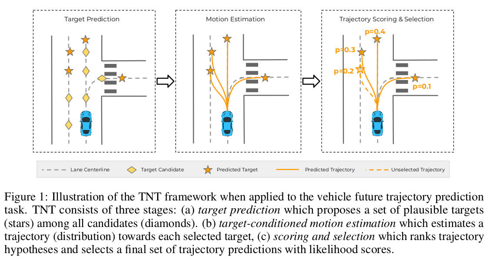
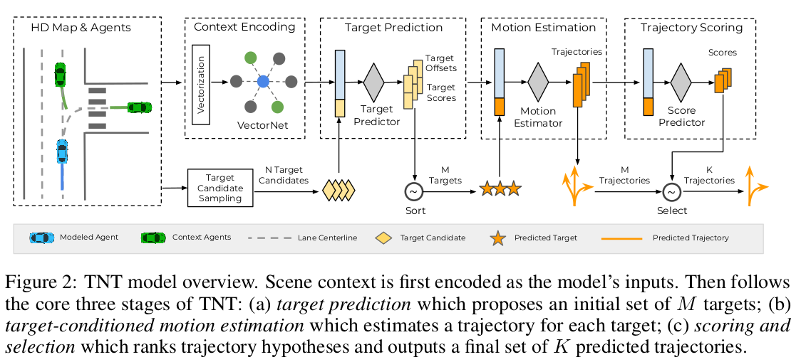
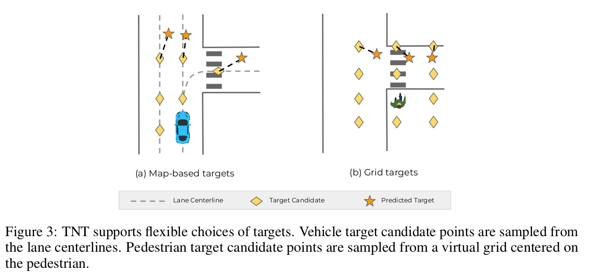
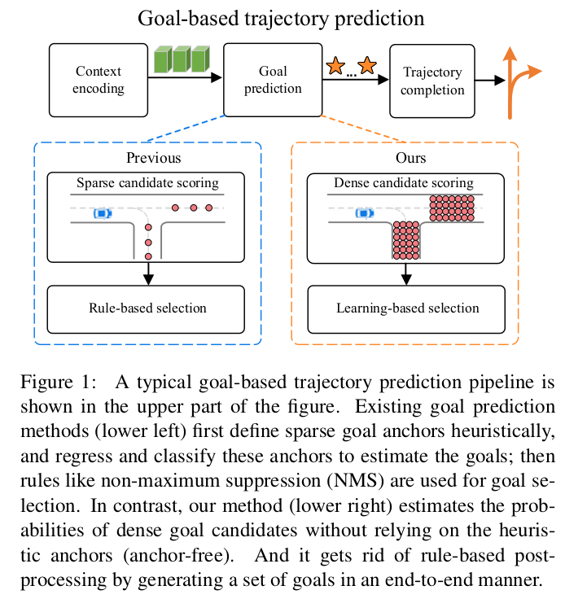
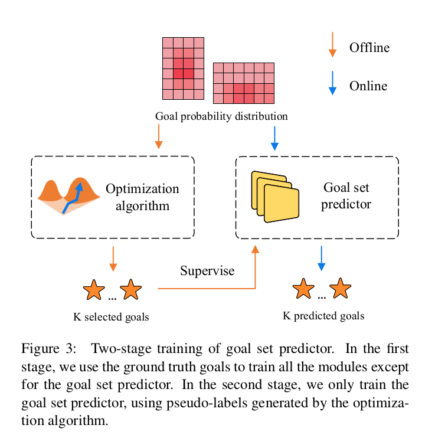
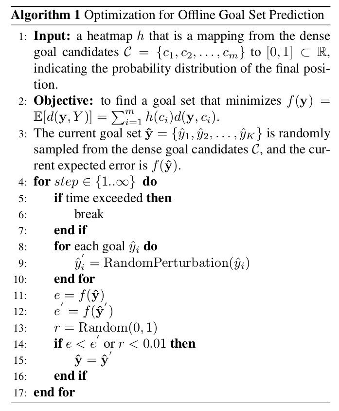

# DenseTNT and TNT 论文解读

## TNT: Target-driveN Trajectory Prediction

`**ref link:**`
https://zhuanlan.zhihu.com/p/435953928
https://blog.csdn.net/weixin_40633696/article/details/124542807?utm_medium=distribute.pc_relevant.none-task-blog-2~default~baidujs_title~default-2-124542807-blog-122758833.pc_relevant_vip_default&spm=1001.2101.3001.4242.2&utm_relevant_index=5

### 概览

在预测车辆的轨迹时, 需要尽可能考虑到车辆不同的情况，即不同的模态，如前行或左转，并预测出对应的概率。

模态的定义是比较模糊的，例如，有不同的速度前行，左转可以以不同的转弯角度实现。为了能够更加通用且精确地定义每条轨迹的模态，我们直接将每条轨迹的模态定义在每条轨迹的终点上。这里的一个重要假设是，轨迹的模态基本由终点所决定，当终点确定后，轨迹的形状也大体确定了。这样我们就把轨迹预测变成了终点预测问题，极大地简化了问题的复杂度。

TNT的预测方式: **首先预测轨迹的终点，然后基于这个终点补充完整条轨迹**。

TNT 基于终点的轨迹预测流程图:

TNT使用VectorNet对高精地图和车辆信息进行编码，得到要预测的车辆的全局特征，以用于接下来的解码，从而完成轨迹预测：

(1). **终点预测:** 为每个Anchor预测一个偏移，得到终点，这些Anchor从道路的中心线上采样得到;
(2). **轨迹补全:** 基于上一步预测的终点将整条轨迹补充完整;
(3). **轨迹打分和筛选:** 根据场景特征，为每条轨迹进行打分，并筛选出最有可能的若干条轨迹。

### TNT 实现

#### 原理

给定一个单个障碍物的观测状态序列 $S_P = [s_{-T^{'}+1}, s_{-T^{'}+2}, ..., s_0]$。我们的目标是预测它的未来状态 $S_F = [s_1, s_2, ..., s_T]$ 到某个固定时间步 T。自然地，障碍物与由其它障碍物和场景元素组成的环境交互作为背景: $C_P​=[c_{-T′+1}​,c_{-T′+2}​,...,c_0​]$。为简洁起见，我们记 $X = (s_P, c_P)$，因此我们想捕捉的整体概率分布是 $p(S_F|X)$ 。

实际上， $p(S_F|X)$ 可以是高度多模态的。例如，车辆驶近十字路口时可能左转、直行或改变车道。直观上，未来状态的不确定性可以被分解为两部分：<u>目标或者意图的不确定性</u>，比如左右转的决定；以及<u>控制的不确定性</u>，比如转弯时需要的细粒度运动。因此，我们可以通过对目标设定条件，然后将其边缘化，从而对概率分布进行分解：

$$p(S_F​∣X)=∫_{τ∈τ(C_P​)}​p(τ∣X)p(S_F​∣τ,X)d_τ​, \tag{1}$$

其中 $\tau(C_P)$ 表示取决于观察到的背景 $C_P$ ​的合理目标空间。

在这个公式下，我们的主要见解是，对于轨迹预测等应用，通过正确设计目标空间 $\tau τ ( C_P )$（如目标位置），目标分布 $ p(\tau|X)$ 可以很好地捕捉意图不确定性。一旦目标确定，我们会进一步证明控制不确定性（如轨迹）可以通过**简单的单模态分布**可靠地建模。我们用一组离散位置来模拟目标空间  $\tau{C_P}$，将 $p(\tau|X)$ 的估计主要转化为一个分类任务。与隐变分模型相比，我们的模型以明确的目标分布的形式提供了更好的可解释性，并且在设计目标空间 $\tau{C_P}$ 时可以自然地结合专家知识（如道路拓扑）。

我们的整体框架有三个概念阶段。第一阶段是**障碍物意图预测**，其目标是用基于观察背景 $X$ 的目标空间 $\tau$ 的离散集合<u>对意图不确定性进行建模</u>，并且输出目标分布 $p(\tau|X)$ 。第二个阶段是**障碍物条件运动估计**，它用单模态分布对从初始状态到目标可能的未来运动进行建模。前两个阶段产生了以下概率预测 $p(S_F|X) = \sum_{\tau\in\tau(C_P)}p(\tau|X)p(S_F|\tau, X)$。

许多下游应用，例如实时行为预测，需要一小组具有代表性的未来预测，而不是所有可能未来的完整分布。我们的最终阶段，**评分和选择**，就是为此目的量身定制的。我们从所有代表性预测上学习一个评分函数 $\phi(S_F)$，并选择一个最终的多样化预测集。

#### 场景编码VectorNet

建模场景背景是轨迹预测的第一步，以获取<u>车辆-道路</u>和<u>车辆-车辆</u>之间的交互。TNT可以使用任何合适的背景编码器：当高清地图可用时，我们使用最优秀的层次图神经网络 VectorNet 对背景进行编码。具体来说，使用多段线来抽象出高清地图元素 $C_P$(车道，交通标志) 和代理轨迹 $S_P$​；采用子图（subgraph）网络对多段线进行编码，多段线包含可变数量的向量；然后使用全局图（global graph）对多段线之间的交互进行建模。输出是每个建模代理的全局背景特征 $X$。如果场景背景只在自上而下的图像形式中可用，则使用卷积网络作为背景编码器。

#### 目标预测

在我们的公式中，目标 $\tau$ 被定义为一个预测目标可能在固定时间范围 $T$ 上的位置 $(x,y)$ 。在第一步目标预测阶段，我们的目的是提供一个预测目标的未来目标的分布 $p( \tau ∣ X )$ 。我们通过一组$N$个离散的、带有连续偏移的量化位置来建模潜在的未来目标： $\tau =\{\tau^n\}=\{(x^n,y^n)+(\Delta x^n,\Delta y^n)\}^N_{n=1}$​。然后这个目标上分布可以通过一个离散-连续分解来建模：

 $$p(τ^n∣X)=π(τ^n∣X)⋅N(Δx^n∣v^x_n​(X))⋅N(Δ_y^n∣v_y^n​(X)),\tag{2}$$

中 $\pi(\tau^n|X)=\frac{e^{f(\tau^n,X)}}{\sum_{\tau^{'}}e^{f(\tau^{'},X)}}$ 是在位置选择 $(x^n,y^n)$上的离散分布。术语 $N(·|v(·))$ 表示一个广义正态分布，其中我们选择Huber作为距离函数。我们将均值表示为 $v(·)$并假设单位方差。

可训练函数 $f(·)$ 和  $v(·)$ 由一个2层的多层感知机(MLP)实现，目标坐标 $(x^k,y^k)$ 和场景背景特征 $X$ 作为输入。它们预测目标位置上的离散分布及其最可能的偏移量。这一阶段的训练损失函数由以下公式给出：

 $$L_{S1}​=L_{cls​}(π,u)+L_{offset}​(v_x​,v_y​,Δx^u,Δy^u),\tag{3}$$

其中 $L_{cls}$ 是交叉熵损失， $L_{offset}$​ 是 Huber 损失；$u$ 是离真实位置最近的目标，并且 $\Delta x^u,\Delta y^u$ 是 $u$ 相对于真值的空间偏移量。

离散目标空间的选择在不同应用中是灵活的，如图3所示。在车辆轨迹预测问题中，我们从高清地图里均匀地采样车道中心线上的点并且将他们作为目标候选点(标记为黄色菱形)，假设车辆从未远离车道线；对于行人，我们在代理周围生成了一个虚拟网格并将网格点作为目标候选点。对每个候选目标，TNT目标预测器生成了一个 $(\pi,\Delta x, \Delta y)$ 的元组；回归后的目标以橙色五角星标记。与直接回归相比，将未来建模成一组离散目标的最显著的优势在于，它不受模态平均的影响，模态平均是阻止多模态预测的主要因素。

#### 基于目标的运动估计

在第二阶段，我们将给定目标轨迹的可能性建模为 $p(S_F|\tau,X)=\prod^T_{t=1}p(s_t|\tau,X)$，同样采用了广义正态分布。这里有两个假设。首先，未来时间步是条件独立的，这使得我们的模型通过避免顺序预测提高了计算效率。其次，我们正在作出有力但合理的假设，即给定目标的轨迹分布是单模态(正态)的。对于短的时间范围来说，这当然是正确的；对于更长的时间范围，可以在(中间)目标预测和运动估计之间迭代，以便假设仍然成立。

这一阶段使用2层的MLP实现。它将背景特征 X 和目标位置 $\tau$ 作为输入，并且每个目标输出一条最可能的轨迹 $[\hat{s_1},...,\hat{s_T}] [s1​^​,...,sT​^​]$。由于它以第一阶段的预测目标为条件，为了实现平滑的学习过程，我们在训练时采用teacher forcing Technique[36]，将真实位置 $(x^n,y^n)$ 作为目标。该阶段的损失项是预测状态 $\hat{s_t}$​ 和真值 $s_t$​ 之间的距离：

$$L_{S2}​ = \sum_{t=1}^{T}​L_{reg}​(\hat{s},s_t​),\tag{4}$$

其中， $L_{reg}$​ 作为每一步坐标偏移的 Huber 损失来实现。

#### 轨迹评分和选择
我们的最终阶段估计未来完整轨迹 S F S_F SF​ 的可能性。这和第二阶段不同，第二阶段分解时间步和目标，也和第一阶段不同，第一阶段只知道目标，但没有完整的轨迹——例如，一个目标可能被估计有很高的可能性，但到达该目标完整轨迹的可能性可能不是。

我们使用最大熵模型对第二阶段的所有 M 条轨迹进行评分:

$$\phi (S_F | X) = \frac{e^{g(S_F, X)}}{{\sum}_{m=1}^{M} e^{g(S_F^m, X)}}​$$,

其中 $g(·)$ 被建模为一个2层的 MLP。这一阶段训练的损失项是预测分数和真值分数之间的交叉熵，

$$L_{S3} = L_{CE}(\phi (S_F | X), \psi(S_F))$$

其中每个预测轨迹的真值评分由预测轨迹到真值轨迹的距离 $\psi(S_F)=\frac{exp(-D(S,S_{GT})/\alpha)}{\sum_{s^{'}}exp(-D(S^{'},S_{GT})/\alpha)}$ 定义，其中 $D(·)$ 单位为米， $\alpha$ 是温度。距离度量定义为 $D(S^i,S^j)=max(||s^i_1-s^j_1||^2_2,...,||s^i_t-s^j_t||^2_2)$。

为了从已评分的 $M$ 个轨迹获得最终一小组 $K$ 个预测轨迹，我们实现了一个轨迹选择算法来排除近似重复的轨迹。我们首先根据他们的分数对轨迹进行降序排列，并且贪婪地选择轨迹； 如果一个轨迹距离所有的选择轨迹都足够远，我们也会选择它，否则排除它。这里使用的距离度量和评分过程相同。这个过程的灵感来源于通常应用于计算机视觉问题（如目标检测）的非极大值抑制算法。

#### 训练和推理细节
上述的 TNT 公式产生全监督的端到端训练，具有损失函数
$$L = \lambda_1 L_{S1} + \lambda_2 L_{S2} + \lambda_3 L_{S3}$$

其中，选择 $\lambda_1,\lambda_2,\lambda_3$ 来平衡训练过程。

在推理时，TNT 的工作原理如下：
 (1) 工作场景编码；
 (2) 采样 N 个候选目标作为目标预测器的输入，取由 $\pi(\tau|X)$ 估计的前 M 个目标；
 (3) 从运动估计模型 $p(S_F|\tau,X)$ 中获取 M 个目标中每个目标的 MAP 轨迹；
 (4) 通过  $\phi(S_F|\tau,X)$  给 M 个轨迹评分，并且选择一组最终的 K 个轨迹。

## DenseTNT:

`ref link:` https://blog.csdn.net/weixin_39397852/article/details/122764880

### Comparison between DenseTNT and TNT

TNT(左图)是根据lane定义一些anchor，再regress和classify获得最终的位置，之后还要通过NMS的筛选法选出最后的轨迹。
DenseTNT(右图)是通过密集地采点避免了定义anchor，同时也避免了使用NMS等规则来筛选轨迹。

意图预测中非常重要的一个问题是ground truth只有一个，而对于多意图的预测来说，多个方向的预测都是允许的，这导致了label中有很多都是无效的，因为gt只包含了一个意图下的结果。此处设计了一个offline的model来提供多个意图下的label。这个model使用了一个优化算法从goal的分布里取出了一个set作为online model的label。

### Method 具体实现方法

#### sparse context encoding -- VectorNet
本文使用VectorNet来提取地图的feature。(没有的高精地图的话也可使用CNN)

#### Dense goal probability estimation

TNT对于一个goal只预测一条轨迹的概率是有问题的：一个goal只有一条预测(可能通向这个goal的别的预测概率很高)，一个goal获取的feature不够丰富(goal附近的点的信息也用上会更好)。

我们使用了`dense goal encoder`。它以一定的采样频率获取了地图上在道路上的所有点。然后预测了这些密集点的概率分布。

##### Lane Scoring
> 在论文实现中，可以用point scoring代替，效果更好。目的在与选出距离final pos(gt)更近的点。

为了减少需要sample的点，我们先预测goal落在不同lane上的概率，这样能过滤掉明显不在candidate lane附近的点，提升运算速度。
这是一个二分类问题。因此使用了二分类的交叉熵计算loss。对于label，使用离gt的goal最近的lane作为1，别的lane为0。对于别的lane $l$，假设gt的goal是$y_{gt}$​，定义一个distance

$$d(l,y_{gt}) = min(||l_1 - y_{gt}||^2, ||l_2 - y_{gt}||^2, ..., ||l_t - y_{gt}||^2,)$$

直觉上就是gt的goal到这条lane的最短距离的平方。

##### Probability Estimation

获得概率分布的做法是self-attention。首先agent的feature经过两次MLP。然后把goal的feature $F$作为需要query的变量，从地图上所有元素 (lane，agent)的feature中去查找索引对应的键和值。目的就是建立goal的feature与地图上所有元素的联系。直观上，这一步是把agent的未来状态(goal)表示成由历史的信息作为变量的函数，这个函数采用的是self-attention的做法。

轨迹目标点(goals)和道路的局部信息可以用以下注意力机制表示:

$$\mathbf{Q} = \mathbf{FW}^{\mathbf{Q}}, \mathbf{K} = \mathbf{LW}^{\mathbf{K}}, \mathbf{V}=\mathbf{LW}^{\mathbf{V}}$$

$$\mathbf{A}(\mathbf{Q},\mathbf{K},\mathbf{V}) = softmax(\frac{\mathbf{QK^\top}}{\sqrt{d_k}})\mathbf{V}$$

where $\mathbf{W}^Q, \mathbf{W}^{K}, \mathbf{W}^{V} \in \mathbb{R}^{d_h \times d_k}$ are the matrices for linear projection, $d_k$ is the dimension of query / key / value vectors, and $\mathbf{F}, \mathbf{F}$ are feature matrices of the dense goal candidates and all map elements (i.e., lanes or agents), respectively.

这一步之后的结果是goal新的feature $\mathbf{F}$。再通过两次MLP，即下图中的 $g(.)$.用softmax中的方法获得每个goal的概率。将所有goal在地图上表示出来的话就是一个概率分布heatmap。

$$\phi_i = \frac{\exp(g(\mathbf{F}_i))}{\sum_{n=1}^{N}\exp(g(\mathbf{F}_n))}$$

对于Loss的计算，离gt的goal最近的goal的label定为1，其余都为0.采取二分类交叉熵的算法。

$$\mathcal{L}_\text{goal} = \mathcal{L}_{\text{CE}}(\phi, \psi)$$

#### Goal Set Prediction
对于多意图的预测，在TNT中，预先设定好target，采用NMS(non-maximum suppression)(靠的近或概率低的过滤掉)。而DenseTNT的上一步获得是heatmap，因此不能简单使用NMS，因为用于筛选的阈值比较难定。这是因为TNT中采用的是从高到低排序概率，而DenseTNT中的概率分布是针对于整个鸟瞰图的，一旦意图的可能性变多了，平均分布到每一个意图的概率就低了(对于概率分布，所有的点的概率加起来需要为1)。

heatmap，输出是goal set，这个有点像目标检测的框生成。但和目标检测不同，对于一个输入，我们的label只有一个，即gt。这样的话可能会有别的意图的结果在训练中被忽略。为此，设计了一个offline model来制造这些label。它和online model的区别就在这一步中。没有使用goal set predictor而是采用了优化算法。

##### Offline Optimization

上一步heatmap的输出，实际上是对于地图上众多goal每个点的一个函数。设定 $C=\{c_1,c_2,...,c_m\}$ 为所有dense goal的candidate，heatmap就把 $C$ 映射到一个0到1的集合，写成 $h(c_i)$ ，这也是每个goal的概率。
接下来定义一个目标函数:

$$E[d(\hat{y}, Y)] = \sum^m_{i=1}h(c_i)d(\hat{y}, c_i)$$

其中，$d(\hat{y}, c_i) = \mathop{\min}\limits_{y_i \in \hat{y}}||y_j - y_{c_i}||$

从直观上讲，目标是有M个goal（大池子），要从中选取K个靠谱的goal（小池子）。 $d$ 是针对于大池子的，对于大池子里所有candidate都有一个 $d$。这每个candidate都与小池子中的goal计算距离，取最近的作为 d d d，即寻找小池子中离candidate最近的点。对于所有的 $d$，用概率加权计算期望。总体的话在收敛情况，大池子中的所有goal到距离自己最近的小池子中的goal乘上概率加权应当达到最小。以下是这个优化算法的实现。

翻译成中文：

- 初始化K个goal，从M个goal的大池子里随机选
- 小池子里的每个goal做随机扰动，变为别的goal
- 计算原来的和现在的小池子的d的期望e和e’
- 如果现在的小池子d的期望更小，则使用现在的小池子。否则以1%的概率采用现在的小池子。（避免局部最优）
- 不停循环2-4直到步数达到阈值（或时间太长）

优化算法之后得到的就是全局最优的选中的小池子。这个小池子里的结果能作为训练online模型的伪label。

##### Goal Set Predictor (online)

模型采用了encode+decode的办法。encoder部分是一层self-attention加上max pooling，decoder部分是2层MLP，输入是heatmap，输出是2K+1个值，分别对应K个2维坐标（goal set）和一个当前goal set的confidence。

考虑到heatmap的概率分布比较散，可以采用N头同时运算。即N个goal set predictor输出N个2K+1的值，从当中选取confidence最高的那个goal set预测。为了运算效率的提升，这N头使用相同的self-attention层，但是不同的2个MLP。

在训练过程中，采用了offline模型的伪label作为监督。上述offline中讲到的初始选定的小池子，在这里采用的是online模型的K个goal的set的预测。然后经过L次随机扰动（即不停随机选取邻居点，L=100），选取当中expected error（offline里的期望项）最小的那个set作为伪label。

标记 $\dot{y}$ ​为预测结果， $\hat{y}$ ​为伪label，则loss的计算如下。即一一对应后的L1距离之和。

$$\mathcal{L_{set}(\dot{y}, \hat{y})} = \sum_{i=1}^{k}\mathcal{L}_{\text{reg}}(\dot{y}, \hat{y})$$

再考虑到采用了N头预测，这部分的loss将采用二分类的交叉熵。其中 $\mu$ 为所有head的confidence，$\nu$ 为label，只有expected error最低的label为1，别的为0。

$$\mathcal{L}_\text{head} = \mathcal{L}_{\text{CE}}(\mu, \nu)$$

#### Trajectory Completion

这一步和TNT做法类似。类似于dense goal encoding（2层MLP后过self-attention）最后过2层MLP来decode得到整条预测轨迹的state。采用teacher forcing技巧（因为只有一条gt）训练时只用gt的goal来算这条预测轨迹。Loss的算法和TNT一样，用的是点点之间的Huber loss。

$$\mathcal{L}_{\text{completion}} = \sum_{t=1}^{T}\mathcal{L_{reg}}(\hat{s}_t, s_t)$$

#### Learning

训练分为两个stage。第一个stage使用gt轨迹训练除了goal set predictor的部分。即把dense的goal输入。获得大量的轨迹。

$$\mathcal{L}_{s1} = \mathcal{L}_{lane} + \mathcal{L}_{goal}+ \mathcal{L}_{completion}$$

第二个stage主要负责goal set predictor的部分。

$$\mathcal{L}_{s2} = \mathcal{L}_{head} + \mathcal{L}_{set}$$

---

> 作者: [Jian YE](https://github.com/jianye0428)  
> URL: https://lruihao.cn/posts/densetnt_tnt/  

