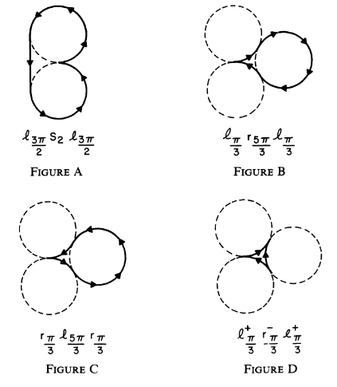
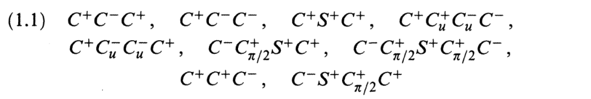
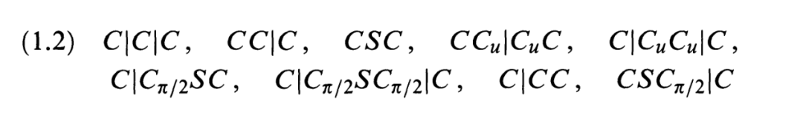
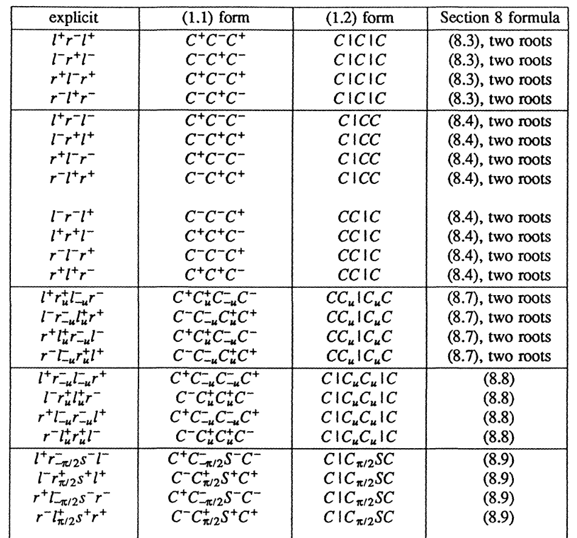
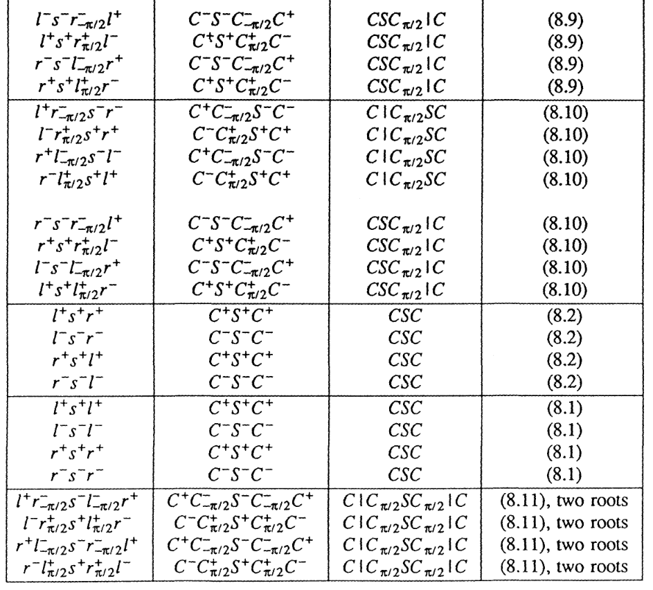

# 车辆路径规划之Dubins曲线与RS曲线简述

## 0. 描述

Dubins和RS曲线都是路径规划的经典算法，其中车辆运动学利用RS曲线居多，因此简单介绍Dubins并引出RS曲线。

花了点时间看了二者的论文，并阅读了一个开源的代码。

## 1. Dubins曲线

Dubins曲线是在满足曲率约束和规定的始端和末端的切线（进入方向）的条件下，连接两个二维平面的最短路径。它满足给定的运动曲率约束，即转弯半径大于等于给定的半径。

假设顺时针圆周运动为R，逆时针圆周运动为L，直线运动为S。求出Dubins曲线，用任务来表达就是

给了车辆起始位置 $(x_{start},y_{start})$ ，车辆的朝向 $\theta_{start}$ ，再给一个车辆的目标位置 $(x_{end},y_{end})$ ，车辆的目标朝向为 $\theta_{end}$ 。车辆最多能实现的曲率为 $K_{max}$ 。车辆不可以做后退运动，只能向前开。

规划的曲线分三段，第一段是绕固定圆心的L或R，第二段是L/R/S，第三段是L/R。用这三段曲线可以使车辆从初始位姿连续的移动到目标位姿。

三段曲线可以组成的集合有6种={LSL、RSR、RSL、LSR、RLR、LRL}。这六种可能中最短的路径就是Dubins曲线。

网上有很多关于Dubins曲线的文章，都很简单。先把初始位姿和目标位姿做一下差值，得到一个更简单的坐标系。再通过画圆和直线，求解一些方程，就可以计算出不同选择路径的长度值。再从中取最小的，就可以得到Dubins曲线了。这里不多介绍。

有关Dubins的文章有很多，对于6种不同的路径，都有对应的公式去计算每段的长度值。

## 2. Reeds-Shepp曲线

**1. 原理**

**“利用倒挡的RS曲线可以比Dubins曲线更优”**

论文《Optimal paths for a car that goes both forwards and backwards》提出了Reeds-Shepp曲线。这篇论文由Reeds和Shepp在1990年发表。他们提出了一种能够计算出车辆以固定转弯半径，由一个姿态向另一个姿态运动的最短路径的曲线，即Reeds-Shepp曲线，简称为RS曲线。

对于Dubins曲线，当我们需要车辆位置不变原地掉头时，有如下图的情况：

 

  
   
  
Dubins曲线

 

图A和图B都可以达到目标。根据Dubins曲线的定义，我们知道图B是最优的路线，同时存在另外一条曲线图C，也能达到相同的效果。但这和我们平时开车显然不同，因为我们的车辆是可以挂倒挡的。我们选择图D代表的路径，可以更快达到目标。

相较于Dubins曲线，RS曲线有了进一步的约束条件：要求每个点的曲率半径都大于1，同时允许车辆可以后退。当车辆可以倒退时，路径有可能被缩短变得更优，而此时Dubins曲线将不能满足要求。作者对RS曲线的所有可能进行了简化表示，在文中做出了一系列定义，我按照文章的顺序进行讲解。

**2. 定义**

•C代表左转（L）或右转（R），S代表沿直线行驶。C^+和C^-的上标代表前进和后退（在车辆里就是换档）。因此，CC代表的就是LR或者RL。

• $C^+_{\pi/2}$ 代表前进方向弧长走 $\pi/2$，C^-_{-\pi/2}代表后退方向弧长走\pi/2。所以再通用一些，C^\pm_t表达式中的C可以代表L、R或者S，上标代表前进方向，下标t是和上标正负号相同的代表弧长的值。

•C_uC_u这两个需要连在一起出现，代表两段弧长相等。

在诸如C^+_tC^-_uC^-_vv^+_w这样的路径族（由四段组成的路径，同样的还有C^-_tC^+_uC^+_vv^-_w……等）中，自由参数t,u,v,w一共有4个参数，比条件的数量（目标位置和角度）多了1个，因此对于给定的终点条件通常存在多个解。我们对族中的路径进行优化，能够得到一个额外的方程，结果就是 v = u，或v = π/2。这样看参数仍然是三个。

作者在后面会证明，确实还有类似于C^+C^-C^+C^-C^+C^-这样的路径存在，这样的路径并不在作者提到的形式之中。但是这种路径往往在我们的形式中有相同的替代路径。对于不在作者集合中的路径，将不会出现在简单的前向场景中。

作者提出了两种描述方式，一种是用\pm代表的正负方向

 

  
   
  

 

另一种是用 | 代表的档位变化

 

  
   
  
BP Network

 

以车辆为例，如果用真实的左打轮和右打轮，加上档位变化，一共会有48种不同的路径，如下图。由于有一些路径会有多个公式来表达，所以这48种路径最多会有68个公式。

 

  
   
  

 

 

  
   
  
BP Network

 

Dubins曲线和我们的证明方式不同。Dubins证明了任何终点条件下都会存在路径，即问题的下限被确定了。同时，任何路径长度小于 \pi/8的路径一定是一个CSC类型的路径。然后容易得到，每个路径必须由有限的C和S组成，最终路径简化为了CSC和CCC两种可能。作者没有能够用Dubins的方法来解决本文章提到的车辆反向运动问题。作者在第7节证明了在不增加路径长度的情况下，最多5段就能表示路径，证明方法与Dubins类似。

作者除了用数学公式来推导证明，还用计算机来做了验证：设置了一个包含很多条子路径的集合W，随机出起始条件和终止条件，如果在集合W中找到了两条路径就能连接起点终点，那么集合W显然就是不充分的，就要对集合W进行一些修剪。最终用这种方式得到了一个最小的有效集合W。一旦猜测出了W，作者再次使用计算机来帮助进行大量情况下的广泛代数运算，以验证上述方法可以给出严格的证明。最后，作者发现证明可以简化为上图，这样普通人可以在没有计算机检查细节的情况下轻松理解。但作者认为，如果没有使用计算机，他们永远不可能找到正确的子路径集。（这实际上表明作者是在计算机辅助下，成功地找到了RS曲线的解，并通过广泛的代数运算验证了他们的方法。最终，他们再反过来简化证明过程，最终让RS曲线更易于理解。）

## 3. 等效运算

作者提到，并不是每次都需要计算48种路径，因为存在一些基本变换规则可以简化计算

- 第一种等效运算：”timeflip”——时间变换

路径 $l^+ r^- s^- l^-$ 和路径 l^-r^+s^+l^+ 之间的关系就是时间变换，可以看出其实就是前进和后退动作替换了一下

当我们想求沿路径 l^-r^+s^+l^+ 从 [0,0,0] 到 [x,y,\phi] 时 ，我们可以求沿路径 l^+r^-s^-l^-从 [0,0,0] 到 [-x,y,-\phi]，求出的路径 l^+r^-s^-l^-中每段走的弧长，就是待求路径 l^-r^+s^+l^+ 的弧长结果

- 第二种等效运算：“reflect”——反射变换

路径 l^+r^-s^-l^- 和路径 r^+l^-s^-r^- 之间的关系就是反射变换，可以看出其实就是向左和向右替换了一下

当我们想求沿路径 r^+l^-s^-r^- 从 [0,0,0] 到 [x,y,\phi] 时 ，我们可以求沿路径 l^+r^-s^-l^-从 [0,0,0] 到 [x,-y,-\phi]，求出的路径 l^+r^-s^-l^-中每段走的弧长，就是待求路径 r^+l^-s^-r^- 的弧长结果

- 第三种等效运算：“backwards”——反向变换

路径 l^+r^-s^-l^- 和路径 l^-s^-r^-l^+ 之间的关系就是反向变换，可以看出其实两条路径前后顺序颠倒了一下

当我们想求沿路径 l^-s^-r^-l^+ 从 [0,0,0] 到 [x,y,\phi] 时 ，我们可以求沿路径 l^+r^-s^-l^-从 [0,0,0] 到 [xcos\phi+ysin\phi,xsin\phi-ycos\phi,\phi]，求出的路径 l^+r^-s^-l^-中每段走的弧长，就是待求路径 l^-s^-r^-l^+ 的弧长结果

上面提到了三种变换关系来简化运算，简单理解一下就是：

从 [0,0,0] 到 [x,y,\phi] 需要求解的三个路径 l^-r^+s^+l^+、r^+l^-s^-r^- 、l^-s^-r^-l^+，通过分别改变终点的坐标，均可以通过求解路径 l^+r^-s^-l^- 得到每段轨迹的弧长或前进距离

## 4. 流程与代码

与Dubins曲线一致，RS曲线每种路径也有对应的公式可以计算。

第一步：起始点坐标变换，令起点坐标变为(0,0,0)，终点的坐标转换为起点坐标系下的坐标，从而简化后续计算

q0 = [sx, sy, syaw]  # 起点:x,y,yaw

q1 = [gx, gy, gyaw]  # 终点:x,y,yaw

dx = q1[0] - q0[0]

dy = q1[1] - q0[1]

dth = q1[2] - q0[2]

c = math.cos(q0[2])

s = math.sin(q0[2])

x = (c * dx + s * dy) * max_curvature

y = (-s * dx + c * dy) * max_curvature

\# 起点变成了(0,0,0),终点坐标变成了(x, y, dth)

第二步：计算路径

利用三种基本定理，计算全部的路径

第三步：选择路径

选择最优的路径，并对生成的路径进行差值，得到路径上的每一个路径点

## 5. 总结

原理基本上很清楚，暂时对可选路径计算的优化没有深究，之后再说。

ref: https://mp.weixin.qq.com/s/RfAEnFtUW7KkG7cSPqmWUw

---

> 作者: [Jian YE](https://github.com/jianye0428)  
> URL: https://jianye0428.github.io/posts/dubinsandrs/  

