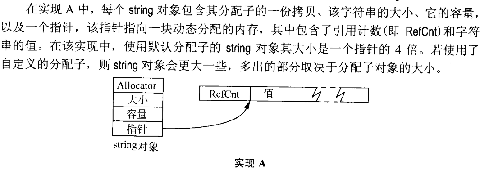
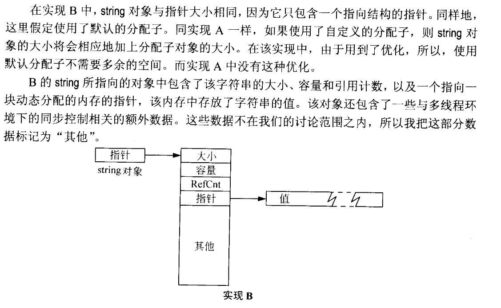
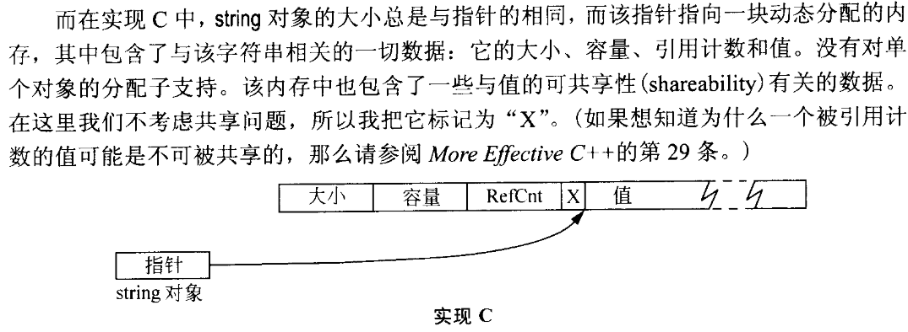
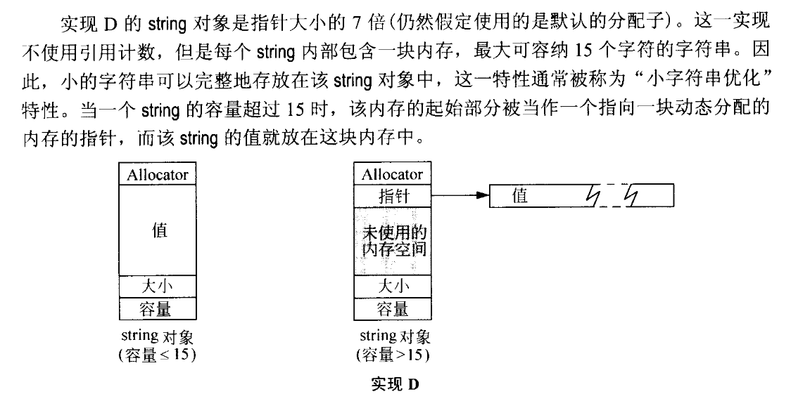
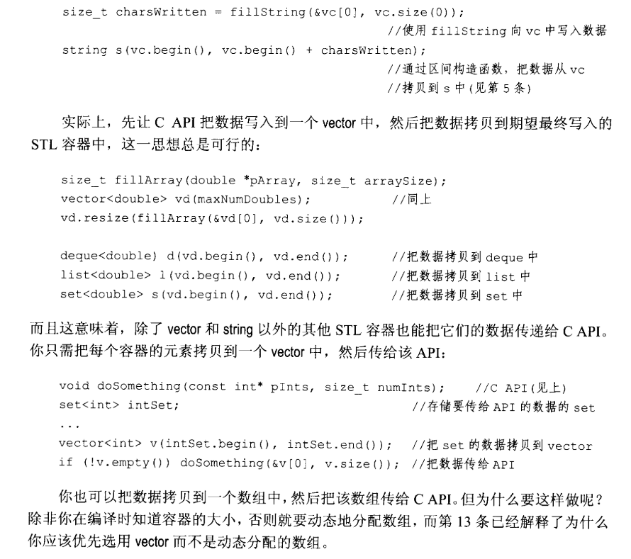

# Effective STL 精读总结 [2] | vector 和 string


# 前言

> Effective-STL总结系列分为七部分，本文为第一部分，涉及原书第一章，内容范围Rule01~12。为方便书写，Rule12简写为R12。


本博客站点系列内容如下：</br>
💡 [Effective STL(第3版) 精读总结(一)](https://jianye0428.github.io/posts/partone/)</br>
💡 [Effective STL(第3版) 精读总结(二)](https://jianye0428.github.io/posts/parttwo/)</br>
💡 [Effective STL(第3版) 精读总结(三)](https://jianye0428.github.io/posts/partthree/)</br>
💡 [Effective STL(第3版) 精读总结(四)](https://jianye0428.github.io/posts/partfour/)</br>


## R13 vector和string优先于动态分配的数组
1. 如果使用动态分配的数组，意味着你需要承担三个责任:
   - 首先必须确保最后会调用delete来释放申请的内存;
   - 其次是必须确保使用了正确的delete形式，如果是分配了数组的话，应该使用delete[];
   - 最后必须确保只delete了一次，而不是多次。
- 而使用vector或者string就不需要承担这样的责任。

2. 如果当前使用的string是以引用计数的方式实现的，而又运行在多线程环境中，并且string的引用计数实现会影响效率（有时会出现同步控制所花费的时间比避免内存分配和字符拷贝节约下来的时间还要多），那么你至少有三种选择方案，且没有一种是放弃使用string。
   - 第一种是检查string实现，看看是否有可能禁止引用计数，通常是通过改变某个预处理变量的值。
   - 第二种是寻找或开发不使用引用计数的string实现。
   - 第三是考虑使用vector<char>而不是string。

## R14: 使用 reserve 来避免不必要的重新分配。

vector 和 string 的自动增长机制：
  1. 分配：分配一块大小为当前容量的某个倍数的新内存。vector 和 string 一般为 2.
  2. 把容器的所有元素从旧的内存复制到新的内存。
  3. 析构掉旧内存中的对象。
  4. 释放旧内存。

**`size()`**：告诉你该容器中有多少个元素。

**`capacity()`**：告诉你该容器利用已经分配的内存可以容纳多少个元素。这是容器所能容纳的元素总数。

**`resize(Container::size_type n)`**：强迫容器改变到包含 n 个元素的状态。在调用 resize 之后，size 将返回 n。

**`reserve(Container::size_type n)`**：强迫容器把它的容量变为至少是 n，前提是 n 不小于当前的大小。

使用 reserve，简单预留适合大小的空间，避免循环过程中发生重新分配：

```c++
vector<int> v;
v.reserve(1000);
for (int i = 1; i <= 1000; ++i) v.push_back(i);
```

对 push_back 的调用不会使 string 中的迭代器、指针和引用无效：
```c++
string s;
...
if (s.size() < s.capacity())
{
    s.push_back('x');
}
```

## R15: 注意 string 实现的多样性。

每个 string 包含的信息：
- 字符串的大小（size），即它所包含的字符个数。
- 存储该字符串中字符的内存容量（capacity）。
- 字符串的值（value)，即构成该字符串的字符。

可选：
- 分配子的拷贝。
- 对值的引用计数。

**实现A**


**实现A**


**实现A**


**实现A**


## R16: 了解如何把 vector 和 string 数据传给旧的 API。

- C++标准要求 vector 中的元素存储在连续的内存中，就像数组一样，所以可以直接得到容器中的数据指针。
对于 `vector v;` 表达式 `v[0]` 给出了一个引用，它是该向量中的第一个元素，所以 `&v[0]` 是指向第一个元素的指针。
`&*v.begin()` 等价于 `&v[0]`

- 对于 `string`，由于 `string` 中的数据不一定存储在连续的内存中且 string 的内部表示不一定是以空字符结尾，需使用成员函数 `c_str()`。



## R17: 使用 “swap 技巧” 除去多余的容量

**shrink to fit**：为了避免向量仍占用不再需要的内存，你希望有一种方法能把它的容量从以前的最大值缩减到当前需要的数量。

从 contestants 向量中除去多余的容量：

```c++
vector<Contestant>(contestants).swap(contestants);
```
vector 的拷贝构造函数只为说拷贝的元素分配**所需要的内存**，所以这个临时变量没有多余的容量。

`swap`：临时变量的数据和 contestents 的数据做 swap 操作。在这之后，contestents 具有了被去除之后的容量，即原先临时变量的容量。临时变量随后被析构，从而释放先前为 contestents 所占据的内存。注意，迭代器、指针和引用也将被交换（string 除外）。

同样适用于 string
```c++
string s;
...
string(s).swap(s);
```
清除一个容器：

```c++
vector<Contestant> v;
string s;
...
vector<Contestant>().swap(v);// 清除v并把它的容量变为最小
string().swap(s);// 清除s并把它的容量变为最小
```
## R18: 避免使用 vector bool

vector 是一个假的容器：
- 它不是一个 STL 容器。
- 它并不存储 bool。为了节省空间，它储存的是 bool 的紧凑表示——使用了与位域（bitfield）一样的思想，一个 8 位的字节可容纳 8 个 “bool”。你可以创建一个指向 bool 的指针，而指向单个位的指针则是不允许的。指向单个位的引用也是被禁止的。
- `vector::operator[]` 返回一个对象，表现得像是一个指向单个位的引用，即所谓的代理对象（proxy object）。

vector 的替代方案：
  1. deque：deque 是一个 STL 容器，而且它确实存储 bool。但 deque 中元素的内存不是连续的。
  2. bitset：bitset 不是 STL 容器，它的大小（元素的个数）在编译时就确定了，所以它不支持迭代器。与 vector 一样，它使用了一种紧凑表示，只为所包含的每个值提供一位空间。

总之，vector 是一个失败了的雄心勃勃的实验，它不完全满足 STL 容器的要求；你最好不要使用它；你可以使用 deque 和 bitset 来替代它，这两个数据结构几乎能做 vector 所能做的一切事情。

ref:
[1]. https://www.cnblogs.com/Sherry4869/p/15128250.html</br>
[2]. https://blog.csdn.net/zhuikefeng/article/details/108164117#t42


---

> 作者: [Jian YE](https://github.com/jianye0428)  
> URL: https://jianye0428.github.io/posts/effective_stl_part_two/  

