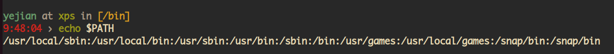
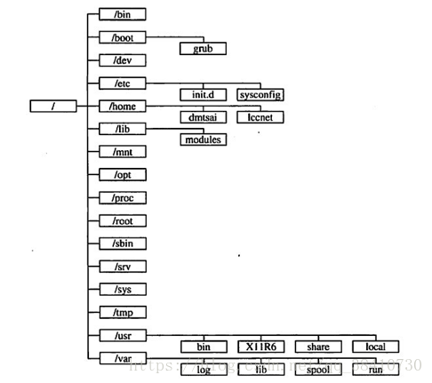

# Linux Filysystem


# Linux系统各系统文件夹下的区别

首先，usr 指 Unix System Resource，而不是User。
通常，
- **/usr/bin**下面的都是系统预装的可执行程序，会随着系统升级而改变。

- **/usr/local/bin**目录是给用户放置自己的可执行程序的地方，推荐放在这里，不会被系统升级而覆盖同名文件。

如果两个目录下有相同的可执行程序，谁优先执行受到PATH环境变量的影响，比如我的一台服务器的PATH变量为。

```shell
echo $PATH
```



这里<u>/usr/local/bin</u>优先于<u>/usr/bin</u>, 一般都是如此。

**/lib**是内核级的, **/usr/lib**是系统级的, **/usr/local/lib**是用户级的.

- **/** - 对你的电脑来说, 有且只有一个根目录。所有的东西都是从这里开始。举个例子: 当你在终端里输入"/home"，你其实是在告诉电脑，先从/(根目录)开始，再进入到home目录。

- **/lib/** — 包含许多被/bin/和/sbin/中的程序使用的库文件。目录/usr/lib/中含有更多用于用户程序的库文件。/lib目录下放置的是/bin和/sbin目录下程序所需的库文件。/lib目录下的文件的名称遵循下面的格式：
    > - libc.so.*
    > - ld*
    > - 仅仅被/usr目录下的程序所使用的共享库不必放到/lib目录下。只有/bin和/sbin下的程序所需要的库有必要放到/lib目录下。实际上，libm.so.*类型的库文件如果被是/bin和/sbin所需要的，也可以放到/usr/lib下。

- **/bin/** — 用来贮存用户命令。目录 /usr/bin 也被用来贮存用户命令。

- **/sbin/** — 许多系统命令(例如 shutdown)的贮存位置。目录/usr/sbin中也包括了许多系统命令。

- **/root/** — 根用户(超级用户)的主目录。

- **/mnt/** — 该目录中通常包括系统引导后被挂载的文件系统的挂载点。譬如，默认的光盘挂载点是/mnt/cdrom/.

- **/boot/** — 包括内核和其它系统启动期间使用的文件。

- **/lost+found/** — 被fsck用来放置零散文件(没有名称的文件)。

- **/lib/** — 包含许多被/bin/和/sbin/中的程序使用的库文件。目录/usr/lib/中含有更多用于用户程序的库文件。

- **/dev/** — 贮存设备文件。

- **/etc/** — 包含许多配置文件和目录。**系统主要的设定档几乎都放置在这个目录内**，例如人员的帐号密码档、各种服务的启始档等等。 一般来说，这个目录下的各档案属性是可以让一般使用者查阅的，但是只有root有权力修改。

- **/var/** — 用于贮存variable(或不断改变的)文件，例如日志文件和打印机假脱机文件。

- **/usr/** — 包括与系统用户直接有关的文件和目录，例如应用程序及支持它们的库文件。在这个目录下，你可以找到那些不适合放在/bin或/etc目录下的额外的工具。比如像游戏阿，一些打印工具拉等等。/usr目录包含了许多子目录： **/usr/bin**目录用于存放程序; **/usr/share**用于存放一些共享的数据，比如音乐文件或者图标等等;/usr/lib目录用于存放那些不能直接运行的，但却是许多程序运行所必需的一些函数库文件。

- **/proc/** — 一个虚拟的文件系统(不是实际贮存在磁盘上的)，它包括被某些程序使用的系统信息。

- **/initrd/** — 用来在计算机启动时挂载 initrd.img 映像文件的目录以及载入所需设备模块的目录。

    - **警告**:
        > 不要删除/initrd/目录。如果你删除了该目录后再重新引导Red Hat Linux时，你将无法引导你的计算机。

- **/tmp/** — 用户和程序的临时目录。/tmp给予所有系统用户读写权。**这是让一般使用者或者是正在执行的程序暂时放置档案的地方。**这个目录是任何人都能够存取的，所以你需要定期的清理一下。当然，重要资料不可放置在此目录啊。 因为FHS甚至建议在开机时，应该要将/tmp下的资料都删除。

- **/home/** — 用户主目录的默认位置。

- **/opt/** — 可选文件和程序的贮存目录。该目录主要被第三方开发者用来简易地安装和卸装他们的软件包。这里主要存放那些可选的程序。你想尝试最新的firefox测试版吗?那就装到/opt目录下吧，这样，当你尝试完，想删掉firefox的时候，你就可 以直接删除它，而不影响系统其他任何设置。安装到/opt目录下的程序，它所有的数据、库文件等等都是放在同个目录下面。

- **/usr/local/** - 这里主要存放那些手动安装的软件，即apt或者apt-get安装的软件。它和/usr目录具有相类似的目录结构。让软件包管理器来管理/usr目录，而把自定义的脚本(scripts)放到/usr/local目录下面，我想这应该是个不错的主意。

- **/media/** - 有些linux的发行版使用这个目录来挂载那些usb接口的移动硬盘(包括U盘)、CD/DVD驱动器等等。




## /usr/local/ 和 /usr/share/ 区别

- **/usr/local** - 这个目录一般是用来存放用户自编译安装软件的存放目录; 一般是通过源码包安装的软件，如果没有特别指定安装目录的话，一般是安装在这个目录中。这个目录下面有子目录。

- **/usr/share** - 系统共用的东西存放地，比如/usr/share/fonts是字体目录，/usr/share/doc和/usr/share/man帮助文件。

- **/var/log** - 系统日志存放，分析日志要看这个目录的东西;

- **/var/spool** -  打印机、邮件、代理服务器等脱机目录。

# Linux Command Notes
## 查找文件的命令:```find```/```locate```/```whereis```/```which```/```type```/```grep```
### find
```find```命令准确，但速度非常慢，它可以查找任何类型的文件
- 使用格式
    ```shell
    find [指定目录] [指定条件] [指定动作]
    ```
    参数说明:
    - [指定目录]： 所要搜索的目录及其所有子目录。默认为当前目录
    - [指定条件]： 所要搜索的文件的特征
        - -name：按文件名来查找文件
        - -user：按照文件的属主来查找文件
        - -group：按照文件所属的组来查找文件
        - -perm：按照文件权限来查找文件
        - -prune：不在当前指定目录中查找
    - [指定动作]： 对搜索结果进行特定的处理
        - -print：将匹配的文件输出到标准输出
        - -exec：对匹配的文件执行该参数所给出的shell命令
        - -ok：和-exec的作用相同，在执行每一个命令之前，让用户来确定是否执行
    > ```find```命令不加任何参数时，表示搜索路径为当前目录及其子目录，默认的动作为-print，即不过滤任何结果，也就是说输出所有的文件

    使用示例:
        - 递归搜索当前目录中，所有以```file```开头的文件
            ```shell
            find . -name 'file*'
            ```
        - 递归搜索当前目录中，所有以```file```开头的文件，并显示它们的详细信息
            ```shell
            find . -name 'file*' -ls
            ```
### locate

```locate```命令可以说是```find -name```的另一种写法，但是要比后者快得多，原因在于它不搜索具体目录，而是搜索一个数据库/var/lib/locatedb，这个数据库中含有本地所有文件信息.

Linux自动创建这个数据库，并且每天自动更新一次，所以使用locate命令查不到最新变动过的文件。为了避免这种情况，可以在使用```locate```之前，先使用```updatedb```命令，手动更新数据库.

- 使用格式:
  ```shell
  locate [参数] <文件名>
  ```

- 使用示例:
  - 搜索```etc```目录下所有以```file```开头的文件
    ```shell
    locate /etc/file
    ```
  - 搜索用户主目录下，所有以f开头的文件，并且忽略大小写
    ```shell
    locate -i ~/f
    ```
### whereis

```whereis```命令只能搜索特定格式的文件

- 使用格式
  ```shell
  whereis [参数] <文件名>
  ```
    - 可搜索文集类型
        - 二进制文件(-b)
        - 源代码文件(-s)
        - 说明文件(-m)
    > 如果省略参数，则返回所有信息
- 使用示例:
  - 找出名为```find```的文件位置
    ```shell
    whereis find
    ```

### which

```which```命令的作用是，在```PATH```变量指定的路径中，搜索某个系统命令的位置，并且返回第一个搜索结果, 也就是说，使用which命令，就可以看到某个系统命令是否存在，以及执行的到底是哪一个位置的命令。
- 使用格式
  ```shell
  which <命令>
  ```
- 使用实例:
  - 查找find命令的位置
    ```shell
    which find
    ```
### type

```type```命令其实不能算查找命令，它是用来区分某个命令到底是由shell自带的，还是由shell外部的独立二进制文件提供的; 如果一个命令是外部命令，那么使用```-p```参数，会显示该命令的路径，相当于which命令。

- 使用格式
  ```shell
  type <命令>
  ```
- 使用实例:
  - 查看cd命令是否为shell自带的命令
    ```shell
    type cd
    ```
  - 查看grep是否为外部命令
    ```shell
    type grep
    ```
### grep

```grep```命令用于查找拥有特殊字段的文件。

- 语法
  ```shell
  grep [-abcEFGhHilLnqrsvVwxy][-A<显示行数>][-B<显示列数>][-C<显示列数>][-d<进行动作>][-e<范本样式>][-f<范本文件>][--help][范本样式][文件或目录...]
  ```
  参数:
    - -a 或 --text : 不要忽略二进制的数据。
    - -A<显示行数> 或 --after-context=<显示行数> : 除了显示符合范本样式的那一列之外，并显示该行之后的内容。
    - -b 或 --byte-offset : 在显示符合样式的那一行之前，标示出该行第一个字符的编号。
    - -B<显示行数> 或 --before-context=<显示行数> : 除了显示符合样式的那一行之外，并显示该行之前的内容。
    - -c 或 --count : 计算符合样式的列数。
    - -C<显示行数> 或 --context=<显示行数>或-<显示行数> : 除了显示符合样式的那一行之外，并显示该行之前后的内容。
    - -d <动作> 或 --directories=<动作> : 当指定要查找的是目录而非文件时，必须使用这项参数，否则grep指令将回报信息并停止动作。
    - -e<范本样式> 或 --regexp=<范本样式> : 指定字符串做为查找文件内容的样式。
    - -E 或 --extended-regexp : 将样式为延伸的正则表达式来使用。
    - -f<规则文件> 或 --file=<规则文件> : 指定规则文件，其内容含有一个或多个规则样式，让grep查找符合规则条件的文件内容，格式为每行一个规则样式。
    - -F 或 --fixed-regexp : 将样式视为固定字符串的列表。
    - -G 或 --basic-regexp : 将样式视为普通的表示法来使用。
    - -h 或 --no-filename : 在显示符合样式的那一行之前，不标示该行所属的文件名称。
    - -H 或 --with-filename : 在显示符合样式的那一行之前，表示该行所属的文件名称。
    - -i 或 --ignore-case : 忽略字符大小写的差别。
    - -l 或 --file-with-matches : 列出文件内容符合指定的样式的文件名称。
    - -L 或 --files-without-match : 列出文件内容不符合指定的样式的文件名称。
    - -n 或 --line-number : 在显示符合样式的那一行之前，标示出该行的列数编号。
    - -o 或 --only-matching : 只显示匹配PATTERN 部分。
    - -q 或 --quiet或--silent : 不显示任何信息。
    - -r 或 --recursive : 此参数的效果和指定"-d recurse"参数相同。
    - -s 或 --no-messages : 不显示错误信息。
    - -v 或 --invert-match : 显示不包含匹配文本的所有行。
    - -V 或 --version : 显示版本信息。
    - -w 或 --word-regexp : 只显示全字符合的列。
    - -x --line-regexp : 只显示全列符合的列。
    - -y : 此参数的效果和指定"-i"参数相同。


- 示例:
  ```shell
  # 查找指定目录/etc/acpi 及其子目录（如果存在子目录的话）下所有文件中包含字符串"update"的文件，并打印出该字符串所在行的内容
  grep -r update /etc/acpi
  ```
  ```shell
  # 查看符合条件的日志条目。
  grep -n '2019-10-24 00:01:11' *.log
  ```
  ```shell
  # 只匹配文本文件，不匹配二进制文件的命令
  grep -srn "parameter" .  --binary-files=without-match
  ```

---

> 作者: [Jian YE](https://github.com/jianye0428)  
> URL: https://jianye0428.github.io/posts/filesystem/  

