# 生成对抗网络GAN

<!-- 
note abstract info tip success question warning failure danger bug example quote
 -->

<!--more-->

## 一、GAN的引入

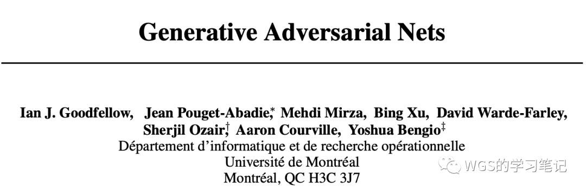

GAN（Generative Adversarial Networks）是一种无监督的深度学习模型，提出于2014年，被誉为“近年来复杂分布上无监督学习最具前景的方法之一”。


Yann Lecun对其的评价是：对抗式训练是迄今为止最酷的一件事情。

Adversarial training is the coolest thing since sliced bread.


我们来看下原文的标题：

- Generative：我们知道机器学习模型有两大类，第一个是分辨模型：对于一个数据去分辨它的类别，或者是预测一个实数值；另一类是生成模型，意思是怎么样生成这个数据本身。显然GAN是属于生成模型。
- Adversarial：对抗的，这里指的是GAN提出的这种 framework 采用对抗训练的方式来work。
- Nets：Network的简写。

## 二、GAN的应用举例
- 数据生成：生成一些假的图像数据，比如海报中的人脸、文本生成图像等； 
- 数据增强：从分割图生成假的真实街景，比如可以方便训练无人汽车等； 
- 风格化和艺术的图像创造：比如转换图像风格、AI换脸、修补图像等； 
- 声音的转换：比如一个人的声音转为另一个的声音、去除噪声等； 
- ...... 

## 三、GAN的快速概述
比如人脸检测、图像识别、语音识别等，**机器总是在现有事物的基础上，做出描述和判断**。能不能创造这个世界不存在的东西？

GAN就是为此而来，它包含三个部分：**生成**、**判别**、**对抗**。其中 <u>生成</u> 和 <u>判别</u> 是它的结构组成，<u>对抗</u>则是它的训练过程。

  - 生成：**生成** 和 **判别** 指的是两个独立的模型，生成器会根据随机向量产生假数据，这些假数据既可以是图片、也可以是文本，并**试图**欺骗判别网络；
  - 判别：**判别器**负责判断接受到的数据是否是真实的，即对生成数据进行真伪鉴别，试图正确识别所有假数据，它其实是一个二分类问题，会给出一个概率，代表着内容的真实程度；两者使用哪种网络并没有明确的规定，所以原文中作者称其为framework。比如可以使用擅长处理图片的CNN、常见的全连接等等，只要能够完成相应的功能就可以了。
  - 对抗：这指的是 GAN 的交替训练过程。以图片生成为例，先让**生成器**产生一些假图片，和收集到的真图片一起交给辨别器，让它学习区分两者，给真的高分，给假的低分，当判别器能够熟练判断现有数据后；再让 **生成器** 以从 **判别器** 处获得高分为目标，不断生成更好的假图片，直到能骗过判别器，重复进行这个过程，直到辨别器对任何图片的预测概率都接近0.5，也就是无法分辨图片的真假，就停止训练。

也就是说在训练迭代的过程中，两个网络持续地进化和对抗，直到到达一个平衡状态，即判别网络无法识别真假。虽说是对抗，但是生成器和辨别器的关系更像是朋友，最初大家都是“无名之辈”，随着不断的训练“切磋”，共同成为“一代高手”。

我们**训练GAN的最终目标**是获得好用的生成器，也就是生成足够以假乱真的内容，能完成类似功能的还有波尔斯曼机、变分自编码器等，它们被称为生成模型。

## 四、原文的摘要

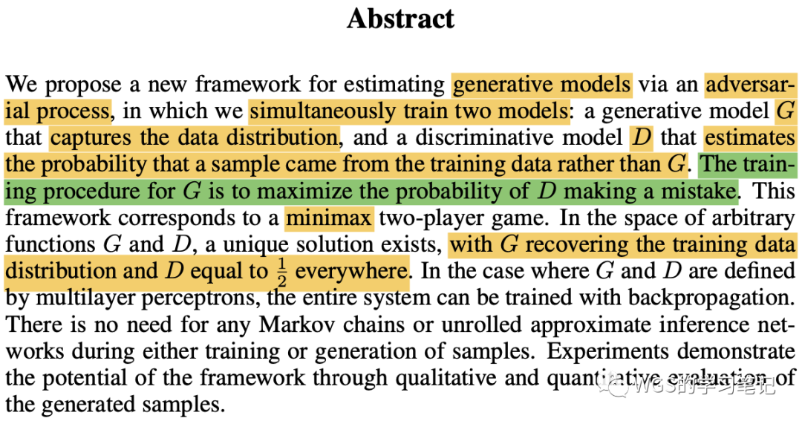


到底什么是GAN？


首先作者提出一个新的framework，通过一个**对抗过程**来估计一个生成模型。

同时会训练两个模型：

- 第一个模型叫做 <mark>**生成模型G**</mark>，用来捕获整个数据的分布，其实就是通过 生成器 去拟合和逼近真实的数据分布；
- 第二个是 <mark>**辨别模型D**</mark>，它是用来估计一个样本是来自真正的数据、还是来自于**G**生成的。


这里稍微解释一下：**生成模型** 它就是对整个数据的分布进行建模，使得能够生成各种分布。这里“分布”是一个很一般化的词，比如生成图片、生成文本、生成视频等。在统计学眼里，整个世界是通过采样不同的分布来得到的，所以想要生成东西，目的就是要抓住整个数据的一个分布。


生成模型的任务是尽量的想**让辨别模型犯错**，这个过程是一个**最大最小的博弈**。在任何函数空间的**G**和**D**里面，存在一个独一无二的解，这个解是代表：**G**能够找出训练数据的真实分布（生成的数据分布趋向于真实数据分布），此时辨别器就判别不出来了，所以概率值为$\frac{1}{2}$。

如果**G**和**D**是一个MLP的话，那么整个系统就可以通过误差反向传播来进行训练。作者说这里不需要使用任何的马尔科夫链，或者说是对一个近似的推理过程展开（说白了意思好像就是和别人的方法比比较简单一点），最后就是说实验的效果非常好。

## 五、原文的例子
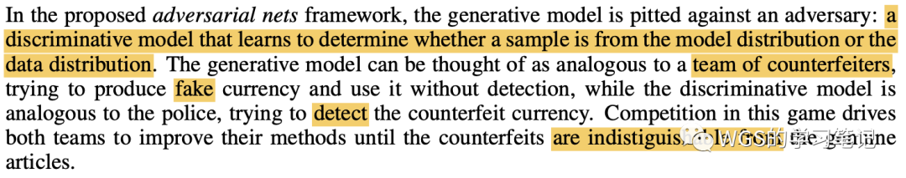

在对抗网络的框架里有两类模型：一个是<mark>**生成模型**</mark>、一个是<mark>**判别模型**</mark>：

- 生成模型比喻成造假的人，它要去产生假币；
- 判别模型比喻成警察，警察的任务就是很好的鉴别假币和真币；

造假者和警察会不断的学习，造假者会提升自己的造假技能，警察也会提升自己判别真币和假币的性能。最后希望造假者能够赢，就是说造的假钱和真钱一模一样，然后警察没有能力去区分真币和假币，那么这个时候就可以使用生成器生成和真实数据一样的数据了。

## 六、GAN模型结构 & 训练GAN的目的

摘要说的已经很清楚了，GAN由两部分组成：
 - 生成器G（Generator）；
 - 判别器D（Discriminator）；

我们的最终目的是希望生成器**G**，能够学习到样本的真实分布$P_{\text{data}}(x)$，那么就能生成之前不存在的、但是却又很真实的样本。

那再啰嗦的说明白一点就是：

- 我们把随机向量（随机噪声）定义为 $z$，$z \in F$，可以是任意分布，比如正态分布、均匀分布。
- 将随机噪声输入到 **生成器G** 中，**G**其实看成一个函数就可以，它可以是任意的一个神经网络，因为神经网络可以逼近任何形式的函数。
- 随机噪声 $z$ 经过**生成器G**后会产生一个 $G(z)$，生成的这个新的向量 $G(z)$，它可以记为服从$P_G(x)$。但是$P_G(x)$这个分布不是我们想要的，我们想要的是**生成器G**生成一个满足于真实分布$P_{\text{data}}(x)$的数据。
- 通过不断的训练迭代，更新调整生成器G的参数，使得$P_G(x)$近似于 $P_{\text{data}}(x)$。

通过调整 **生成器G** 的参数，使得它生成的分布和真实的分布尽可能的像，这个就是最终要达到的目的，可以通过 生成器G 生成一些满足真实分布，但又不是真实存在的数据。

我们以手写数字识别为例，图例如下：

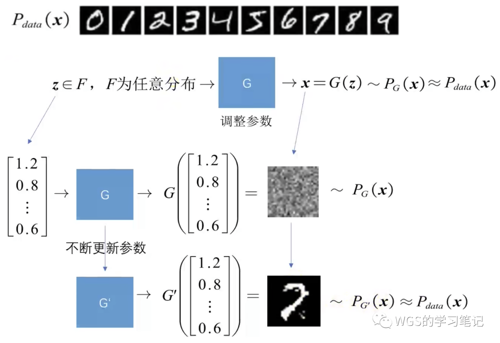

GAN模型结构图如下示例：

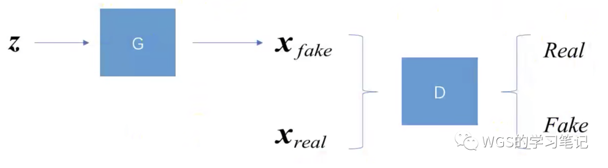

- 我们将随机噪声输入到**生成器G**中，产生 $G(z)$，我们把它叫做$x_{\text{fake}}$，$x_{\text{fake}}$为生成的图片，就是假的图片；
- 我们还有满足于真实分布$P_{\text{data}}(x)$的数据，记为$x_{\text{real}}$；
- 我们把 $x_{\text{real}}$ 和 $x_{\text{fake}}$ 同时送到**判别器D**中去训练，做一个二分类任务，判断是真还是假；

## 七、举例理解GAN的原理


因为原文举的例子比较敏感，我们以李宏毅老师的例子（中央电视台鉴宝节目：一槌定音）来进行GAN原理的阐述。


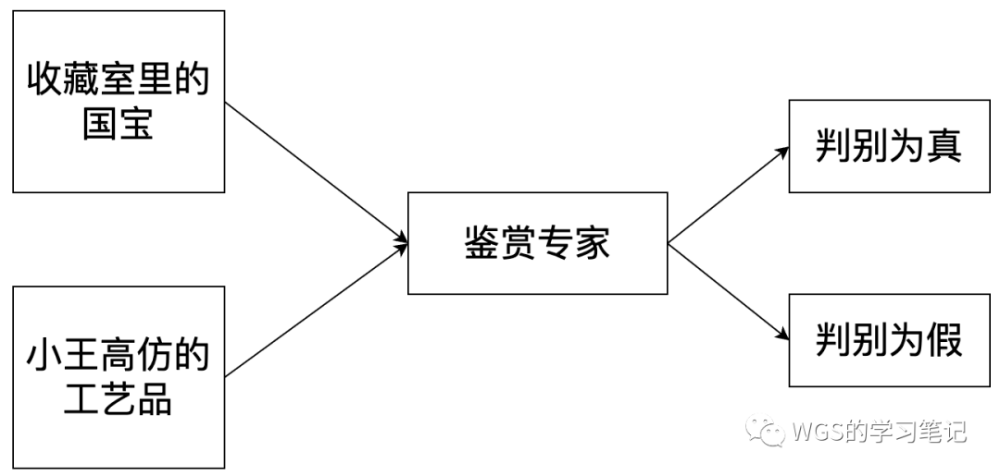

假设现在有一个人，我们称它为小王，小王是一个收藏家，它的收藏室里收藏了很多“国宝”。但是小王不想只做一个收藏家，他还想高仿这些“国宝”，我们这里将高仿的赝品定义为“工艺品”。

基于GAN的目标，我们知道：

 - 小王最终想成为一个水平很高的“工艺品大师”；

但是如果想成为一个“工艺品”方面的专家，小王自己在家闭门造车肯定是行不通的，因为我们的总目标是想让小王成为一个高水平的、可以以假乱真的工艺品大师。为了达到这个目标，首先需要一个高水平的鉴赏专家（高水平的对手），其次小王本身就要是个高水平的工艺品大师。所以小王还需要找一个水平很高的国宝鉴赏专家。鉴赏专家负责辨别出真的“国宝”和小王的“工艺品”，小王负责高仿生产“工艺品”。

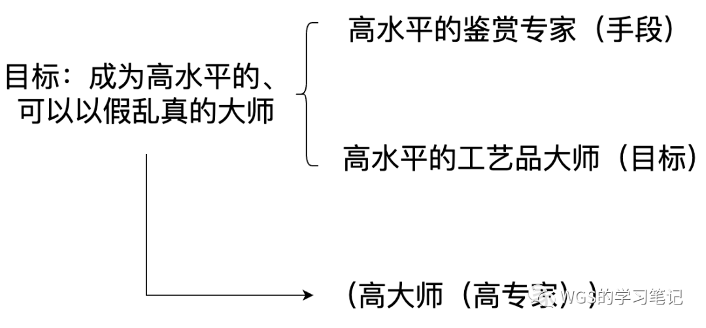

概述来说：**小王需要先有一个高水平的专家，然后才可能成为一个高水平的大师。高水平的专家可以看成一种手段，成为高水平的大师才是我们的目标。**

## 八、数学描述

### 8.1 相关符号

基于上述鉴宝例子，我们来看一下GAN的数学描述，首先需要强调的是：

- 工艺品经过鉴赏专家判断后，是会受到一个 feedback 的；
- 对于鉴赏专家而言，它也会从工艺品受到一个 feedback ，当然这是潜在的；

我们就来看一下，这个例子如何用数学符号去表示：

- "国宝"是静态的，它相当于我们的真实样本 $\{x_{\text{real}_i}\}^N_{i=1}$ ，这里我们以 $P_{data}$ 表示；
- 工艺品也是从一个概率分布里抽样出来的，我们将工艺品记作 $\{x_{\text{fake}_i}\}^N_{i=1}$ ，我们把这个概率分布称作 $P_g(x;\theta_{g})$，g就代表Generator的意思；

  
  注意我们并不直接对 $P_g$ 建模，即不直接对生成模型本身进行建模，我们用一个神经网络去逼近这个分布，纯粹的神经网络它是不具备随机性的，所以我们会假设它有一个 $z$，就是前面提到的随机噪声，是来自于一个简单的分布，比如高斯分布： $z \sim P_Z(z)$ ；
  

- 原始的GAN里，神经网络就用NN表示，它本身就是一个确定性变换，即是一个复杂函数，表示为 $G(z;\theta_{g})$；

  
  $\theta_g$ 在NN里就是表示权重参数，在 $P_g$ 里就是代表概率分布参数。
  

- 鉴赏专家也可以看成一个概率分布，我们也用一个NN来描述它：$D(x; \theta_{d})$，代表 $x$ 是国宝的概率

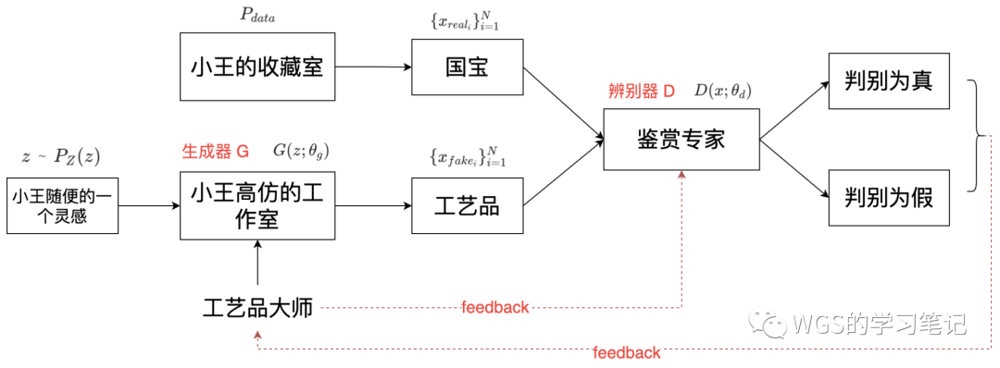

对于鉴赏专家 **(判别器D)** 接收到的来说：

- 可以是来自国宝、也可以是来自于工艺品，是无所谓的，重要的是本身是代表是国宝的概率。

对于判别器D的输出来说：

- $D(x)$ 的值越趋近于1，说明它是国宝的概率就越大；越趋近于0，说明它是工艺品的概率就越大。

上图又可简化为：

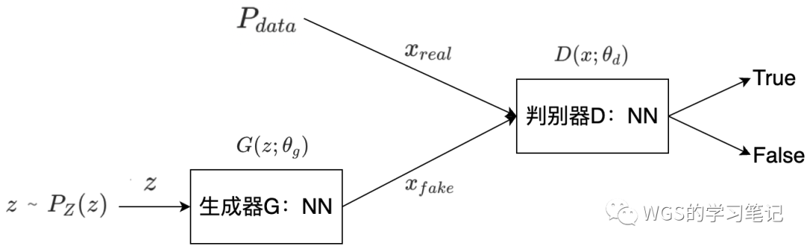

一方面是从 $P_{data}$ 里来，一方面是 $z$ 输入到生成器后的输出，$z$ 为噪声。

 
  换句话说, $z$ 是从简单分布中采样，经过生成器后变成 $x$，此时生成的由的先验分布和生成器共同决定。
  

### 8.2、“高专家”的目标函数

符号描述表述清楚后，我们看一下GAN的目标函数，首先回顾一下GAN的目标：<u>成为一个高水平的、可以以假乱真的大师</u>。为了达到这个目标，我们又可以分为一个手段和一个目标：

- 手段：**需要一个高水平的鉴别专家**；
- 目标：**成为高水平的工艺品大师**。

也就是说我们需要<u>先成就一个高水平的专家，才有可能成就一个高水平的大师</u>，所以它们的关系是：(高大师(高专家))。

首先看高专家，高专家水平高体现在：国宝判别为真、工艺品判别为假：

$$
高专家：
\begin{equation}
\left\{
\begin{aligned}
%\nonumber
if \ x \ is \ from \ P_{data}, \ then D(x) \uparrow\\
if \ x \ is \ from \ P_{g}, \ then D(x) \downarrow\\
(z \ is \ from \ P_{z}) \\
\end{aligned}
\right.
\end{equation}
$$

为了将式子统一起来，我们改写为：

$$
高专家：
\begin{equation}
\left\{
\begin{aligned}
%\nonumber
if \ x \ is \ from \ P_{data}, \ then D(x) \uparrow\\
if \ x \ is \ from \ P_{g}, \ then \ 1-D(x) \downarrow\\
(z \ is \ from \ P_{z}) \\
\end{aligned}
\right.
\end{equation}
$$


因为 $D(x)$ 是一个概率值分布，范围是0~1， $D(x)$ 偏小， $1-D(x)$ 则相应的就偏大。


对于工艺品，$x$ 是从**生成器G**来的，所以可以表示成 $G(z)$：

$$
高专家：
\begin{equation}
\left\{
\begin{aligned}
%\nonumber
if \ x \ is \ from \ P_{data}, \ then D(x) \uparrow\\
if \ x \ is \ from \ P_{g}, \ then \ 1 - D(G(z)) \uparrow\\
(z \ is \ from \ P_{z}) \\
\end{aligned}
\right.
\end{equation}
$$

为了使目标函数更容易表达，或者说计算更加方便，我们加上，所以进一步表达为：
$$
高专家：
\begin{equation}
\left\{
\begin{aligned}
%\nonumber
if \ x \ is \ from \ P_{data}, \ then \ \log{D(x)} \uparrow\\
if \ x \ is \ from \ P_{g}, \ then \ \log{(1 - D(G(z)))} \uparrow\\
(z \ is \ from \ P_{z}) \\
\end{aligned}
\right.
\end{equation}
$$


$\log$ 为增函数，$\log(x)$ 与 $x$ 的增减性保持一致，在极大化参数的时候，与原始求解是一样的。


所以对于成就一个高专家来说，目标函数如下：

$$\max_{D} E_{x \sim P_{data}}[\log{D(x)}] + E_{z \sim P_{z}}[\log (1 - D(G(z)))]$$


可能有同学不明白为什么原文这里用期望，其实很简单，我们假设数据分布总共有个样本，那么它的期望可以表示为：

$$E_{x \sim P_{data}}[\log(D(x))] = \frac{1}{N} \sum_{i=1}^{N} \log(D(x_i)), x_i \sim P_{data}$$


### 8.3、“高大师”的目标函数

我们再来看高大师的目标函数，**高大师是建立在高专家的水平之上**，对于高大师来讲，希望高专家将所有的工艺品都判断为真：

$$高大师: if \ x \ from \ P_g,\ then \ D(G(z)) \uparrow $$

为了统一起来，我们改写为:

$$高大师: if \ x \ from \ P_g,\ then \ (1 - D(G(z))) \downarrow $$

所以对于高大师来讲，目标函数为:

$$\min_{G} E_{z \sim P_z}[\log (1 - D(G(z)))]$$

### 8.4、总目标函数

本着**先成就 高专家, 再成就 高大师**的原则，GAN的目标函数为：

$$\min_{G} \max_{D} V(D, G) = \mathbb{E_{x\sim p_{data}(x)}}[\log(D(x))] + \mathbb{E_{z\sim p_{z}(z)}}[\log(1 - D(G(z)))]$$


通过目标函数我们也能看出，GAN模型的复杂度，不在于模型的定义，而在于模型的traning，也就是D和G的学习。



还有一点需要强调的是，自始至终我们都没有去直接面对 $P_g$，我们实际上使用一个可微神经网络 $G(z)$ 去逼近这个 $P_g$ ，而且是从采样的角度去逼近，换句话说，对于生成网络 $P_g$，GAN是绕过了它，并没有直接去解决 $P_g$，而是从采样的角度去逼近它。所以GAN又被称做：Implicit Density Model.


公式比较多，所以对目标函数再啰嗦的介绍下：

我们可以得出，它实际上就要对价值函数 $V(D, G)$ 进行min、max的博弈，还有需要注意的是：$D(x)$ 是判别器的输出，它要做二分类，所以经过sigmoid之后 $D(x) \in [0, 1]$；

我们来看一下它是怎么工作的：

- 首先固定住G不动，通过调整D的参数，来最大化价值函数 $V(D, G)$：
  - 要想最大化 $V$ ，左边的 $D(x)$ 要趋近于1（这样才能保证log的值尽可能大），同时要让右边的 $D(G(z))$ 趋近于0（这样才能保证 $log(1-D(G(z)))$ 尽可能大）；
  - $\max V(D, G)$ 其实就是把真实数据和假数据区分的一个过程.
  $$\min_{G} \max_{D} V(D, G) = \mathbb{E_{x\sim p_{data}(x)}}[\log(D(x))] + \mathbb{E_{z\sim p_{z}(z)}}[\log(1 - D(G(z)))]$$
- 然后固定住D不动，此时公式的左部分已经是个定值了，我们**调整G的参数**，来最小化价值函数 $V(D, G)$：
  - 要让 $V(D, G)$ 最小，那么就要让 $D(G(z))$ 趋近于1，只有 $V(G(z))$ 趋近于1的时候，定义域里的值才能趋近于0，也就是log会变得越来越小，达到最小化 $V$ 的过程；
  - 这个过程就是想让 $D(G(z))$ 趋近于1，z满足生成数据的分布，它是假的，那么 $min_G$ 的过程就是想要调整生成器，来骗过判别器，从而**使得假数据被判别为真**。
  $$\min_{G} \max_{D} V(D, G) = \mathbb{E_{x\sim p_{data}(x)}}[\log(D(x))] + \mathbb{E_{z\sim p_{z}(z)}}[\log(1 - D(G(z)))]$$

总结如下：

- 固定G, 调整D, 最大化 $V(D, G)$, 导致 $D(x) \rightarrow 1, D(G(z)) \rightarrow 0$
- 固定D, 调整G, 最小化 $\max_{D}V(D, G)$, 导致 $D(G(z)) \rightarrow 1$

想必肯定有同学会发现这里出现的一个矛盾：上面的趋近于0，下面的趋近于1，这个矛盾、冲突，就理解为GAN中的**对抗**的意思。

## 九、全局最优解推导

因为公式多、篇幅长，所以在推导最优解之前，我们先回顾一下GAN里的三个角色：

- 真实样本分布$P_{data}$；
- **生成器 Generator** 对应概率分布为:$P_g$，即代表生成器生成数据的概率分布；
- **判别器 Discriminator** 对应的条件概率分布是离散的，就是0-1分布（伯努利分布），给定x的情况下，1代表正品、0代表工艺品（赝品）；

我们的最终目标，就**是想让生成器生成的样本的概率分布$P_g$无限的接近于$P_{data}$**，即：$P_g \rightarrow P_{data}$；


我们常规的生成模型（不是GAN），是直接对$P_g$进行建模: $P_g \rightarrow \theta_{g}$, 极大似然估计表示如下：

$$\theta_g = \argmax_{\theta_g} \sum_{i=1}^N \log{P_g}(x_i) = \argmin KL(P_{data} || P_g)$$

从距离的角度讲，是最小化KL散度，最终想让$P_{data} = P_g$，这就是原先如何把参数求出来的策略。


### 9.1、关于 D 的最大值

GAN从**对抗学习**的角度去构造目标函数，我们上面构造的目标函数，只是从逻辑上觉得它没有问题，那么我们可能会考虑：

- 这个最大最小问题，它的最优解存在不存在？
- 如果最优解 $P_g$（就是G）存在，那么全局最优的情况下，$P_g$是否等于$P_{data}$？

如果这个不成立的话，那么其实这个目标函数是没有意义的，我们来看一下，方便记作，直接用论文中的符号来描述：

我们记：

$$V(D, G) = \mathbb{E}_{x\sim p_{data}(x)}[\log{D(x)}] + \mathbb{E}_{z\sim p_{z}}[\log{1 - D(G(z))}]$$

我们先求max，根据期望的定义：$E_{x \sim P(x)} = \int_x p(x)f(x)dx$，将其展为积分的形式：

$\quad For \quad fixed \quad G, 求： \max_D(V(D, G))$
$$
\begin{align}
\max_D V(D, G) &= \int P_{data} \cdot \log D dx + \int P_g \cdot \log (1 - D) dx \\
&= \int {[P_{data} \cdot \log D + P_g \cdot \log(1 - D)]} dx
\end{align}
$$


这里两个积分中的x确实是不同的变量，但是积分微元的符号可以做任意变换，不用纠结这里。


我们要求里面函数关于x积分的最大值，那么就看一下它的导数：

$$
\begin{align}
\frac{\partial}{\partial{D}}(\max V(D, G)) &= \frac{\partial}{\partial D}\int {[P_{data} \cdot \log D + P_g \cdot \log(1 - D)]} \\
&= \int \frac{\partial}{\partial D} {[P_{data} \cdot \log D + P_g \cdot \log(1 - D)]} \\
&= \int {[P_{data} \cdot \frac{1}{D} + P_g \cdot \frac{-1}{\log(1 - D)}]} \Longleftrightarrow 0\\
\end{align}
$$


因为积分是对x积的，求导是对D求的，两者互不干扰可以交换词序。

最优的时候导数为0。


$$\therefore P_{data} \cdot \frac{1}{D} = P_g \cdot \frac{1}{1-D}$$

所以当固定G时，最优的D为:

$$D^*_G = \frac{P_{data}}{P_{data} + P_g}$$

### 9.2 关于 G 的最小值

最大值求出来之后，我们再来看关于G的最小值，我们将$D^*$带进去：

$$
\begin{align}
\min_G \max_D V(D, G) &= \min_G V(D^*_G, G) \\
&= \min_G E_{x \sim P_{data}}[\log(\frac{P_{data}}{P_{data} + P_g})] + E_{x \sim P_{g}}[\log(1 - \frac{P_{data}}{P_{data} + P_g})] \\
&= \min_G E_{x \sim P_{data}}[\log(\frac{P_{data}}{P_{data} + P_g})] + E_{x \sim P_{g}}[\log(\frac{P_{g}}{P_{data} + P_g})]\\
\end{align}
$$

这里 $P_{data}$ 和 $P_g$，和KL散度的定义非常类似，KL divergence定义：

$$KL(P||Q) = E_{x \sim P}[\log(\frac{P(x)}{Q(x)})]$$

但是我们不能直接这么写，我们需要保证分子和分母必须同时为两个概率分布，但是分母是$P_{data} + P_g$，是两个概率分布相加，那它的取值就变成[0, 2]了。

所以我们给它再除以个2就可以了，取值范围就又变成[0, 1]了。换句话说，可以把它看成概率密度函数，具体什么样子无所谓，它的取值在[0, 1]之间，并且是连续的。

$$
\begin{align}
\min_G \max_D V(D, G) &= \min_G V(D^*_G, G) \\
&= \min_G E_{x \sim P_{data}}[\log(\frac{P_{data}}{P_{data} + P_g})] + E_{x \sim P_{g}}[\log(1 - \frac{P_{data}}{P_{data} + P_g})] \\
&= \min_G E_{x \sim P_{data}}[\log(\frac{P_{data}}{P_{data} + P_g})] + E_{x \sim P_{g}}[\log(\frac{P_{g}}{P_{data} + P_g})]\\
&= \min_G E_{x \sim P_{data}}[\log(\frac{P_{data}}{(P_{data} + P_g)/2} \cdot\frac{1}{2})] + E_{x \sim P_{g}}[\log(\frac{P_{g}}{(P_{data} + P_g)/2}\cdot\frac{1}{2})]\\
&= \min_{G} KL (P_{data} || \frac{P_{data} + P_g}{2}) + KL (P_{g} || \frac{P_{data} + P_g}{2}) - \log4\\
\end{align}
$$



将两个$\log(\frac{1}{2})$拿出去，$\log(\frac{1}{2}) = \log1 - \log2 = -\log2,$，$-\log2$的期望就是它自己，两个就是$-\log2-\log2 = -\log4$


我们得出上式，发现它又满足 JS divergence 的定义：

$$JSD(P||Q) = \frac{1}{2} KL(P || M) + \frac{1}{2} KL (Q||M), 其中 M = \frac{P + Q}{2}$$

所以上式又可写成：

$$\min_G - \log 4 + 2 JSP(P_{data}||P_g)$$

JS divergence是衡量两个分布之间的距离，所以只有当这两个分布越来越相等的时候，就找到这个式子的最小值了，故：

当$P_g(x) = P_{data}(x)$时，上式可得最小值。

所以我们只需要优化：

$$\min_G\max_D V(D, G) = \mathbb{E}_{x\sim{p_{data}(x)}}[\log D(x)] + \mathbb{E}_{z\sim{p_{z}(z)}}[1 - \log D(G(z))]$$

就可以得到$P_g(x) = P_{data}(x)$.


另外，当 $P_g(x) = P_{data}(x)$ 时，又因为 $D^*_G = \frac{P_{data}}{P_{data} + P_g}$， 所以此时 $D^* = \frac{1}{2}$ 。意思是，在最优的情况下，鉴赏专家已经没有分辨真假的能力了，概率都0.5，这个时候判别器对于生成器而言，已经没有继续学习的必要了。


## 十、原文给出的训练步骤

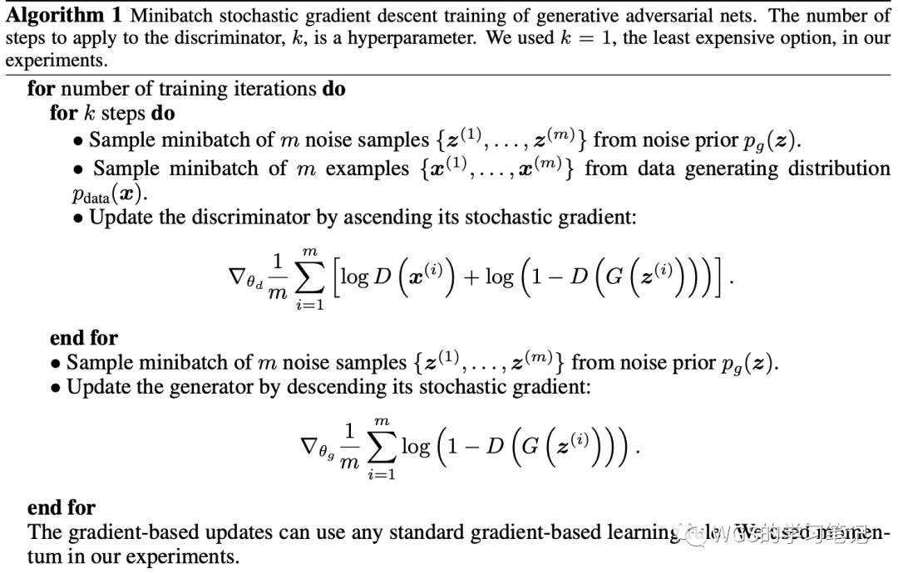

- 在每一个step里先采样m个噪音样本；
- 再采样m个来自于真实数据的样本；这样就组成了一个大小为2m的小批量；
- 将样本分别放到 **生成器** 和 **辨别器** 去求梯度，更新 **辨别器** 参数；

做完之后：

- 再采样m个噪音样本，放到公式的第二项里面（因为我们要**更新生成器**，生成器与第一项无关），算出它的梯度；
- 然后对生成器进行参数更新。

这样就完成了一次迭代，可以看到每次迭代里，我们是**先更新辨别器，再更新生成器**。


k是一个超参数，不能太小也不能太大，要保证辨别器有足够的更新，但也不要更新太好了。如果没有足够好的更新，就是生成器变换了之后，没有把辨别器更新的足够好，

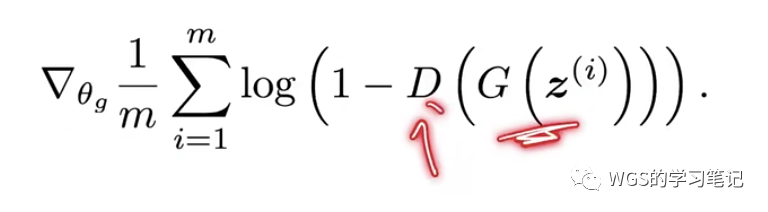
G已经做了变化，但是D没有做什么改变，再更新G来糊弄D，其实意义不大。

反过来讲，如果一更新就把D训练到完美，那么1-D就会变成0，对一个0的东西求导，那么就会在生成模型上更新有困难。

回到原文的例子，辨别器是警察，生成器就是造假者，假设警察特别厉害，造假者产一点假钞出来就被连锅端了，那造假者就没能力改进和提升自己了，但反过来讲，如果警察无力，造假者随便造点东西，警察也看不出来，那造假者就不会有动力去改进和提升自己。

所以最好是两者实力相当、相爱相杀，大家一起进步。所以k的调参，要使得D的更新和G的更新进度都差不多。


## 十一、GAN原理及训练过程总结

### 11.1、GAN原理总结

GAN主要包括了两部分：

- <mark>生成器（Generator）</mark>：生成器主要用来学习真实数据的分布，从而让自身生成的数据更加真实，骗过判别器；
- <mark>判别器（Discriminator）</mark>：判别器则需要对接受的数据进行真假判断。

在训练过程中，生成器努力地让生成的数据更加真实，而判别器则努力地去识别出数据的真假，这个过程相当于一个二人博弈，随着时间的推移，生成器和判别器在不断的进行对抗，这就是它对抗的含义。

最终两个网络达到了一个动态均衡：生成器生成的数据接近于真实数据分布，而判别器识别不出真假数据，对于给定数据的预测为真的概率基本接近0.5（相当于随机猜测类别）。

GAN设计的关键在于损失函数的处理：
- 对于判别模型，损失函数是容易定义的，判断一张图片是真实的还是生成的，显然是一个二分类问题。
- 对于生成模型，损失函数的定义就不是那么容易，我们希望生成器可以生成接近于真实的图片，对于生成的图片是否像真实的，我们人类肉眼容易判断，但具体到代码中，是一个抽象的，难以数学公里化定义的范式。

针对这个问题，我们不妨把生成模型的输出，交给判别模型处理，让判别器判断这是一个真实的图像还是假的图像，因为深度学习模型很适合做分类，这样就将生成器和判别器紧密地联合在了一起。


假如我们直接用生成器训练，它的训练结果并不会得到一个真实的图像，而会得到一个比较模糊的图像，因为我们无法构建一个合适的损失去判断它是否像真实图片，所以它会将所有训练样本做平均，产生一个比较糊的图片。这就是为什么要将生成器的样本交给判别器来构建损失。


### 11.2、GAN算法流程总结

- $G$ 是一个生成图片的网络，它接收一个随机的噪声z，通过这个噪声生成图片$G(z)$，记作；
- $D$ 是一个判别网络，判别一张图片是不是“真实的”，它的输入参数是x，x代表一张图片，输出$D(x)$，代表x为真实图片的概率，如果为1，就代表100%是真实的图片，输出为0，就代表不是真实图片。

在训练过程中，将随机噪声输入生成网络G，得到生成的图片；判别器接受生成的图片和真实的图片，并尽量将两者区分开来。在这个计算过程中，能否正确区分生成的图片和真实的图片将作为判别器的损失；而能否生成近似真实的图片、并使得判别器将生成的图片判定为真，将作为生成器的损失。

生成器的损失是通过判别器的输出来计算的，而判别器的输出是一个概率值，我们可以通过交叉熵来计算。

## 十二、torch复现
https://wangguisen.blog.csdn.net/article/details/127820071
ref: 
[1]. https://arxiv.org/abs/1406.2661 
[2]. https://www.bilibili.com/video/BV1eE411g7xc 
[3]. https://www.bilibili.com/video/BV1rb4y187vD 
[4]. https://www.bilibili.com/video/BV1HD4y1S7Pe 

---

> 作者: [Jian YE](https://github.com/jianye0428)  
> URL: https://jianye0428.github.io/posts/gan_1/  

