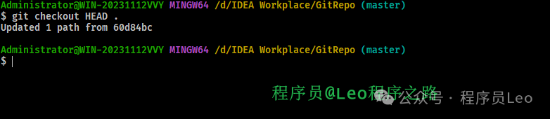

# Git 核心知识点总结


# Git核心知识总结

<br>
<center>
  
  <br>
  <div style="color:orange; border-bottom: 1px solid #d9d9d9; display: inline-block; color: #999; padding: 2px;">Git 总览</div>
</center>
<br>

## 1.什么是Git

在了解Git之前，我们先了解一下版本控制这个概念。

### 1.1 什么是版本控制

版本控制是一种记录一个或若干文件内容变化，以便将来查阅特定版本修订情况的系统。 除了项目源代码，你可以对任何类型的文件进行版本控制。

### 1.2 为什么需要版本控制

有了它你就可以将某个文件回溯到之前的状态，甚至将整个项目都回退到过去某个时间点的状态，你可以比较文件的变化细节，查出最后是谁修改了哪个地方，从而找出导致项目问题出现的原因，又是谁在何时报告了某个功能缺陷等等。

### 1.3 本地版本控制系统

许多人习惯用复制整个项目目录的方式来保存不同的版本，或许还会改名加上备份时间以示区别。 这么做唯一的好处就是简单，但是特别容易犯错。 有时候会混淆所在的工作目录，一不小心会写错文件或者覆盖意想外的文件。

为了解决这个问题，人们很久以前就开发了许多种本地版本控制系统，大多都是采用某种简单的数据库来记录文件的历次更新差异。

Git是当前最先进、最主流的分布式版本控制系统，免费、开源！核心能力就是版本控制。再具体一点，就是面向代码文件的版本控制，代码的任何修改历史都会被记录管理起来，意味着可以恢复到到以前的任意时刻状态。支持跨区域多人协作编辑，是团队项目开发的必备基础，所以Git也就成了程序员的必备技能。

<br>
<center>
  
  <br>
  <div style="color:orange; border-bottom: 1px solid #d9d9d9; display: inline-block; color: #999; padding: 2px;">本地版本控制系统</div>
</center>
<br>

## 2.Git的来源

Git是一种分布式版本控制系统，它的设计和开发最初由林纳斯·托瓦兹（Linus Torvalds）领导，他也是Linux操作系统的创始人。Git的开发始于2005年，其背景和初始目的与Linux开发社区的需求密切相关。

### 2.1 背景和初始动机

在Git之前，Linux内核的开发使用的是一个名为BitKeeper的商业版本控制系统。这个系统对Linux社区是免费的，但在2005年，由于一些争议和许可问题，Linux社区失去了对BitKeeper的免费许可。这促使托瓦兹寻找一个新的工具来管理Linux内核的开发。

托瓦兹对版本控制系统有几个明确的需求和目标：

1. **「性能」**：由于Linux内核的庞大和复杂性，性能成为一个关键因素。Git需要高效地处理大型项目。
2. **「分布式架构」**：Git被设计为分布式系统，意味着每个开发者的计算机上都有整个代码库的完整历史记录，这样可以减少对中央服务器的依赖。
3. **「数据完整性」**：Git强调数据的完整性。它通过对文件内容和目录结构使用SHA-1哈希来确保代码历史不被篡改。
4. **「简单的分支和合并」**：在Linux开发中，分支和合并操作非常频繁。Git被设计为使这些操作尽可能简单和高效。

### 2.2 Git的发展

Git最初是作为一个命令行工具发布的，但随着时间的推移，围绕Git开发了大量的图形界面工具和增强功能，使其更加用户友好。Git迅速在开源社区中获得了广泛的接受，并逐渐成为世界上最流行的版本控制系统。

### 2.3 GitHub和Git的普及

Git的普及也与GitHub这样的平台紧密相关。GitHub是一个基于Web的Git版本库托管服务，它提供了图形界面，并增加了如分叉、拉取请求和社交网络功能等特性，这些都极大地促进了Git的普及和开源文化的发展。

## 3.Git的特点

开源免费，使用广泛。

- 强大的文档（代码）的历史版本管理，直接记录完整快照（完整内容，而非差异），支持回滚、对比。
- 分布式多人协作的的代码协同开发，几乎所有操作都是本地执行的，支持代码合并、代码同步。
- 简单易用的分支管理，支持高效的创建分支、合并分支。

## 4.Git的基本概念

### 4.1 概念汇总

| 概念名称                            | 描述                                                         |
| :---------------------------------- | :----------------------------------------------------------- |
| 工作区（Workspace）                 | 就是在电脑里能看到的代码库目录，是我们搬砖的地方，新增、修改的文件会提交到暂存区 |
| 暂存区（stage 或 index）            | 用于临时存放文件的修改，实际上上它只是一个文件（.git/index），保存待提交的文件列表信息。 |
| 版本库/仓库（Repository）           | Git的管理仓库，管理版本的数据库，记录文件/目录状态的地方，所有内容的修改记录（版本）都在这里。 |
| 服务端/远程仓库（origin 或 remote） | 服务端的版本库，专用的Git服务器，为多人共享提供服务，承担中心服务器的角色。本地版本库通过push指令把代码推送到服务端版本库。 |
| 本地仓库                            | 用户机器上直接使用的版本库                                   |
| 分支（Branch）                      | 分支是从主线分离出去的“副本”，可以独立操作而互不干扰，仓库初始化就有一个默认主分支master。 |
| 头（HEAD）                          | HEAD类似一个“指针”，指向当前活动分支的最新版本。             |
| 提交（Commit）                      | 把暂存区的所有变更的内容提交到当前仓库的活动分支。           |
| 推送（Push）                        | 将本地仓库的版本推送到服务端（远程）仓库，与他人共享。       |
| 拉取（Pull）                        | 从服务端（远程）仓库获取更新到本地仓库，获取他人共享的更新。 |
| 获取（Fetch）                       | 从服务端（远程）仓库更新，作用同拉取（Pull），区别是不会自动合并。 |
| 冲突（Conflict）                    | 多人对同一文件的工作副本进行更改，并将这些更改合并到仓库时就会面临冲突，需要人工合并处理。 |
| 合并（Merge）                       | 对有冲突的文件进行合并操作，Git会自动合并变更内容，无法自动处理的冲突内容会提示人工处理。 |
| 标签（Tags）                        | 标签指的是某个分支某个特定时间点的状态，可以理解为提交记录的别名，常用来标记版本。 |
| master（或main）                    | 仓库的“master”分支，默认的主分支，初始化仓库就有了。Github上创建的仓库默认名字为“main” |
| origin/master                       | 表示远程仓库（origin）的“master”分支                         |
| origin/HEAD                         | 表示远程仓库（origin）的最新提交的位置，一般情况等于“origin/master” |

### 4.2 工作区/暂存区/仓库

工作区（Workspace）就是在电脑里能看到的代码库目录，是我们搬砖的地方，新增、修改的文件会提交到暂存区。

- 在这里新增文件、修改文件内容，或删除文件。

暂存区（stage或index）用于临时存放文件的修改，实际上上它只是一个文件（.git/index），保存待提交的文件列表信息。

- 用git add 命令将工作区的修改保存到暂存区。

版本库/仓库（Repository仓库）Git的管理仓库，管理版本的数据库，记录文件/目录状态的地方，所有内容的修改记录（版本）都在这里。就是工作区目录下的隐藏文件夹.git，包含暂存区、分支、历史记录等信息。

- 用git commit 命令将暂存区的内容正式提交到版本库。
- master 为仓库的默认分支master，HEAD是一个“指针”指向当前分支的最新提交，默认指向最新的master。

### 4.3 Git的基本流程

Git的工作流程核心就下面几个步骤。

1. 准备仓库：创建或从服务端克隆一个仓库。
2. 编写代码：在工作目录中添加、修改代码。
3. 暂存（git add）：将需要进行版本管理的文件放入暂存区域。
4. 提交（git commit）：将暂存区域的文件提交到Git仓库。
5. 推送（git push）：将本地仓库推送到远程仓库，同步版本库。
6. 获取更新（fetch/pull）：从服务端更新到本地，获取他人推送的更新，与他人协作、共享。

<br>
<center>
  
  <br>
  <div style="color:orange; border-bottom: 1px solid #d9d9d9; display: inline-block; color: #999; padding: 2px;">Git 工作 流程</div>
</center>
<br>

- `git commit -a` 指令省略了add到暂存区的步骤，直接提交工作区的修改内容到版本库，不包括新增的文件。
- `git fetch`、`git pull` 都是从远程服务端获取最新记录，区别是git pull多了一个步骤，就是自动合并更新工作区。
- `git checkout .` 、`git checkout [file]` 会清除工作区中未添加到暂存区的修改，用暂存区内容替换工作区。
- `git checkout HEAD .`、 `git checkout HEAD [file]` 会清除工作区、暂存区的修改，用HEAD指向的当前分支最新版本替换暂存区、工作区。
- `git diff` 用来对比不同部分之间的区别，如暂存区、工作区，最新版本与未提交内容，不同版本之间等。
- `git reset` 是专门用来撤销修改、回退版本的指令，替代上面checkout的撤销功能。

**「基本的 Git 工作流程如下：」**

1. 在工作目录中修改文件。
2. 暂存文件，将文件的快照放入暂存区域。
3. 提交更新，找到暂存区域的文件，将快照永久性存储到 Git 仓库目录。

### 4.4 Git的状态

Git在执行提交的时候，不是直接将工作区的修改保存到仓库，而是将暂存区域的修改保存到仓库。要提交文件，首先需要把文件加入到暂存区域中。因此，Git管理的文件有三（+2）种状态：

- **「未跟踪(untracked)：」** 新添加的文件，或被移除跟踪的文件，未建立跟踪，通过git add添加暂存并建立跟踪。
- **「未修改：」** 从仓库签出的文件默认状态，修改后就是“已修改”状态了。
- **「已修改(modified)：」** 文件被修改后的状态。
- **「已暂存(staged)：」** 修改、新增的文件添加到暂存区后的状态。
- **「已提交(committed)：」** 从暂存区提交到版本库。

## 5.Git的安装

Git官网：https://www.git-scm.com/ 下载安装包进行安装。Git的使用有两种方式：

- **「命令行」**：Git的命令通过系统命令行工具，或Git提供的命令行工具运行（`C:\Program Files\Git\git-bash.exe`）
- **「GUI工具」**：Windows(GUI)、Mac(GUI)工具，需单独安装，使用更简单、更易上手。

**「下一步傻瓜式安装即可。」**

指令`git --version`查看安装版本号

```
$ git --version
git version 2.39.2.windows.1
```

## 6.Git快速入门

### 6.1 创建仓库

创建仓库的方式有两种。

1. 一种是创建全新的仓库，基于`git init`命令来，会在当前目录初始化创建仓库。
2. 一种是通过`git clone + 仓库地址`的方式，一般叫做克隆远程仓库。

首先准备一个本地的工作目录：GitRepo

<br>
<center>
  
  <br>
  <div style="color:orange; border-bottom: 1px solid #d9d9d9; display: inline-block; color: #999; padding: 2px;">新建本地仓库</div>
</center>
<br>
然后gitbash打开，初始化为git仓库。

```
$ git init
Initialized empty Git repository in D:/IDEA Workplace/GitRepo/.git/
```

创建完多出了一个被隐藏的`.git`目录，这就是本地仓库Git的工作目录。

<br>
<center>
  
  <br>
  <div style="color:orange; border-bottom: 1px solid #d9d9d9; display: inline-block; color: #999; padding: 2px;">生成.git文件夹</div>
</center>
<br>

克隆远程仓库，如在gitee上创建的仓库 `https://gitee.com/gaoziman/vue3-doc.git`

通过以下命令进行克隆：

```shell
git clone https://gitee.com/gaoziman/vue3-doc.git
```

<br>
<center>
  
  <br>
  <div style="color:orange; border-bottom: 1px solid #d9d9d9; display: inline-block; color: #999; padding: 2px;">拉取远程代码</div>
</center>
<br>

可以看到远程仓库就出现在我们的本地工作空间

<br>
<center>
  
  <br>
  <div style="color:orange; border-bottom: 1px solid #d9d9d9; display: inline-block; color: #999; padding: 2px;">远程代码出现在本地仓库</div>
</center>
<br>

### 6.2 暂存区add

`git add`命令就是把要提交的所有修改放到 **「暂存区（Stage）」**，然后，执行`git commit`就可以一次性把暂存区的所有修改提交到仓库。

| **「指令」**            | **「描述」**                                           |
| :---------------------- | :----------------------------------------------------- |
| git add [file1] [file2] | 添加文件到暂存区，包括修改的文件、新增的文件           |
| git add [dir]           | 同上，添加目录到暂存区，包括子目录                     |
| git add .               | 同上，添加**「所有」**修改、新增文件（未跟踪）到暂存区 |
| git rm [file]           | 删除工作区文件，并且将这次删除放入暂存区               |

```shell
# 查看仓库状态
$ git status
On branch master
Your branch is up to date with 'origin/master'.

Changes not staged for commit:
  (use "git add <file>..." to update what will be committed)
  (use "git restore <file>..." to discard changes in working directory)
        modified:   Nodejs.md

no changes added to commit (use "git add" and/or "git commit -a")

Administrator@WIN-20231112VVY MINGW64 /d/IDEA Workplace/GitRepo/vue3-doc/01-环境 (master)
# 添加到指定文件到暂存区
$ git add Nodejs.md

Administrator@WIN-20231112VVY MINGW64 /d/IDEA Workplace/GitRepo/vue3-doc/01-环境 (master)
# 继续查看仓库状态
$ git status
On branch master
Your branch is up to date with 'origin/master'.

Changes to be committed:
  (use "git restore --staged <file>..." to unstage)
        modified:   Nodejs.md
```

修改之后通过 `git add 文件名` 即可把文件提交至暂存区

<br>
<center>
  
  <br>
  <div style="color:orange; border-bottom: 1px solid #d9d9d9; display: inline-block; color: #999; padding: 2px;">把文件提交至暂存区</div>
</center>
<br>

### 6.3 commit提交

`git commit`提交是以时间顺序排列被保存到数据库中的，就如游戏关卡一样，每一次提交（commit）就会产生一条记录：`id + 描述 + 快照内容`。

- **「commit id」**：根据修改的文件内容采用摘要算法（SHA1）计算出不重复的40位字符，这么长是因为Git是分布式的，要保证唯一性、完整性，一般本地指令中可以只用前几位（6）。即使多年以后，依然可通过`id`找到曾经的任何内容和变动，再也不用担心丢失了。
- **「描述」**：针对本次提交的描述说明，建议**「准确」**填写，就跟代码中的注释一样，很重要。
- **「快照」**：就是完整的版本文件，以对象树的结构存在仓库下`\.git\objects`目录里，这也是Git效率高的秘诀之一。

我们可以通过 `git reflog` 查看所有的提交记录包括回退记录。

<br>
<center>
  
  <br>
  <div style="color:orange; border-bottom: 1px solid #d9d9d9; display: inline-block; color: #999; padding: 2px;">查看回退记录</div>
</center>
<br>


我们可以通过提交所有的指令到仓库。

```shell
 git commit -a -m'修改README的版权信息'
```

有时候我们提交完了才发现漏掉了几个文件没有添加，或者提交信息写错了。 此时，可以运行带有 `--amend` 选项的提交命令尝试重新提交：

如果代码没有任何新变化，则用来改写上一次commit的提交信息

```shell
$ git commit --amend -m [message]
```

取消暂存的文件

```shell
git reset filename
```

撤消对文件的修改:

```shell
git checkout -- filename
```

用参数 `--oneline` 可以让日志输出更简洁（一行）

<br>
<center>
  
  <br>
  <div style="color:orange; border-bottom: 1px solid #d9d9d9; display: inline-block; color: #999; padding: 2px;">git log --oneline 输出</div>
</center>
<br>

**「🔥指令：」**

| **「指令」**            | **「描述」**                                                 |
| :---------------------- | :----------------------------------------------------------- |
| git commit -m '说明'    | 提交变更，参数`-m`设置提交的描述信息，应该正确提交，不带该参数会进入说明编辑模式 |
| git commit -a           | 参数`-a`，表示直接从工作区提交到版本库，略过了`git add`步骤，不包括新增的文件 |
| git commit [file]       | 提交暂存区的指定文件到仓库区                                 |
| git commit --amend -m   | 使用一次新的`commit`，替代上一次提交，会修改`commit`的`hash`值（id） |
| git log -n20            | 查看日志(最近20条)，不带参数`-n`则显示所有日志               |
| git log -n20 --oneline  | 参数“`--oneline`”可以让日志输出更简洁（一行）                |
| git log -n20 --graph    | 参数“`--graph`”可视化显示分支关系                            |
| git log --follow [file] | 显示某个文件的版本历史                                       |
| git blame [file]        | 以列表形式显示指定文件的修改记录                             |
| git **「reflog」**      | 查看所有可用的历史版本记录（实际是HEAD变更记录），包含被回退的记录（**「重要」**） |
| git status              | 查看本地仓库状态，比较常用的指令，加参数`-s`简洁模式         |

### 6.4 提交的唯一标识ID

每一个提交都有一个唯一标识，主要就是提交的`hash`值`commit id`，在很多指令中会用到，如版本回退、拣选提交等，需要指定一个提交。那标识唯一提交有两种方式：

- 首先就是`commit id`，一个40位编码，指令中使用的时候可以只输入前几位（6位）即可。
- 还有一种就是HEAD~n，是基于当前`HEAD`位置的一个相对坐标。
  - `HEAD` 表示当前分支的最新版本，是比较常用的参数。
  - `HEAD^`上一个版本，`HEAD^^` 上上一个版本。
  - `HEAD~` 或`HEAD~1` 表示上一个版本，以此类推，`HEAD^10` 为最近第10个版本。
  - `HEAD@{2}`在`git reflog`日志中标记的提交记录索引。

通过`git log`、`git reflog`可以查看历史日志，可以看每次提交的唯一编号（hash）。区别是`git reflog`可以查看所有操作的记录（实际是HEAD变更记录），包括被撤销回退的提交记录。

```shell
$ git reflog -n10
5acc914 (HEAD -> main) HEAD@{0}: reset: moving to HEAD~
738748b (dev) HEAD@{1}: reset: moving to HEAD~
9312c3e HEAD@{2}: reset: moving to HEAD~
db03fcb HEAD@{3}: reset: moving to HEAD~
1b81fb3 HEAD@{4}: reset: moving to HEAD~
41ea423 HEAD@{5}: reset: moving to HEAD~
d3e15f9 HEAD@{6}: reset: moving to d3e15f9
1b81fb3 HEAD@{7}: reset: moving to HEAD~1
41ea423 HEAD@{8}: reset: moving to HEAD~
d3e15f9 HEAD@{9}: reset: moving to HEAD~
```

<br>
<center>
  
  <br>
  <div style="color:orange; border-bottom: 1px solid #d9d9d9; display: inline-block; color: #999; padding: 2px;">查看变更记录</div>
</center>
<br>

### 6.5 diff比较

`git diff`用来比较不同文件版本之间的差异。

| **「指令」**             | **「描述」**                                                 |
| :----------------------- | :----------------------------------------------------------- |
| **「git diff」**         | 查看暂存区和工作区的差异                                     |
| git diff [file]          | 同上，指定文件                                               |
| git diff --cached        | 查看已暂存的改动，就是暂存区与新版本`HEAD`进行比较           |
| git diff --staged        | 同上                                                         |
| git diff --cached [file] | 同上，指定文件                                               |
| git diff HEAD            | 查看已暂存的+未暂存的所有改动，就是与最新版本`HEAD`进行比较  |
| git diff HEAD~           | 同上，与上一个版本比较。`HEAD~`表示上一个版本，`HEAD~10`为最近第10个版本 |
| git diff [id] [id]       | 查看两次提交之间的差异                                       |
| git diff [branch]        | 查看工作区和分支直接的差异                                   |

```shell
# 查看文件的修改
$ git diff README.md

# 查看两次提交的差异
$ git diff 8f4244 1da22

# 显示今天你写了多少行代码：工作区+暂存区
$ git diff --shortstat "@{10 day ago}"
```

## 7.远程仓库

Git作为分布式的版本管理系统，我们每个本地终端都有属于自己的Git仓库。但团队协作还需一个中间仓库，作为控制中心，同步各个仓库。于是服务端（远程）仓库就来承担这个职责，服务端不仅有仓库，还配套相关管理功能，这就是所谓的 **「远程仓库」** 。

<br>
<center>
  
  <br>
  <div style="color:orange; border-bottom: 1px solid #d9d9d9; display: inline-block; color: #999; padding: 2px;">远程仓库</div>
</center>
<br>
远程仓库有好几种，大致分为下面几种。

- 公共Git服务器，如Github、码云Gitee、腾讯Coding等。
- 搭建私有Git服务器，如开源的Gitlab、Gitea、等。

### 7.1 远程仓库指令

| **「指令」**                       | **「描述」**                                                 |
| :--------------------------------- | :----------------------------------------------------------- |
| git clone [git地址]                | 从远程仓库克隆到本地（当前目录）                             |
| git remote -v                      | 查看所有远程仓库，不带参数`-v`只显示名称                     |
| git remote show [remote]           | 显示某个远程仓库的信息                                       |
| git remote add [name] [url]        | 增加一个新的远程仓库，并命名                                 |
| git remote rename [old] [new]      | 修改远程仓库名称                                             |
| **「git pull [remote] [branch]」** | 取回远程仓库的变化，并与本地版本合并                         |
| **「git pull」**                   | 同上，针对当前分支                                           |
| git fetch [remote]                 | 获取远程仓库的所有变动到本地仓库，不会自动合并！需要手动合并 |
| **「git push」**                   | 推送当前分支到远程仓库                                       |
| git push [remote] [branch]         | 推送本地当前分支到远程仓库的指定分支                         |
| git push [remote] --force/-f       | 强行推送当前分支到远程仓库，即使有冲突，⚠️很危险！            |
| git push [remote] --all            | 推送所有分支到远程仓库                                       |
| git push –u                        | 参数`–u`表示与远程分支建立关联，第一次执行的时候用，后面就不需要了 |
| git remote rm [remote-name]        | 删除远程仓库                                                 |
| git pull --rebase                  | 使用rebase的模式进行合并                                     |

### 7.2 push和pull

`git push`、`git pull`是团队协作中最常用的指令，用于同步本地、服务端的更新，与他人协作。

**「🔸推送」**（push）：推送本地仓库到远程仓库。

- 如果推送的更新与服务端存在冲突，则会被拒绝，`push`失败。一般是有其他人推送了代码，导致文件冲突，可以先`pull`代码，在本地进行合并，然后再`push`。

**「🔸拉取」**（pull）：从服务端（远程）仓库更新到本地仓库。

- `git pull`：拉取服务端的最新提交到本地，并与本地合并，合并过程同分支的合并。
- `git fetch`：拉取服务端的最新提交到本地，不会自动合并，也不会更新工作区。

### 7.4 fetch和pull有什么区别

#### 1. Git Fetch

`git fetch`命令用于从另一个仓库（例如，远程仓库）下载新的分支和数据，但不会自动合并或修改你当前工作目录下的文件或分支。`fetch` 命令会把远程仓库的所有信息拉取到本地仓库，但这些改动不会反映在你的当前工作分支上，除非你明确地进行合并。

换句话说，`git fetch`是一种安全的方式来查看别人已经做了哪些工作，而这些变更在你用`git fetch`之后不会影响你当前的工作状态。如果你想要让这些变更影响你的当前分支，你需要用`git merge`手动合并，如`git merge origin/master`（如果你是从`master`分支上fetch的）。

#### 2. Git Pull

`git pull`命令实际上是`git fetch`加上`git merge`命令的组合。当你执行`git pull`，Git会从远程仓库获取最新的版本信息，然后尝试自动合并到你当前的分支。通常情况下，这意味着它将远程的更新内容合并到你当前分支的本地副本中。

在简单的情况下，`git pull`会顺利地将远程变更合并到你的本地分支，你的工作流程可以无缝继续。然而，如果在fetch的数据与你本地的修改存在冲突时，你可能需要手动解决这些冲突。

#### 3. 使用场景对比

在不清楚远程分支的情况下，你可能更倾向于首先使用`git fetch`来查看有哪些更新，待检查完更新内容后再决定是否合并到当前分支。这是一种更为谨慎的做法，尤其适用于复杂的合并操作，或者当你不希望自动将更改应用到本地仓库时使用。

另一方面，如果你相信远程的变更不会引起任何问题，并且希望你的本地分支保持与远程分支的同步，可以直接使用`git pull`。

#### 4.案例

获取远程仓库的更新数据，但不合并到当前分支：

```
git fetch origin
```

获取远程仓库的更新数据并自动合并到当前分支：

```
git pull origin master  # 拉取origin远程仓库的master分支并合并到当前分支
```

`git fetch`用于安全地查看远程变更，而`git pull`则用于获取并立刻应用这些变更。两者合适的使用取决于你想如何管理远程数据和本地分支的关系。

## 8.分支

几乎每一种版本控制系统都以某种形式支持分支，一个分支代表一条独立的开发线。

使用分支意味着你可以从开发主线上分离开来，然后在不影响主线的同时继续工作。

<br>
<center>
  
  <br>
  <div style="color:orange; border-bottom: 1px solid #d9d9d9; display: inline-block; color: #999; padding: 2px;">分支示意</div>
</center>
<br>

Git 分支实际上是指向更改快照的指针。

有人把 Git 的分支模型称为**「必杀技特性」**，而正是因为它，将 **「Git」** 从版本控制系统家族里区分出来。

### 8.1 branch

加入，准备1月份发布新版本，要新开发一些新功能，占领市场。你和小伙伴 **「张三」** 一起负责开发一个新功能A，开发周期2周，在这两周你们的代码不能影响其他人，不影响主分支。这个时候就可以为这个新功能创建一个分支，你们两在这个分支上干活，2周后代码开发完了、测试通过，就可以合并进要发版的开发分支了。安全、高效，不影响其他人工作，完美！

实际开发中，我们可能会有多个分支进行开发。

- **「master」**：作为主分支，存放稳定的代码，就是开发后测试通过的代码，不允许随便修改和合并。
- **「开发分支」**：用于团队日常开发用，比如团队计划12月份开发10个功能并发版，则在此分支上进行，不影响主分支的稳定，如果我们开发到一个成熟阶段，依然可以合并到master主分支。

> ❝
>
> **「分支」**就是指向某一个提交记录的“指针”引用，因此创建分支是非常快的，不管仓库多大。当我们运行`git branch dev`创建了一个名字为`dev`的分支，Git实际上是在`.git\refs\heads`下创建一个`dev`的引用文件（没有扩展名）。
>
> ❞

### 8.2 分支命令

我这里讲这些命令总结为思维导图，大家可以参考一下。

<br>
<center>
  
  <br>
  <div style="color:orange; border-bottom: 1px solid #d9d9d9; display: inline-block; color: #999; padding: 2px;">branch 分支示意导图</div>
</center>
<br>

列出了当前的所有分支，星号“*”开头的“main”为当前活动分支。

<br>
<center>
  
  <br>
  <div style="color:orange; border-bottom: 1px solid #d9d9d9; display: inline-block; color: #999; padding: 2px;">列出当前的所有分支</div>
</center>
<br>

### 8.3 分支冲突

把两个分支的修改内容合并到一起，常用的合并指令`git merge [branch]`，将分支`[branch]`合并到当前分支。根据要合并的内容的不同，具体合并过程就会有多种情况。

首先我们准备一个案例项目，我已经在gitee准备好了，非常简单，只有三个简单的文件。

<br>
<center>
  
  <br>
  <div style="color:orange; border-bottom: 1px solid #d9d9d9; display: inline-block; color: #999; padding: 2px;">gitee 代码</div>
</center>
<br>

#### 1. 快速合并

合并`dev`到`master`，注意要先切换到`master`分支，然后执行`git merge dev`，把`dev`合并到当前分支。

首先创建dev分支并切换到dev分支上去。

<br>
<center>
  
  <br>
  <div style="color:orange; border-bottom: 1px solid #d9d9d9; display: inline-block; color: #999; padding: 2px;">创建dev分支</div>
</center>
<br>

然后再dev分支上面创建一个b.txt文件，随之提交到远程仓库中。

<br>
<center>
  
  <br>
  <div style="color:orange; border-bottom: 1px solid #d9d9d9; display: inline-block; color: #999; padding: 2px;">BP Network</div>
</center>
<br>

可以看到我们远程仓库的dev分支上面已经有了b.txt这个文件。

<br>
<center>
  
  <br>
  <div style="color:orange; border-bottom: 1px solid #d9d9d9; display: inline-block; color: #999; padding: 2px;">BP Network</div>
</center>
<br>

然后切换到master分支上面，把dev分支合并到我们的master主分支上面。

<br>
<center>
  
  <br>
  <div style="color:orange; border-bottom: 1px solid #d9d9d9; display: inline-block; color: #999; padding: 2px;">BP Network</div>
</center>
<br>

同时可以看到我们远程仓库中master分支也同步到了dev分支的b.txt文件。

<br>
<center>
  
  <br>
  <div style="color:orange; border-bottom: 1px solid #d9d9d9; display: inline-block; color: #999; padding: 2px;">BP Network</div>
</center>
<br>

#### 2. 普通合并

如果`master`有变更，存在分支交叉，则会把两边的变更合并成一个提交。

- 如果两边变更的文件不同，没有什么冲突，就自动合并了。
- 如果有修改同一个文件，则会存在冲突，到底该采用哪边的，程序无法判断，就换产生冲突。冲突内容需要人工修改后再重新提交，才能完成最终的合并。

我们在远程仓库master分支中手动更改a.txt文件来演示。

##### 1. 第一种情况

<br>
<center>
  
  <br>
  <div style="color:orange; border-bottom: 1px solid #d9d9d9; display: inline-block; color: #999; padding: 2px;">BP Network</div>
</center>
<br>

此时我们在本地仓库中更改其他文件，只要不是a.txt即可，然后push到远程。

<br>
<center>
  
  <br>
  <div style="color:orange; border-bottom: 1px solid #d9d9d9; display: inline-block; color: #999; padding: 2px;">BP Network</div>
</center>
<br>

此时发现我们当前本地仓库的版本号与远程仓库master分支的版本号不一致，导致提交不上去。

这种情况还是比较简单的，只需要通过 `git pull` 命令将本地版本与远程版本同步即可

<br>
<center>
  
  <br>
  <div style="color:orange; border-bottom: 1px solid #d9d9d9; display: inline-block; color: #999; padding: 2px;">BP Network</div>
</center>
<br>

此时会进行自动合并到本地分支，并当做一次提交，提交信息大家也可以进行更改，我这里默认即可。

<br>
<center>
  
  <br>
  <div style="color:orange; border-bottom: 1px solid #d9d9d9; display: inline-block; color: #999; padding: 2px;">BP Network</div>
</center>
<br>

此时再次提交即可成功提交到远程仓库中。

##### 2. 第二种情况

上面那种方式处理起来比较简单，因为是处理不同的文件。

下面我来演示一下对于同一个文件冲突情况进行解决。

我们在远程仓库手动添加了以下这句话进行对b.txt文件的修改。(可以理解为程序员A修改了b.txt文件并提交到远程仓库中去。)

<br>
<center>
  
  <br>
  <div style="color:orange; border-bottom: 1px solid #d9d9d9; display: inline-block; color: #999; padding: 2px;">BP Network</div>
</center>
<br>

此时程序员B也在本地修改了b.txt文件。

<br>
<center>
  
  <br>
  <div style="color:orange; border-bottom: 1px solid #d9d9d9; display: inline-block; color: #999; padding: 2px;">BP Network</div>
</center>
<br>

然后通过一系列命令提交至远程仓库。

可以发现出现冲突之后，我们立即通过git pull 命令进行了同步，但是初始我们的这里发生了很多变化，变成了**「master | MENERGING」**。

<br>
<center>
  
  <br>
  <div style="color:orange; border-bottom: 1px solid #d9d9d9; display: inline-block; color: #999; padding: 2px;">BP Network</div>
</center>
<br>

此时这种情况就是因为在自动合并的时候出现了冲突，git无法帮助我们解决，需要我们自己手动解决冲突。

然后我们在本地打开b.txt文件。

可以看到确实也把远程更改的内容同步过来了，这里就需要我们手动解决，由我们和另外一个程序员协商到底是保留谁的内容或者是都保留。

<br>
<center>
  
  <br>
  <div style="color:orange; border-bottom: 1px solid #d9d9d9; display: inline-block; color: #999; padding: 2px;">BP Network</div>
</center>
<br>
此时我们觉得都进行保留，然后删除其他多余内容。

然后进行代码提交。

<br>
<center>
  
  <br>
  <div style="color:orange; border-bottom: 1px solid #d9d9d9; display: inline-block; color: #999; padding: 2px;">BP Network</div>
</center>
<br>

此时可以发现远程仓库b.txt文件内容已经发现了改变，并且是由我们手动解决并提交的。

<br>
<center>
  
  <br>
  <div style="color:orange; border-bottom: 1px solid #d9d9d9; display: inline-block; color: #999; padding: 2px;">BP Network</div>
</center>
<br>

大功告成!!

## 9.Git的版本回退

如果发现我们编写代码中写错了要怎么办，但又分好几种情况，我们依次往下看。

- ❓还没提交的怎么撤销？ -- checkout
  - 还未提交的修改（工作区、暂存区）不想要了，用签出指令（checkout）进行撤销清除。
  - 或者用`checkout`的新版回滚指令`reset`。
- ❓**「已提交但么有push的提交如何撤销？」**—— `reset`、`revert`
- ❓**「已push的提交如何撤销？」**—— 同上，先本地撤销，然后强制推送`git push origin -f`，**「⚠️注意慎用！」** 记得先`pull`获取更新。

### 9.1 版本回退命令

| **「指令」**               | **「描述」**                                                 |
| :------------------------- | :----------------------------------------------------------- |
| git checkout .             | 撤销工作区的（未暂存）修改，把暂存区恢复到工作区。不影响暂存区，如果没暂存，则撤销所有工作区修改 |
| git checkout [file]        | 同上，`file`指定文件                                         |
| git checkout HEAD .        | 撤销工作区、暂存区的修改，用`HEAD`指向的当前分支最新版本替换工作区、暂存区 |
| git checkout HEAD [file]   | 同上，`file`指定文件                                         |
|                            |                                                              |
| git reset                  | 撤销暂存区状态，同`git reset HEAD`，不影响工作区             |
| git reset HEAD [file]      | 同上，指定文件`file`，`HEAD`可省略                           |
| git reset [commit]         | 回退到指定版本，清空暂存区，不影响工作区。工作区需要手动`git checkout`签出 |
| git reset --soft [commit]  | 移动分支`master`、`HEAD`到指定的版本，不影响暂存区、工作区，需手动`git checkout`签出更新 |
| git reset --hard HEAD      | 撤销工作区、暂存区的修改，用当前最新版                       |
| git reset --hard HEAD~     | 回退到上一个版本，并重置工作区、暂存区内容。                 |
| git reset --hard [commit]  | 回退到指定版本，并重置工作区、暂存区内容。                   |
|                            |                                                              |
| git **「revert」**[commit] | 撤销一个提交，会用一个新的提交（原提交的逆向操作）来完成撤销操作，如果已`push`则重新`push`即可 |

- `git checkout .`、`git checkout [file]` 会清除工作区中未添加到暂存区的修改，用暂存区内容替换工作区。
- `git checkout HEAD .`、`git checkout HEAD [file]` 会清除工作区、暂存区的修改，用HEAD指向的当前分支最新版本替换暂存区、工作区。

#### 1. 只撤销工作区的修改（未暂存）

撤销工作区的（未暂存）修改，把暂存区恢复到工作区。不影响暂存区，如果没暂存，则撤销所有工作区修改。

<br>
<center>
  
  <br>
  <div style="color:orange; border-bottom: 1px solid #d9d9d9; display: inline-block; color: #999; padding: 2px;">BP Network</div>
</center>
<br>

#### 2. 撤销工作区、暂存区的修改

撤销工作区、暂存区的修改，用`HEAD`指向的当前分支最新版本替换工作区、暂存区

<br>
<center>
  
  <br>
  <div style="color:orange; border-bottom: 1px solid #d9d9d9; display: inline-block; color: #999; padding: 2px;">BP Network</div>
</center>
<br>

### 9.2 reset

`reset`是专门用来撤销修改、回退版本的指令，支持的场景比较多，多种撤销姿势，所以参数组合也比较多。简单理解就是移动`master`分支、`HEAD`的“指针”地址，理解这一点就基本掌握`reset`了。

`reset`有三种模式，对应三种参数：`mixed`（默认模式）、`soft`、`hard`。三种参数的主要区别就是对工作区、暂存区的操作不同。

- `mixed`为默认模式，参数可以省略。
- 只有`hard`模式会重置工作区、暂存区，一般用这个模式会多一点。

<br>
<center>
  
  <br>
  <div style="color:orange; border-bottom: 1px solid #d9d9d9; display: inline-block; color: #999; padding: 2px;">BP Network</div>
</center>
<br>

| 模式名称            | **「描述」**                                       | **「HEAD的位置」** | **「暂存区」** | **「工作区」** |
| :------------------ | :------------------------------------------------- | :----------------- | :------------- | :------------- |
| **「soft」**        | 回退到某一个版本，工作区不变，需手动`git checkout` | 修改               | 不修改         | 不修改         |
| **「mixed」**(默认) | 撤销暂存区状态，不影响工作区，需手动`git checkout` | 修改               | 修改           | 不修改         |
| **「hard」**        | 重置未提交修改（工作区、暂存区）                   | 修改               | 修改           | 修改           |

穿梭前，用`git log`可以查看提交历史，以便确定要回退到哪个版本。要重返未来，用`git reflog`查看命令历史，以便确定要回到未来的哪个版本。

#### 1. 撤销暂存区

这个其实跟刚刚的 `git checkout HEAD .`是一样的。

#### 2. 撤销工作区、暂存区修改

```shell
$ git reset --hard HEAD
```

#### 3. 回退版本库到上一个版本，并重置工作区、暂存

```shell
$ git reset --hard HEAD~
```

可以看到他已经回到了我们上一个版本。

<br>
<center>
  
  <br>
  <div style="color:orange; border-bottom: 1px solid #d9d9d9; display: inline-block; color: #999; padding: 2px;">BP Network</div>
</center>
<br>

通过git log 日志查看也没有了之前的记录，而是被HEAD指向到上一个版本。

<br>
<center>
  
  <br>
  <div style="color:orange; border-bottom: 1px solid #d9d9d9; display: inline-block; color: #999; padding: 2px;">BP Network</div>
</center>
<br>

#### 4. 回到原来的版本，并重置工作区、暂存

```
$ git reset --hard 891350d
```

可以看到他又回到上上一步，也就是对上一步操作进行撤销。

<br>
<center>
  
  <br>
  <div style="color:orange; border-bottom: 1px solid #d9d9d9; display: inline-block; color: #999; padding: 2px;">BP Network</div>
</center>
<br>

#### 5. 查看所有历史提交记录

```shell
git reflog
```

<br>
<center>
  
  <br>
  <div style="color:orange; border-bottom: 1px solid #d9d9d9; display: inline-block; color: #999; padding: 2px;">BP Network</div>
</center>
<br>

## 10.IDEA集成Git

通过以上内容，我们对Git整个工作流程有了一些认识，以及知道如何使用Git进行平时的开发。

但是在真实的开发中，我们可能并不是使用命令行进行操作，而是在IDEA中进行图形化操作，我们写完代码即可进行提交。

我们打开IDEA，依次在settings ---》Version Control ---》 Git。

选择自己的Git安装路径，然后进行测试看是否成功。

<br>
<center>
  
  <br>
  <div style="color:orange; border-bottom: 1px solid #d9d9d9; display: inline-block; color: #999; padding: 2px;">BP Network</div>
</center>
<br>

点击Test之后看到自己对应的Git版本号之后即可说明我们初步测试成功。

<br>
<center>
  
  <br>
  <div style="color:orange; border-bottom: 1px solid #d9d9d9; display: inline-block; color: #999; padding: 2px;">BP Network</div>
</center>
<br>

然后就可以在IDEA中进行代码的编写。

<br>
<center>
  
  <br>
  <div style="color:orange; border-bottom: 1px solid #d9d9d9; display: inline-block; color: #999; padding: 2px;">BP Network</div>
</center>
<br>
然后讲代码push到远程仓库。
<br>
<center>
  
  <br>
  <div style="color:orange; border-bottom: 1px solid #d9d9d9; display: inline-block; color: #999; padding: 2px;">BP Network</div>
</center>
<br>

相比于命令行，IDEA的图形化操作是不是让人更省心，简单易上手。

## 11.参考文献

- https://git-scm.com/book/zh/v2
- https://www.yuque.com/kanding/ktech/ccgylqhnb94ug4bu#LlJg3
- https://javaguide.cn/tools/git/git-intro.html
- https://www.yiibai.com/git


---

> 作者: [Jian YE](https://github.com/jianye0428)  
> URL: https://jianye0428.github.io/posts/gitnotes2/  

