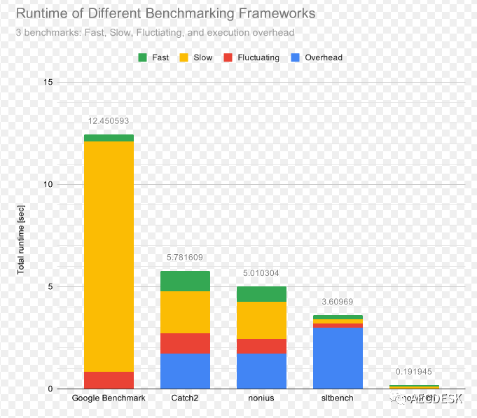

# Google Benchmark 性能测试分析工具


## 0. 简介

作为一个程序而言，benchmark是非常关键的一个衡量指标，无论是程序算法的指标还是程序运行性能的指标，这些我们都可以去完成衡量。对于性能衡量而言google benchmark无疑是一个比较好的选择。

<br>
<center>
  
  <br>
  <div style="color:orange; border-bottom: 1px solid #d9d9d9; display: inline-block; color: #999; padding: 2px;">性能测试工具对比</div>
</center>
<br>

## 1. google benchmark安装

[google benchmark 下载地址](https://github.com/google/benchmark)

**编译安装:**

登录 linux环境，执行以下命令，进行编译安装：

```shell
git clone https://github.com/google/benchmark.git
cd benchmark
git clone https://github.com/google/googletest.git
mkdir build
cd build
cmake .. -DCMAKE_BUILD_TYPE=RELEASE
make -j4
# 如果想全局安装就接着运行下面的命令
sudo make install
```

## 2.  代码编写

创建一个C++源文件，并编写包含基准测试函数的代码。例如，创建一个名为benchmark_example.cpp的文件，并编写如下内容：

```c++
#include <benchmark/benchmark.h>

static void BM_MyFunction(benchmark::State& state) {
    // 在这里编写您要测试的代码
    for (auto _ : state) {
        // 执行您的代码
    }
}

BENCHMARK(BM_MyFunction);

BENCHMARK_MAIN();
```

在上述示例中，`BM_MyFunction`是您要测试的函数。

然后我们可以使用C++编译器编译您的代码，并链接Google Benchmark库。

```shell
g++ benchmark_example.cpp -o benchmark_example -lbenchmark -lpthread
```

如果是cmakelist，则可以使用

```CMake
set(CMAKE_CXX_FLAGS "${CMAKE_CXX_FLAGS} -pthread")
# benchmark依赖thread线程库
add_library(benchmark STATIC IMPORTED)
set_property(TARGET benchmark PROPERTY IMPORTED_LOCATION /usr/local/lib/libbenchmark.a)

add_executable(demo demo.cpp)
target_link_libraries(demo
    benchmark
)

install(TARGETS
    demo
    DESTINATION "bin/"
)
```

### 2.1 基础代码调用测试

我们可以看到每一个benchmark测试用例都是一个类型为`std::function`的函数，其中`benchmark::State&`负责测试的运行及额外参数的传递。

测试用例编写完成后，我们需要使用`BENCHMARK()`将我们的测试用例注册进benchmark，这样程序运行时才会执行我们的测试。

最后是用`BENCHMARK_MAIN();`替代直接编写的main函数，它会处理命令行参数并运行所有注册过的测试用例生成测试结果。

<table><tr><td bgcolor=yellow>Example 1:</td></tr></table>

```c++

#include <benchmark/benchmark.h>
#include <vector>
#include <array>

constexpr int len = 6;
std::vector<int> vec{1, 2, 3, 4, 5, 6};
std::array<int, len> array{1, 2, 3, 4, 5, 6};

// benchmark::State &state用于维护测试上下文信息，以及控制迭代次数
static void vector_test(benchmark::State &state)
{
    for (auto _ : state)
    {
        vec[0];
        vec[1];
        vec[2];
        vec[3];
        vec[4];
        vec[5];
    }
}

static void array_test(benchmark::State &state)
{
    for (auto _ : state)
    {
        array[0];
        array[1];
        array[2];
        array[3];
        array[4];
        array[5];
    }
}

// 注册测试用例
BENCHMARK(vector_test);
BENCHMARK(array_test);
// benchmark的主函数
BENCHMARK_MAIN();
```

结果格式如下:

```shell
Load Average: 0.43, 0.25, 0.10
------------------------------------------------------
Benchmark            Time             CPU   Iterations
------------------------------------------------------
vector_test       6.81 ns         6.81 ns    102373755
array_test        13.6 ns         13.6 ns     51227934
```

<table><tr><td bgcolor=yellow>Example 2</td></tr></table>

```c++
#include <benchmark/benchmark.h>
#include <array>

constexpr int len = 6;

// constexpr function具有inline属性，你应该把它放在头文件中
constexpr auto my_pow(const int i)
{
    return i * i;
}

// 使用operator[]读取元素，依次存入1-6的平方
static void bench_array_operator(benchmark::State& state)
{
    std::array<int, len> arr;
    constexpr int i = 1;
    for (auto _: state) {
        arr[0] = my_pow(i);
        arr[1] = my_pow(i+1);
        arr[2] = my_pow(i+2);
        arr[3] = my_pow(i+3);
        arr[4] = my_pow(i+4);
        arr[5] = my_pow(i+5);
    }
}
BENCHMARK(bench_array_operator);

// 使用at()读取元素，依次存入1-6的平方
static void bench_array_at(benchmark::State& state)
{
    std::array<int, len> arr;
    constexpr int i = 1;
    for (auto _: state) {
        arr.at(0) = my_pow(i);
        arr.at(1) = my_pow(i+1);
        arr.at(2) = my_pow(i+2);
        arr.at(3) = my_pow(i+3);
        arr.at(4) = my_pow(i+4);
        arr.at(5) = my_pow(i+5);
    }
}
BENCHMARK(bench_array_at);

// std::get<>(array)是一个constexpr function，它会返回容器内元素的引用，并在编译期检查数组的索引是否正确
static void bench_array_get(benchmark::State& state)
{
    std::array<int, len> arr;
    constexpr int i = 1;
    for (auto _: state) {
        std::get<0>(arr) = my_pow(i);
        std::get<1>(arr) = my_pow(i+1);
        std::get<2>(arr) = my_pow(i+2);
        std::get<3>(arr) = my_pow(i+3);
        std::get<4>(arr) = my_pow(i+4);
        std::get<5>(arr) = my_pow(i+5);
    }
}
BENCHMARK(bench_array_get);

BENCHMARK_MAIN();
```

我们可以看到每一个benchmark测试用例都是一个类型为`std::function<void(benchmark::State&)>`的函数，其中`benchmark::State&`负责测试的运行及额外参数的传递。

随后我们使用`for (auto _: state) {}`来运行需要测试的内容，`state`会选择合适的次数来运行循环，时间的计算从循环内的语句开始，所以我们可以选择像例子中一样在for循环之外初始化测试环境，然后在循环体内编写需要测试的代码。

测试用例编写完成后我们需要使用`BENCHMARK(<function_name>)`;将我们的测试用例注册进benchmark，这样程序运行时才会执行我们的测试。

最后是用BENCHMARK_MAIN();替代直接编写的main函数，它会处理命令行参数并运行所有注册过的测试用例生成测试结果。

示例中大量使用了`constexpt`，这是为了能在编译期计算出需要的数值避免对测试产生太多噪音。

然后我们编译测试程序：

```shell
g++ -Wall -std=c++14 benchmark_example.cpp -pthread -lbenchmark
```

benchmark需要链接`libbenchmark.so`，所以需要指定`-lbenchmark`，此外还需要`thread`的支持，因为`libstdc++`不提供`thread`的底层实现，我们需要`pthread`。另外不建议使用-lpthread，官方表示会出现兼容问题，在我这测试也会出现链接错误。注意文件名一定要在-lbenchmark前面，否则编译会失败，具体参见：https://github.com/google/benchmark/issues/619

如果你是在Windows平台使用google/benchmark，那么你需要额外链接shlwapi.lib才能使benchmark正常编译和运行。详细信息在这里。

编译好程序后就可以运行测试了：

```shell
2024-01-20T15:56:26+08:00
Running ./benchmark_example_two
Run on (4 X 3700 MHz CPU s)
CPU Caches:
  L1 Data 32 KiB (x4)
  L1 Instruction 32 KiB (x4)
  L2 Unified 256 KiB (x4)
  L3 Unified 8192 KiB (x1)
Load Average: 0.36, 0.64, 0.82
***WARNING*** CPU scaling is enabled, the benchmark real time measurements may be noisy and will incur extra overhead.
---------------------------------------------------------------
Benchmark                     Time             CPU   Iterations
---------------------------------------------------------------
bench_array_operator       30.9 ns         30.6 ns     22700640
bench_array_at             31.1 ns         30.9 ns     22376913
bench_array_get            29.4 ns         29.4 ns     23760270
```

显示的警告信息表示在当前系统环境有一些噪音(例如其他在运行的程序)可能导致结果不太准确，并不影响我们的测试。

在Windows上通常没有上述警告，如果你需要在Linux平台上去除相关警告的话，请参考此处。

测试结果与预期基本相符，`std::get`最快，`at()`最慢。

### 2.2 传参调用测试

上面的测试用例都只接受一个`benchmark::State&`类型的参数，所以我们可以使用`BENCHMARK`宏生成的对象的`Arg`方法来完成参数的传递。

传递进来的参数会被放入`state`对象内部存储，通过`range`方法获取，调用时的参数`0`是传入参数的需要，对应第一个参数。

举个例子，假如我们需要实现一个队列，现在有ring buffer和linked list两种实现可选，现在我们要测试两种方案在不同情况下的性能表现：

```c++
// 必要的数据结构
#include <benchmark/benchmark.h>
#include "ring.h"
#include "linked_ring.h"

// ring buffer的测试
static void bench_array_ring_insert_int_10(benchmark::State& state)
{
    auto ring = ArrayRing<int>(10);
    for (auto _: state) {
        for (int i = 1; i <= 10; ++i) {
            ring.insert(i);
        }
        state.PauseTiming(); // 暂停计时
        ring.clear();
        state.ResumeTiming(); // 恢复计时
    }
}
BENCHMARK(bench_array_ring_insert_int_10);

// linked list的测试
static void bench_linked_queue_insert_int_10(benchmark::State &state)
{
    auto ring = LinkedRing<int>{};
    for (auto _:state) {
        for (int i = 0; i < 10; ++i) {
            ring.insert(i);
        }
        state.PauseTiming();
        ring.clear();
        state.ResumeTiming();
    }
}
BENCHMARK(bench_linked_queue_insert_int_10);
// 还有针对删除的测试，以及针对string的测试，都是高度重复的代码，这里不再罗列
```

很显然，上面的测试除了被测试类型和插入的数据量之外没有任何区别，如果可以通过传入参数进行控制的话就可以少写大量重复的代码。

编写重复的代码是浪费时间，而且往往意味着你在做一件蠢事，google的工程师们当然早就注意到了这一点。虽然测试用例只能接受一个`benchmark::State&`类型的参数，但我们可以将参数传递给state对象，然后在测试用例中获取：

```c++
static void bench_array_ring_insert_int(benchmark::State& state)
{
    auto length = state.range(0);
    auto ring = ArrayRing<int>(length);
    for (auto _: state) {
        for (int i = 1; i <= length; ++i) {
            ring.insert(i);
        }
        state.PauseTiming();
        ring.clear();
        state.ResumeTiming();
    }
}
BENCHMARK(bench_array_ring_insert_int)->Arg(10);
```
上面的例子展示了如何传递和获取参数：
  - 传递参数使用`BENCHMARK`宏生成的对象的`Arg`方法
  - 传递进来的参数会被放入`state`对象内部存储，通过`range`方法获取，调用时的参数`0`是传入参数的需要，对应第一个参数

`Arg`方法一次只能传递一个参数，那如果一次想要传递多个参数呢？也很简单：

```c++
static void bench_array_ring_insert_int(benchmark::State& state)
{
    auto ring = ArrayRing<int>(state.range(0));
    for (auto _: state) {
        for (int i = 1; i <= state.range(1); ++i) {
            ring.insert(i);
        }
        state.PauseTiming();
        ring.clear();
        state.ResumeTiming();
    }
}
BENCHMARK(bench_array_ring_insert_int)->Args({10, 10});
```

上面的例子没什么实际意义，只是为了展示如何传递多个参数，`Args`方法接受一个`vector`对象，所以我们可以使用c++11提供的大括号初始化器简化代码，获取参数依然通过`state.range`方法，`1`对应传递进来的第二个参数。

有一点值得注意，参数传递只能接受整数，如果你希望使用其他类型的附加参数，就需要另外想些办法了。

### 2.3 简化多个类似测试用例的生成功

向测试用例传递参数的最终目的是为了在不编写重复代码的情况下生成多个测试用例，在知道了如何传递参数后你可能会这么写：

```c++
static void bench_array_ring_insert_int(benchmark::State& state)
{
    auto length = state.range(0);
    auto ring = ArrayRing<int>(length);
    for (auto _: state) {
        for (int i = 1; i <= length; ++i) {
            ring.insert(i);
        }
        state.PauseTiming();
        ring.clear();
        state.ResumeTiming();
    }
}
// 下面我们生成测试插入10，100，1000次的测试用例
BENCHMARK(bench_array_ring_insert_int)->Arg(10);
BENCHMARK(bench_array_ring_insert_int)->Arg(100);
BENCHMARK(bench_array_ring_insert_int)->Arg(1000);
```


```shell
2024-01-20T15:56:26+08:00
Running ./benchmark_example_two
Run on (4 X 3700 MHz CPU s)
CPU Caches:
  L1 Data 32 KiB (x4)
  L1 Instruction 32 KiB (x4)
  L2 Unified 256 KiB (x4)
  L3 Unified 8192 KiB (x1)
Load Average: 0.36, 0.64, 0.82
***WARNING*** CPU scaling is enabled, the benchmark real time measurements may be noisy and will incur extra overhead.
--------------------------------------------------------------------------------
Benchmark                                    Time              CPU      Iterations
----------------------------------------------------------------------------------
bench_array_ring_insert_int/10              584  ns           547 ns     1000000
bench_array_ring_insert_int/100             1357 ns           1367 ns     560000
bench_array_ring_insert_int/1000            9207 ns           9521 ns     64000
```
以上的代码虽然结果是正确的，但是仍然写了很多重复代码！

幸好`Arg`和`Args`会将我们的测试用例使用的参数进行注册以便产生用例名/参数的新测试用例，并且返回一个指向`BENCHMARK`宏生成对象的指针，换句话说，如果我们想要生成仅仅是参数不同的多个测试的话，只需要链式调用Arg和Args即可：

```c++
BENCHMARK(bench_array_ring_insert_int)->Arg(10)->Arg(100)->Arg(1000);
```

结果和上面一样。

但这还不是最优解，我们仍然重复调用了Arg方法，如果我们需要更多用例时就不得不又要做重复劳动了。

对此google benchmark也有解决办法：我们可以使用`Range`方法来自动生成一定范围内的参数。

先看看Range的原型：

```c++
BENCHMAEK(func)->Range(int64_t start, int64_t limit);
```

start表示参数范围起始的值，limit表示范围结束的值，Range所作用于的是一个_闭区间_。

但是如果我们这样改写代码，是会得到一个错误的测试结果:

```c++
BENCHMARK(bench_array_ring_insert_int)->Range(10, 1000);
```

```shell
--------------------------------------------------------------------------------
Benchmark                                   Time            CPU      Iterations
----------------------------------------------------------------------------------
bench_array_ring_insert_int/10              584  ns         625 ns     1000000
bench_array_ring_insert_int/64              1042 ns         1029 ns    896000
bench_array_ring_insert_int/512             4948  ns        5313 ns    100000
bench_array_ring_insert_int/1000            9221 ns         8545 ns     89600
```

为什么会这样呢？那是因为Range默认除了start和limit，中间的其余参数都会是某一个基底（base）的幂，基地默认为8，所以我们会看到64和512，它们分别是8的平方和立方。

想要改变这一行为也很简单，只要重新设置基底即可，通过使用RangeMultiplier方法：

```c++
BENCHMARK(bench_array_ring_insert_int)->RangeMultiplier(10)->Range(10, 1000);
```

现在结果恢复如初了。

使用Ranges可以处理多个参数的情况：

```c++
BENCHMARK(func)->RangeMultiplier(10)->Ranges({{10, 1000}, {128， 256}});
```

第一个范围指定了测试用例的第一个传入参数的范围，而第二个范围指定了第二个传入参数可能的值（注意这里不是范围了）。

与下面的代码等价：

```c++
BENCHMARK(func)->Args({10, 128})
               ->Args({100, 128})
               ->Args({1000, 128})
               ->Args({10, 256})
               ->Args({100, 256})
               ->Args({1000, 256})
```
实际上就是用生成的第一个参数的范围于后面指定内容的参数做了一个笛卡尔积。

### 2.4 使用参数生成器

如果我想定制没有规律的更复杂的参数呢？这时就需要实现自定义的参数生成器了。

一个参数生成器的签名如下：

```c++
void CustomArguments(benchmark::internal::Benchmark* b);
```

我们在生成器中计算处参数，然后调用`benchmark::internal::Benchmark`对象的`Arg`或`Args`方法像上两节那样传入参数即可。

随后我们使用`Apply`方法把生成器应用到测试用例上：

```c++
BENCHMARK(func)->Apply(CustomArguments);
```

其实这一过程的原理并不复杂，我做个简单的解释：

  1. `BENCHMARK`宏产生的就是一个`benchmark::internal::Benchmark`对象然后返回了它的指针
  2. 向`benchmark::internal::Benchmark`对象传递参数需要使用`Arg`和`Args`等方法
  3. `Apply`方法会将参数中的函数应用在自身
  4. 我们在生成器里使用`benchmark::internal::Benchmark`对象的指针`b`的`Args`等方法传递参数，这时的`b`其实指向我们的测试用例


到此为止生成器是如何工作的已经一目了然了，当然从上面得出的结论，我们还可以让Apply做更多的事情。

下面看下Apply的具体使用：

```c++
// 这次我们生成100，200，...，1000的测试用例，用range是无法生成这些参数的
static void custom_args(benchmark::internal::Benchmark* b)
{
    for (int i = 100; i <= 1000; i += 100) {
        b->Arg(i);
    }
}

BENCHMARK(bench_array_ring_insert_int)->RangeMultiplier(10)->Apply(custom_args);
```

### 2.5 模板类的调用测试

如果针对每一种情况写测试函数，显然违反了`DRY原则`，因为除了vector的类型参数不同，其他代码几乎是完全一样的。

```c++
#include <benchmark/benchmark.h>
#include <vector>
#include <array>

template <typename T, std::size_t length, bool is_reserve = true>
void bench_vector_reserve(benchmark::State& state)
{
    for (auto _ : state) {
        std::vector<T> container;
        if constexpr (is_reserve) {
            container.reserve(length);
        }
        for (std::size_t i = 0; i < length; ++i) {
            container.push_back(T{});
        }
    }
}
// BENCHMARK_TEMPLATE(bench_vector_reserve, std::string, 100);
// // benchmark的主函数
// BENCHMARK_MAIN();
```

非常的简单，我们通过`length`控制插入的元素个数；`is_reserve`则负责控制是否预分配内存，通过`if constexpr`可以生成reserve和不进行任何操作的两种代码（如果不熟悉c++17的if constexpr，推荐花两分钟看看[这里](https://www.cnblogs.com/apocelipes/p/14536236.html#%E4%BD%BF%E7%94%A8%E7%BC%96%E8%AF%91%E6%9C%9F%E6%9D%A1%E4%BB%B6%E5%88%86%E6%94%AF)）。

然后我们像往常一样定义一个测试用例：

```shell
BENCHMARK(bench_vector_reserve<std::string,100>);
```


可是等我们编译的时候却报错了！

```shell
$ g++ test.cpp -lpthread -lbenchmark -lbenchmark_main

test.cpp:19:48: 错误：宏“BENCHMARK”传递了 2 个参数，但只需要 1 个
   19 | BENCHMARK(bench_vector_reserve<std::string,100>);
      |                                                ^
In file included from a.cpp:1:
/usr/local/include/benchmark/benchmark.h:1146: 附注：macro "BENCHMARK" defined here
 1146 | #define BENCHMARK(n)                                     \
      |
test.cpp:19:1: 错误：‘BENCHMARK’不是一个类型名
   19 | BENCHMARK(bench_vector_reserve<std::string,100>);
```

原因是这样的，在编译器处理宏的时候实际上不会考虑c++语法，所以分割模板参数的逗号被识别成了分割宏参数的逗号，因此在宏处理器的眼里我们像是传了两个参数。这也说明了`BENCHMARK`是处理不了模板的。

不过别担心，Google早就想到这种情况了，所以提供了`BENCHMARK_TEMPLATE`宏，我们只需要把模板名字和需要的类型参数依次传给宏即可：

```C++
BENCHMARK_TEMPLATE(bench_vector_reserve, std::string, 100);
BENCHMARK_TEMPLATE(bench_vector_reserve, std::string, 1000);
BENCHMARK_TEMPLATE(bench_vector_reserve, std::string, 10000);
BENCHMARK_TEMPLATE(bench_vector_reserve, std::string, 100000);
BENCHMARK_TEMPLATE(bench_vector_reserve, std::string, 100, false);
BENCHMARK_TEMPLATE(bench_vector_reserve, std::string, 1000, false);
BENCHMARK_TEMPLATE(bench_vector_reserve, std::string, 10000, false);
BENCHMARK_TEMPLATE(bench_vector_reserve, std::string, 100000, false);
```

输出:

```shell
2024-01-20T19:12:57+08:00
Running ./benchmark_template
Run on (4 X 3700 MHz CPU s)
CPU Caches:
  L1 Data 32 KiB (x4)
  L1 Instruction 32 KiB (x4)
  L2 Unified 256 KiB (x4)
  L3 Unified 8192 KiB (x1)
Load Average: 1.67, 1.82, 1.39
***WARNING*** CPU scaling is enabled, the benchmark real time measurements may be noisy and will incur extra overhead.
-------------------------------------------------------------------------------------------
Benchmark                                                 Time             CPU   Iterations
-------------------------------------------------------------------------------------------
bench_vector_reserve<std::string, 100>                 2912 ns         2910 ns       239967
bench_vector_reserve<std::string, 1000>               27585 ns        27571 ns        25299
bench_vector_reserve<std::string, 10000>             275549 ns       275527 ns         2534
bench_vector_reserve<std::string, 100000>           3158585 ns      2818440 ns          253
bench_vector_reserve<std::string, 100, false>          7743 ns         7635 ns        89883
bench_vector_reserve<std::string, 1000, false>        54695 ns        54663 ns        12540
bench_vector_reserve<std::string, 10000, false>      671379 ns       671340 ns         1050
bench_vector_reserve<std::string, 100000, false>    8904492 ns      8903935 ns           79
```

### 2.6 定制测试参数

在上面的代码中，length参数其实是不必要的，所以代码可以这样改：

```c++
template <typename T, bool is_reserve = true>
void bench_vector_reserve(benchmark::State& state)
{
	for (auto _ : state) {
		std::vector<T> container;
		if constexpr (is_reserve) {
            // 通过range方法获取传入的参数
			container.reserve(state.range(0));
		}
		for (std::size_t i = 0; i < state.range(0); ++i) {
			container.push_back(T{});
		}
	}
}

BENCHMARK_TEMPLATE(bench_vector_reserve, std::string)->RangeMultiplier(10)->Range(10, 10000 * 10);
BENCHMARK_TEMPLATE(bench_vector_reserve, std::string, false)->RangeMultiplier(10)->Range(10, 10000 * 10);
```

现在我们测试的元素数量是[10, 100, 1000, 10^4, 10^5]。

除此之外还有另一种叫“密集参数”的Ranges。google benchmark提供了DenseRange方法。

这个方法的原型如下：

```c++
DenseRange(int64_t start, int64_t end, int64_t step);
```

`Ranges`是累乘，而`DenseRange`是累加，因为累乘会导致几何级数的增长，在数轴上的分布越来越稀疏，累加则看上去像是均匀分布的，因此累加的参数生成器被叫做`密集参数生成器`。

如果我们把测试用例这么改：

```c++
BENCHMARK_TEMPLATE(bench_vector_reserve, std::string)->DenseRange(1000, 100 * 100, 1000);
```
现在我们的length就是这样一个序列：`[1000，2000，3000， ...，9000，10000]`。

关于自定义参数最后一个知识点是`ArgsProduct`。看名字就知道这是一个参数工厂。

```c++
ArgsProduct(const std::vector< std::vector<int64_t> >& arglists);
```

`std::vector<int64_t>`实际上就是一组参数，`arglists`就是多组参数的合集，他们之间会被求笛卡尔积，举个例子：

```c++
BENCHMARK(BM_test)->ArgsProduct({ {"a", "b", "c", "d"}, {1, 2, 3, 4} });

// 等价于下面的
BENCHMARK(BM_test)->Args({"a", 1})
                  ->Args({"a", 2})
                  ->Args({"a", 3})
                  ->Args({"a", 4})
                  ->Args({"b", 1})
                  ->Args({"b", 2})
                  ->Args({"b", 3})
                  ...
                  ->Args({"d", 3})
                  ->Args({"d", 4})
                  ```
```

我们可以看到参数工厂其实得自己手写所有参数，那如果我想配合工厂使用Ranges呢？

没问题，benchmark的开发者们早就想到了，所以提供了下面这些帮助函数：

```c++
benchmark::CreateRange(8, 128, /*multi=*/2)   // 生成：[8, 16, 32, 64, 128]
benchmark::CreateDenseRange(1, 6, /*step=*/1) // 生成：[1, 2, 3, 4, 5, 6]
```

如果换成我们的例子，就可以这样写：

```c++
BENCHMARK_TEMPLATE(bench_vector_reserve, std::string)->ArgsProduct({
    benchmark::CreateRange(10, 10000*10, 10)
});
BENCHMARK_TEMPLATE(bench_vector_reserve, std::string, false)->ArgsProduct({
    benchmark::CreateRange(10, 10000*10, 10)
});
```

借助仅仅两行代码我们就能生成数量可观的测试用例：

```shell
2024-01-20T19:26:55+08:00
Running ./bm_template_2
Run on (4 X 3700 MHz CPU s)
CPU Caches:
  L1 Data 32 KiB (x4)
  L1 Instruction 32 KiB (x4)
  L2 Unified 256 KiB (x4)
  L3 Unified 8192 KiB (x1)
Load Average: 1.91, 2.05, 1.65
***WARNING*** CPU scaling is enabled, the benchmark real time measurements may be noisy and will incur extra overhead.
------------------------------------------------------------------------------------------
Benchmark                                                Time             CPU   Iterations
------------------------------------------------------------------------------------------
bench_vector_reserve<std::string>/10                   466 ns          466 ns      1505218
bench_vector_reserve<std::string>/100                 3549 ns         3548 ns       200461
bench_vector_reserve<std::string>/1000               34067 ns        34049 ns        20858
bench_vector_reserve<std::string>/10000             324499 ns       324370 ns         2125
bench_vector_reserve<std::string>/100000           3229254 ns      3227361 ns          219
bench_vector_reserve<std::string, false>/10           1604 ns         1603 ns       436414
bench_vector_reserve<std::string, false>/100          7707 ns         7705 ns        89743
bench_vector_reserve<std::string, false>/1000        57709 ns        57694 ns        12026
bench_vector_reserve<std::string, false>/10000      688582 ns       688283 ns         1008
bench_vector_reserve<std::string, false>/100000    9208480 ns      9205775 ns           75
```

当然，这只是一个类型参数，实际上我们还有另外两个类型需要测试。另外这是1.5.5新增的功能，如果你想尝鲜得先升级google benchmark。

通常做到上面那一步就足够了，然而在这里我们还有优化空间，因为如果我们把其他两个测试用的类型加上，代码是这样的，MyClass的定义后面会给出：

```c++
BENCHMARK_TEMPLATE(bench_vector_reserve, std::string)->ArgsProduct({
    benchmark::CreateRange(10, 10000*10, 10)
});
BENCHMARK_TEMPLATE(bench_vector_reserve, std::string, false)->ArgsProduct({
    benchmark::CreateRange(10, 10000*10, 10)
});
BENCHMARK_TEMPLATE(bench_vector_reserve, std::size_t)->ArgsProduct({
    benchmark::CreateRange(10, 10000*10, 10)
});
BENCHMARK_TEMPLATE(bench_vector_reserve, std::size_t, false)->ArgsProduct({
    benchmark::CreateRange(10, 10000*10, 10)
});
BENCHMARK_TEMPLATE(bench_vector_reserve, MyClass)->ArgsProduct({
    benchmark::CreateRange(10, 10000*10, 10)
});
BENCHMARK_TEMPLATE(bench_vector_reserve, MyClass, false)->ArgsProduct({
    benchmark::CreateRange(10, 10000*10, 10)
});
```

你看见了什么？没错，重复重复重复！我们又违背了DRY原则。

重复说不上什么十恶不赦，但能避免还是要避免的，所以我准备用宏来简化这些代码：

```c++
#define generate_test(type) \
	BENCHMARK_TEMPLATE(bench_vector_reserve, type)->ArgsProduct({benchmark::CreateRange(10, 100000, 10)}); \
	BENCHMARK_TEMPLATE(bench_vector_reserve, type, false)->ArgsProduct({benchmark::CreateRange(10, 100000, 10)});

generate_test(std::string);
generate_test(std::size_t);
generate_test(MyClass);
```

这下舒服多了。

接着来看我们的MyClass，我们的MyClass包含几个虚函数，禁止移动赋值，同时被刻意设计成了非平凡复制，这样的类型可以说是绕过了标准库容器设计的大部分优化措施，算是个妥妥的反面教材，希望你的项目里尽量不要出现这种东西：

```c++
class MyClass {
public:
	long i = 2L;
    MyClass() { i = 2L; }
	virtual ~MyClass() {}
	virtual long get() { return i; }
	MyClass& operator=(MyClass&&) = delete;
	MyClass(const MyClass& obj) {
		i = obj.i;
	}
	MyClass& operator=(const MyClass& obj) {
		i = obj.i;
	}
};
```

这个类其实就是针对内存分配器实现的，vector在重新进行内存分配后很可能靠移动语义或者memmove来移动数据，这两者将导致重新分配内存导致的性能损失变小，不利于我们观察vector的行为，所以我定制了这个类。

```shell
2024-01-20T19:39:19+08:00
Running ./bm_template_3
Run on (4 X 3700 MHz CPU s)
CPU Caches:
  L1 Data 32 KiB (x4)
  L1 Instruction 32 KiB (x4)
  L2 Unified 256 KiB (x4)
  L3 Unified 8192 KiB (x1)
Load Average: 1.94, 1.42, 1.32
***WARNING*** CPU scaling is enabled, the benchmark real time measurements may be noisy and will incur extra overhead.
------------------------------------------------------------------------------------------
Benchmark                                                Time             CPU   Iterations
------------------------------------------------------------------------------------------
bench_vector_reserve<std::string>/10                   480 ns          480 ns      1399285
bench_vector_reserve<std::string>/100                 3446 ns         3445 ns       200045
bench_vector_reserve<std::string>/1000               34552 ns        33697 ns        20974
bench_vector_reserve<std::string>/10000             329746 ns       329407 ns         2123
bench_vector_reserve<std::string>/100000           3263084 ns      3262478 ns          215
bench_vector_reserve<std::string, false>/10           1603 ns         1602 ns       435234
bench_vector_reserve<std::string, false>/100          7871 ns         7870 ns        88586
bench_vector_reserve<std::string, false>/1000        58803 ns        58793 ns        11582
bench_vector_reserve<std::string, false>/10000      713880 ns       711949 ns          973
bench_vector_reserve<std::string, false>/100000    9387908 ns      9385776 ns           74
bench_vector_reserve<std::size_t>/10                   388 ns          387 ns      1800299
bench_vector_reserve<std::size_t>/100                 2421 ns         2421 ns       289565
bench_vector_reserve<std::size_t>/1000               23424 ns        23413 ns        29931
bench_vector_reserve<std::size_t>/10000             229590 ns       229543 ns         3081
bench_vector_reserve<std::size_t>/100000           2258210 ns      2257467 ns          309
bench_vector_reserve<std::size_t, false>/10           1331 ns         1329 ns       526682
bench_vector_reserve<std::size_t, false>/100          4098 ns         4094 ns       169896
bench_vector_reserve<std::size_t, false>/1000        26619 ns        26614 ns        26307
bench_vector_reserve<std::size_t, false>/10000      248256 ns       248125 ns         2864
bench_vector_reserve<std::size_t, false>/100000    2411262 ns      2410631 ns          286
bench_vector_reserve<MyClass>/10                       547 ns          547 ns      1264878
bench_vector_reserve<MyClass>/100                     4268 ns         4268 ns       163187
bench_vector_reserve<MyClass>/1000                   41305 ns        41292 ns        16957
bench_vector_reserve<MyClass>/10000                 408955 ns       408888 ns         1713
bench_vector_reserve<MyClass>/100000               4095353 ns      4093747 ns          170
bench_vector_reserve<MyClass, false>/10               1428 ns         1428 ns       487914
bench_vector_reserve<MyClass, false>/100              8052 ns         8050 ns        86405
bench_vector_reserve<MyClass, false>/1000            65784 ns        65772 ns        10679
bench_vector_reserve<MyClass, false>/10000          741154 ns       741025 ns          940
bench_vector_reserve<MyClass, false>/100000        6842572 ns      6839261 ns          102
```

### 2.7. 使用Benchmark接口

这里将待测试的函数注册为一个基准测试用例，并指定测试用例的名称和参数。该代码中使用了三种不同的注册方式：`函数指针`、`Lambda 函数`和`带参数的函数指针`。最后，使用 `benchmark::RunSpecifiedBenchmarks` 函数运行所有注册的基准测试用例，并使用 `benchmark::Shutdown` 函数释放资源。

```c++
#include <benchmark/benchmark.h>
#include <chrono>
#include <thread>

void BM_DemoSleep(benchmark::State& state) {
  for (auto _ : state){
    std::this_thread::sleep_for(std::chrono::nanoseconds(1000)); //待测试的代码
  }
}

void BM_DemoSleep1(benchmark::State& state, int id) {
  std::cout << "id:"<< id << std::endl;
  for (auto _ : state){
    std::this_thread::sleep_for(std::chrono::nanoseconds(1000));
  }
}

int main(int argc, char** argv) {
  benchmark::Initialize(&argc, argv); // 初始化Benchmark
  if (benchmark::ReportUnrecognizedArguments(argc, argv)) return 1;

  // 使用函数指针注册
  benchmark::RegisterBenchmark("BM_DemoSleep", &BM_DemoSleep);
  // 使用Lamba函数注册
  benchmark::RegisterBenchmark("BM_DemoSleep1", [](benchmark::State& state){
    for (auto _ : state){
      std::this_thread::sleep_for(std::chrono::nanoseconds(1000));
    }
  });

  // 使用带参数的函数指针注册
  int id = 10;
  benchmark::RegisterBenchmark("BM_DemoSleep2", &BM_DemoSleep1, id);

  benchmark::RunSpecifiedBenchmarks(); // 运行
  benchmark::Shutdown();
}
```

## 3. Ref:

[1]. https://mp.weixin.qq.com/s/hrKwlKj6i2twd_qNqaHyYg</br>
[2]. [Google Benchmark 用户手册](https://github.com/google/benchmark/blob/main/docs/user_guide.md)</br>
[3]. https://www.cnblogs.com/apocelipes/p/10348925.html</br>

---

> 作者: [Jian YE](https://github.com/jianye0428)  
> URL: https://jianye0428.github.io/posts/google_benchmark_introduction/  

