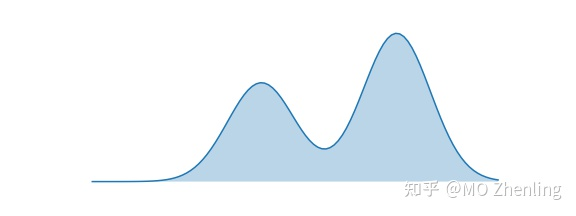

# KL Divergence 详解

## 一、 基本定义

假设给定事件 $x$, 则我们有以下定义:

1. **Probability:**
取值0~1

$$p(x) 或 q(x)$$

2. **Information:**
对$p(x)$取对数，加符号得正值
$$I(p)=-\log p(x)$$
概率越高，包含的信息小，因为事件越来越确定。相反，概率越低，包含的信息越多，因为事件具有很大的不确定性。

3. **(Shannon)Entropy(信息熵):**

$p(x)$对$I(x)$ 平均
$$
\begin{aligned}
H(p)& =\mathbb{E}_{x\sim P}[I(p)]  \\
&=\sum p(x)I(p) \\
&=-\sum p(x)\log p(x)
\end{aligned}
$$
熵是信息的平均，直观上，Shannon熵是信息在**同一分布**下的平均。

KL散度来源于信息论，信息论的目的是以信息含量来度量数据。信息论的核心概念是信息熵(Entropy)，使用H来表示。概率论中概率分布所含的信息量同样可以使用信息熵来度量。


对于任意概率事件，由于其概率$p(x) \geq 0$ 且 $p(x) \leq 0$, 因此 $H(p) \geq 0$.


4. **Cross-Entropy:**
$p(x)$对$I(q)$平均:
$$
\begin{aligned}
H(p,q)& =\mathbb{E}_{x\sim P}[I(q)]  \\
&=\sum p(x)I(q) \\
&=-\sum p(x)\log q(x)
\end{aligned}
$$
熵是信息的平均，直观上，交叉熵是信息在不同分布下的平均。

5. **KL divergence(Relative entropy/Information gain):**
$$
\begin{aligned}
D_{KL}(p||q)& =H(p,q)-H(p)  \\
&=-\sum p(x)\log q(x)+\sum p(x)\log p(x) \\
&=-\sum p(x)\log\frac{q(x)}{p(x)} \\
&=\sum p(x)\log\frac{p(x)}{q(x)}
\end{aligned}
$$
   - 相对熵 = 交叉熵 - shannon熵
   - 非对称$D_{KL}(p||q)\neq D_{KL}(q||p)$，亦不满足三角不等式，故不是距离。
   - $D_{KL}(p||q)$为$p$相对于$q$，值非负，取零若$p=q$。从公式上看，就是拿$q$替代$p$后熵的变化。
   - $KL = Kullback-Leibler$

所谓KL散度，是指当某分布q(x)被用于近似p(x)时的信息损失。

$$
D(p||q)=\sum_{x\in X}p(x)\log\frac{p(x)}{q(x)}
$$
也就是说，q(x)能在多大程度上表达p(x)所包含的信息，KL散度越大，表达效果越差。

## 二、 KL divergence 一些性质（非正式）证明

1. 非对称性
$$
D_{KL}(p||q)-D_{KL}(q||p)=\sum\left(p(x)+q(x)\right)\log\frac{p(x)}{q(x)}
$$
易知，当$p(x) \neq q(x)$时，上式不为0。故，$D_{KL}(p||q)$和$D_{KL}(q||p)$非对称，是不同的。（此部分侧重于说明它们不是不同的）

2. 非负性
$$
\begin{aligned}
-D_{KL}(p||q)& =\sum p(x)\log\frac{q(x)}{p(x)}  \cr
&\leq\log\sum p(x)\frac{q(x)}{p(x)} \cr
&=\log1 \cr
&=0
\end{aligned}
$$
其中，不等式部分使用了[Jensen's inequality](https://link.zhihu.com/?target=https%3A//en.wikipedia.org/wiki/Jensen%2527s_inequality)

3. 凹性
$$
\begin{aligned}
&D_{KL}[\lambda p_1(x)+(1-\lambda)p_2(x)||\lambda q_1(x)+(1-\lambda)q_2(x)] \cr
&=\sum\left[\lambda p_1(x)+(1-\lambda)p_2(x)\right]\log\frac{[\lambda p_1(x)+(1-\lambda)p_2(x)]}{[\lambda q_1(x)+(1-\lambda)q_2(x)]} \cr
&\leq\sum\left[\lambda p_1(x)\log\frac{\lambda p_1(x)}{\lambda q_1(x)}+(1-\lambda)p_2(x)\log\frac{(1-\lambda)p_2(x)}{(1-\lambda)q_2(x)}\right] \cr
&=\lambda\sum p_1(x)\log\frac{p_1(x)}{q_1(x)}+(1-\lambda)\sum p_2(x)\log\frac{p_2(x)}{q_2(x)} \cr
&=\lambda D_{KL}[p_1(x)||q_1(x)]+(1-\lambda)D_{KL}[p_2(x)||q_2(x)]
\end{aligned}
$$

其中，不等式部分用到了[log sum inequality](https://link.zhihu.com/?target=https%3A//statproofbook.github.io/P/logsum-ineq)

## 三、最小化KL divergence目标函数

为了方便说明，我们基于定义在某个空间$X$上的分布$P$和$Q$来重写一下KL， 如下所示：
$$
D_{KL}(P||Q)=\mathbb{E}_{x\sim P}[\log\frac{P(X)}{Q(X)}]
$$

假设，$P$为真实的分布函数，我们想要用带参数 $\theta$ 的分布函数 $Q$，即 $Q_{\theta}$ ，去近似。也就是说，通过选取参数$\theta$， 让 $Q_{\theta}$ 和 $P$ 在某种意义上具有相似性。下面，我们分别将选取正向KL和反向KL做为目标函数进行说明。为了方便，我们假设 $P$ 为双峰分布，$Q_{\theta}$ 为正太分布，故 $\theta$ 包含均值和方差两个参数。

1. 最小化正向KL目标函数
目标函数如下：
$$
\begin{aligned}
&\arg\min_{\theta}D_{KL}(P||Q_{\theta}) \cr
&=\arg\min_\theta\mathbb{E}_{x\sim P}[\log\frac{P(X)}{Q(X)}] \cr
&=\arg\min_\theta\mathbb{E}_{x\sim P}[-\log Q_\theta(X)]-H[P(X)] \cr
&=\arg\min_\theta\mathbb{E}_{x\sim P}[-\log Q_\theta(X)] \cr
&=\arg\max_\theta\mathbb{E}_{x\sim P}[\log Q_\theta(X)]
\end{aligned}
$$
从此处可以看出最小化正向KL目标函数，其实是等价于通过 $Q_{\theta}$ 进行最大似然估计。也就是说，数据 $x$ 由 $P$ 产生，基于这些数据，我们选取 $\theta$ 让平均在 $P(X)$ 上的 $\log Q_{\theta}(X)$ 似然函数最大，即:

**平均P(X)各个峰太，P(X)概率高的地方，$Q_{\theta}(X)$ 概率也要高**

所以我们有下图mean-seeking的结果

(你也可以从信息/熵的角度去理解，道理是一样的)

2. 最小化反向KL目标函数
目标函数如下：

$$
\begin{aligned}
&\arg\min_{\theta}D_{KL}(Q_{\theta}||P) \cr
&=\arg\min_\theta\mathbb{E}_{x\sim Q_\theta}[\log\frac{Q_\theta}{P(X)}] \cr
&=\arg\min_\theta\mathbb{E}_{x\sim Q_\theta}[-\log P(X)]-H[Q_\theta(X)] \cr
&=\arg\max_\theta\mathbb{E}_{x\sim Q_\theta}\left[\log P(X)\right]+H[Q_\theta(X)]
\end{aligned}
$$

此时，我们需要选取参数 $\theta$，让平均在 $Q_{\theta}(X)$ 上的 $\log P(X)$ 似然函数最大;同时，让Shannon熵 $H(Q_{\theta}(X))$
也比较大，即约束 $Q_{\theta}(X)$ 不要过于集中。总的来看，我们有：

**平均 $Q_{\theta}(X)$ 各个峰太，$Q_{\theta}(X)$ 概率高的地方，$P(X)$ 概率也要高，但 $Q_{\theta}(X)$ 不能过于集中**

可以想象，如果没有 $H[Q_{\theta}(X)]$ 的约束，可能会调整 $\theta$，让 $Q_{\theta}(X)$ 集中于 $P(X)$ 最大的地方，得到的值也会比较大。所以，$H[Q_{\theta}(X)]$ 起到了一个正则化（regularization）的效果。

所以我们有下图mode-seeking 的结果:

正向最小化和反向最小化放在一起对比：

正向和反向最小化 此部分代码来自参考文献3，但在调用logsumexp时，有点问题，故做了一个微小改动，代码放在微信公众号MoData文章最后，如果感兴趣，[点击此处](https://link.zhihu.com/?target=https%3A//mp.weixin.qq.com/s%3F__biz%3DMzg4NDY5NTk5NA%3D%3D%26amp%3Bmid%3D2247483795%26amp%3Bidx%3D1%26amp%3Bsn%3D25f1bcf1e725090c22fcf37d181e875e%26amp%3Bchksm%3Dcfb57746f8c2fe50ffefbd47620e447542d43639774fb8f462c97c4953643238e62619db81ba%26token%3D1055919935%26lang%3Dzh_CN%23rd)。

**相关参考资料**
[1]. Cover, T. M., and J. A. Thomas. "Elements of Information Theory,(2nd edn, 2006)." DOI: https://doi. org/10.1002 X 47174882 (2006).
[2]. https://dibyaghosh.com/blog/probability/kldivergence.html
[3]. https://www.tuananhle.co.uk/notes/r

ref:
[1]. [KL-Divergence详解](https://zhuanlan.zhihu.com/p/425693597)
[2]. https://www.zhihu.com/tardis/zm/art/95687720?source_id=1005
[3]. http://hanj.cs.illinois.edu/cs412/bk3/KL-divergence.pdf
[4]. [KL 进阶](https://zhuanlan.zhihu.com/p/372835186)

---

> 作者: [Jian YE](https://github.com/jianye0428)  
> URL: https://jianye0428.github.io/posts/kldivergence/  

