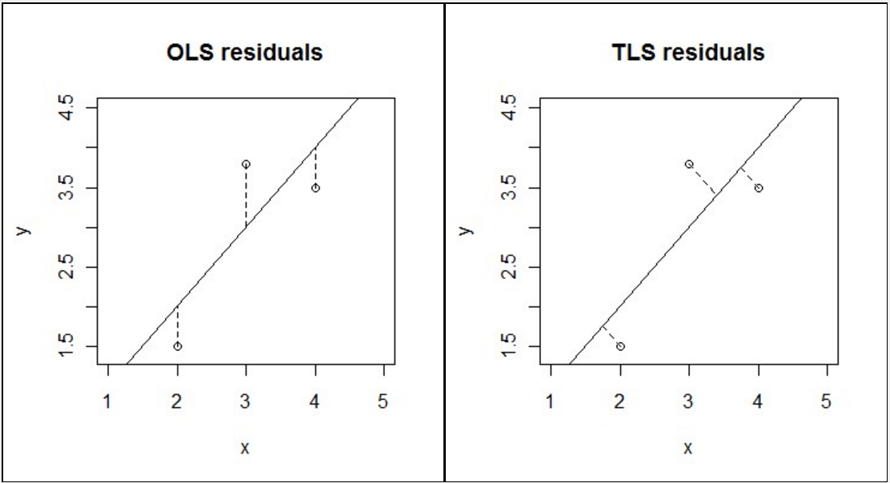
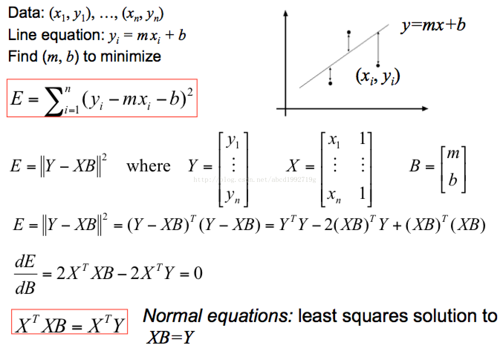
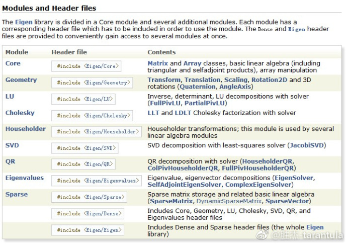
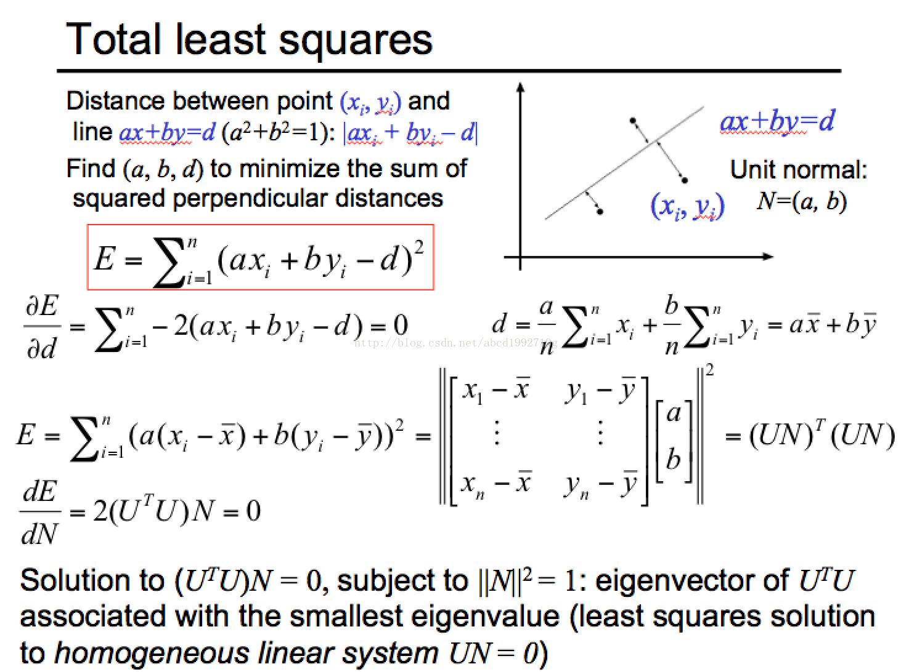
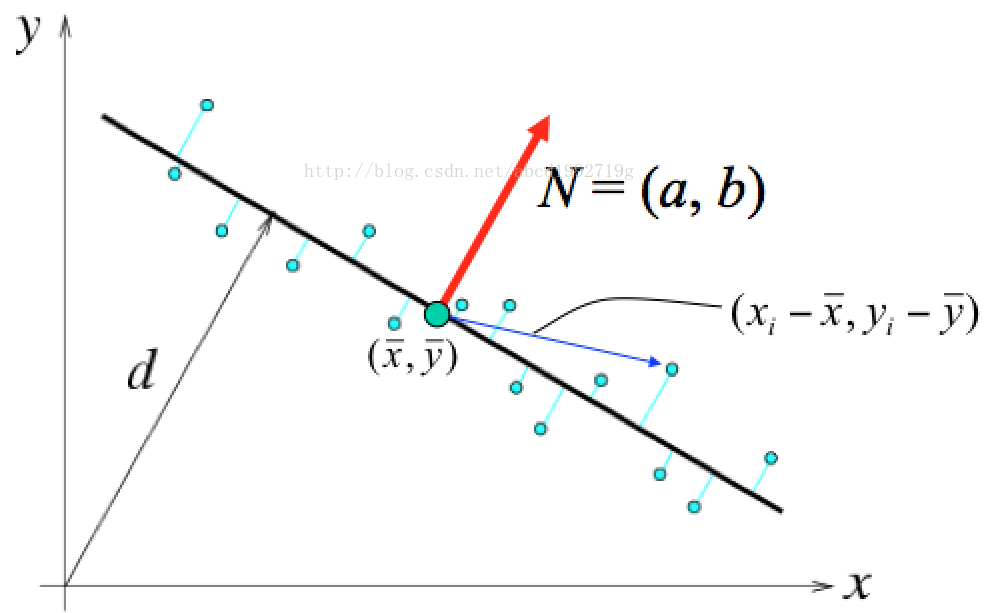
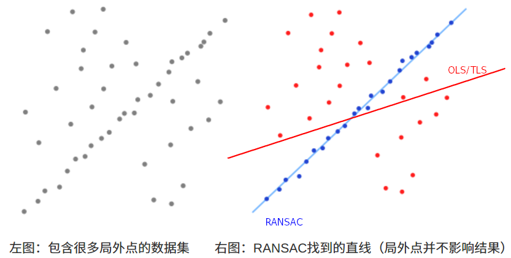

# 曲线拟合


## 一、 最小二乘法拟合直线

**最小二乘拟合** 是一种数学上的近似和优化，利用已知的数据得出一条直线或者曲线，使之在坐标系上与已知数据之间的距离的平方和最小。

- **TLS(Total Least Squares)** vs **OLS(Ordinary Least Squares)**

<br>
<center>
  
  <br>
  <div style="color:orange; border-bottom: 1px solid #d9d9d9; display: inline-block; color: #999; padding: 2px;">BP Network</div>
</center>
<br>

如上图，TLS 和 OLS 都是最小二乘拟合，只是在偏差评估上采取了不同的方式。
最小二乘法是一种较为简单的回归分析方法。

- 最常用的是 OLS（Ordinary Least Square，普通最小二乘法）：所选择的回归模型应该使所有观察值的残差平方和达到最小（如上图左）。

<br>
<center>
  
  <br>
  <div style="color:orange; border-bottom: 1px solid #d9d9d9; display: inline-block; color: #999; padding: 2px;">BP Network</div>
</center>
<br>

```c++
// Gary: O-Least-Square最小二乘拟合
Segment::LocalLine Segment::fitLocalLine(const std::list<Bin::MinZPoint> &points) {
  const unsigned int n_points = points.size();
  // 构造 X/Y 矩阵
  Eigen::MatrixXd X(n_points, 2);
  Eigen::VectorXd Y(n_points);
  unsigned int counter = 0;
  for (auto iter = points.begin(); iter != points.end(); ++iter) {
    X(counter, 0) = iter->d;
    X(counter, 1) = 1;
    Y(counter) = iter->z;
    ++counter;
  }
  // 计算 B
  const Eigen::MatrixXd X_t = X.transpose();
  const Eigen::VectorXd result = (X_t * X).inverse() * X_t * Y;
  LocalLine line_result;
  line_result.first = result(0);
  line_result.second = result(1);
  return line_result;
}
```

Eigen 是C++中可以用来调用并进行矩阵计算的一个库，里面封装了一些类。

<br>
<center>
  
  <br>
  <div style="color:orange; border-bottom: 1px solid #d9d9d9; display: inline-block; color: #999; padding: 2px;">BP Network</div>
</center>
<br>

通过解 $XB=Y$ 我们就能解出 $B=[m b]$：

$$\begin{gathered}
m = \frac{\sum x_{i}^{2}\sum y_{i}-\sum x_{i}(\sum x_{i}y_{i})}{n\sum x_{i}^{2}-(\sum x_{i})^{2}} \\
b = \frac{n\sum x_{i}\sum y_{i}-\sum x_{i}(\sum x_{i}y_{i})}{n\sum x_{i}^{2}-(\sum x_{i})^{2}}
\end{gathered}$$

```c++
OrdinaryLeastSquare(const vector<double>& x, const vector<double>& y) {
    double t1=0, t2=0, t3=0, t4=0;
    for(int i=0; i<x.size(); ++i)  {
        t1 += x[i]*x[i];
        t2 += x[i];
        t3 += x[i]*y[i];
        t4 += y[i];
    }
    m = (t3*x.size() - t2*t4) / (t1*x.size() - t2*t2);
    b = (t1*t4 - t2*t3) / (t1*x.size() - t2*t2);
}
```

- OLS 这种 least square 存在问题，比如针对垂直线段就不行，于是引入第二种 Total Least Square。

<br>
<center>
  
  <br>
  <div style="color:orange; border-bottom: 1px solid #d9d9d9; display: inline-block; color: #999; padding: 2px;">BP Network</div>
</center>
<br>

<br>
<center>
  
  <br>
  <div style="color:orange; border-bottom: 1px solid #d9d9d9; display: inline-block; color: #999; padding: 2px;">BP Network</div>
</center>
<br>

其中，$U=\begin{bmatrix}x_1-\overline{x}&y_1-\overline{y}\\\vdots&\vdots\\x_n-\overline{x}&y_n-\overline{y}\end{bmatrix}$;

$\frac{dE}{dN}=\frac{d(N^TU^TUN)}{dN}=U^TUN+N^TU^TU$ ,因为 $U^TU $ 是一个对称矩阵 $(U^TU=(U^TU)^T)$, $U^TUN=N^TU^TU$, 所以 $\frac{dE}{dN}=2(U^TU)N$;
此外，$U^TU=\begin{bmatrix}\sum(x_i-\overline x)^2&\sum(x_i-\overline x)(y_i-\overline y)\\\sum(x_i-\overline x)(y_i-\overline y)&\sum(y_i-\overline y)^2\end{bmatrix}$ 是关于 X、Y 的一个二阶矩(随机变量平方的期望)矩阵(second-moment matrix);

二阶矩矩阵 $U^{T}U$ 的最小特征值对应的特征向量即为求解的 $N=[a b]$
  - 特征值 & 特征向量
    > 设 A为 n 阶矩阵 $(n × n)$，若存在常数 λ 及 n 维非零向量 x(n × 1)，使得 $Ax = λx$，则称 λ是矩阵 A 的 特征值，x 是 A 属于特征值 λ 的 特征向量。
  - $eig(U^T U) = [V, D]$, $V$ 是特征向量阵（每列为一个特征向量），D特征值对角阵 ⟹ 寻找 D 中特征值最小的对角元素对应的特征向量即为 $U^TU$ 最小特征值对应的特征向量
    > 特征值分解： $U^T U = V D V^{-1}$
  - 通过 SVD（奇异值）求解:
    - $SVD(A)=[U,S,V]$,即 $A=USV^T$
    >其中 $U$ 是一个`m*m`的正交阵（Orthogonal matrix：满足 $UU^T=I$ 或者 $U^TU=I$ 的 n 阶方阵，其中 I 为 n 阶单位阵），$S$ 是一个`m*n`的对角阵（Diagonal matrix：主对角线之外的元素皆为 0 的矩阵，对角线上的元素可以为 0 或其他值），对角线上的元素为 $A$ 的**奇异值（Singular value）**，$V$ 是一个`n*n`的正交阵。$U$ 的 m 个列向量为 $A$ 的**左奇异向量（Left singular vector）**，$V$ 的 n 个列向量为 $A$ 的**右奇异向量（Right singular vector）**。$S$ 完全由 $A$ 决定和 $U$、$V$ 无关；
    > $A$ 的左奇异向量（$U$）是 $AA^T$ 的特征向量；$A$ 的右奇异向量是 $A^TA$ 的特征向量。
    > $A$ 的非零奇异值是 $A^TA$ 特征值的平方根，同时也是 $AA^T$ 特征值的平方根。
  - 寻找 $S$ 中最小奇异值对应的 $V$ 的右奇异向量即为 $A^TA$ 最小特征值对应的特征向量。

```c++
#include <iostream>
#include <Eigen/Dense>
#include <Eigen/Eigenvalues>

using namespace Eigen;
using namespace std;

int main() {
    // Eigenvalue
    // typedef Matrix<int, 3, 3> Matrix3d
    Matrix3d A;
    A << 1, 2, 3, 4, 5, 6, 7, 8, 9;
    cout << "Here is a 3x3 matrix, A:" << endl << A << endl << endl;
    EigenSolver<Matrix3d> es(A.transpose() * A);
    // 对角矩阵，每一个对角线元素就是一个特征值，里面的特征值是由大到小排列的
    Matrix3d D = es.pseudoEigenvalueMatrix();
    // 特征向量（每一列）组成的矩阵
    Matrix3d V = es.pseudoEigenvectors();
    cout << "The eigenvalue matrix D is:" << endl << D << endl << endl;
    cout << "The eigenvector matrix V is:" << endl << V << endl << endl;
    // 特征值分解
    // cout << "Finally, V * D * V^(-1) = " << endl << V * D * V.inverse() << endl;
    // 特征值&特征向量
    cout << "min-eigenvector & min-eigenvalue" << endl;
    cout << " <1> The min-eigenvalue for A^T*A:" << endl << D(D.rows()-1, D.rows()-1) << endl;
    cout << " <2> The min-eigenvector for A^T*A:" << endl << V.col(V.cols()-1) << endl;
    cout << " <3> (A^T*A)*min-eigenvector =" << endl << (A.transpose()*A) * V.col(V.cols()-1) << endl;
    cout << " <4> min-eigenvalue*min-eigenvector =" << endl << D(D.rows()-1, D.rows()-1)*V.col(V.cols()-1) << endl << endl;

    // SVD
    // Eigen::ComputeThinV | Eigen::ComputeThinU
    Eigen::JacobiSVD<Eigen::Matrix3d> svd(A, Eigen::ComputeFullV | Eigen::ComputeFullU);
    Eigen::Matrix3d S = svd.singularValues().asDiagonal();
    //得到最小奇异值的位置
    Matrix3d::Index minColIdx;
    svd.singularValues().rowwise().sum().minCoeff(&minColIdx);

    cout << "The left singular vectors U is:" << endl << svd.matrixU() << endl << endl;
    cout << "The singular-value matrix S is:" << endl << S << endl << endl;
    cout << "The right singular vectors V is:" << endl << svd.matrixV() << endl << endl;
    cout << "The SVD: USV^T =" << endl << svd.matrixU()*S*svd.matrixV().transpose() << endl << endl;

    // 奇异值与特征值的关系
    cout << "The S^2 is:" << endl << S*S << endl << endl;
    cout << "The min-eigenvector for A^T*A:" << endl << svd.matrixV().col(minColIdx) << endl;

    return 0;
}
```
- $d = ax + by$
- 最终得到的拟合曲线:  $y = - \frac{a}{b}x + \frac{d}{b}$

**其他直线拟合方法:**
> [王先荣：随机抽样一致性算法（RANSAC）](http://www.cnblogs.com/xrwang/archive/2011/03/09/ransac-1.html)

<br>
<center>
  
  <br>
  <div style="color:orange; border-bottom: 1px solid #d9d9d9; display: inline-block; color: #999; padding: 2px;">BP Network</div>
</center>
<br>

(1). 从一组观测数据中找出合适的2维拟合直线，观测数据中包含局内点和局外点，其中局内点近似的被直线所通过，而局外点远离于直线（如上图）；
(２). 简单的 最小二乘法 不能找到适应于局内点的直线，原因是最小二乘法尽量去适应包括局外点在内的所有点；RANSAC 能得出一个仅仅用局内点计算出模型，并且概率还足够高。

RANSAC通过反复选择数据中的一组随机子集来达成目标（被选取的子集被假设为局内点），并用下述方法进行验证：
  - ①：有一个模型适应于假设的局内点，即所有的未知参数都能从假设的局内点计算得出。
  - ②：用①中得到的模型去测试所有的其它数据，如果某个点适用于估计的模型，认为它也是局内点。
  - ③：如果有足够多的点被归类为假设的局内点，那么估计的模型就足够合理；用所有假设的局内点去重新估计模型，因为它仅仅被初始的假设局内点估计过，通过估计局内点与模型的错误率来评估模型。
  - ④：①-③这个过程被重复执行固定的次数，每次产生的模型要么因为局内点太少而被舍弃，要么因为比现有的模型更好而被选用。

References:
- [Total Least Squares](http://www.statisticalconsultants.co.nz/blog/total-least-squares.html)
- [abcd1992719g: OpenCV2马拉松第25圈——直线拟合与RANSAC算法](http://blog.csdn.net/abcd1992719g/article/details/28118095)
- [王先荣：随机抽样一致性算法（RANSAC）](http://www.cnblogs.com/xrwang/archive/2011/03/09/ransac-1.html)
### 二、 三次样条曲线

- 1. 根据起始点和终点求三次样条曲线的系数

    已知三次样条曲线的方程为 $y = a_0 + a_1 \cdot x + a_2 \cdot x ^ 2 + a_3 \cdot x ^ 3$ ， 并且已知起始点坐标 $(x_0, y_0)$, 起始点导数k_1, 终点坐标(x_1, y_1), 终点导数k_2, 求三次样条曲线的系数

    解: 通过平移变换可知， 将起始点置于零点，则终点为$(x_1 - x_0, y_1 - y_0)$，那么根据点和相关点之间的导数可以求相应的系数。方程如下:

    $a_0 = y_0$
    $a_1 = k_0$
    $(y_1 - y_1) = a_1 * (x_1 - x_0) + a_2 * (x_1 - x_0) ^ 2 + a_3 * (x_1 - x_0) ^ 3$
    $k_1 = a_1 + 2 * a_2 * (x_1 - x_0) + 3 * a_3 * (x_1 - x_0) ^ 2$

    或者也可以设三次样条曲线方程为:$y = a_0 + a_1 * (x - x_0) + a_2 * (x - x_1) ^ 2 + a_3 * (x - x_2) ^ 3$

    代码参考:
    ```c++
    void PredictorManager::GetCubicPolynomialCofficients(double start_s, double start_ds, double end_s, double end_ds, double start_t, double end_t, std::array<double, 4>* coeffs) {
      coeffs->operator[](0) = start_s;
      coeffs->operator[](1) = start_ds;
      double p = end_t - start_t;
      double p2 = p * p;
      double p3 = p2 * p;
      double tmp_var1 = (end_ds - start_ds) * p;
      double tmp_var2 = end_s - start_s -  start_ds * p;
      coeffs->operator[](2) = (3.0 * tmp_var2 - tmp_var1) / p2;
      coeffs->operator[](3) = (tmp_var1 - 2.0 * tmp_var2) / p3;
   }

    double EvaluateQuarticPolynomial(const std::array<double, 5>& coeffs, const double t, const uint32_t order, const double end_t,
                                 const double end_v) {
      if (t >= end_t) {
        switch (order) {
          case 0: {
            double end_value = (((coeffs[4] * end_t + coeffs[3]) * end_t + coeffs[2]) * end_t + coeffs[1]) * end_t + coeffs[0];
            return end_value + (t - end_t) * end_v;
          }
          case 1: {
            return end_v;
          }
          default: { return 0.0; }
        }
      }
      switch (order) {
        case 0: {
          return (((coeffs[4] * t + coeffs[3]) * t + coeffs[2]) * t + coeffs[1]) * t + coeffs[0];
        }
        case 1: {
          return ((4.0 * coeffs[4] * t + 3.0 * coeffs[3]) * t + 2.0 * coeffs[2]) * t + coeffs[1];
        }
        case 2: {
          return (12.0 * coeffs[4] * t + 6.0 * coeffs[3]) * t + 2.0 * coeffs[2];
        }
        case 3: {
          return 24.0 * coeffs[4] * t + 6.0 * coeffs[3];
        }
        case 4: {
          return 24.0 * coeffs[4];
        }
        default:
          return 0.0;
      }
    }
    ```

### 三、Bezier曲线


    参考文献:
    [1]. [三次样条曲线求系数1](https://huaweicloud.csdn.net/63a571ddb878a5454594788c.html?spm=1001.2101.3001.6650.2&utm_medium=distribute.pc_relevant.none-task-blog-2%7Edefault%7EBlogCommendFromBaidu%7Eactivity-2-90477388-blog-118017126.pc_relevant_vip_default&depth_1-utm_source=distribute.pc_relevant.none-task-blog-2%7Edefault%7EBlogCommendFromBaidu%7Eactivity-2-90477388-blog-118017126.pc_relevant_vip_default&utm_relevant_index=3#devmenu7)

    [2]. [三次样条曲线求系数2](https://blog.csdn.net/ymj7150697/article/details/105713587)

    [3]. [三次样条曲线求系数3](https://blog.csdn.net/weixin_37722026/article/details/103778202)


## References:
[1].[最小二乘法拟合直线](https://durant35.github.io/2017/07/21/Algorithms_LeastSquaresLineFitting/)

---

> 作者: [Jian YE](https://github.com/jianye0428)  
> URL: https://jianye0428.github.io/posts/linefitting/  

