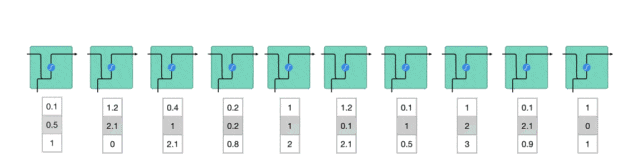
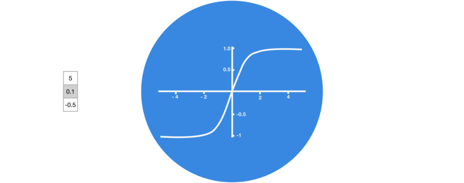
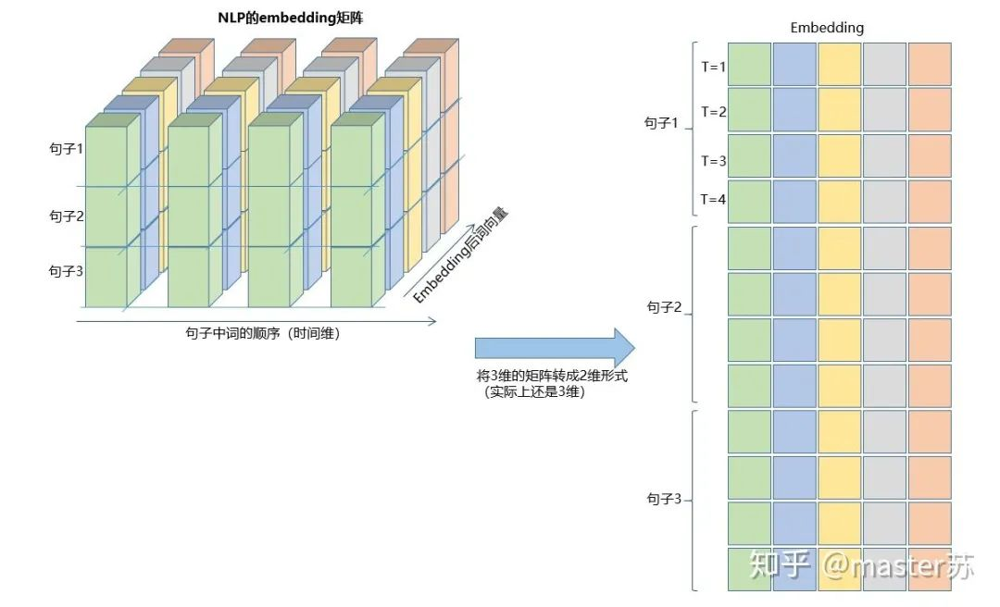

# 长短期记忆网络 -- LSTM


## 一、传统的BP网络和CNN网络

BP网络和CNN网络没有时间维，和传统的机器学习算法理解起来相差无几，CNN在处理彩色图像的3通道时，也可以理解为叠加多层，图形的三维矩阵当做空间的切片即可理解，写代码的时候照着图形一层层叠加即可。如下图是一个普通的BP网络和CNN网络。
<br>
<center>
  
  <br>
  <div style="color: orange; border-bottom:  1px solid #d9d9d9;
  display:  inline-block;
  color:  #999;
  padding:  2px;">BP Network</div>
</center>

<br>
<center>
  
  <br>
  <div style="color: orange; border-bottom:  1px solid #d9d9d9;
  display:  inline-block;
  color:  #999;
  padding:  2px;">CNN Network</div>
</center>

<br>

图中的隐含层、卷积层、池化层、全连接层等，都是实际存在的，一层层前后叠加，在空间上很好理解，因此在写代码的时候，基本就是看图写代码，比如用keras就是:

```python
# 示例代码，没有实际意义
model = Sequential()
model.add(Conv2D(32, (3, 3), activation='relu'))  # 添加卷积层
model.add(MaxPooling2D(pool_size=(2, 2)))         # 添加池化层
model.add(Dropout(0.25))                          # 添加dropout层

model.add(Conv2D(32, (3, 3), activation='relu'))  # 添加卷积层
model.add(MaxPooling2D(pool_size=(2, 2)))         # 添加池化层
model.add(Dropout(0.25))                          # 添加dropout层

....   # 添加其他卷积操作

model.add(Flatten())                            # 拉平三维数组为2维数组
model.add(Dense(256, activation='relu'))        添加普通的全连接层
model.add(Dropout(0.5))
model.add(Dense(10, activation='softmax'))

....  # 训练网络
```

## 二、LSTM网络

RNN网络的机构图如下图所示:

<center>
  
  <br>
  <div style="color: orange; border-bottom:  1px solid #d9d9d9; display:  inline-block; color:  #999; padding:  2px;">2.1 RNN Architecture Overview</div>
</center>
<br>

**<font color=purple>RNN 面临的问题:短时记忆和梯度消失/梯度爆炸</font>**
  - <font color=red>短时记忆</font>
    **问题描述**：RNN在处理长序列时，由于信息的传递是通过隐藏状态进行的，随着时间的推移，较早时间步的信息可能会在传递到后面的时间步时逐渐消失或被覆盖。

    **影响**：这导致RNN难以捕捉和利用序列中的长期依赖关系，从而限制了其在处理复杂任务时的性能。

  - <font color=red>梯度消失/梯度爆炸</font>
    **问题描述**：在RNN的反向传播过程中，梯度会随着时间步的推移而逐渐消失（变得非常小）或爆炸（变得非常大）。

    **影响**：梯度消失使得RNN在训练时难以学习到长期依赖关系，因为较早时间步的梯度信息在反向传播到初始层时几乎为零。梯度爆炸则可能导致训练过程不稳定，权重更新过大，甚至导致数值溢出。

**<font color=blue>LSTM解决问题:</font>**
大脑和LSTM在处理信息时都选择性地保留重要信息，忽略不相关细节，并据此进行后续处理。这种机制使它们能够高效地处理和输出关键信息，解决了RNN（递归神经网络）在处理长序列时面临的问题。

<table><body text=red><tr><td style="text-align:center;font-weight:bold" bgcolor=yellow><font size="3" color="red">大脑记忆机制</font></td></tr></body></table>

- 大脑记忆机制：当浏览评论时，大脑倾向于记住重要的关键词。无关紧要的词汇和内容容易被忽略。回忆时，大脑提取并表达主要观点，忽略细节。

- LSTM门控机制：LSTM通过输入门、遗忘门和输出门选择性地保留或忘记信息，使用保留的相关信息来进行预测，类似于大脑提取并表达主要观点。

图2.1是RNN循环神经网络经典的结构图，LSTM只是对隐含层节点A做了改进，整体结构不变，因此本文讨论的也是这个结构的可视化问题。

中间的A节点隐含层，左边是表示只有一层隐含层的LSTM网络，所谓LSTM循环神经网络就是在时间轴上的循环利用，在时间轴上展开后得到右图。

**上图右边，我们看Xt表示序列，下标t是时间轴，所以，A的数量表示的是时间轴的长度，是同一个神经元在不同时刻的状态(Ht)，不是隐含层神经元个数。**

我们知道，LSTM网络在训练时会使用上一时刻的信息，加上本次时刻的输入信息来共同训练。

举个简单的例子: 在第一天我生病了(初始状态H0)，然后吃药(利用输入信息X1训练网络)，第二天好转但是没有完全好(H1)，再吃药(X2),病情得到好转(H2),如此循环往复知道病情好转。因此，输入Xt是吃药，时间轴T是吃多天的药，隐含层状态是病情状况。因此我还是我，只是不同状态的我。

实际上，LSTM的网络是这样的:

<center>
  
  <br>
  <div style="color: orange; border-bottom:  1px solid #d9d9d9; display:  inline-block; color:  #999; padding:  2px;">LSTM Network</div>
</center>

上面的图表示包含2个隐含层的LSTM网络，在T=1时刻看，它是一个普通的BP网络，在T=2时刻看也是一个普通的BP网络，只是沿时间轴展开后，T=1训练的隐含层信息H,C会被传递到下一个时刻T=2，如下图所示。上图中向右的五个常常的箭头，所指的也是隐含层状态在时间轴上的传递。

<center>
  
  <br>
  <div style="color: orange; border-bottom:  1px solid #d9d9d9; display:  inline-block; color:  #999; padding:  2px;">LSTM Architecture Overview</div>
</center>

注意，图中H表示隐藏层状态，C是遗忘门，后面会讲解它们的维度。

### 2.1 LSTM的原理

<table><body text=red><tr><td style="text-align:left;font-weight:bold" bgcolor=yellow><font size="3" color="red">RNN工作原理:第一个词被转换成了机器可读的向量，然后 RNN 逐个处理向量序列。</font></td></tr></body></table>

<br>
<center>
  
  <br>
  <div style="color:orange; border-bottom: 1px solid #d9d9d9; display: inline-block; color: #999; padding: 2px;">RNN 工作原理</div>
</center>
<br>

- **<font color=purple>隐藏状态的传递</font>**
  过程描述：在处理序列数据时，RNN将前一时间步的隐藏状态传递给下一个时间步。

  作用：隐藏状态充当了神经网络的“记忆”，它包含了网络之前所见过的数据的相关信息。

  重要性：这种传递机制使得RNN能够捕捉序列中的时序依赖关系。

<br>
<center>
  
  <br>
  <div style="color:orange; border-bottom: 1px solid #d9d9d9; display: inline-block; color: #999; padding: 2px;">将隐藏状态传递给下一个时间步</div>
</center>
<br>

- **<font color=purple>隐藏状态的计算</font>**
  细胞结构：RNN的一个细胞接收当前时间步的输入和前一时间步的隐藏状态。

  组合方式：当前输入和先前隐藏状态被组合成一个向量，这个向量融合了当前和先前的信息。

  激活函数：组合后的向量经过一个tanh激活函数的处理，输出新的隐藏状态。这个新的隐藏状态既包含了当前输入的信息，也包含了之前所有输入的历史信息。

<br>
<center>
  
  <br>
  <div style="color:orange; border-bottom: 1px solid #d9d9d9; display: inline-block; color: #999; padding: 2px;">BP Network</div>
</center>
<br>

**<font color=red>输出:</font>**新的隐藏状态被输出，并被传递给下一个时间步，继续参与序列的处理过程。

<br>
<center>
  
  <br>
  <div style="color:orange; border-bottom: 1px solid #d9d9d9; display: inline-block; color: #999; padding: 2px;">RNN的细胞结构和运算</div>
</center>
<br>

<table><body text=red><tr><td style="text-align:center;font-weight:bold" bgcolor=yellow><font size="3" color="fuchsia">LSTM工作原理：</font></td></tr></body></table>

<br>
<center>
  
  <br>
  <div style="color:orange; border-bottom: 1px solid #d9d9d9; display: inline-block; color: #999; padding: 2px;">LSTM的细胞结构和运算</div>
</center>
<br>


- **<font color=red>输入门:</font>**
  作用：决定哪些新信息应该被添加到记忆单元中。

  组成：输入门由一个sigmoid激活函数和一个tanh激活函数组成。sigmoid函数决定哪些信息是重要的，而tanh函数则生成新的候选信息。

  运算：输入门的输出与候选信息相乘，得到的结果将在记忆单元更新时被考虑。


<br>
<center>
  
  <br>
  <div style="color:orange; border-bottom: 1px solid #d9d9d9; display: inline-block; color: #999; padding: 2px;">输入门（sigmoid激活函数 + tanh激活函数）</div>
</center>
<br>

- **<font color=red>遗忘门:</font>**
  作用：决定哪些旧信息应该从记忆单元中遗忘或移除。

  组成：遗忘门仅由一个sigmoid激活函数组成。

<br>
<center>
  
  <br>
  <div style="color:orange; border-bottom: 1px solid #d9d9d9; display: inline-block; color: #999; padding: 2px;">sigmoid激活函数（区间0～1）</div>
</center>
<br>

运算：sigmoid函数的输出直接与记忆单元的当前状态相乘，用于决定哪些信息应该被保留，哪些应该被遗忘。输出值越接近1的信息将被保留，而输出值越接近0的信息将被遗忘。

<br>
<center>
  
  <br>
  <div style="color:orange; border-bottom: 1px solid #d9d9d9; display: inline-block; color: #999; padding: 2px;">遗忘门（sigmoid激活函数）</div>
</center>
<br>

- **<font color=red>输出门:</font>**

  作用：决定记忆单元中的哪些信息应该被输出到当前时间步的隐藏状态中。

  组成：输出门同样由一个sigmoid激活函数和一个tanh激活函数组成。sigmoid函数决定哪些信息应该被输出，而tanh函数则处理记忆单元的状态以准备输出。

  运算：sigmoid函数的输出与经过tanh函数处理的记忆单元状态相乘，得到的结果即为当前时间步的隐藏状态。

<br>
<center>
  
  <br>
  <div style="color:orange; border-bottom: 1px solid #d9d9d9; display: inline-block; color: #999; padding: 2px;">输出门(sigmoid激活函数 + tanh激活函数)</div>
</center>
<br>

## 三、LSTM的输入结构

为了更好理解LSTM结构，还必须理解LSTM的数据输入情况。仿照3通道图像的样子，再加上时间轴后的多样本的多特征的不同时刻的数据立方体如下图所示:

<center>
  
  <br>
  <div style="color: orange; border-bottom:  1px solid #d9d9d9; display:  inline-block; color:  #999; padding:  2px;">Input Structure of LSTM Network</div>
</center>

右边的图是我们常见模型的输入，比如XGBOOST，lightGBM，决策树等模型，输入的数据格式都是这种(N*F)的矩阵，而左边是加上时间轴后的数据立方体，也就是时间轴上的切片，它的维度是(N*T*F),第一维度是样本数，第二维度是时间，第三维度是特征数，如下图所示:


<center>
  
  <br>
  <div style="color: orange; border-bottom:  1px solid #d9d9d9; display:  inline-block; color:  #999; padding:  2px;">天气数据立方体</div>
</center>

这样的数据立方体很多，比如天气预报数据，把样本理解成城市，时间轴是日期，特征是天气相关的降雨风速PM2.5等，这个数据立方体就很好理解了。在NLP里面，一句话会被embedding成一个矩阵，词与词的顺序是时间轴T，索引多个句子的embedding三维矩阵如下图所示:

<center>
  
  <br>
  <div style="color: orange; border-bottom:  1px solid #d9d9d9; display:  inline-block; color:  #999; padding:  2px;">NLP Embedding Matrix</div>
</center>

## 四、Pytorch中的LSTM

### 4.1 Pytorch中定义的LSTM模型

pytorch中定义的LSTM模型的参数如下

```python
class torch.nn.LSTM(*args, **kwargs)
参数有:
  - input_size: x的特征维度
  - hidden_size: 隐藏层的特征维度
  - num_layers: lstm隐层的层数，默认为1
  - bias: False则bihbih=0和bhhbhh=0. 默认为True
  - batch_first: True则输入输出的数据格式为 (batch, seq, feature)
  - dropout: 除最后一层，每一层的输出都进行dropout，默认为:  0
  - bidirectional: True则为双向lstm默认为False
```

结合前面的图形，我们一个个看。

(1)input_size: x的特征维度，就是数据立方体中的F，在NLP中就是一个词被embedding后的向量长度，如下图所示:

<center>
  
  <br>
  <div style="color:orange; border-bottom: 1px solid #d9d9d9; display: inline-block; color: #999; padding: 2px;">LSTM Feature Matrix</div>
</center>

(2)hidden_size: 隐藏层的特征维度(隐藏层神经元个数)，如下图所示，我们有两个隐含层，每个隐藏层的特征维度都是5。注意，**非双向LSTM的输出维度等于隐藏层的特征维度**。

<br>
<center>
  
  <br>
  <div style="color:orange; border-bottom: 1px solid #d9d9d9; display: inline-block; color: #999; padding: 2px;">隐藏层特征维度</div>
</center>
<br>


(3)num_layers: lstm隐层的层数，上面的图我们定义了2个隐藏层。
(4)batch_first: 用于定义输入输出维度，后面再讲。
(5)bidirectional: 是否是双向循环神经网络，如下图是一个双向循环神经网络，因此在使用双向LSTM的时候我需要特别注意，正向传播的时候有(Ht, Ct),反向传播也有(Ht', Ct'),前面我们说了非双向LSTM的输出维度等于隐藏层的特征维度，而**双向LSTM的输出维度是隐含层特征数*2，而且H,C的维度是时间轴长度*2**。

<br>
<center>
  
  <br>
  <div style="color:orange; border-bottom: 1px solid #d9d9d9; display: inline-block; color: #999; padding: 2px;">Bidirectional RNN</div>
</center>
<br>

### 4.2 喂给LSTM的数据格式

pytorch中LSTM的输入数据格式默认如下:

```python
input(seq_len, batch, input_size)
参数有:
  - seq_len: 序列长度，在NLP中就是句子长度，一般都会用pad_sequence补齐长度
  - batch: 每次喂给网络的数据条数，在NLP中就是一次喂给网络多少个句子
  - input_size: 特征维度，和前面定义网络结构的input_size一致。
```

前面也说到，如果LSTM的参数 batch_first=True，则要求输入的格式是:

```python
input(batch, seq_len, input_size)
```

刚好调换前面两个参数的位置。其实这是比较好理解的数据形式，下面以NLP中的embedding向量说明如何构造LSTM的输入。

之前我们的embedding矩阵如下图:
<br>
<center>
  
  <br>
  <div style="color:orange; border-bottom: 1px solid #d9d9d9; display: inline-block; color: #999; padding: 2px;">Embedding Matrix</div>
</center>
<br>

如果把batch放在第一位，则三维矩阵的形式如下:

<br>
<center>
  
  <br>
  <div style="color:orange; border-bottom: 1px solid #d9d9d9; display: inline-block; color: #999; padding: 2px;">Batch First</div>
</center>
<br>

其转换过程如下图所示:
<br>
<center>
  
  <br>
  <div style="color:orange; border-bottom: 1px solid #d9d9d9; display: inline-block; color: #999; padding: 2px;">将三维矩阵转换成二维形式</div>
</center>
<br>

看懂了吗，这就是输入数据的格式，是不是很简单。
LSTM的另外两个输入是 h0 和 c0，可以理解成网络的初始化参数，用随机数生成即可。

```python
h0(num_layers * num_directions, batch, hidden_size)
c0(num_layers * num_directions, batch, hidden_size)
参数:
  - num_layers: 隐藏层数
  - num_directions: 如果是单向循环网络，则num_directions=1，双向则num_directions=2
  - batch: 输入数据的batch
  - hidden_size: 隐藏层神经元个数
```
注意，如果我们定义的input格式是:
```python
input(batch, seq_len, input_size)
```

则H和C的格式也是要变的:

```python
h0(batc，num_layers * num_directions, h, hidden_size)
c0(batc，num_layers * num_directions, h, hidden_size)
```

### 4.3 LSTM的output格式

LSTM的输出是一个tuple，如下:

```python
output,(ht, ct) = net(input)
  - output:  最后一个状态的隐藏层的神经元输出
  - ht: 最后一个状态的隐含层的状态值
  - ct: 最后一个状态的隐含层的遗忘门值
```
output的默认维度是:

```python
output(seq_len, batch, hidden_size * num_directions)
ht(num_layers * num_directions, batch, hidden_size)
ct(num_layers * num_directions, batch, hidden_size)
```

和input的情况类似，如果我们前面定义的input格式是:

```python
input(batch, seq_len, input_size)
```

则ht和ct的格式也是要变的:

```python
ht(batc，num_layers * num_directions, h, hidden_size)
ct(batc，num_layers * num_directions, h, hidden_size)
```

说了这么多，我们回过头来看看ht和ct在哪里，请看下图:
<br>
<center>
  
  <br>
  <div style="color:orange; border-bottom: 1px solid #d9d9d9; display: inline-block; color: #999; padding: 2px;">LSTM Network</div>
</center>
<br>

output在哪里？请看下图:
<br>
<center>
  
  <br>
  <div style="color:orange; border-bottom: 1px solid #d9d9d9; display: inline-block; color: #999; padding: 2px;">输出层</div>
</center>
<br>

## 五、LSTM和其他网络组合

还记得吗，output的维度等于隐藏层神经元的个数，即hidden_size，在一些时间序列的预测中，会在output后，接上一个全连接层，全连接层的输入维度等于LSTM的hidden_size，之后的网络处理就和BP网络相同了，如下图:

<br>
<center>
  
  <br>
  <div style="color:orange; border-bottom: 1px solid #d9d9d9; display: inline-block; color: #999; padding: 2px;">在LSTM网络后接上全连接层</div>
</center>
<br>

用pytorch实现上面的结构:
```python
import torch
from torch import nn

class RegLSTM(nn.Module):
    def __init__(self):
        super(RegLSTM, self).__init__()
        # 定义LSTM
        self.rnn = nn.LSTM(input_size, hidden_size, hidden_num_layers)
        # 定义回归层网络，输入的特征维度等于LSTM的输出，输出维度为1
        self.reg = nn.Sequential(
            nn.Linear(hidden_size, 1)
        )

    def forward(self, x):
        x, (ht,ct) = self.rnn(x)
        seq_len, batch_size, hidden_size= x.shape
        x = y.view(-1, hidden_size)
        x = self.reg(x)
        x = x.view(seq_len, batch_size, -1)
        return x
```

当然，有些模型则是将输出当做另一个LSTM的输入，或者使用隐藏层ht,ct的信息进行建模，不一而足。
好了，以上就是我对LSTM的一些学习心得，看完记得关注点赞。


REF:
  [[1]. 漂亮，LSTM模型结构的可视化](https: //mp.weixin.qq.com/s?__biz=MzU1OTYzNjg5OQ==&mid=2247545117&idx=1&sn=670ba155d94b229d39c5bf0bf20239d5&chksm=fc1639d1cb61b0c72434a00454b2af8f9022e7ac3030a4186cda22ef5594ef5994620dc5fd52&mpshare=1&scene=1&srcid=0617kfSozC3sKY1lRjYg1f0u&sharer_shareinfo=6833fdea9df7fee2c423a9474c0928be&sharer_shareinfo_first=6833fdea9df7fee2c423a9474c0928be#rd)
  [2].https: //zhuanlan.zhihu.com/p/94757947
  [3].https: //zhuanlan.zhihu.com/p/59862381
  [4].https: //zhuanlan.zhihu.com/p/36455374
  [5].https: //www.zhihu.com/question/41949741/answer/318771336
  [6].https: //blog.csdn.net/android_ruben/article/details/80206792
  to be added: <br>
  [7].https: //www.analyticsvidhya.com/blog/2021/01/understanding-architecture-of-lstm/
  [8]. [神经网络算法 - 一文搞懂LSTM(长短期记忆网络)](https://mp.weixin.qq.com/s/p1jmj__DQIwDMDTCExHs5Q)


---

> 作者: [Jian YE](https://github.com/jianye0428)  
> URL: https://jianye0428.github.io/posts/lstm/  

