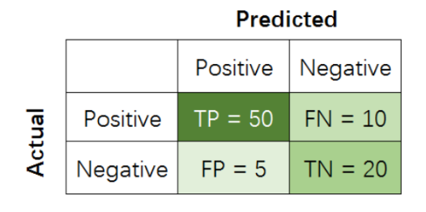

# Classification and Regression Metrics


ref:</br>
[1] https://www.cnblogs.com/rushup0930/p/13359513.html</br>
[2] https://blog.csdn.net/u013250861/article/details/123029585#t12</br>
[3] https://blog.csdn.net/wf592523813/article/details/95202448</br>
[4] https://zhuanlan.zhihu.com/p/69101372</br>

# classification 分类

主要涉及的知识点：

- 混淆矩阵、Precision(精准率)、Recall(召回率)、Accuracy(准确率)、F1-score    （包括二分类和多分类问题）
- ROC、AUC

> 最常见的指标Accuracy到底有哪些不足？
> 解: Accuracy是分类问题中最常用的指标，它计算了分类正确的预测数与总预测数的比值。但是，<font color=red>对于不平衡数据集而言，Accuracy并不是一个好指标</font>。
> 假设我们有100张图片，其中91张图片是「狗」，5张是「猫」，4张是「猪」，我们希望训练一个三分类器，能正确识别图片里动物的类别。其中，狗这个类别就是大多数类 (majority class)。当大多数类中样本（狗）的数量远超过其他类别（猫、猪）时，如果采用Accuracy来评估分类器的好坏，那么即便模型性能很差 (如无论输入什么图片，都预测为「狗」)，也可以得到较高的Accuracy Score (如91%)。此时，虽然Accuracy Score很高，但是意义不大。当数据异常不平衡时，Accuracy评估方法的缺陷尤为显著。

## 二分类模型的常见指标

在二分类问题中，假设该样本一共有两种类别：Positive和Negative。当分类器预测结束，我们可以绘制出混淆矩阵（confusion matrix）。其中分类结果分为如下几种：



- True Positive (TP): 把正样本成功预测为正。
- True Negative (TN)：把负样本成功预测为负。
- False Positive (FP)：把负样本错误地预测为正。
- False Negative (FN)：把正样本错误的预测为负。

> 一个小技巧， <font color=red>第一个字母表示划分正确与否</font>， T 表示判定正确（判定正确）， F表示判定错误(False)； <font color=red>第二个字母表示分类器判定结果</font>， P表示判定为正例， N表示判定为负例。

在二分类模型中，Accuracy，Precision，Recall和F1 score的定义如下：

$$\text{Accuracy} = \frac{TP + TN}{TP + TN + FP + FN}$$
>> Accuracy 能够清晰的判断我们模型的表现，但有一个严重的缺陷： 在正负样本不均衡的情况下，占比大的类别往往会成为影响 Accuracy 的最主要因素，此时的 Accuracy 并不能很好的反映模型的整体情况。

$$\text{Precision} = \frac{TP}{TP + FP}$$

>> Precision着重评估在预测为Positive的所有数据中，真实Positve的数据到底占多少？

精确率高，意味着分类器要尽量在 “更有把握” 的情况下才将样本预测为正样本， 这意味着精确率能够很好的体现模型对于负样本的区分能力，精确率越高，则模型对负样本区分能力越强。

$$\text{Recall} = \frac{TP}{TP + FN}$$

>> Recall着重评估：在所有的Positive数据中，到底有多少数据被成功预测为Positive

召回率高，意味着分类器尽可能将有可能为正样本的样本预测为正样本，这意味着<font color=red>召回率能够很好的体现模型对于正样本的区分能力，召回率越高，则模型对正样本的区分能力越强</font>。

**举例**:

一个医院新开发了一套癌症AI诊断系统，想评估其性能好坏。我们把病人得了癌症定义为Positive，没得癌症定义为Negative。那么， 到底该用什么指标进行评估呢？

- 如用Precision对系统进行评估，那么其回答的问题就是：
    > 在诊断为癌症的一堆人中，到底有多少人真得了癌症？
- 如用Recall对系统进行评估，那么其回答的问题就是：
    > 在一堆得了癌症的病人中，到底有多少人能被成功检测出癌症？
- 如用Accuracy对系统进行评估，那么其回答的问题就是：
    > 在一堆癌症病人和正常人中，有多少人被系统给出了正确诊断结果（患癌或没患癌）？

<font color=red>那啥时候应该更注重Recall而不是Precision呢？</font>

> 当False Negative (FN)的成本代价很高 (后果很严重)，希望尽量避免产生FN时，应该着重考虑提高Recall指标。

<font color=red>那啥时候应该更注重Precision而不是Recall呢？</font>

> 当False Positive (FP)的成本代价很高 (后果很严重)时，即期望尽量避免产生FP时，应该着重考虑提高Precision指标。

$$\text{F1-score} = \frac{2 \times Precision \times Recall}{Precision + Recall}$$

而F1-score是Precision和Recall两者的综合。

举个更有意思的例子（我拍脑袋想出来的，绝对原创哈），假设检察机关想将罪犯捉拿归案，需要对所有人群进行分析，以判断某人犯了罪（Positive），还是没犯罪（Negative）。显然，检察机关希望不漏掉一个罪人（提高recall），也不错怪一个好人（提高precision），所以就需要同时权衡recall和precision两个指标。

尤其在上个世纪，中国司法体制会更偏向Recall，即「天网恢恢，疏而不漏，任何罪犯都插翅难飞」。而西方司法系统会更偏向Precision，即「绝不冤枉一个好人，但是难免有罪犯成为漏网之鱼，逍遥法外」。到底是哪种更好呢？显然，极端并不可取。Precision和Recall都应该越高越好，也就是F1应该越高越好。

**<font color=green>如何通俗的解释召回率与精确率？</font>**

> 例：公园里有50只皮卡丘和10只臭臭泥。有正常审美的人都会想要用精灵球把尽可能多的皮卡丘抓回来，同时尽可能少地抓住臭臭泥。 最终我们的精灵球成功抓回来了45只皮卡丘和10只臭臭泥。
我们就可以说50只皮卡丘中有45只被召唤 (call) 回来 (re) 了，所以 recall = 45 / 50。
但同时，这台机器还误把5只臭臭泥识别为皮卡丘，在它抓回来的所有55只神奇宝贝中，精灵球对皮卡丘判断的精准性 (precision)  = 45 / 55。
在上面的例子中，精灵球=预测模型，皮卡丘=正样本，臭臭泥=负样本。
>总结这两个概念的用处：描述模型对正样本的预测性能
1、recall描述模型“把正样本叫 (call) 回来(re)”的能力。
2、precision描述模型“叫回来的正样本”有多少是精确的。

## AOC / AUC

混淆矩阵中有着Positive、Negative、True、False的概念，其意义如下：

- 称预测类别为1的为Positive（阳性），预测类别为0的为Negative（阴性）。
- 预测正确的为True（真），预测错误的为False（伪）。

对上述概念进行组合，就产生了如下的混淆矩阵:


然后，由此引出True Positive Rate（真阳率）、False Positive（伪阳率）两个概念：

$$TP Rate = \frac{TP}{TP + FN}$$
$$FP Rate = \frac{FP}{FP + TN}$$

仔细看这两个公式，发现其实TPRate就是TP除以TP所在的列，FPRate就是FP除以FP所在的列，二者意义如下：

- TPRate的意义是所有真实类别为1的样本中，预测类别为1的比例。
- FPRate的意义是所有真实类别为0的样本中，预测类别为1的比例。


如果上述概念都弄懂了，那么ROC曲线和AUC就so easy了：

按照定义，AUC即ROC曲线下的面积，而ROC曲线的横轴是FPRate，纵轴是TPRate，当二者相等时，即y=x，如下图:


表示的意义是：对于不论真实类别是1还是0的样本，分类器预测为1的概率是相等的。

换句话说，分类器对于正例和负例毫无区分能力，和抛硬币没什么区别，一个抛硬币的分类器是我们能想象的最差的情况，因此一般来说我们认为AUC的最小值为0.5（当然也存在预测相反这种极端的情况，AUC小于0.5，这种情况相当于分类器总是把对的说成错的，错的认为是对的，那么只要把预测类别取反，便得到了一个AUC大于0.5的分类器）。

而我们希望分类器达到的效果是：对于真实类别为1的样本，分类器预测为1的概率（即TPRate），要大于真实类别为0而预测类别为1的概率（即FPRate），即y＞x，因此大部分的ROC曲线长成下面这个样子：


说了这么多还是不够直观，不妨举个简单的例子。

首先对于硬分类器（例如SVM，NB），预测类别为离散标签，对于8个样本的预测情况如下：


得到混淆矩阵如下：


进而算得TPRate=3/4，FPRate=2/4，得到ROC曲线：


最终得到AUC为0.625。

对于LR等预测类别为概率的分类器，依然用上述例子，假设预测结果如下：


这时，需要设置阈值来得到混淆矩阵，不同的阈值会影响得到的TPRate，FPRate，如果阈值取0.5，小于0.5的为0，否则为1，那么我们就得到了与之前一样的混淆矩阵。其他的阈值就不再啰嗦了。依次使用所有预测值作为阈值，得到一系列TPRate，FPRate，描点，求面积，即可得到AUC。

最后说说AUC的优势，AUC的计算方法同时考虑了分类器对于正例和负例的分类能力，在样本不平衡的情况下，依然能够对分类器作出合理的评价。

例如在反欺诈场景，设欺诈类样本为正例，正例占比很少（假设0.1%），如果使用准确率评估，把所有的样本预测为负例，便可以获得99.9%的准确率。

但是如果使用AUC，把所有样本预测为负例，TPRate和FPRate同时为0（没有Positive），与(0,0) (1,1)连接，得出AUC仅为0.5，成功规避了样本不均匀带来的问题。

## 多分类模型的常见指标详细解析

在多分类（大于两个类）问题中，假设我们要开发一个动物识别系统，来区分输入图片是猫，狗还是猪。给定分类器一堆动物图片，产生了如下结果混淆矩阵。


在混淆矩阵中，正确的分类样本（Actual label = Predicted label）分布在左上到右下的对角线上。其中，Accuracy的定义为分类正确（对角线上）的样本数与总样本数的比值。**Accuracy度量的是全局样本预测情况。而对于Precision和Recall而言，每个类都需要单独计算其Precision和Recall。**
classify_multiclass_prediction


比如，对类别「猪」而言，其Precision和Recall分别为:

$$\text{Precision} = \frac{TP}{TP + FP} = \frac{20}{20 + 50} = \frac{2}{7}$$

$$\text{Recall} = \frac{TP}{TP + FN} = \frac{20}{10} = \frac{2}{3}$$

也就是:
$$P_{cat} = \frac{8}{15}, P_{dog} = \frac{17}{23}, P_{pig} = \frac{2}{7}, (P代表Precision) $$
$$R_{cat} = \frac{4}{7}, R_{dog} = \frac{17}{32}, R_{pig} = \frac{2}{3}, (R代表Recall) $$

如果想评估该识别系统的总体功能，必须考虑猫、狗、猪三个类别的综合预测性能。那么，到底要怎么综合这三个类别的Precision呢？是简单加起来做平均吗？通常来说， 我们有如下几种解决方案（[也可参考scikit-learn官网](https://link.zhihu.com/?target=https%3A//scikit-learn.org/stable/modules/generated/sklearn.metrics.precision_score.html)）：

**1. Macro-average方法**
该方法最简单，直接将不同类别的评估指标（Precision/ Recall/ F1-score）加起来求平均，给所有类别相同的权重。该方法能够平等看待每个类别，但是它的值会受**稀有类别**影响。

$$\text{Macro-Precision} = \frac{P_{cat} + P_{dog} + P_{pig}}{3} = 0.5194$$
$$\text{Macro-Recall} = \frac{R_{cat} + R_{dog} + R_{pig}}{3} = 0.5898$$

**2. Weighted-average方法**

该方法给不同类别不同权重（权重根据该类别的真实分布比例确定），每个类别乘权重后再进行相加。该方法考虑了类别不平衡情况，它的值更容易受到常见类（majority class）的影响。


$$W_{cat} : W_{dog} : W_{pig} = N_{cat} : N_{dog} : N_{pig} = \frac{7}{26} : \frac{16}{26} : \frac{3}{26} (W代表权重，N代表样本在该类别下的真实数目)$$
$$\text{Weighted-Precision} = P_{cat} \times W_{cat} + P_{dog} \times W_{dog} + P_{pig} \times W_{pig} = 0.6314$$
$$\text{Weighted-Recall} = {R_{cat} \times W_{cat} + R_{dog} \times W_{dog} + R_{pig} \times W_{pig}}= 0.5577$$


**3. Micro-average方法**

该方法把每个类别的TP, FP, FN先相加之后，在根据二分类的公式进行计算。

$$\text{Micro-Precision} = \frac{TP_{cat} + TP_{dog} + TP_{pig}}{TP_{cat} + TP_{dog} + TP_{pig} + FP_{cat} + FP_{dog} + FP_{pig}} = 0.5577$$
$$\text{Micro-Recall} = \frac{TP_{cat} + TP_{dog} + TP_{pig}}{TP_{cat} + TP_{dog} + TP_{pig} + FN_{cat} + FN_{dog} + FN_{pig}} = 0.5577$$


其中，特别有意思的是，<u>Micro-precision 和 Micro-recall竟然始终相同！</u>这是为啥呢？

这是因为在某一类中的False Positive样本，一定是其他某类别的False Negative样本。听起来有点抽象？举个例子，比如说系统错把「狗」预测成「猫」，那么对于狗而言，其错误类型就是False Negative，对于猫而言，其错误类型就是False Positive。于此同时，Micro-precision和Micro-recall的数值都等于Accuracy，因为它们计算了对角线样本数和总样本数的比值，总结就是

$$\text{Micro-Precision} = \text{Micro-Recall} = \text{Micro-F1 score} = \text{Accuracy}$$


demo示例:
```python
import numpy as np
import seaborn as sns
from sklearn.metrics import confusion_matrix
import pandas as pd
import matplotlib.pyplot as plt
from sklearn.metrics import accuracy_score, average_precision_score,precision_score,f1_score,recall_score

# create confusion matrix
y_true = np.array([-1]*70 + [0]*160 + [1]*30)
y_pred = np.array([-1]*40 + [0]*20 + [1]*20 +
                  [-1]*30 + [0]*80 + [1]*30 +
                  [-1]*5 + [0]*15 + [1]*20)
cm = confusion_matrix(y_true, y_pred)
conf_matrix = pd.DataFrame(cm, index=['Cat','Dog','Pig'], columns=['Cat','Dog','Pig'])

# plot size setting
fig, ax = plt.subplots(figsize = (4.5,3.5))
sns.heatmap(conf_matrix, annot=True, annot_kws={"size": 19}, cmap="Blues")
plt.ylabel('True label', fontsize=18)
plt.xlabel('Predicted label', fontsize=18)
plt.xticks(fontsize=18)
plt.yticks(fontsize=18)
plt.savefig('confusion.pdf', bbox_inches='tight')
plt.show()

print('------Weighted------')
print('Weighted precision', precision_score(y_true, y_pred, average='weighted'))
print('Weighted recall', recall_score(y_true, y_pred, average='weighted'))
print('Weighted f1-score', f1_score(y_true, y_pred, average='weighted'))
print('------Macro------')
print('Macro precision', precision_score(y_true, y_pred, average='macro'))
print('Macro recall', recall_score(y_true, y_pred, average='macro'))
print('Macro f1-score', f1_score(y_true, y_pred, average='macro'))
print('------Micro------')
print('Micro precision', precision_score(y_true, y_pred, average='micro'))
print('Micro recall', recall_score(y_true, y_pred, average='micro'))
print('Micro f1-score', f1_score(y_true, y_pred, average='micro'))
```

# Regression 回归

回归算法的评价指标就是MSE，RMSE，MAE、R-Squared。

　　MSE和MAE适用于误差相对明显的时候，大的误差也有比较高的权重，RMSE则是针对误差不是很明显的时候；MAE是一个线性的指标，所有个体差异在平均值上均等加权，所以它更加凸显出异常值，相比MSE；

　　RMSLE: 主要针对数据集中有一个特别大的异常值，这种情况下，data会被skew，RMSE会被明显拉大，这时候就需要先对数据log下，再求RMSE，这个过程就是RMSLE。对低估值（under-predicted）的判罚明显多于估值过高(over-predicted)的情况（RMSE则相反）

---

> 作者: [Jian YE](https://github.com/jianye0428)  
> URL: https://lruihao.cn/posts/metrics/  

