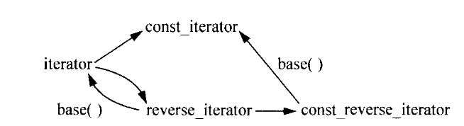
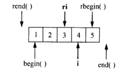

# Effective STL 精读总结 [4] | 迭代器


# 前言

> Effective-STL总结系列分为七部分，本文为第四部分，涉及原书第四章，内容范围Rule26~29。为方便书写，Rule26简写为R26。


本博客站点系列内容如下：</br>
💡 [Effective STL(第3版) 精读总结(一)](https://jianye0428.github.io/posts/partone/)</br>
💡 [Effective STL(第3版) 精读总结(二)](https://jianye0428.github.io/posts/parttwo/)</br>
💡 [Effective STL(第3版) 精读总结(三)](https://jianye0428.github.io/posts/partthree/)</br>
💡 [Effective STL(第3版) 精读总结(四)](https://jianye0428.github.io/posts/partfour/)</br>


## R26: iterator 优先于 const_interator、reverse_interator 及 const_reverse_interator

1. STL中所有的标准容器都提供了4种迭代器类型，对容器类container<T>而言，iterator类型相当于T*，const_iterator相当于const T*。reverse_iterator和const_reverse_iterator递增的效果是从容器的尾部反向遍历到头部。
2. 对于vector容器的insert函数和erase函数，这些函数只接受iterator类型的参数，而不是const_iterator、reverse_iterator或者const_reverse_iterator。下面这张图展示了不同类型迭代器之间的关系。黑色箭头，并且上面未标函数的表示隐式类型转换，标函数的表示显示类型转换，但是需要注意的是，通过base()得到的迭代器或许并非是你期望的迭代器类型。也可以看出想隐式转换const_iterator到iterator是不可行的。从reverse_iterator转换来的iterator在使用之前可能需要进行相应的调整，条款28将更详细地说明这一点。由此可见，尽量使用iterator，而不是const或reverse型的迭代器，可以使容器的使用更为简单有效，并且可以避免潜在的问题。

不同类型的迭代器之间的关系:


3. 假设有个iterator i和一个const_iterator ci指向同一个对象，但是在比较这两个迭代器时，即if(i == ci)的结果却是假，甚至不能通过编译，因为这些STL实现将const_iterator的operator==作为成员函数，而不是一个非成员函数，ci不能隐式转成i，但是i可以隐式转成ci，所以判断if(ci == i)是真。避免这种问题最简单的办法是减少混用不同类型的迭代器，尽量使用iterator来代替const_iterator。

## R27: 使用 distance 和 advance 将容器的 const_interator 转换成 iterator

1. 首先考虑类型转换达到该条款的目的，包括两种代码，Iter i(ci);和Iter i(const_cast<Iter>(ci));，这两种代码都不能通过编译，原因在于iterator和const_iterator是完全不同的两个类，相当于int和complex<double>之间互转，当然不可能成功。不过对于vector和string来说，上面的代码可能通过编译，因为大多数STL将vector<T>::iterator和vector<T>::const_iterator分别定义为T*和const T*，string::iterator和string::const_iterator定义为char*和const char*，因此对于这两个容器强转可能是成功的，但是即使在这两个容器种，reverse_iterator和const_reverse_iterator仍然是两个类，它们之间是不能强转的。
2. 可以通过distance函数进行转换，代码如下：
   ```c++
    typedef deque<int> IntDeque;
    typedef IntDeque::iterator Iter;
    typedef IntDeque::const_iterator ConstIter;

    IntDeque d;
    ConstIter ci;
    Iter i(d.begin());
    advance(i, distance(i, ci));//目前不能通过编译，但是思想是通过distance计算出ci和begin之间的距离，然后移动这么多距离
   ```
   上面这个程序不能通过编译的原因是distance函数只能接受一种类型的迭代器，而i和ci是两种不同的迭代器。要通过编译最简单的方法是显示指定distance使用的类型，即advance(i, distance<ConstIter>(i, ci));除了达成效率，再考虑这么做的效率如何，它的执行效率取决于你使用的迭代器，对于随机访问迭代器（vector、string和deque），它是常数时间操作，对于双向迭代器（其他所有），它是线性时间操作。

## R28: 正确理解由reverse_iterator的base()成员函数所产生的iterator的用法



假设通过reverse_iterator查找容器中值为3的元素，ri表示3的位置，但是在调用base()函数将其转换成iterator类型时，因为偏移变成i所指向的位置。假设要在ri的位置插入新元素，我们预期新元素会插入在现在元素3的位置，然后3和其后的元素需要往右移动一个位置，但是因为insert会将新元素插入到迭代器指向位置的前面，而逆序遍历的顺序是由后向前的，所以会将新元素插入在3的“后面”，实际对reverse_iterator来说就是“前面”。所以如果是在reverse_iterator类型ri位置插入，只需要在ir.base()位置插入即可。但是如果是在ri位置删除元素，则需要在ri.base()位置前面的位置执行删除。但是其中还是有坑，请看如下代码：

```c++
//这段代码通不过编译
vector<int> v;
vector<int>::reverse_iterator ri = find(v.rbegin(), v.rend(), 3);
v.erase(--ri.base());//iterator的--是左移，reverse_iterator的--是右移
```
这段代码对于vector和string不能通过编译的原因在于，这两种容器的iterator和const_iterator是以内置指针的方式实现的，所以ri.base()的结果是一个指针，而C和C++都规定了从函数返回的指针不应该被修改。所以必须换个调用方式：v.erase((++ri).base());，先让ri左移再取指针。

## R29: 对于逐个字符的输入请考虑使用istreambuf::iterator

假设你想将一个文本文件中的内容拷贝到一个string对象中，考虑如下的实现方式：

```c++
ifstream inputFile("inputData.txt");
string fileData((istream_iterator<char>(inputFile)), istream_iterator<char>());//注意第一个参数用括号包起来
```

但是这种读取方式是不包含空白字符的，因为istream_iterator使用operator>>完成读操作，而默认情况下operator>>会跳过空白字符，假定你要保留空白字符，可以更改这种默认行为，如下代码:

```c++
ifstream inputFile("inputData.txt");
inputFile.unsetf(ios::skipws);
string fileData((istream_iterator<char>(inputFile)), istream_iterator<char>());//注意第一个参数用括号包起来
```

上述代码是可以完成要求的功能的，但是你会发现它并不够快，istream_iterator内部使用的operator>>实际上执行了格式化输出，这意味着每次调用operator>>操作符，都会执行许多附加的操作。一种更为有效的途径是使用istreambuf_iterator，istreambuf_iterator的使用方法与istream_iterator大致相同，但是istream_iterator<char>使用operator>>从输入流中读取单个字符，而istreambuf_iterator<char>从一个输入流的缓冲区读取下一个字符。使用的代码就是将istream_iterator改成istreambuf_iterator。

```c++
ifstream inputFile("inputData.txt");
string fileData((istreambuf_iterator<char>(inputFile)), istreambuf_iterator<char>());//注意第一个参数用括号包起来
```

同样对于非格式化的逐个字符的输出，也可以考虑使用ostreambuf_iterator替换ostream_iterator。

ref:
[1]. https://www.cnblogs.com/Sherry4869/p/15128250.html</br>
[2]. https://blog.csdn.net/zhuikefeng/article/details/108164117#t42</br>
[3]. https://zhuanlan.zhihu.com/p/458156007

---

> 作者: [Jian YE](https://github.com/jianye0428)  
> URL: https://jianye0428.github.io/posts/partfour/  

