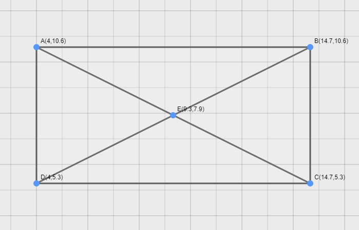
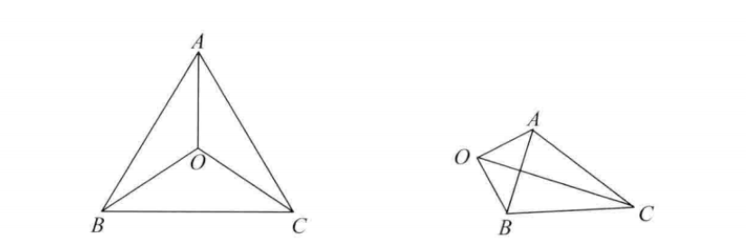
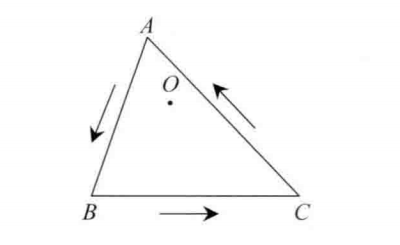
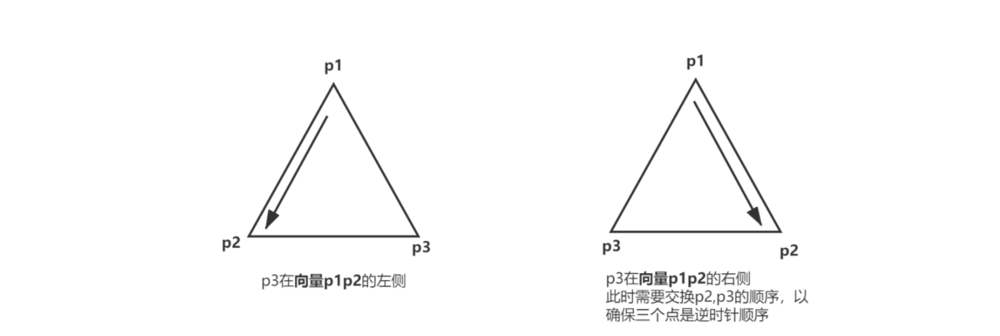

# 点、线、面之间的关系


## 1. 点到直线的距离
<mark>**<font color=red>第一种:</font>**</mark>
本文默认情况下，直线的方程为 $l:Ax+By+C=0$，$A$, $B$ 均不为0，斜率为 $k\_l$，点的坐标为P(x0, y0)，点 $P$ 到 $l$ 的距离为 $d$ 。

则距离为:

$$d=\frac{|Ax\_0+By\_0+C|}{\sqrt{A^2+B^2}}$$

推导过程如下: https://zhuanlan.zhihu.com/p/26307123

<mark>**<font color=red>第二种:</font>**</mark>
直线的方程为 $l: y = ax + b$，$a$, $b$ 均不为0，斜率为 $a$，点的坐标为P(x0, y0)，点 $P$ 到直线 $l$ 的距离为 $d$ 。

$$d=\frac{|ax\_{0} - y\_{0} + b|}{\sqrt{a^2+b^2}}$$

## 2. 如何判断两点在直线的两侧

<mark>**<font color=red>判断点在直线的一侧:</font>**</mark>

**方法一:**

已知 $P(0,0)$, $Q(3,2)$ 两点，试判断 $P$ , $Q$是否在直线 $2x+3y=4$ 的同一侧。

解：直线2x+3y=4, 即直线2x+3y-4=0, 把P、Q代入2x+3y-4得到:

$$2 \times 0 + 3 \times 0-4=-4<0$$

$$2 {\times} 3+3 {\times} 2 - 4 = 8 > 0$$

所以，在**两侧**。

**方法2:**

> 怎么判断坐标为(xp,yp)的点P是在直线的哪一侧呢?

设直线是由其上两点 $(x\_1,y\_1)$，$(x\_2,y\_2)$ 确定的，直线方向是由 $(x\_1,y\_1)$ 到 $(x\_2,y\_2)$ 的方向。

假设直线方程为：$Ax+By+C=0$，则有:

$A=y2-y1$; $B=x1-x2$; $C=x2*y1-x1*y2$;

$$\left\\{\begin{aligned}
A&=y\_2-y\_1\\\\
B&=x\_1-x\_2\\\\
C&=x\_2*y\_1-x\_1*y\_2
\end{aligned}\right.$$

这时可以通过计算D,来判断点P是在直线的哪一侧:

$$D=A*x\_p+B*y\_p+C$$

若D<0, 则点P在直线的左侧;
若D>0, 则点P在直线的右侧;
若D=0, 则点P在直线上。

> 注：这里的直线是有方向性的！

**方法3：**

> 利用矢量计算快速判定一点在直线的哪一侧!

例如矢量A×矢量B=矢量C

设想矢量A沿小于180度的角度转向矢量B

将右手的四指指向矢量A的方向，右手的四指弯曲代表上述旋转方向，则伸直的拇指指向它们的叉乘得到的矢量C

如果矢量C的方向相同，则在同侧；否则在两侧。

> 注：叉乘计算公式！

若将向量用坐标表示（三维向量），向量 $a=(x\_1,y\_1,z\_1)$，向量 $b=(x\_2,y\_2,z\_2)$，则：

**点乘**，也叫向量的内积、数量积。

$$向量a·向量b = |a||b|cos\theta$$
$$向量a·向量b = x\_1 * x\_2 + y\_1 * y\_2 + z\_1 * z\_2$$

**叉乘**，也叫向量的外积、向量积。

$$|向量c| = |向量a×向量b| = |a||b|sin \theta$$

向量c的方向与a,b所在的平面垂直，且方向要用“右手法则”判断（用右手的四指先表示向量a的方向，然后手指朝着手心的方向<180摆动到向量b的方向，大拇指所指的方向就是向量c的方向）；

$$a\times b=\begin{vmatrix}\mathrm{i}&\mathrm{j}&\mathrm{k}\\\\x\_{1}&y\_{1}&z\_{1}\\\\x\_{2}&y\_{2}&z\_{2}\end{vmatrix}=(y\_{1}z\_{2}-y\_{2}z\_{1})i-(x\_{1}z\_{2}-x\_{2}z\_{1})j+(x\_{1}y\_{2}-x\_{2}y\_{1})k$$

（i、j、k分别为空间中相互垂直的三条坐标轴的单位向量）
ref: <br>
[1]. [Cross Product叉乘速查手册](https://aipiano.github.io/2019/01/25/%E5%8F%89%E4%B9%98%E9%80%9F%E6%9F%A5%E6%89%8B%E5%86%8C/)<br>
[2].[叉乘几何意义](https://zhuanlan.zhihu.com/p/359975221)<br>
[3].https://blog.csdn.net/wzyaiwl/article/details/106310705

## 3. 判断点是否在矩形、多边形中

**方法一:**

> 只要判断该点的横坐标和纵坐标是否夹在矩形的左右边和上下边之间。

例如: 判断一个点是否在两条线段之间夹着就转化成，判断一个点是否在某条线段的一边上，就可以利用叉乘的方向性，来判断夹角是否超过了180度

如下图:
<br>
<center>
  
  <br>
  <div style="color:orange; border-bottom: 1px solid #d9d9d9; display: inline-block; color: #999; padding: 2px;">BP Network</div>
</center>
<br>

只要判断 $(AB \times AE ) * (CD \times CE)  >= 0$ 就说明E在AD和BC中间夹着，同理 $ (DA \times DE ) * (BC \times BE) >= 0 $ 计算另两边AB,CD就可以了。([备注可进一步学习：向量点乘，叉乘的意义和几何意义](https://www.cnblogs.com/fangsmile/p/14690062.html))

最后就是只需要判断

$$(AB \times AE ) * (CD \times CE)  >= 0 \text{且} (DA \times DE ) * (BC \times BE) >= 0$$ 。

参考代码:
```c++
// 计算 |p1 p2| X |p1 p|
function GetCross(p1: Point, p2: Point, p: Point) {
    return (p2.x - p1.x) * (p.y - p1.y) - (p.x - p1.x) * (p2.y - p1.y);
}
//判断点p是否在p1p2p3p4的正方形内
function IsPointInMatrix(p1: Point, p2: Point, p3: Point, p4: Point, p: Point) {
    let isPointIn = GetCross(p1, p2, p) * GetCross(p3, p4, p) >= 0 && GetCross(p2, p3, p) * GetCross(p4, p1, p) >= 0;
    return isPointIn;
}
```


举例: https://www.cnblogs.com/fangsmile/p/9306510.html


**方法2：**
> 采用点是否包含在多边形中判断

以该点为顶点，做一条射线，使得矩形四个顶点中任意一点都不在射线上。

若该射线与矩形有且仅有一个交点，则在矩形内；若有零个或两个焦点，则在矩形外。

至于射线，可以通过选择肯定在矩形外的一点和已知点练成线段来构成。

**References:**
[1] [二维计算几何基础](https://oi-wiki.org/geometry/2d/)


## 4. 判断一个点是否在三角形的内部

**方法一：面积比较**

判断△ABO+△BOC+△COA的面积与△ABC是否相等。若相等则O在内部，反之则在外部。
<br>
<center>
  
  <br>
  <div style="color:orange; border-bottom: 1px solid #d9d9d9; display: inline-block; color: #999; padding: 2px;">BP Network</div>
</center>
<br>

如何计算三角形的面积呢？通过坐标，很容易计算三角形的边长。

再由海伦公式计算面积。
$$S=\sqrt{p(p-a)(p-b)(p-c)}$$

其中，a,b,c为三边长度, $p=\frac{a+b+c}{2}$

代码实现:
```c++
#include <iostream>
#include <math.h>
using namespace std;

struct Point {
    double x;
    double y;
};

double getDist(Point p1,Point p2) {
    //两点之间计算距离公式
    return sqrt(pow(p1.x-p2.x,2) + pow(p1.y-p2.y,2));
}
double getArea(Point p1,Point p2,Point p3) {
    double a = getDist(p1, p2);
    double b = getDist(p2, p3);
    double c = getDist(p1, p3);
    double p = (a + b + c) / 2;
    return sqrt(p * (p - a) * (p - b) * (p - c));
}
bool isInTriangle(Point p1,Point p2,Point p3,Point o) {
    double s1 = getArea(p1,p2,o);
    double s2 = getArea(p2,p3,o);
    double s3 = getArea(p3,p1,o);
    double s = getArea(p1,p2,p3);
    return s1+s2+s3 == s; //此处没有用fabs(a-b)<eps比较，是方便大家理解思路
}
int main() {
    Point p1,p2,p3,o;
    cin >> p1.x >> p1.y;
    cin >> p2.x >> p2.y;
    cin >> p3.x >> p3.y;
    cin >> o.x >> o.y;
    bool flag = isInTriangle(p1,p2,p3,o);
    if(flag) puts("Yes");
    else puts("No");
}
```

**方法二：向量叉乘**

若点O在三角形内部，则沿着三角形的边逆时针走，点O一定保持在边的左侧。如图示，点在逆时针行走时，在AB，BC，CA的左侧。

<br>
<center>
  
  <br>
  <div style="color:orange; border-bottom: 1px solid #d9d9d9; display: inline-block; color: #999; padding: 2px;">BP Network</div>
</center>
<br>

如何判断点在一个边的左侧呢？

可以借助向量叉乘来判断O是否在向量AB的哪一侧。通过计算向量AO与向量AB的叉乘的值为正，则表示O在AB的左侧，反之为右侧。

(理解最好，理解不了也不要纠结，把叉乘公式记一下就ok)

向量 $\overrightarrow{a}$ 是 $(m,n)$ , $\vec{b}$ 是 $(p,q)$

$$\vec{a}  \times  \vec{b} = m*q-n*p$$

本题的核心思路就是这样。如果要让手撕代码，题目可能没有说输入的3个点是逆时针顺序的。比如，上图中如果依次输入的是A,C,B的坐标，那就不行了。

怎么解决呢？假设依次输入的点分别是p1,p2,p3。

我们判断若p3在 $\vec{p1} \vec{p2}$的右侧！则表示输入的点的顺序是顺时针的，即A,C,B式的输入，将p2,p3调换位置即可保证顺序是逆时针。

<br>
<center>
  
  <br>
  <div style="color:orange; border-bottom: 1px solid #d9d9d9; display: inline-block; color: #999; padding: 2px;">BP Network</div>
</center>
<br>

参考代码:

```c++
#include <iostream>
#include <math.h>
using namespace std;
struct Point {
    double x;
    double y;
};
double crossproduct(Point p1,Point p2,Point p3) {
    //首先根据坐标计算p1p2和p1p3的向量，然后再计算叉乘
    //p1p2 向量表示为 (p2.x-p1.x,p2.y-p1.y)
    //p1p3 向量表示为 (p3.x-p1.x,p3.y-p1.y)
    return (p2.x-p1.x)*(p3.y-p1.y) - (p2.y-p1.y)*(p3.x-p1.x);
}
bool isInTriangle(Point p1,Point p2,Point p3,Point o) {
    //保证p1，p2，p3是逆时针顺序
    if(crossproduct(p1, p2, p3)<0) return isInTriangle(p1,p3,p2,o);
    if(crossproduct(p1, p2, o)>0 && crossproduct(p2, p3, o)>0 && crossproduct(p3, p1, o)>0)
        return true;
    return false;
}
int main() {
    Point p1,p2,p3,o;
    cin >> p1.x >> p1.y;
    cin >> p2.x >> p2.y;
    cin >> p3.x >> p3.y;
    cin >> o.x >> o.y;
    bool flag = isInTriangle(p1,p2,p3,o);
    if(flag) puts("Yes");
    else puts("No");
}
```

https://leetcode.cn/circle/discuss/7OldE4/

---

> 作者: [Jian YE](https://github.com/jianye0428)  
> URL: https://jianye0428.github.io/posts/pointlineplane/  

