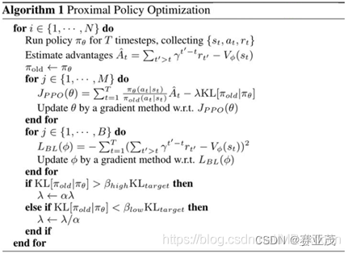

# 强化学习 | PPO 论文解读

## 1. 引言

​ 首先在论文的引言部分给出了经典的强化学习算法的不足之处:许多的经典强化学习算法在大型的模型、数据采样效率、鲁棒性(无需手动超参调整)上都有很大的提升空间。Q-Learning算法(包括函数逼近类算法)在许多简单问题上应用存在局限性,例如要满足状态空间与动作空间的离散型要求，并且其理解起来也是一件很困难的事情、而vanilla policy gradient算法的数据效率与鲁棒性较差、置信域优化算法(TRPO)相对来说比较复杂，而且对于包含噪声或参数共享(在策略函数与价值函数之间有其他的辅助任务需求)的网络结构不兼容(比如dropout)。
​
该论文的主要目的是为了解决上述问题，**在TRPO的基础上运用一阶优化提高其数据的使用效率与良好的表现**。创新的使用了一种对目标函数使用限幅概率比(clipped probabilty ratios)的方法，对原有策略的表现做出悲观主义的估计(个人理解这里是对原有策略目标函数 $J(\theta)$的下界做出估计)。为了优化策略 $\pi_{\theta}$,我们交替从策略中采样数据，并对采样数据执行几个优化阶段。

​实验比较了好几个代理者算法，发现其中采用限幅概率比(clipped probabilty ratios)的方法表现效果最佳。相比于之前的一些强化学习算法，PPO在连续控制问题上比之前的算法效果都要好。在Atari游戏中，其表现要显著强于A2C和ACER算法，因为其是更加简单的(从策略的采样复杂度的角度上来说)。

## 2. 背景

### 2.1 策略梯度方法(Policy Gradient Methods)

策略梯度方法主要通过计算一个 $estimator s(\hat{g})$, 并且将其用于随机梯度下降算法中实现策略的梯度上升功能 $(\theta\leftarrow\theta+\alpha\hat{g})$。比较常用的一种estimator如下所示:

$$\hat{g}=\hat{E}_t\left[\nabla_\theta\log\pi_\theta\left(a_t\left|s_t\right.\right)\hat{A}_t\right]$$

 其中 $\pi_{\theta}$ ​是随机策略函数，$\hat{A_t}$ 是在第 $t$个步长时的优势函数 $A(s_t,a_t)$ 的估计值。

> 由之前的知识我们可以知道，这里的 $\hat{ A_t}$ 如果是用MonteCarlo方法来估计即: $\hat{A_t} = G_t-v_{\omega}(s_t)$ ，便是Reinforce with baseline 方法。如果采用 $\hat{A_t} = Q_{\pi_{\theta}}(s_t,a_t)-v_{\omega}(s_t)$ 来估计，便是A2C方法。

 其中: $\hat E_t[...]$表明采用在一群采样的样本之间采用经验平均值来估计，即: $\hat{E_t[...]}=\frac{1}{n}\sum_{t=1}^n[...]$。由于可以用带用自动梯度计算的软件对 $\hat{g}$ 进行计算，因此 $\hat{g}$ 可以视为对以下目标进行梯度计算 $\nabla_{\theta}$:

$$L^{PG}(\theta)=\hat{E}_t\left[\log\pi_\theta\left(a_t\left|s_t\right.\right)\hat{A}_t\right]$$

​ 尽管上式在用多个轨迹(trajectory)对误差 $L^{PG}(\theta)$ 进行多步的参数更新优化时有一定的优势。但是这么做理由并不充分(原话是doing so is not well-justified我不知道怎么翻译比较合适)，并且这常常会导致一个毁灭性的极大范围的策略参数 $\theta$ 的更新问题(个人认为这里想强调的是学习率$\alpha$ 不好调，容易造成参数的估计出现问题)。

### 2.2 置信域方法

在TRPO算法中，目标函数(或者称为代理函数)是一个被要求最大化的目标函数，其被约束在一系列的策略更新的约束下。具体而言该优化问题可以描述如下:

$$\max_\theta\hat{E}_t\left[\frac{\pi_\theta\left(a_t\left|s_t\right.\right)}{\pi_{\theta_{old}}\left(a_t\left|s_t\right.\right)}\hat{A}_t\right]\\s.t.\hat{E}_t\left[KL[\pi_{\theta_{old}}\left(.|s_t\right),\pi_\theta\left(.|s_t\right)]\right]\leq\delta $$

​ 其中，$\theta_{old}$ 是在策略函数 $\pi$ 更新之前的 $\theta$，是个向量。该约束问题可以在对目标在 $\theta_{old}$ ​进行一阶近似(泰勒一阶展开)，在约束处对 $\theta_{old}$ ​进行二阶近似(泰勒二阶展开)如下后，利用共轭梯度法求解。

$$\max_\theta g(\theta_{old})(\theta-\theta_{old})\\s.t.\frac12(\theta-\theta_{old})^TF(\theta_{old})(\theta-\theta_{old})\leq\delta $$

其中， $F(\theta)=E_{s_{t} ,a_{t}\sim\pi_{\theta}} [\nabla_{\theta} \operatorname{log}\pi(a_{t} |s_{t} ;\theta)[\nabla_{\theta} \operatorname{log}\pi(a_{t} |s_{t} ;\theta)]^{T}]$，而 $g\left(\theta\right)=\nabla_{\theta}E_{\pi(\theta_{old})}[\frac{\pi_\theta\left(a_t\mid s_t\right)}{\pi_{\theta_{old}\left(a_t\mid s_t\right)}}\hat{A}_{t}]$

事实上，上述的置信域优化问题的求解一般建议采用罚函数法求解，而并不是利用带约束优化问题的常规套路求解。将上述带约束的优化问题转化为如下的无约束优化问题：

$$\max_\theta\hat{E}_t\left[\frac{\pi_\theta\left(a_t\left|s_t\right.\right)}{\pi_{\theta_{old}\left(a_t\left|s_t\right.\right)}}\hat{A}_t-\beta KL[\pi_{\theta_{old}}\left(.|s_t\right),\pi_\theta\left(.|s_t\right)]\right]$$

​对于其中的 $\beta$ 为罚系数。事实上上式中对于 $KL$ 散度实际使用时，用最大散度替代平均散度实现约束效果。而TRPO算法使用时一般用硬约束而非罚函数，这是因为选择 $\beta$ 时，不同的 $\beta$ 的选择会产生许多不同的问题。因此为了实现我们一阶优化算法的目标，选择一个固定的惩罚系数 $\beta$ 用SGD优化上面的罚方程是不现实的(这里主要强调的是调超参 $\beta$ 的问题)。

# 3.剪裁代理目标(Clipped Surrogate Objective)

 设$r_t\left(\theta\right)=\frac{\pi_\theta\left(a_t\left|s_t\right.\right)}{\pi_{\theta_{old}}\left(a_t\left|s_t\right.\right)}$。TRPO算法最大化一个代理目标函数如下:

$$L^{CPI}(\theta)=\hat{E}_t\left[\frac{\pi_\theta\left(a_t\left|s_t\right.\right)}{\pi_{\theta_{old}}\left(a_t\left|s_t\right.\right)}\hat{A}_t\right]=\hat{E}_t\left[r_t\left(\theta\right)\hat{A}_t\right]$$

​其中CPI指的是保守策略迭代(conservative policy iteration)。如果没有KL散度的约束，最大化 $L^{CPI}(\theta)$ 将导致一个大的策略参数的过估计。**因此我们考虑修正这个目标，去惩罚比率$r_t(\theta)$远离1时的情况**。

我们主要考虑如下所示的最大化目标函数:

$$L^{CLIP}(\theta)=\hat{E}_t\left[\min(r_t\left(\theta\right)\hat{A}_t,\mathbf{clip}(r_t\left(\theta\right),1-\varepsilon,1+\varepsilon)\hat{A}_t)\right]$$

​而其中 $\varepsilon$ 是一个待调的超参，一般可以设为 \varepsilon = 0.2$，上式的第一个最小项是 $L^{CPI}(\theta)$。第二个最小项是 $\mathbf{clip}(r_t(\theta),1-\varepsilon,1+\varepsilon)\hat{A_t})$，通过切片比率修正了代理函数:

$$\left.\mathbf{clip}(r_t\left(\theta\right),1-\varepsilon,1+\varepsilon)=\left\{\begin{array}{l}1-\varepsilon,r_t\left(\theta\right)\leq1-\varepsilon\\r_t\left(\theta\right)\quad,1-\varepsilon\leq r_t\left(\theta\right)\leq1+\varepsilon\\1+\varepsilon,r_t\left(\theta\right)\geq1+\varepsilon\end{array}\right.\right.$$

当 $\hat {A_t}$ ​取不同的符号时，其 $L^{CLIP}(\theta)$ 和 $r$ 的关系如下图所示:

 

  
   
  
BP Network

 

> 个人理解:当 $\hat A_t\geq 0$时，为了达到目标 $\max L^{CLIP}(\theta)$，限制 $r_t(\theta)$ 只在小于 $1+\varepsilon$ 时有增大趋势。而当 $r_t(\theta)$ 过大即 $r_t(\theta)\geq 1+\varepsilon$ 时，限制其 $L^{CLIP}(\theta)$ 的继续增大。这样对于那些使得 $r_t(\theta)$过大的 $\theta$ , 其目标函数 $L^{CLIP}(\theta)$ 不会更大，也就不在$ \theta$ 的搜索的考虑范围之内。因此采用搜索算法搜索 $\theta$ 时不容易搜索到使得 $r_t(\theta)$ 过大的 $\theta$。达到在尽可能置信域内搜索$\theta$的效果。当$\hat{A_t}\leq0$时，同理依然如此。

对比不同方法在连续控制问题中的调整参数 $\theta$ 对散度 $KL(\theta,\theta_{old})$ 的影响效果如下图所示:

 

  
   
  
BP Network

 

该图可以看出在初始参数 $\theta_{old}$ 的一次PPO算法迭代之后，$KL(\pi_{\theta},\pi_{\theta_{old}})$ 几乎最大值才是0.02。这充分保住了$\theta$ 在 $\theta_{old}$ 的置信域之内。该图来自于 Hopper-v1问题，超参数如下:

 

  
   
  
BP Network

 

### 4.自适应罚函数系数方法

 前面讲到采用罚函数法进行参数更新时，主要是罚函数系数 $\beta$ 的选取比较困难。而现在一种克服方法是自适应调整系数 $\beta$。

其优化目标如下:

$$\max L^{KLPEN}(\theta)=\hat{E_t}\left[\frac{\pi_\theta\left(a_t\left|s_t\right.\right)}{\pi_{\theta_{old}\left(a_t\left|s_t\right.\right)}}\hat{A}_t-\beta KL[\pi_{\theta_{old}}\left(.|s_t\right),\pi_\theta\left(.|s_t\right)]\right]$$

​计算 $d=\hat{E}_{t}\left[KL[\pi_{\theta_{old}}\left(.|s_{t}\right),\pi_{\theta}\left(.|s_{t}\right)]\right]$, 当$d\leq\frac{d_{targ}}{1.5},\beta\leftarrow\frac\beta2$​; 当 $d\geq1.5d_{targ} ,\beta\leftarrow2\beta$。值得一提的是 $\beta$的初值以及参数1.5和2对算法本身并不敏感。这是因为算法会在使用中自动判断并且调整参数。

### 5.算法部分

 

  
   
  
BP Network

 
在网上找了一个比较详细的伪代码图:

 

  
   
  
BP Network

 

算法中优势函数的计算如下(具体算法过程不过多描述请参考原论文)：

 

  
   
  
BP Network

 

### 6.实验部分

不过多描述，就给张图：
 

  
   
  
BP Network

 

## Ref:
[1] [PPO算法经典论文阅读](https://blog.csdn.net/shengzimao/article/details/126493407)
[2] [PPO(Proximal Policy Optimization Algorithms)论文解读及实现](https://blog.csdn.net/weixin_42529756/article/details/131691832)
[3] [影响PPO算法性能的10个关键技巧（附PPO算法简洁Pytorch实现）](https://zhuanlan.zhihu.com/p/512327050)

---

> 作者: <no value>  
> URL: https://jianye0428.github.io/posts/ppo/  

