# LLM预训练之RLHF（一）：RLHF及其变种

## 0. 引言

在ChatGPT引领的大型语言模型时代，国内外的大模型呈现爆发式发展，尤其是以年初的LLaMA模型为首的开源大模型和最近百川智能的baichuan模型，但无一例外，都使用了「基于人类反馈的强化学习」（RLHF）来提升语言模型的性能，并在模型重注入了人类的偏好，以提高模型的有用性和安全性。不过RLHF也早已更新换代，我们以如下目录进行详细讲述RLHF及其变种：

- LLM的经典预训练Pipeline
- Llama 2中的RLHF
- RLHF替代方案

## 一、LLM的经典预训练Pipeline

​  目前基于Transformer decoder的LLM，比如ChatGPT、LLaMA、baichuan等，通常都会有基于预训练的base模型和在base模型至少使用RLHF微调的Chat模型，Chat模型的训练一般都包括如下三个步骤：预训练，有监督微调和对齐。

​  在**预训练**阶段，模型会从大量无标注文本数据集中学习通用知识，然后使用「**有监督微调」（SFT）**优化模型以更好地遵守特定指令，最后使用**对齐**技术使LLM可以更有用且更安全地响应用户提示。

### 1.1 预训练（Pre-training）

预训练阶段通常需要包含数十亿到数万亿个token的庞大文本语料库，但训练目标是**模型需要根据提供的文本来预测「下一个单词」**。

 

  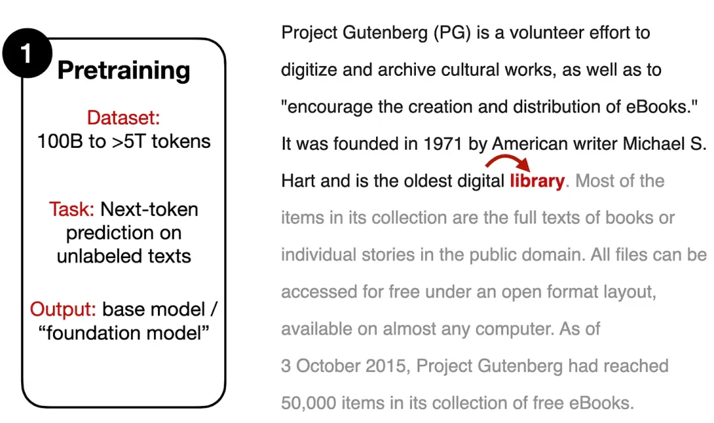
   
  
BP Network

 

**1.2 有监督微调（Supervised Finetuning）**

​SFT的训练过程类似Pre-training阶段，也是预测「下一个单词」，但是**需要人工标注的指令数据集**，其中模型的输入是一个指令（根据任务的不同，也可能包含一段输入文本），输出为模型的预期回复内容。

 

  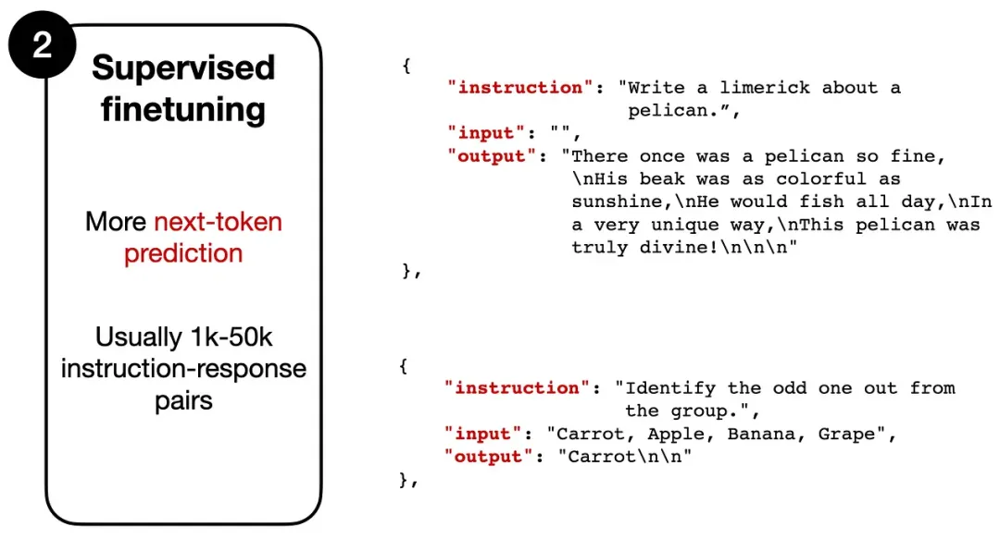
   
  
BP Network

 

数据形式类似于：

> Instruction: "Write a limerick about a pelican."
>
> 指令：“写一首关于鹈鹕的打油诗。“
>
> Output: "There once was a pelican so fine..."
>
> 输出：“从前有一只鹈鹕很好...“

模型会把“Write a limerick about a pelican”作为输入，逐个token进行预测，输出“There once was a pelican so fine...”

虽然两个阶段都采用类似的训练目标，但有监督微调数据集通常比预训练数据小得多，指令数据集需要人类（或其他高质量的LLM）提供标注结果，所以无法大规模应用。

**1.3 对齐（Alignment）**

第三阶段依然是微调，不过其主要目标在于将语言模型与人类的偏好、价值观进行对齐，这也是RLHF机制发挥的地方。

 

  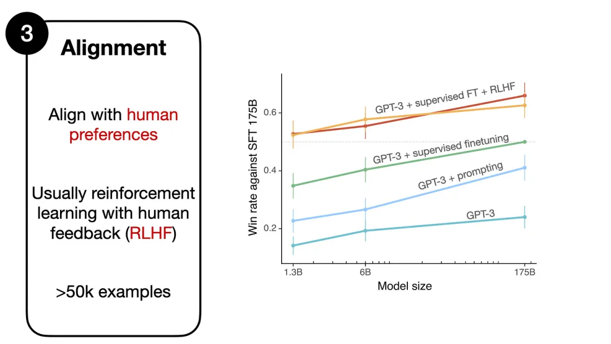
   
  
BP Network

 

## 二、Reinforcement Learning with Human Feedback (RLHF)

上节，我们讨论了现代LLM的三个训练过程；本小节，我们重点讨论「上述两个微调阶段」（Supervised Tinetuning和Alignment）中使用的RLHF技术。

RLHF主要包括三步：

1. 在预训练好的模型上进行「有监督微调」（SFT）；
2. 在有监督微调模型基础上创建一个reward model（RM）模型；
3. 基于RM模型使用PPO算法微调SFT模型；

### 2.1 在预训练好的模型上进行有监督微调**

先收集一个Prompts集合，并要求标注人员写出高质量的回复，然后使用该数据集以监督的方式微调预训练的基础模型。

 

  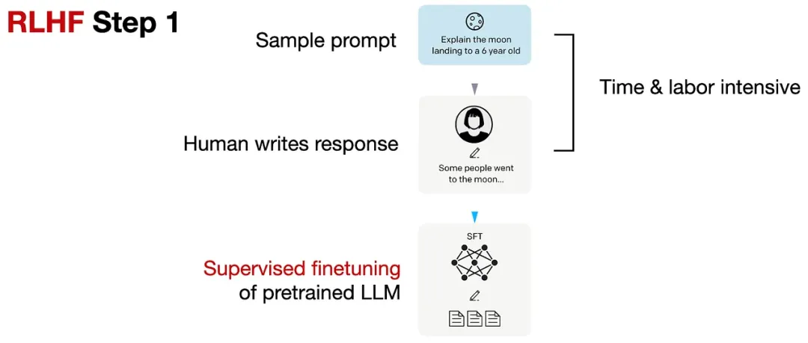
   
  
BP Network

 

​该步骤与上小节的Supervised Finetuning类似，但这是RLHF不可或缺的一个步骤。

### 2.2 在有监督微调模型基础上创建一个RM模型

对于每个Prompt，要求有监督微调后的LLM生成四到九个回复，再由标注人员根据个人偏好对所有回复进行排序。虽然排序过程很耗时，但工作量还是比第一步的有监督数据集构建要少一些。

 

  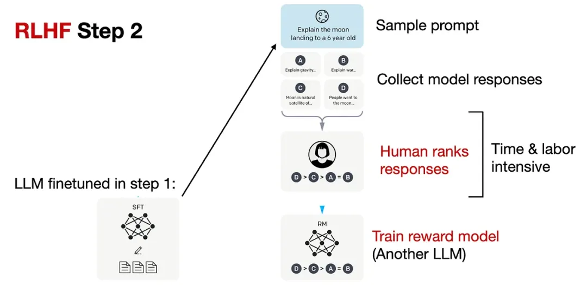
   
  
BP Network

 

在处理排序数据时，使用了一个奖励模型RM，RM来自RLHF第一步的「有监督微调语言模型」（SFT），SFT的输出通过一个回归层（单个输出节点）转换为奖励分数，即可称为**RM模型**。

### 2.3 基于RM模型使用PPO算法微调SFT模型

基于RM模型使用proximal policy optimization (PPO)算法微调SFT模型

 

  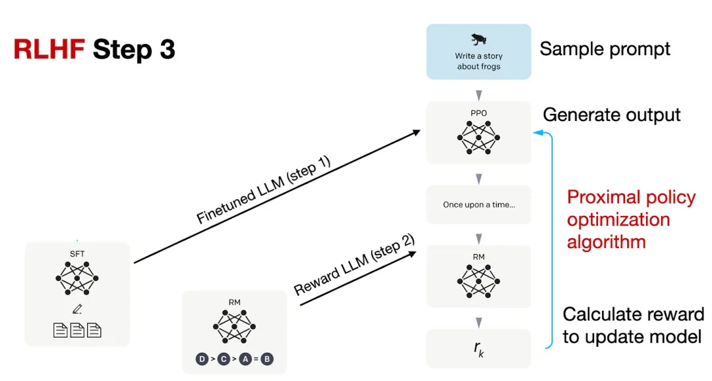
   
  
BP Network

 

PPO的具体技术细节可以参考InstructGPT或下面的论文列表。

1. Asynchronous Methods for Deep Reinforcement Learning (2016) ，https://arxiv.org/abs/1602.01783
2. Proximal Policy Optimization Algorithms (2017)，https://arxiv.org/abs/1707.06347
3. Fine-Tuning Language Models from Human Preferences (2020)，https://arxiv.org/abs/1909.08593
4. Learning to Summarize from Human Feedback (2022) ，https://arxiv.org/abs/2009.01325

## 三、LLaMA 2的RLHF**

Meta AI在创建Llama-2-chat模型时也使用了RLHF技术，不过与ChatGPT相比还是有些细微区别。

 

  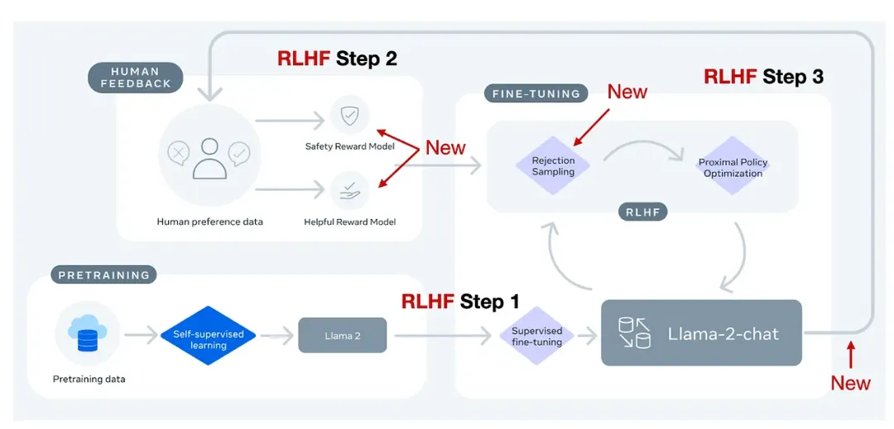
   
  
BP Network

 

简单来说，Llama-2-chat在第一步RLHF微调上使用相同的指令数据，但在第二步使用了两个奖励模型；通过多个阶段的不断进化，奖励模型也会根据Llama-2-chat模型出现的错误进行更新；并且增加了拒绝采样（rejection sampling）步骤。

### 3.1 Margin Loss

​在标准InstructGPT中使用的RLHF PPO方法，研究人员需要收集同一个提示下的4-9个模型输出并进行排序，比如四个回复的排序结果为A<C< D<B，那么就可以得到六个对比结果：A < C，A < D ，A < B，C < D，C < B，D < B。

​Llama 2的数据集也采用类似的方式，不过标注人员每次只能看到两个（而非4-9个）回复并进行对比，但新增了一个边际（margin）标签，对比结果可以为「显著更好」（significantly better）和「好的不明显」（negligibly better）。

在排序训练时中，Llama 2相比InstructGPT增加了边际损失：

$$\mathcal{L}_{\mathrm{ranking}}=-\log\left(\sigma\left(r_\theta\left(x,y_c\right)-r_\theta\left(x,y_r\right)-m(r)\right)\right)$$

其中，$r_θ(x，y)$是提示x和生成的回复y的标量分数输出; θ为模型权重; σ是将层输出转换为范围从0到1的分数的逻辑S形函数; $y_c$是由标注人员选择的更优回复; $y_r$是较差的回复。$m(r)$可以调节两个回复之间的差值，如果对比结果为「显著更好」，则会增加梯度值，加快更新速度。

### 3.2 两个RM模型

​Llama 2中的两个奖励模型分别侧重「有用性」（helpfulness）和「安全性」（safety），用于模型优化的最终奖励函数会将两个分数进行线性组合。

 

  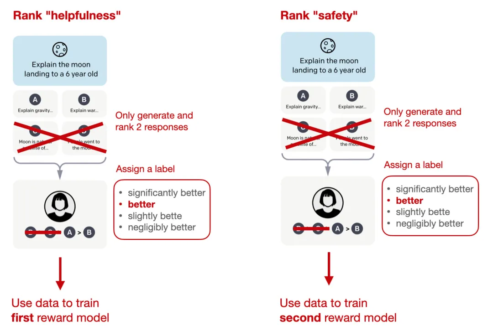
   
  
BP Network

 

### 3.3 拒绝采样

​Llama 2的作者使用了一个训练流水线，**同时使用PPO和拒绝采样算法**，迭代地产生多个RLHF模型（从RLHF-V1到RLHF-V5），模型在拒绝采样时会得到K个输出，并使用最高奖励的输出更新梯度，而PPO每次只基于单样本进行更新。

 

  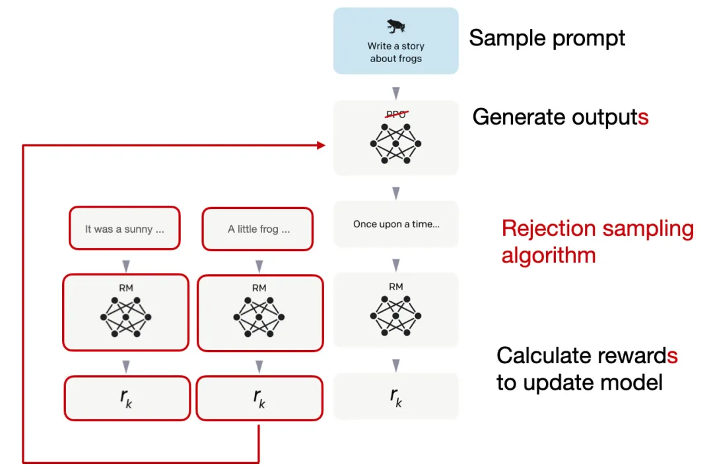
   
  
BP Network

 

在监督微调的初始阶段之后，模型只使用拒绝采样进行训练，然后再结合拒绝采样和PPO。

从实验结果来看，RLHF微调模型在无害性和有用性上都得到了改善，并且在最后阶段RLHF-v5使用PPO算法的性能最好。

 

  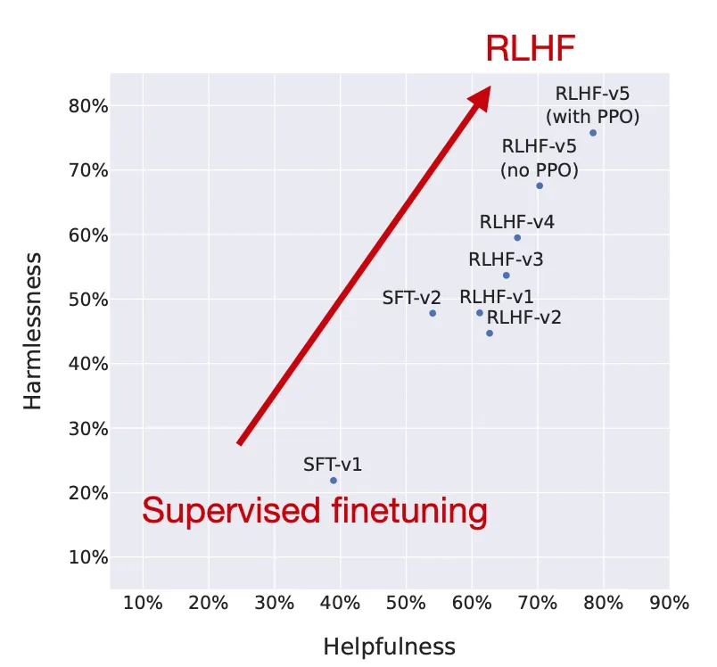
   
  
BP Network

 

## 四、RLHF的替代方案

 

  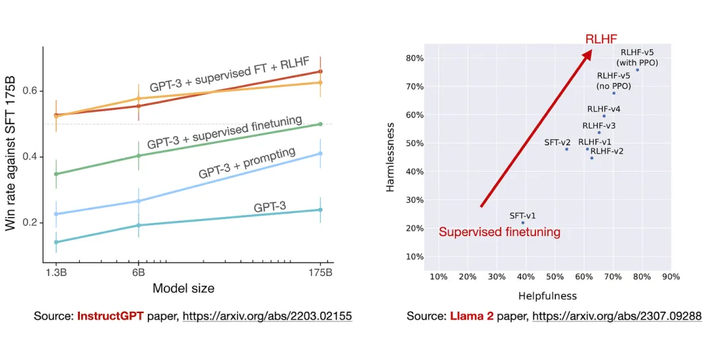
   
  
BP Network

 

RLHF在InstructGPT和Llama 2论文中被证明是有效的，但是RLHF的过程是比较复杂的，下面将介绍一下最近RLHF的替代方案：

### 4.1 Constitutional AI: Harmlessness from AI Feedback (Dec 2022, https://arxiv.org/abs/2212.08073)

研究人员提出了一种 **基于人类提供的规则列表的自我训练机制**。与前面提到的InstructGPT论文类似，也使用了强化学习方法。

 

  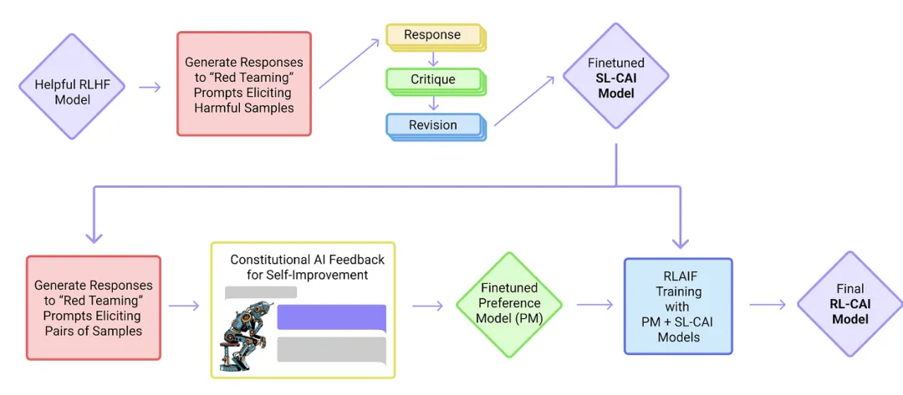
   
  
BP Network

 

上图中的「红队」（Red Team）指的是测试目标系统的防御能力，即外部或内部专家模拟潜在对手的过程，通过模仿现实世界攻击者的战术、技术和程序来挑战、测试并最终改进系统。

### 4.2 The Wisdom of Hindsight Makes Language Models Better Instruction Followers (Feb 2023, https://arxiv.org/abs/2302.05206)

研究人员提出了一种**基于重新标记的监督微调方法HIR**，该方法在12个BigBench任务上优于RLHF。

​HIR是如何工作的？简而言之，HIR方法包括两个步骤，即**采样**和**训练**。在采样步骤中，Prompt和指令输入给LLM来获取答案，根据对齐得分，在训练阶段适当的地方重新标注指令；然后，重新标记的指令和原始的Prompt用于微调LLM。使用这种重新标记的方法，研究人员有效地将失败案例（LLM创建的输出与原始指令不匹配的案例）转化为有用的训练数据，用于监督学习。

 

  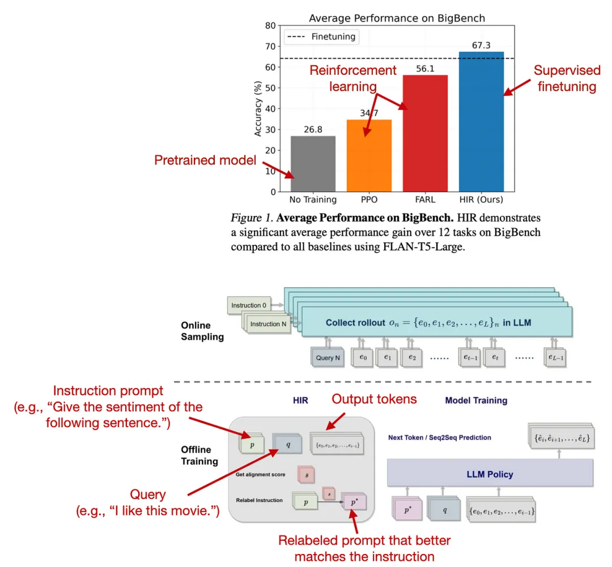
   
  
BP Network

 

### 4.3 Direct Preference Optimization: Your Language Model is Secretly a Reward Model (https://arxiv.org/abs/2305.18290, May 2023)

**直接偏好优化（DPO）是具有PPO的RLHF的替代方案**，其中研究人员表明，在RLHF中拟合奖励模型的交叉熵损失可以直接用于微调LLM。根据他们的基准，使用DPO更有效，而且在响应质量方面通常也优于RLHF/PPO。

 

  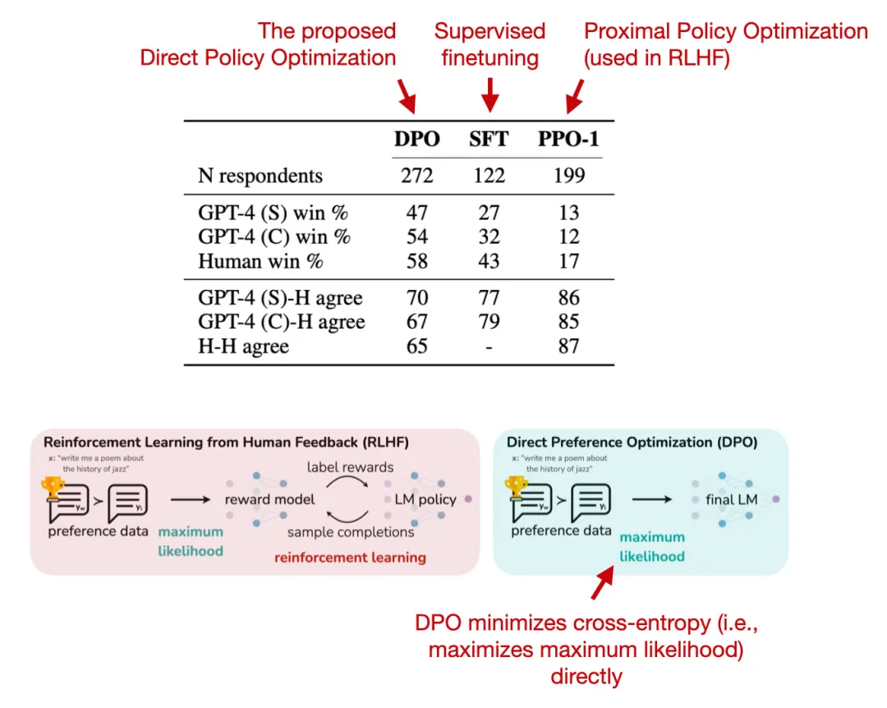
   
  
BP Network

 

### 4.4 Reinforced Self-Training (ReST) for Language Modeling (Aug 2023, https://arxiv.org/abs/2308.08998)

ReST是人类反馈强化学习（RLHF）的一种替代方案，它**使LLM与人类偏好保持一致**。 **ReST使用采样方法创建改进的数据集**，在质量越来越高的子集上迭代训练，以完善其奖励函数。根据作者的说法，与标准的在线RLHF方法（如具有近端策略优化的RLHF，PPO）相比，ReST通过离线生成训练数据集实现了更高的效率，但缺少与InstructGPT或Llama 2中使用的标准RLHF PPO方法的全面比较。

 

  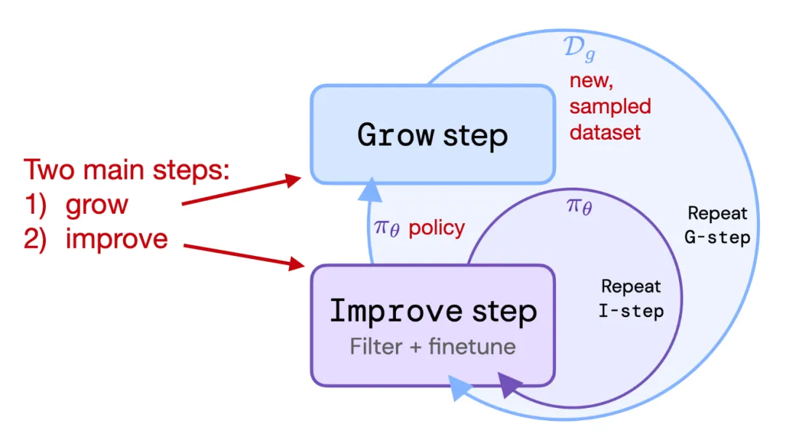
   
  
BP Network

 

### 4.5 RLAIF: Scaling Reinforcement Learning from Human Feedback with AI Feedback (Sep 2023, https://arxiv.org/abs/2309.00267)

最近的人工智能反馈强化学习（RLAIF）研究表明，RLHF中奖励模型训练的评级不一定必须由人类提供，而是可以由LLM生成（此处：PaLM 2）。标注人员在一半的案例中更喜欢RLAIF模型，也就意味着两个模型的差距并不大，RLHF和RLAIF都大大优于纯通过监督指令微调训练的模型。

 

  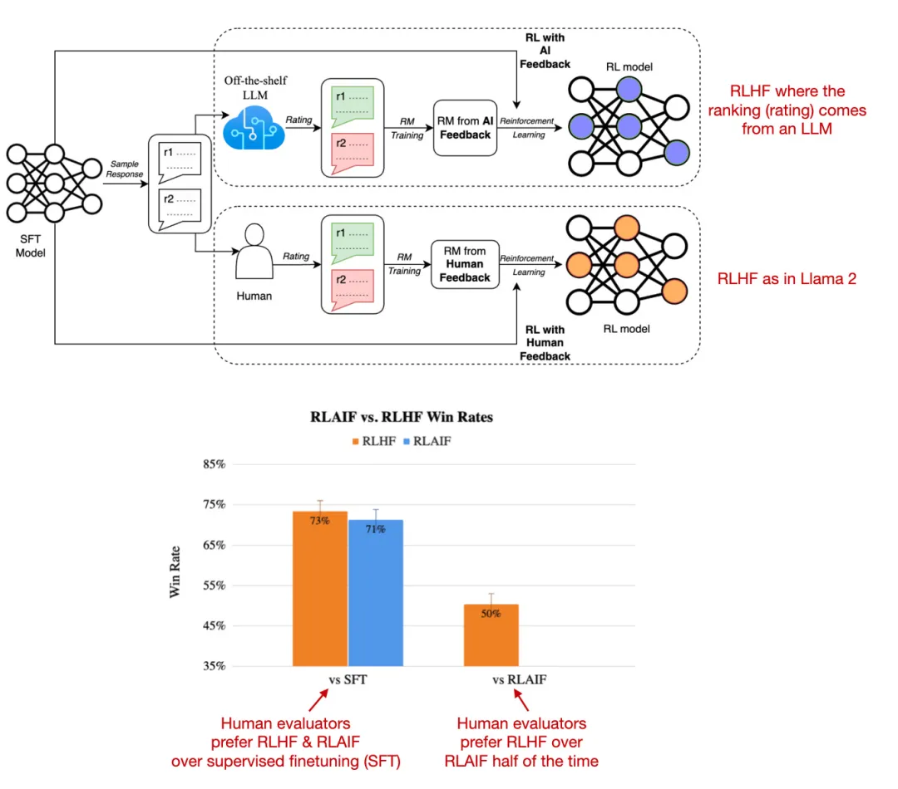
   
  
BP Network

 

这项研究的结果非常有用和有趣，因为它基本上意味着我们可能能够使基于RLHF的训练更加高效和容易。然而，这些RLAIF模型在专注于信息内容的安全性和真实性的定性研究中的表现还有待观察，而人类偏好研究仅部分捕捉到了这一点。

**参考文献：**

[1] https://magazine.sebastianraschka.com/p/llm-training-rlhf-and-its-alternatives 
[2] https://mp.weixin.qq.com/s/3Ff6C5zT7fXggQ1FwxvWAQ

---

> 作者: [Jian YE](https://github.com/jianye0428)  
> URL: https://jianye0428.github.io/posts/pretrain_rlhf_one/  

