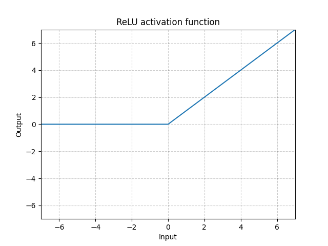

# PyTorch Notes


## Torch 基本函数
### 1. **```torch.einsum()```**
```torch.einsum(equation, *operands)->Tensor```:爱因斯坦求和
ref1: 算子部署: https://blog.csdn.net/HW140701/article/details/120654252
ref2: 例子: https://zhuanlan.zhihu.com/p/361209187

**三条基本规则:**
- **规则一:** equation 箭头左边，在不同输入之间<font color=red>重复出现的索引</font>表示，把输入张量沿着该维度做乘法操作，比如还是以上面矩阵乘法为例， "ik,kj->ij"，k 在输入中重复出现，所以就是把 a 和 b 沿着 k 这个维度作相乘操作；
- **规则二:** 只出现在 equation 箭头左边的索引，表示中间计算结果需要在这个维度上求和，也就是上面提到的求和索引；
- **规则三:** equation 箭头右边的索引顺序可以是任意的，比如上面的 "ik,kj->ij" 如果写成 "ik,kj->ji"，那么就是返回输出结果的转置，用户只需要定义好索引的顺序，转置操作会在 einsum 内部完成

**特殊规则:**
   - equation 可以不写包括箭头在内的右边部分，那么在这种情况下，输出张量的维度会根据默认规则推导。就是把输入中只出现一次的索引取出来，然后按字母表顺序排列，比如上面的矩阵乘法 "ik,kj->ij" 也可以简化为 "ik,kj"，根据默认规则，输出就是 "ij" 与原来一样；
   - equation 中支持 "..." 省略号，用于表示用户并不关心的索引。比如只对一个高维张量的最后两维做转置可以这么写：
     ```shell
     a = torch.randn(2,3,5,7,9)
     # i = 7, j = 9
     b = torch.einsum('...ij->...ji', [a])
     ```

### 2. **```torch.permute()/torch.transpose()```**
```torch.permute(dim0, dim1, dim2)```:用于调换不同维度的顺序
```torch.transpose(input, dim0, dim1)```:交换矩阵的两个维度


### 3. **```torch.rand()```**
```torch.rand(dim0, dim1)```:生成dim0 x dim1的tensor

### 4. **```torch.size()/torch.shape```**
```torch.size()```:返回tensor的size
```torch.shape```:返回tensor的size


### 5. **```torch.tensordot()```**
ref: tensordot()和einsum()的区别: https://blog.csdn.net/Eric_1993/article/details/105670381
```torch.tensordot(tensor1， tensor2， axes=([dim1,dim2],[dim0, dim1]))```: 将axes指定的子数组进行点乘, axes 指定具体的维度.

### 6. **```torch.transpose()```**
```torch.transpose(tensor, dim0, dim2) —> Tensor```:在dim0和dim1方向上转置

###7. **`torch.index_add_()`**

` Tensor.index_add_(dim, index, source, *, alpha=1) → Tensor`

demo:
```python
>>> x = torch.ones(5, 3)
>>> t = torch.tensor([[1, 2, 3], [4, 5, 6], [7, 8, 9]], dtype=torch.float)
>>> index = torch.tensor([0, 4, 2])
>>> x.index_add_(0, index, t)
tensor([[  2.,   3.,   4.],
        [  1.,   1.,   1.],
        [  8.,   9.,  10.],
        [  1.,   1.,   1.],
        [  5.,   6.,   7.]])
>>> x.index_add_(0, index, t, alpha=-1)
tensor([[  1.,   1.,   1.],
        [  1.,   1.,   1.],
        [  1.,   1.,   1.],
        [  1.,   1.,   1.],
        [  1.,   1.,   1.]])
```


## Torch NN Module

```python
import torch
from torch import nn
from torch import functional as F
```

### 1. **`nn.Conv1d()`**

  `torch.nn.Conv1d(in_channels, out_channels, kernel_size, stride=1, padding=0, dilation=1, groups=1, bias=True, padding_mode='zeros', device=None, dtype=None)`

  **Shape:**
    - Input: $(N, C_{in}, L_{in})$ or $(C_{in}, L_{in})$
    - Output: $(N, C_{in}, L_{in})$ or $(C_{in}, L_{in})$, where
    $$L_{out} = \frac{L_{in} + 2 \cdot \text{padding} - \text{dilation} \cdot (\text{kernel\_size} - 1) - 1}{stride}$$

  **Demo:**
  ```python
  m = nn.Conv1d(16, 33, 3, stride=2)
  input = torch.randn(20, 16, 50) # B x C x H or N x C x L
  output = m(input)
  print(output.shape) # torch.Size([20, 33, 24])
  ```
### 2. **`nn.Conv2d()`**

  `torch.nn.Conv2d(in_channels, out_channels, kernel_size, stride=1, padding=0, dilation=1, groups=1, bias=True, padding_mode='zeros', device=None, dtype=None)`

  **Shape:**
   - Input: $(N, C_{\text in}, H_{\text in}, W_{\text in})$ or $(C_{\text in}, H_{\text in}, W_{\text in})$
    - Output: $(N, C_{\text out}, H_{\text out}, W_{\text out})$ or $(C_{\text out}, H_{\text out}, W_{\text out})$, where
    $$
    H_{out} = \frac{H_{in} + 2 \cdot \text{padding[0]} - \text{dilation[0]} \cdot (\text{kernel\_size[0]} - 1) - 1}{stride[0]} + 1
    $$
    $$
    W_{out} = \frac{W_{in} + 2 \cdot \text{padding[1]} - \text{dilation[1]} \cdot (\text{kernel\_size[1]} - 1) - 1}{stride[1]} + 1
    $$

  **Demo:**

  ```python
    # With square kernels and equal stride
    m = nn.Conv2d(16, 33, 3, stride=2)
    # non-square kernels and unequal stride and with padding
    m = nn.Conv2d(16, 33, (3, 5), stride=(2, 1), padding=(4, 2)) # output.shape: 20 x 33 x 28 x 100
    # non-square kernels and unequal stride and with padding and dilation
    m = nn.Conv2d(16, 33, (3, 5), stride=(2, 1), padding=(4, 2), dilation=(3, 1)) # output.shape: 20 x 33 x 26 x 100
    input = torch.randn(20, 16, 50, 100)
    output = m(input) #
  ```

### 3. **`nn.functional.interpolate()`**
  `torch.nn.functional.interpolate(input, size=None, scale_factor=None, mode='nearest', align_corners=None, recompute_scale_factor=None, antialias=False)`


### 4. **`nn.functional.ReLU()`**

  $$ \text{ReLU} = (x)^+ = \max {(0,x)}$$

  `torch.nn.ReLU(inplace=False)`

  **作用:**

   - Sigmoid的导数只有在0附近的时候有比较好的激活性，在正负饱和区的梯度都接近于0，所以这会造成梯度弥散，而ReLU函数在大于0的部分梯度为常数，所以不会产生梯度弥散现象。

   - ReLU函数在负半区的导数为0 ，所以一旦神经元激活值进入负半区，那么梯度就会为0，而正值不变，这种操作被成为单侧抑制。（也就是说：**在输入是负值的情况下，它会输出0，那么神经元就不会被激活。这意味着同一时间只有部分神经元会被激活，从而使得网络很稀疏，进而对计算来说是非常有效率的。**）<u>正因为有了这单侧抑制，才使得神经网络中的神经元也具有了稀疏激活性。</u>尤其体现在深度神经网络模型(如CNN)中，当模型增加N层之后，理论上ReLU神经元的激活率将降低2的N次方倍。

   - relu函数的导数**计算更快**，程序实现就是一个if-else语句，而sigmoid函数要进行浮点四则运算。

  **Shape:**
  - Input: $(∗)$, where $*$ means any number of dimensions.
  - Output: $(∗)$, same shape as the input.



**Demo:**
  ```python
  m = nn.ReLU()
  input = torch.randn(2)
  output = m(input)
  # An implementation of CReLU - https://arxiv.org/abs/1603.05201
  m = nn.ReLU()
  input = torch.randn(2).unsqueeze(0)
  output = torch.cat((m(input),m(-input)))
  ```


### 5. **`nn.MaxPool2d()`**

`torch.nn.MaxPool2d(kernel_size, stride=None, padding=0, dilation=1, return_indices=False, ceil_mode=False)`

**Shape:**

- Input: $(N, C, H_{in}, W_{in})$ or $(C, H_{in}, W_{in})$
- Output: $(N, C, H_{out}, W_{out})$ or $(C, H_{out}, W_{out})$

where,

$$ H_{out} = \frac{H_{in} + 2 * \text{padding}[0] - \text{dilation}[0] * (\text{kernel\_size}[0]-1) - 1}{\text{stride}[0]} + 1$$

$$ W_{out} = \frac{W_{in} + 2 * \text{padding}[1] - \text{dilation}[1] * (\text{kernel\_size}[1]-1) - 1}{\text{stride}[1]} + 1$$

**demo:**

```python
# pool of square window of size=3, stride=2
m = nn.MaxPool2d(3, stride=2)
# pool of non-square window
m = nn.MaxPool2d((3, 2), stride=(2, 1))
input = torch.randn(20, 16, 50, 32)
output = m(input) # 20 16 24 31
```


### 6. **`nn.AvgPool2d()`**

```
torch.nn.AvgPool2d(kernel_size, stride=None, padding=0, ceil_mode=False, count_include_pad=True, divisor_override=None)
```

**Shape:**

- Input: $(N, C, H_{in}, W_{in})$ or $(C, H_{in}, W_{in})$
- Output: $(N, C, H_{out}, W_{out})$ or $(C, H_{out}, W_{out})$

where,

$$ H_{out} = \frac{H_{in} + 2 * \text{padding}[0] -  (\text{kernel\_size}[0])}{\text{stride}[0]} + 1$$

$$ W_{out} = \frac{W_{in} + 2 * \text{padding}[1] - (\text{kernel\_size}[1])}{\text{stride}[1]} + 1$$

**demo:**

```python
# pool of square window of size=3, stride=2
m = nn.AvgPool2d(3, stride=2)
# pool of non-square window
m = nn.AvgPool2d((3, 2), stride=(2, 1))
input = torch.randn(20, 16, 50, 32)
output = m(input) # 20 16, 24 31
```

## torch.cuda

ref link: https://zhuanlan.zhihu.com/p/76908135

1. [`torch.cuda.current_device()`](https://pytorch.org/docs/stable/_modules/torch/cuda.html#current_device): 返回当前选择的设备的索引

2. [`torch.cuda.current_stream()`](https://pytorch.org/docs/stable/_modules/torch/cuda.html#current_stream): 返回参数设备的当前的[Stream](https://pytorch.org/docs/stable/cuda.html#torch.cuda.Stream)

3. [`torch.cuda.default_stream()`](https://pytorch.org/docs/stable/_modules/torch/cuda.html#current_stream): 返回当前参数设备的[Stream](https://pytorch.org/docs/stable/cuda.html#torch.cuda.Stream)

4. *CLASS* [`torch.cuda.device`](https://pytorch.org/docs/stable/_modules/torch/cuda.html#device): 可以改变选择的设备的上下文管理器
   Parameters：device (torch.device or int) – device index to select. It’s a no-op if this argument is a negative integer or None.

5. [`torch.cuda.device_count()`](https://pytorch.org/docs/stable/_modules/torch/cuda.html#device_count): 返回可使用GPU的数量

6. *CLASS* [`torch.cuda.device_of(obj)`](https://pytorch.org/docs/stable/_modules/torch/cuda.html#device_of)
   Context-manager 将参数对象的设备改成当前的设备。你可以使用张量或者存储作为参数。如果传入的对象没有分配在GPU上，这个操作是无效的。

7. [`torch.cuda.empty_cache()`](https://pytorch.org/docs/stable/_modules/torch/cuda.html#empty_cache)
   释放caching allocator当前持有的所有未占用的cached memory，使其可以用在其他GPU应用且可以在 nvidia-smi可视化。
   >> 注意：[empty_cache()](https://pytorch.org/docs/stable/cuda.html#torch.cuda.empty_cache) 并不会增加PyTorch可以使用的GPU显存的大小。 查看 [Memory management](https://pytorch.org/docs/stable/notes/cuda.html#cuda-memory-management) 来获取更多的GPU显存管理的信息。

8. [`torch.cuda.get_device_capability(device=None)`](https://pytorch.org/docs/stable/_modules/torch/cuda.html#get_device_capability)
   Gets the cuda capability of a device.

    Parameters：device (torch.device or int, optional) – device for which to return the device capability. This function is a no-op if this argument is a negative integer. It uses the current device, given bycurrent_device(), if device is None (default).

    Returns：the major and minor cuda capability of the device

    Return type ： tuple(int, int)
9. [`torch.cuda.get_device_name(device=None)`](https://pytorch.org/docs/stable/_modules/torch/cuda.html#get_device_name)

10. [`torch.cuda.init()`](https://pytorch.org/docs/stable/_modules/torch/cuda.html#init)
    初始化PyTorch的CUDA状态。如果你通过C API与PyTorch进行交互，你可能需要显式调用这个方法。只有CUDA的初始化完成，CUDA的功能才会绑定到Python。用户一般不应该需要这个，因为所有PyTorch的CUDA方法都会自动在需要的时候初始化CUDA。如果CUDA的状态已经初始化了，将不起任何作用。
11. [`torch.cuda.is_available()`]
12. [`torch.cuda.max_memory_allocated(device=None)`](https://pytorch.org/docs/stable/_modules/torch/cuda.html#max_memory_allocated)
    Returns the maximum GPU memory occupied by tensors in bytes for a given device.
13. [`torch.cuda.max_memory_cached(device=None)`](https://pytorch.org/docs/stable/_modules/torch/cuda.html#max_memory_cached)
14. [`torch.cuda.memory_allocated(device=None)`](https://pytorch.org/docs/stable/_modules/torch/cuda.html#memory_allocated)
    Parameters：device (torch.device or int, optional) – selected device. Returns statistic for the current device, given by current_device(), if device is None (default).
15. [`torch.cuda.memory_cached(devide=None)`](https://pytorch.org/docs/stable/_modules/torch/cuda.html#memory_cached)
16. [``]

---

> 作者: Jian Ye  
> URL: https://jianye0428.github.io/posts/pytorchnotes/  

