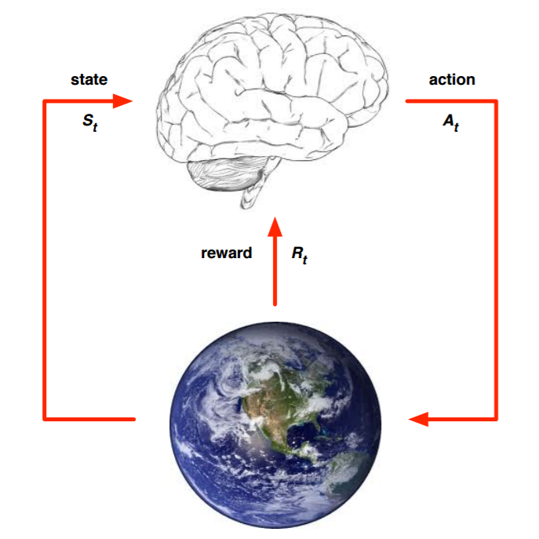

# RL学习笔记 [1] | 模型基础


# 0. 引言

　从今天开始整理强化学习领域的知识，主要参考的资料是Sutton的强化学习书和UCL强化学习的课程。这个系列大概准备写10到20篇，希望写完后自己的强化学习碎片化知识可以得到融会贯通，也希望可以帮到更多的人，毕竟目前系统的讲解强化学习的中文资料不太多。

　第一篇会从强化学习的基本概念讲起，对应Sutton书的第一章和UCL课程的第一讲。

# 1. 强化学习在机器学习中的位置

  强化学习的学习思路和人比较类似，是在实践中学习，比如学习走路，如果摔倒了，那么我们大脑后面会给一个负面的奖励值，说明走的姿势不好。然后我们从摔倒状态中爬起来，如果后面正常走了一步，那么大脑会给一个正面的奖励值，我们会知道这是一个好的走路姿势。那么这个过程和之前讲的机器学习方法有什么区别呢？

  强化学习是和监督学习，非监督学习并列的第三种机器学习方法，从下图我们可以看出来。

  <br>
  <center>
    
    <br>
    <div style="color:orange; border-bottom: 1px solid #d9d9d9; display: inline-block; color: #999; padding: 2px;">RL、SL、UL与ML的区别联系</div>
  </center>
  <br>

  与监督学习相比，强化学习最大的区别是它没有监督学习已经准备好的训练数据输出值。强化学习只有奖励值，但是这个奖励值和监督学习的输出值不一样，它不是事先给出的，而是延后给出的，比如上面的例子里走路摔倒了才得到大脑的奖励值。同时，强化学习的每一步与时间顺序前后关系紧密。而监督学习的训练数据之间一般都是独立的，没有这种前后的依赖关系。

  再来看看强化学习和非监督学习的区别。也还是在奖励值这个地方。非监督学习是没有输出值也没有奖励值的，它只有数据特征。同时和监督学习一样，数据之间也都是独立的，没有强化学习这样的前后依赖关系。

# 2. 强化学习的建模

  我们现在来看看强化学习这样的问题我们怎么来建模，简单的来说，是下图这样的：

  <br>
  <center>
    
    <br>
    <div style="color:orange; border-bottom: 1px solid #d9d9d9; display: inline-block; color: #999; padding: 2px;">大脑与环境的交互</div>
  </center>
  <br>

  上面的大脑代表我们的算法执行个体，我们可以操作个体来做决策，即选择一个合适的动作（Action）$A\_t$。下面的地球代表我们要研究的环境,它有自己的状态模型，我们选择了动作 $A\_t$ 后，环境的状态(State)会变，我们会发现环境状态已经变为 $S\_{t+1}$,同时我们得到了我们采取动作 $A\_t$ 的延时奖励(Reward) $R\_{t+1}$。然后个体可以继续选择下一个合适的动作，然后环境的状态又会变，又有新的奖励值...这就是强化学习的思路。

  那么我们可以整理下这个思路里面出现的强化学习要素。

  - 第一个是环境的状态 $S$, $t$ 时刻环境的状态 $S\_t$ 是它的环境状态集中某一个状态。

  - 第二个是个体的动作 $A$, $t$ 时刻个体采取的动作 $A\_t$ 是它的动作集中某一个动作。

  - 第三个是环境的奖励 $R$, $t$ 时刻个体在状态 $S\_t$ 采取的动作 $A\_t$ 对应的奖励 $R\_{t+1}$ 会在 $t+1$ 时刻得到。

  - 第四个是个体的策略(policy) $π$,它代表个体采取动作的依据，即个体会依据策略 $π$ 来选择动作。最常见的策略表达方式是一个条件概率分布 $π(a|s)$, 即在状态 $s$ 时采取动作 $a$ 的概率。即 $π(a|s)=P(A\_t=a|S\_t=s)$.此时概率大的动作被个体选择的概率较高。

  - 第五个是个体在策略 $π$ 和状态 $s$ 时，采取行动后的价值(value)，一般用 $v_π(s)$ 表示。这个价值一般是一个期望函数。虽然当前动作会给一个延时奖励 $R\_{t+1}$,但是光看这个延时奖励是不行的，因为当前的延时奖励高，不代表到了 $t+1$, $t+2$,...时刻的后续奖励也高。比如下象棋，我们可以某个动作可以吃掉对方的车，这个延时奖励是很高，但是接着后面我们输棋了。此时吃车的动作奖励值高但是价值并不高。因此我们的价值要综合考虑当前的延时奖励和后续的延时奖励。价值函数 $v\_{\pi}(s)$ 一般可以表示为下式，不同的算法会有对应的一些价值函数变种，但思路相同。
   $$v\_{\pi}(s)=\mathbb{E}\_π(R\_{t+1}+γR\_{t+2}+γ^2R\_{t+3}+...|S\_t=s)$$

  - 其中 $γ$ 是第六个模型要素，即奖励衰减因子，在[0，1]之间。如果为0，则是贪婪法，即价值只由当前延时奖励决定，如果是1，则所有的后续状态奖励和当前奖励一视同仁。大多数时候，我们会取一个0到1之间的数字，即当前延时奖励的权重比后续奖励的权重大。

  - 第七个是环境的状态转化模型，可以理解为一个概率状态机，它可以表示为一个概率模型，即在状态 $s$ 下采取动作 $a$,转到下一个状态 $s'$ 的概率，表示为 $P^a\_{ss'}$。

  - 第八个是探索率 $ϵ$，这个比率主要用在强化学习训练迭代过程中，由于我们一般会选择使当前轮迭代价值最大的动作，但是这会导致一些较好的但我们没有执行过的动作被错过。因此我们在训练选择最优动作时，会有一定的概率 $ϵ$ 不选择使当前轮迭代价值最大的动作，而选择其他的动作。

  以上8个就是强化学习模型的基本要素了。当然，在不同的强化学习模型中，会考虑一些其他的模型要素，或者不考虑上述要素的某几个，但是这8个是大多数强化学习模型的基本要素。

# 3. 强化学习的简单实例

  这里给出一个简单的强化学习例子Tic-Tac-Toe。这是一个简单的游戏，在一个3x3的九宫格里，两个人轮流下，直到有个人的棋子满足三个一横一竖或者一斜，赢得比赛游戏结束，或者九宫格填满也没有人赢，则和棋。

  这个例子的完整代码在[github](https://github.com/ljpzzz/machinelearning/blob/master/reinforcement-learning/introduction.py)。例子只有一个文件，很简单，代码首先会用两个电脑选手训练模型，然后可以让人和机器对战。当然，由于这个模型很简单，所以只要你不乱走，最后的结果都是和棋，当然想赢电脑也是不可能的。

  我们重点看看这个例子的模型，理解上面第二节的部分。如何训练强化学习模型可以先不管。代码部分大家可以自己去看，只有300多行。

  - 首先看第一个要素环境的状态 $S$。这是一个九宫格，每个格子有三种状态，即没有棋子(取值0)，有第一个选手的棋子(取值1)，有第二个选手的棋子(取值-1)。那么这个模型的状态一共有$3^9=19683$个。

  - 接着我们看个体的动作 $A$，这里只有9个格子，每次也只能下一步，所以最多只有9个动作选项。实际上由于已经有棋子的格子是不能再下的，所以动作选项会更少。实际可以选择动作的就是那些取值为0的格子。

  - 第三个是环境的奖励 $R$，这个一般是我们自己设计。由于我们的目的是赢棋，所以如果某个动作导致的改变到的状态可以使我们赢棋，结束游戏，那么奖励最高，反之则奖励最低。其余的双方下棋动作都有奖励，但奖励较少。特别的，对于先下的棋手，不会导致结束的动作奖励要比后下的棋手少。

    ```python
    # give reward to two players
    def giveReward(self):
      if self.currentState.winner == self.p1Symbol:
        self.p1.feedReward(1)
        self.p2.feedReward(0)
      elif self.currentState.winner == self.p2Symbol:
        self.p1.feedReward(0)
        self.p2.feedReward(1)
      else:
        self.p1.feedReward(0.1)
        self.p2.feedReward(0.5)
    ```

  - 第四个是个体的策略(policy) $π$，这个一般是学习得到的，我们会在每轮以较大的概率选择当前价值最高的动作，同时以较小的概率去探索新动作，在这里AI的策略如下面代码所示。里面的exploreRate就是我们的第八个要素探索率 $ϵ$。即策略是以 $1−ϵ$ 的概率选择当前最大价值的动作，以 $ϵ$ 的概率随机选择新动作。

    ```python
    # determine next action
    def takeAction(self):
      state = self.states[-1]
      nextStates = []
      nextPositions = []
      for i in range(BOARD_ROWS):
        for j in range(BOARD_COLS):
          if state.data[i, j] == 0:
            nextPositions.append([i, j])
            nextStates.append(state.nextState(i, j, self.symbol).getHash())
      if np.random.binomial(1, self.exploreRate):
        np.random.shuffle(nextPositions)
        # Not sure if truncating is the best way to deal with exploratory step
        # Maybe it's better to only skip this step rather than forget all the history
        self.states = []
        action = nextPositions[0]
        action.append(self.symbol)
        return action

      values = []
      for hash, pos in zip(nextStates, nextPositions):
        values.append((self.estimations[hash], pos))
      np.random.shuffle(values)
      values.sort(key=lambda x: x[0], reverse=True)
      action = values[0][1]
      action.append(self.symbol)
      return action
    ```


  - 第五个是价值函数，代码里用value表示。价值函数的更新代码里只考虑了当前动作的现有价值和得到的奖励两部分，可以认为我们的第六个模型要素衰减因子 $γ$ 为0。具体的代码部分如下，价值更新部分的代码加粗。具体为什么会这样更新价值函数我们以后会讲。

    ```python
    # update estimation according to reward
    def feedReward(self, reward):
      if len(self.states) == 0:
          return
      self.states = [state.getHash() for state in self.states]
      target = reward
      for latestState in reversed(self.states):
          value = self.estimations[latestState] + self.stepSize * (target - self.estimations[latestState])
          self.estimations[latestState] = value
          target = value
      self.states = []
    ```

  - 第七个是环境的状态转化模型, 这里由于每一个动作后，环境的下一个模型状态是确定的，也就是九宫格的每个格子是否有某个选手的棋子是确定的，因此转化的概率都是1，不存在某个动作后会以一定的概率到某几个新状态，比较简单。

  从这个例子，相信大家对于强化学习的建模会有一个初步的认识了。　　　　　　　　

  以上就是强化学习的模型基础，下一篇会讨论马尔科夫决策过程。


---

> 作者: [Jian YE](https://github.com/jianye0428)  
> URL: https://jianye0428.github.io/posts/rl_learning_note_1/  
> 转载 URL: https://www.cnblogs.com/pinard/p/9385570.html
