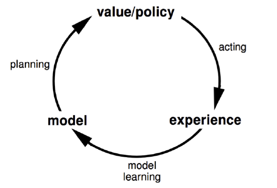
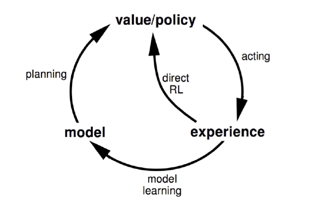
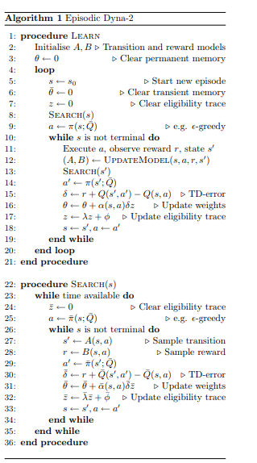

# 强化学习笔记 [17] | 基于模型的强化学习与Dyna算法框架

# [强化学习(十七) 基于模型的强化学习与Dyna算法框架](https://www.cnblogs.com/pinard/p/10384424.html)

在前面我们讨论了基于价值的强化学习(Value Based RL)和基于策略的强化学习模型(Policy Based RL)，本篇我们讨论最后一种强化学习流派，基于模型的强化学习(Model Based RL)，以及基于模型的强化学习算法框架Dyna。

本篇主要参考了UCL强化学习课程的第8讲和Dyna-2的[论文](https://www.davidsilver.uk/wp-content/uploads/2020/03/dyna2_compressed.pdf)。

#  1. 基于模型的强化学习简介

基于价值的强化学习模型和基于策略的强化学习模型都不是基于模型的，它们从价值函数，策略函数中直接去学习，不用学习环境的状态转化概率模型，即在状态 $s$ 下采取动作 $a$,转到下一个状态 $s'$ 的概率 $P^a\_{ss'}$。

而基于模型的强化学习则会尝试从环境的模型去学习，一般是下面两个相互独立的模型：
  - 一个是状态转化预测模型，输入当前状态 $s$和动作 $a$，预测下一个状态 $s'$。
  - 另一个是奖励预测模型，输入当前状态 $s$和动作 $a$，预测环境的奖励 $r$。

即模型可以描述为下面两个式子：

$$\begin{gathered}S\_{t+1}\sim P(S\_{t+1}|S\_t,A\_t)\\\\R\_{t+1}\sim R(R\_{t+1}|S\_t,A\_t)\end{gathered}$$

如果模型 $P$, $R$ 可以准确的描述真正的环境的转化模型，那么我们就可以基于模型来预测，当有一个新的状态 $S$ 和动作 $A$到来时，我们可以直接基于模型预测得到新的状态和动作奖励，不需要和环境交互。当然如果我们的模型不好，那么基于模型预测的新状态和动作奖励可能错的离谱。

从上面的描述我们可以看出基于模型的强化学习和不基于模型的强化学习的主要区别：即基于模型的强化学习是从模型中学习，而不基于模型的强化学习是从和环境交互的经历去学习。

下面这张图描述了基于模型的强化学习的思路：

 

  
   
  
Model-based RL

 

# 2. 基于模型的强化学习算法训练流程

这里我们看看基于模型的强化学习算法训练流程，其流程和我们监督学习算法是非常类似的。

假设训练数据是若干组这样的经历：

$$S\_1,A\_1,R\_2,S\_2,A\_2,R\_2,\ldots,S\_T$$

对于每组经历，我们可以将其转化为 $T−1$ 组训练样本，即：

$$\begin{gathered}
S\_1,A\_1\to S\_2,S\_1,A\_1\to R\_2 \\\\
S\_2,A\_2\to S\_3,S\_2,A\_2\to R\_3 \\\\
...... \\\\
S\_{T-1},A\_{T-1}\rightarrow S\_T,~S\_{T\_1},A\_{T-1}\rightarrow R\_T
\end{gathered}$$

右边的训练样本一起组成了一个分类模型或密度估计模型，输入状态和动作，输出下一个状态。 右边的训练样本一起组成了一个回归模型训练集，输入状态和动作，输出动作奖励值。

至此我们的强化学习求解过程和传统的监督学习算法没有太多区别了，可以使用传统的监督学习算法来求解这两个模型。

当然还可以更简单，即通过对训练样本进行查表法进行统计，直接得到 $P(S\_{t+1}|S\_t,A\_t)$ 的概率和 $R(R\_{t+1}|S\_t,A\_t)$ 的平均值，这样就可以直接预测。比使用模型更简单。

此外，还有其他的方法可以用来得到 $P(S\_{t+1}|S\_t,A\_t)$和 $R(R\_{t+1}|S\_t,A\_t)$，这个我们后面再讲。

虽然基于模型的强化学习思路很清晰，而且还有不要和环境持续交互优化的优点，但是用于实际产品还是有很多差距的。主要是我们的模型绝大多数时候不能准确的描述真正的环境的转化模型，那么使用基于模型的强化学习算法得到的解大多数时候也不是很实用。那么是不是基于模型的强化学习就不能用了呢？也不是，我们可以将基于模型的强化学习和不基于模型的强化学习集合起来，取长补短，这样做最常见的就是Dyna算法框架。

# 3. Dyna算法框架

Dyna算法框架并不是一个具体的强化学习算法，而是一类算法框架的总称。Dyna将基于模型的强化学习和不基于模型的强化学习集合起来，既从模型中学习，也从和环境交互的经历去学习，从而更新价值函数和（或）策略函数。如果用和第一节类似的图，可以表示如下图，和第一节的图相比，多了一个“Direct RL“的箭头，这正是不基于模型的强化学习的思路。

 

  
   
  
Dyna算法示意图

 

Dyna算法框架和不同的具体的不基于模型的强化学习一起，可以得到具体的不同算法。如果我们使用基于价值函数的Q-Learning，那么我们就得到了Dyna-Q算法。我们基于Dyna-Q来看看Dyna算法框架的一般流程.

# 4. Dyna-Q算法流程

这里我们给出基于价值函数的Dyna-Q算法的概要流程。假设模型使用的是查表法。
  - (1). 初始化任意一个状态 $s$,和任意一个动作 $a$ 对应的状态价值 $Q(s,a)$, 初始化奖励模型 $R(s,a)$和状态模型 $P(s,a)$
  - (2). for $i=1$ to 最大迭代次数T：
    - (a) $S \leftarrow \text{current state}$
    - (b) $A \leftarrow \text{ϵ−greedy(S,Q)}$
    - (c) 执行动作 $A$,得到新状态 $S'$ 和奖励 $R$
    - (d) 使用Q-Learning更新价值函数：$Q(S,A)=Q(S,A)+\alpha[R+\gamma\max\_aQ(S^{\prime},a)-Q(S,A)]$
    - (e) 使用 $S,A,S^{\prime}$ 更新状态模型 $P(s,a)$，使用 $S,A,R$ 更新状态模型 $R(s,a)$
    - (f) $\text{for} \space \space j=1 \space \space \text{to} \text{最大次数}n$：
      - (i) 随机选择一个之前出现过的状态 $S$ , 在状态 $S$ 上出现过的动作中随机选择一个动作 $A$
      - (ii) 基于模型 $P(S,A)$ 得到 $S'$, 基于模型 $R(S,A)$ 得到 $R$
      - (iii) 使用Q-Learning更新价值函数: $Q(S,A)=Q(S,A)+\alpha[R+\gamma\max\_aQ(S^{\prime},a)-Q(S,A)]$

从上面的流程可以看出，Dyna框架在每个迭代轮中，会先和环境交互，并更新价值函数和（或）策略函数，接着进行n次模型的预测，同样更新价值函数和（或）策略函数。这样同时利用上了和环境交互的经历以及模型的预测。

# 5. Dyna-2算法框架

在Dyna算法框架的基础上后来又发展出了Dyna-2算法框架。和Dyna相比，Dyna-2将和和环境交互的经历以及模型的预测这两部分使用进行了分离。还是以Q函数为例，Dyna-2将记忆分为**永久性记忆**（permanent memory）和**瞬时记忆**（transient memory）, 其中永久性记忆利用实际的经验来更新，瞬时记忆利用模型模拟经验来更新。

永久性记忆的Q函数定义为：

$$Q(S,A)=\phi(S,A)^T\theta $$

瞬时记忆的Q函数定义为：

$$Q^{\prime}(S,A)=\overline{\phi}(S,A)^T\overline{\theta}$$

组合起来后记忆的Q函数定义为：

$$\overline{Q}(S,A)=\phi(S,A)^T\theta+\overline{\phi}(S,A)^T\overline{\theta}$$

Dyna-2的基本思想是在选择实际的执行动作前，智能体先执行一遍从当前状态开始的基于模型的模拟，该模拟将仿真完整的轨迹，以便评估当前的动作值函数。智能体会根据模拟得到的动作值函数加上实际经验得到的值函数共同选择实际要执行的动作。价值函数的更新方式类似于 $SARSA(λ)$

以下是Dyna-2的算法流程：

 

  
   
  
Dyna-2 算法流程

 

# 6. 基于模型的强化学习总结

基于模型的强化学习一般不单独使用，而是和不基于模型的强化学习结合起来，因此使用Dyna算法框架是常用的做法。对于模型部分，我们可以用查表法和监督学习法等方法，预测或者采样得到模拟的经历。而对于非模型部分，使用前面的Q-Learning系列的价值函数近似，或者基于Actor-Critic的策略函数的近似都是可以的。

除了Dyna算法框架，我们还可以使用基于模拟的搜索(simulation-based search)来结合基于模型的强化学习和不基于模型的强化学习,并求解问题。这部分我们在后面再讨论。

---

> 作者: [Jian YE](https://github.com/jianye0428)  
> URL: https://jianye0428.github.io/posts/rl_learning_note_17/  

