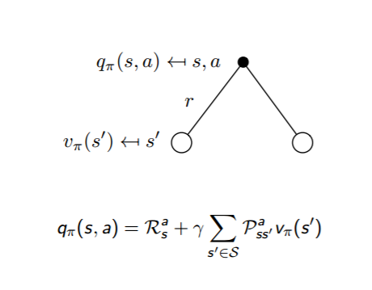
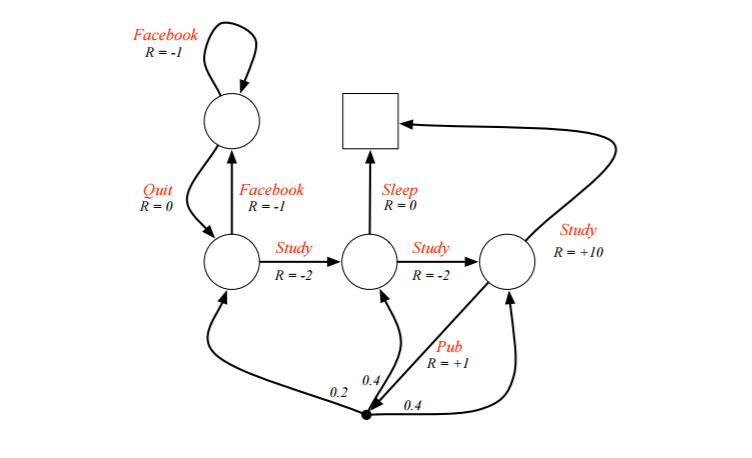
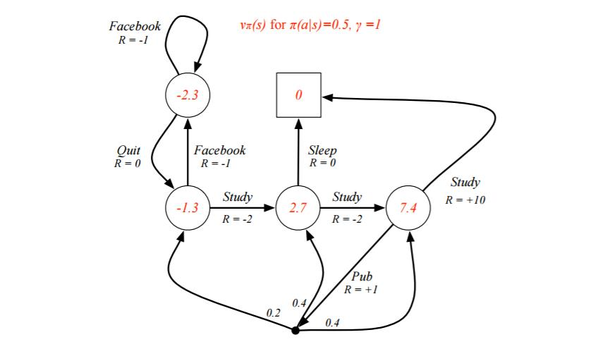
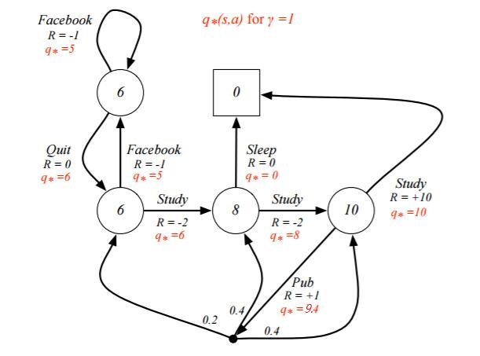

# RL学习笔记 [2] | 马尔科夫决策过程(MDP)

# 0. 引言

  在[强化学习（一）模型基础](https://www.cnblogs.com/pinard/p/9385570.html)中，我们讲到了强化学习模型的8个基本要素。但是仅凭这些要素还是无法使用强化学习来帮助我们解决问题的, 在讲到模型训练前，模型的简化也很重要，这一篇主要就是讲如何利用马尔科夫决策过程(Markov Decision Process，以下简称MDP)来简化强化学习的建模。

  MDP这一篇对应Sutton书的第三章和UCL强化学习课程的第二讲。

# 1. 强化学习引入MDP的原因

  对于马尔科夫性本身，我之前讲过的[隐马尔科夫模型HMM（一）HMM模型](http://www.cnblogs.com/pinard/p/6945257.html)，[条件随机场CRF(一)从随机场到线性链条件随机场](http://www.cnblogs.com/pinard/p/7048333.html)以及[MCMC(二)马尔科夫链](http://www.cnblogs.com/pinard/p/6632399.html)都有讲到。它本身是一个比较简单的假设，因此这里就不专门对“马尔可夫性”做专门的讲述了。

  除了对于环境的状态转化模型这个因素做马尔科夫假设外，我们还对强化学习第四个要素个体的策略(policy) $π$ 也做了马尔科夫假设。即在状态$s$时采取动作$a$的概率仅与当前状态$s$有关，与其他的要素无关。用公式表示就是

  $$\pi(a\mid s)=P(A\_{t}=a\mid S\_{t}=s)$$

  对于第五个要素，价值函数 $v\_π(s)$ 也是一样, $v\_π(s)$ 现在仅仅依赖于当前状态了，那么现在价值函数 $v\_π(s)$ 表示为:

  $$\nu\_{\pi}(s)=\mathrm{E}\_{\pi}(G\_{t}|S\_{t}=s)=\mathrm{E}\_{\pi}(R\_{t+1}+\gamma R\_{t+2}+\gamma^{2}R\_{t+3}+\ldots\mid S\_{t}=s)$$

  其中，$G\_t$ 代表收获(return), 是一个MDP中从某一个状态 $S\_t$ 开始采样直到终止状态时所有奖励的有衰减的之和。

# 2. MDP的价值函数与贝尔曼方程

  对于MDP，我们在第一节里已经讲到了它的价值函数 $v\_π(s)$ 的表达式。但是这个表达式没有考虑到所采用的动作$a$带来的价值影响，因此我们除了 $v\_π(s)$ 这个状态价值函数外，还有一个动作价值函数 $q\_π(s,a)$，即：

  $$q\_{\pi}(s,a)=\operatorname{E}\_{\pi}(G\_{t}|S\_{t}=s,A\_{t}=a)=\operatorname{E}\_{\pi}(R\_{t+1}+\gamma R\_{t+2}+\gamma^{2}R\_{t+3}+\ldots\mid S\_{t}=s,A\_{t}=a)$$

  根据价值函数的表达式，我们可以推导出价值函数基于状态的递推关系，比如对于状态价值函数 $v\_π(s)$，可以发现：

  $$\begin{aligned}
  V\_{\pi}(s)& =\mathrm{E}\_{\pi}(R\_{t+1}+\gamma R\_{t+2}+\gamma^{2}R\_{t+3}+\ldots\mid S\_{t}=s)  \\\\
  &=\mathrm{E}\_{\pi}(R\_{t+1}+\gamma(R\_{t+2}+\gamma R\_{t+3}+\ldots)|S\_{t}=s) \\\\
  &=\mathrm{E}\_{\pi}(R\_{t+1}+\gamma G\_{t+1}|S\_{t}=s) \\\\
  &=\mathrm{E}\_{\pi}(R\_{t+1}+\gamma\nu\_{\pi}(S\_{t+1})|S\_{t}=s)
  \end{aligned}$$

  也就是说，在 $t$ 时刻的状态 $S\_t$ 和 $t+1$ 时刻的状态 $S\_{t+1}$ 是满足递推关系的，即：

  $$v\_{\pi}(s)=\mathrm{E}\_{\pi}(R\_{t+1}+\gamma\nu\_{\pi}(S\_{t+1})\mid S\_{t}=s)$$
　　　　
  这个递推式子我们一般将它叫做**贝尔曼方程**。这个式子告诉我们，一个状态的价值由该状态的奖励以及后续状态价值按一定的衰减比例联合组成。

  同样的方法，我们可以得到动作价值函数 $q\_π(s,a)$ 的贝尔曼方程：

  $$q\_{\pi}(s,a)=\mathrm{E}\_{\pi}(R\_{t+1}+\gamma q\_{\pi}(S\_{t+1},A\_{t+1})\mid S\_{t}=s,A\_{t}=a)$$

# 3. 状态价值函数与动作价值函数的递推关系

根据动作价值函数 $q\_π(s,a)$ 和状态价值函数 $v\_π(s)$ 的定义，我们很容易得到他们之间的转化关系公式：

$$\nu\_{\pi}(s)=\sum\_{a\in A}\pi(a|s)q\_{\pi}(s,a)$$

也就是说，状态价值函数是所有动作价值函数基于策略 $π$ 的期望。通俗说就是某状态下所有状态动作价值乘以该动作出现的概率，最后求和，就得到了对应的状态价值。

反过来，利用上贝尔曼方程，我们也很容易从状态价值函数 $v\_π(s)$ 表示动作价值函数 $q\_π(s,a)$，即：

$$q\_{\pi}(s,a)=R\_{s}^{a}+\gamma\sum\_{s^{\prime}\in S}P\_{ss'}^{a}\nu\_{\pi}(s^{'})$$

通俗说就是状态动作价值有两部分相加组成，第一部分是即时奖励，第二部分是环境所有可能出现的下一个状态的概率乘以该下一状态的状态价值，最后求和，并加上衰减。

这两个转化过程也可以从下图中直观的看出：

 

  
   
  
状态价值函数

 

 

  
   
  
动作价值函数

 

把上面两个式子互相结合起来，我们可以得到：

$$\nu\_{\pi}(s)=\sum\_{a\in A}\pi(a\mid s)(R\_{s}^{a}+\gamma\sum\_{s' \in S}P\_{ss'}^{a}\nu\_{\pi}(s^{'}))$$

$$q\_\pi(s,a)=R\_s^a+\gamma\sum\_{s' \in S}P\_{ss'}^a\sum\_{a' \in A}\pi(a' \mid s')q\_\pi(s',a')$$

# 4. 最优价值函数

解决强化学习问题意味着要寻找一个最优的策略让个体在与环境交互过程中获得始终比其它策略都要多的收获，这个最优策略我们可以用 *π*∗表示。一旦找到这个最优策略$π^∗$，那么我们就解决了这个强化学习问题。一般来说，比较难去找到一个最优策略，但是可以通过比较若干不同策略的优劣来确定一个较好的策略，也就是局部最优解。

如何比较策略的优劣呢？一般是通过对应的价值函数来比较的，也就是说，寻找较优策略可以通过寻找较优的价值函数来完成。可以定义最优状态价值函数是所有策略下产生的众多状态价值函数中的最大者，即：

$$\nu\_{*}(s)=\max\_{\pi}\nu\_{\pi}(s)$$

同理也可以定义最优动作价值函数是所有策略下产生的众多动作状态价值函数中的最大者，即：

$$q\_*(s,a)=\max\_\pi q\_\pi(s,a)$$

对于最优的策略，基于动作价值函数我们可以定义为：

$$\pi\_*(a|s)=\begin{cases}1&\mathrm{if~}a=\mathrm{arg~}\max\_{a\in A}q*(s,a)\\\\0&\mathrm{else}&\end{cases}$$

只要我们找到了最大的状态价值函数或者动作价值函数，那么对应的策略 $π^*$ 就是我们强化学习问题的解。同时，利用状态价值函数和动作价值函数之间的关系，我们也可以得到:

$$v\_*(s)=\max\_aq\_*(s,a)$$

反过来的最优价值函数关系也很容易得到：

$$q\_{*}(s,a)=R\_{s}^{a}+\gamma\sum\_{s' \in S}P\_{ss}^{a}{}\_{*}(\mathrm{s'})$$

利用上面的两个式子也可以得到和第三节末尾类似的式子：

$$\nu\_*(s)=\max\_a(R\_s^a+\gamma\sum\_{s^{\prime}\in S}P\_{ss'}^a\nu\_*(s'))$$

$$q\_*(s,a)=R\_s^a+\gamma\sum\_{s' \in S}P\_{ss'}^a\max\_{a'}q\_*(s',a')$$

# 5. MDP实例

上面的公式有点多，需要一些时间慢慢消化，这里给出一个UCL讲义上实际的例子，首先看看具体我们如何利用给定策略来计算价值函数。

 

  
   
  
MDP 举例

 

例子是一个学生学习考试的MDP。里面左下那个圆圈位置是起点，方框那个位置是终点。上面的动作有study, pub, facebook, quit, sleep，每个状态动作对应的即时奖励R已经标出来了。我们的目标是找到最优的动作价值函数或者状态价值函数，进而找出最优的策略。

为了方便，我们假设衰减因子 $γ=1$, $π(a|s)=0.5$。

对于终点方框位置，由于其没有下一个状态，也没有当前状态的动作，因此其状态价值函数为0。对于其余四个状态，我们依次定义其价值为*v*1,*v*2,*v*3,*v*4， 分别对应左上，左下，中下，右下位置的圆圈。我们基于$\nu\_{\pi}(s)=\sum\_{a\in A}\pi(a|s)(R\_{s}^{a}+\gamma\sum\_{s' \in S}P\_{ss'}^{a}\nu\_{\pi}(s'))$计算所有的状态价值函数。可以列出一个方程组。

  - 对于*v*1位置，我们有：$v\_1=0.5*(-1+v\_1)+0.5*(0+v\_2)$

  - 对于*v*2位置，我们有：$v\_2=0.5*(-1+v\_1)+0.5*(-2+v\_3)$

  - 对于*v*3位置，我们有：$v\_3=0.5*(0+0)+0.5*(-2+v\_4)$

  - 对于*v*4位置，我们有：$v\_4=0.5*(10+0)+0.5*(1+0.2*v\_2+0.4*v\_3+0.4*v\_4)$

解出这个方程组可以得到 $v\_1=−2.3$, $v\_2=−1.3$, $v\_3=2.7$, $v\_4=7.4$, 即每个状态的价值函数如下图：

 

  
   
  
MDP

 

上面我们固定了策略$ π(a|s)$, 虽然求出了每个状态的状态价值函数，但是却并不一定是最优价值函数。那么如何求出最优价值函数呢？这里由于状态机简单，求出最优的状态价值函数 $v*(s)$ 或者动作价值函数 $q*(s,a)$ s比较容易。

我们这次以动作价值函数 $q*(s,a)$ 来为例求解。首先终点方框处的好求。

$$q*(s\_3,sleep)=0,q*(s\_4,study)=10$$

接着我们就可利用 $q*(s,a)=R\_{s}^{a}+\gamma\sum\_{s' \in S}P\_{ss'}^{a}\max\_{a'}q*(s',a')$ 列方程组求出所有的 $q∗(s,a)$ 。有了所有的 $q*(s,a)$,利用 $v\_{*}(s)=\max\_{a}q*(s,a)$ 就可以求出所有的 $v∗(s)$。最终求出的所有 $v∗(s)$ 和 $q∗(s,a)$ 如下图：

 

  
   
  
MDP

 

从而我们的最优决策路径是走6->6->8->10->结束。　　　　

# 6. MDP小结

MDP是强化学习入门的关键一步，如果这部分研究的比较清楚，后面的学习就会容易很多。因此值得多些时间在这里。虽然MDP可以直接用方程组来直接求解简单的问题，但是更复杂的问题却没有办法求解，因此我们还需要寻找其他有效的求解强化学习的方法。

下一篇讨论用动态规划的方法来求解强化学习的问题。

# 7. ref
https://www.cnblogs.com/pinard/p/9426283.html

---

> 作者: [Jian YE](https://github.com/jianye0428)  
> URL: https://jianye0428.github.io/posts/rl_learning_note_2/  

