# 强化学习 | 深度解读Soft Actor-Critic 算法

# 深度解读Soft Actor-Critic 算法
## 1 前言

机器人学习Robot Learning正在快速的发展，其中深度强化学习deep reinforcement learning（DRL），特别是面向连续控制continous control的DRL算法起着重要的作用。在这一领域中，目前可以说有三类行之有效的model free DRL算法：

- TRPO,PPO
- DDPG及其拓展（[D4PG](https://link.zhihu.com/?target=https%3A//arxiv.org/abs/1804.08617),TD3等）
- Soft Q-Learning, Soft Actor-Critic

**PPO** 算法是目前最主流的DRL算法，同时面向离散控制和连续控制，在[OpenAI Five](https://en.wikipedia.org/wiki/OpenAI_Five)上取得了巨大成功。但是PPO是一种on-policy的算法，也就是PPO面临着严重的sample inefficiency，需要巨量的采样才能学习，这对于真实的机器人训练来说，是无法接受的。

**DDPG** 及其拓展则是DeepMind开发的面向连续控制的off policy算法，相对PPO 更sample efficient。**DDPG训练的是一种确定性策略deterministic policy，即每一个state下都只考虑最优的一个动作**。DDPG的拓展版D4PG从paper中的结果看取得了非常好的效果，但是并没有开源，目前github上也没有人能够完全复现Deepmind的效果。

 **Soft Actor-Critic (SAC)** 是面向Maximum Entropy Reinforcement learning 开发的一种off policy算法，和DDPG相比，Soft Actor-Critic使用的是随机策略stochastic policy，相比确定性策略具有一定的优势（具体后面分析）。Soft Actor-Critic在公开的benchmark中取得了非常好的效果，并且能直接应用到真实机器人上。最关键的是，Soft Actor-Critic是完全开源的，因此，深入理解Soft Actor-Critic 算法具有非常重要的意义，也是本篇blog的目的。

Soft Actor-Critic算法相关链接：

Paper：

- [Soft Actor-Critic: Off-Policy Maximum Entropy Deep Reinforcement Learning with a Stochastic Actor](https://link.zhihu.com/?target=https%3A//arxiv.org/abs/1801.01290)
- [Soft Actor-Critic Algorithms and Applications](https://link.zhihu.com/?target=https%3A//arxiv.org/abs/1812.05905)
- [Reinforcement Learning with Deep Energy-Based Policies](https://link.zhihu.com/?target=https%3A//arxiv.org/abs/1702.08165) (Soft Q-Learning)

Codes:

- [rail-berkeley/softlearning](https://link.zhihu.com/?target=https%3A//github.com/rail-berkeley/softlearning) (原作者实现）
- [vitchyr/rlkit](https://link.zhihu.com/?target=https%3A//github.com/vitchyr/rlkit)
- [openai/spinningup](https://link.zhihu.com/?target=https%3A//github.com/openai/spinningup)
- [hill-a/stable-baselines](https://link.zhihu.com/?target=https%3A//github.com/hill-a/stable-baselines)

下面我们来详细解读一下SAC的算法及其具体实现。本文的阅读需要有基本的DRL算法基础知识。

## 2 为什么研究 Maximum Entropy Reinforcement Learning？

对于一般的DRL，学习目标很直接，就是学习一个policy使得累加的reward期望值最大：

$$\pi^*=\arg\max\_\pi\mathbb{E}\_{(s\_t,a\_t)\sim\rho\_\pi}[\sum\_tR(s\_t,a\_t)]\tag{1}$$

而最大熵RL，除了上面的基本目标，还要求policy的每一次输出的action 熵entropy最大：

$$\pi^*=\arg\max\_\pi\mathbb{E}\_{(s\_t,a\_t)\sim\rho\_\pi}[\sum\_t\underbrace{R(s\_t,a\_t)}\_{reward}+\alpha\underbrace{H(\pi(\cdot|s\_t))}\_{entropy}]\tag{2}$$

这样做的基本目的是什么呢？让策略随机化，即输出的每一个action的概率尽可能分散，而不是集中在一个action上。不了解entropy的同学可以看这里：[wiki-信息熵](https://link.zhihu.com/?target=https%3A//zh.wikipedia.org/wiki/%E7%86%B5_(%E4%BF%A1%E6%81%AF%E8%AE%BA))

我们知道DDPG训练得到的是一个deterministic policy确定性策略，也就是说这个策略对于一种状态state只考虑一个最优的动作。所以，stochastic policy相对deterministic policy有什么优势呢？

Stochastic policy随机策略在实际机器人控制上往往是更好的做法。比如我们让机器人抓取一个水杯，机器人是有无数条路径去实现这个过程的，而并不是只有唯一的一种做法。因此，我们就需要drl算法能够给出一个随机策略，在每一个state上都能输出每一种action的概率，比如有3个action都是最优的，概率一样都最大，那么我们就可以从这些action中随机选择一个做出action输出。**最大熵maximum entropy的核心思想就是不遗落到任意一个有用的action，有用的trajectory**。对比DDPG的deterministic policy的做法，看到一个好的就捡起来，差一点的就不要了，而最大熵是都要捡起来，都要考虑。

**基于最大熵的RL算法有什么优势？**

以前用deterministic policy的算法，我们找到了一条最优路径，学习过程也就结束了。现在，我们还要求熵最大，就意味着神经网络需要去explore探索所有可能的最优路径，这可以产生以下多种优势：

- 1）学到policy可以作为更复杂具体任务的初始化。因为通过最大熵，policy不仅仅学到一种解决任务的方法，而是所有all。因此这样的policy就更有利于去学习新的任务。比如我们一开始是学走，然后之后要学朝某一个特定方向走。

- 2）更强的exploration能力，这是显而易见的，能够更容易的在多模态reward （multimodal reward）下找到更好的模式。比如既要求机器人走的好，又要求机器人节约能源

- 3）更robust鲁棒，更强的generalization。因为要从不同的方式来探索各种最优的可能性，也因此面对干扰的时候能够更容易做出调整。（干扰会是神经网络学习过程中看到的一种state，既然已经探索到了，学到了就可以更好的做出反应，继续获取高reward）

既然最大熵RL算法这么好，我们当然应该研究它了。而实际上，在之前的DRL算法[A3C](https://link.zhihu.com/?target=https%3A//arxiv.org/abs/1602.01783)中，我们其实已经用了一下最大熵：

 

  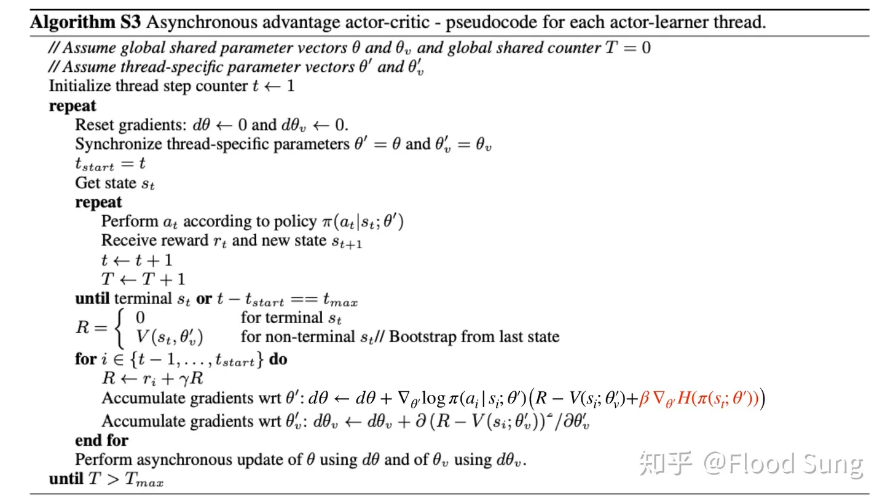
   
  
BP Network

 

在训练policy的时候，A3C加了entropy项，作为一个regularizer，让policy更随机。不过A3C这么做主要是为了更好做exploration，整体的训练目标依然只考虑reward。这和Soft Actor-Critic的设定还是不一样的，Soft Actor-Critic是真正最大熵DRL算法。

## 3 Maximum Entropy Reinforcement Learning的Bellman方程

我们先回顾一下dynamic programming中Bellman backup equation，参考[http://www0.cs.ucl.ac.uk/staff/d.silver/web/Teaching_files/MDP.pdf](https://link.zhihu.com/?target=http%3A//www0.cs.ucl.ac.uk/staff/d.silver/web/Teaching_files/MDP.pdf)

 

  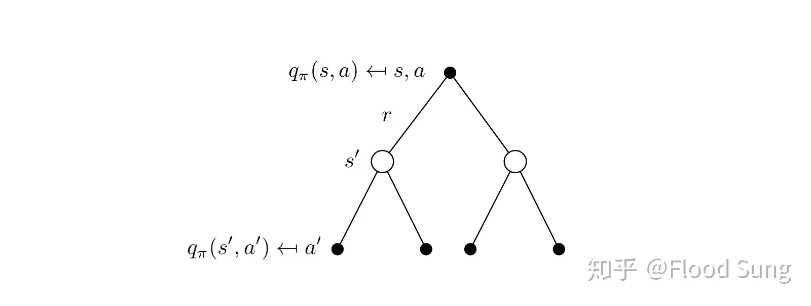
   
  
BP Network

 

$$q\_\pi(s,a)=r(s,a)+\gamma\sum\_{s^{\prime}\in\mathcal{S}}\mathcal{P}\_{ss^{\prime}}^a\sum\_{a^{\prime}\in\mathcal{A}}\pi(a^{\prime}|s^{\prime})q\_\pi(s^{\prime},a^{\prime})\tag{3}$$

那么对于最大熵（MaxEnt)的目标，其实可以把熵也作为reward的一部分，我们在计算q值时（记住q是累加reward的期望，传统rl的目标等价于让q最大），就需要计算每一个state的熵entropy (entropy的公式如下图所示）：

 

  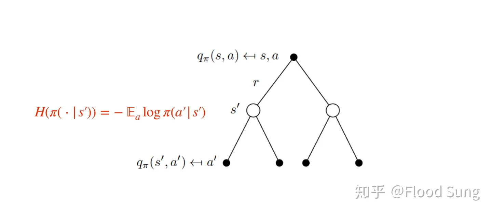
   
  
BP Network

 

 

  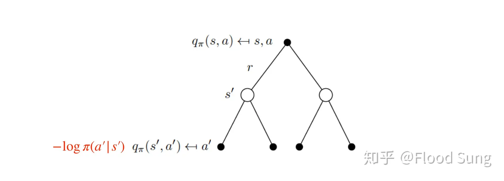
   
  
BP Network

 

因此我们就可以得到Soft Bellman Backup equation (Entropy项)额外乘上 $\alpha$ 系数：

$$q\_\pi(s,a)=r(s,a)+\gamma\sum\_{s^{\prime}\in\mathcal{S}}\mathcal{P}\_{ss^{\prime}}^a\sum\_{a^{\prime}\in\mathcal{A}}\pi(a^{\prime}|s^{\prime})(q\_\pi(s^{\prime},a^{\prime})-\alpha\log(\pi(a^{\prime}|s^{\prime}))\quad(4)$$

Recall一下[Dynamic Programming Backup](https://link.zhihu.com/?target=http%3A//www0.cs.ucl.ac.uk/staff/d.silver/web/Teaching_files/MC-TD.pdf)：

 

  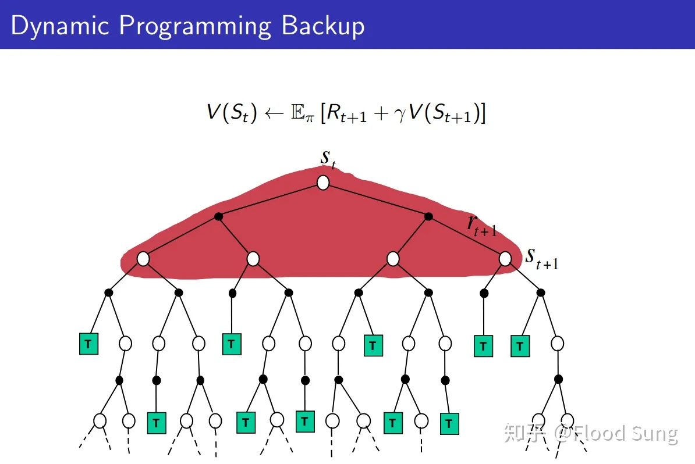
   
  
BP Network

 
对应Q值的公式是

$$Q(s\_t,a\_t)=r(s\_t,a\_t)+\gamma\mathbb{E}\_{s\_{t+1},a\_{t+1}}[Q(s\_{t+1},a\_{t+1})]\tag{5}$$

根据公式（4），我们可以得到Soft Bellman Backup的 更新公式：

$$Q\_{soft}(s\_t,a\_t)=r(s\_t,a\_t)+\gamma\mathbb{E}\_{s\_{t+1},a\_{t+1}}[Q\_{soft}(s\_{t+1},a\_{t+1})-\alpha\log(\pi(a\_{t+1}|s\_{t+1}))]\tag{6}$$

上面公式（6）是直接使用dynamic programming，将entropy嵌入计算得到的结果。我们可以反过来先直接把entropy作为reward的一部分：

$$r\_{soft}(s\_t,a\_t)=r(s\_t,a\_t)+\gamma\alpha\mathbb{E}\_{s\_{t+1}\sim\rho}H(\pi(\cdot|s\_{t+1}))\tag{7}$$

我们将（7）带入到公式（5）：

$$\begin{aligned}
{Q\_{soft}(s\_{t},a\_{t})} &=r(s\_t,a\_t)+\gamma\alpha\mathbb{E}\_{s\_{t+1}\sim\rho}H(\pi(\cdot|s\_{t+1}))+\gamma\mathbb{E}\_{s\_{t+1},a\_{t+1}}[Q\_{soft}(s\_{t+1},a\_{t+1})]\\\\
&=r(s\_t,a\_t)+\gamma\mathbb{E}\_{s\_{t+1}\sim\rho,a\_{t+1}\sim\pi}[Q\_{soft}(s\_{t+1},a\_{t+1})]+\gamma\alpha\mathbb{E}\_{s\_{t+1}\sim\rho}H(\pi(\cdot|s\_{t+1}))\\\\
&=r(s\_t,a\_t)+\gamma\mathbb{E}\_{s\_{t+1}\sim\rho,a\_{t+1}\sim\pi}[Q\_{soft}(s\_{t+1},a\_{t+1})]+\gamma\mathbb{E}\_{s\_{t+1}\sim\rho}\mathbb{E}\_{a\_{t+1}\sim\pi}[-\alpha\log\pi(a\_{t+1}|s\_{t+1})]\\\\
&=r(s\_t,a\_t)+\gamma\mathbb{E}\_{s\_{t+1}\sim\rho}[\mathbb{E}\_{a\_{t+1}\sim\pi}[Q\_{soft}(s\_{t+1},a\_{t+1})-\alpha\log(\pi(a\_{t+1}|s\_{t+1}))]]\\\\&=r(s\_t,a\_t)+\gamma\mathbb{E}\_{s\_{t+1},a\_{t+1}}[Q\_{soft}(s\_{t+1},a\_{t+1})-\alpha\log(\pi(a\_{t+1}|s\_{t+1}))]\end{aligned}$$

可以得到一样的结果。

与此同时，我们知道:

$$Q(s\_t,a\_t)=r(s\_t,a\_t)+\gamma\mathbb{E}\_{s\_{t+1}\sim\rho}[V(s\_{t+1})]\tag{9}$$

因此，我们有：

$$V\_{soft}(s\_t)=\mathbb{E}\_{a\_t\sim\pi}[Q\_{soft}(s\_t,a\_t)-\alpha\log\pi(a\_t|s\_t)]\tag{10}$$

至此我们理清楚了SAC paper原文中的公式(2)和(3)：

 

  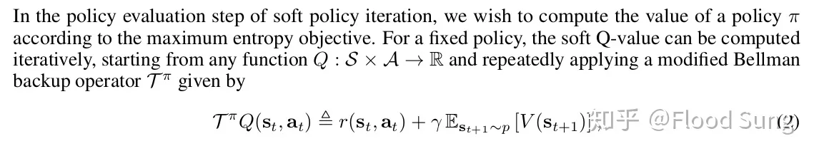
   
  
BP Network

 

 

  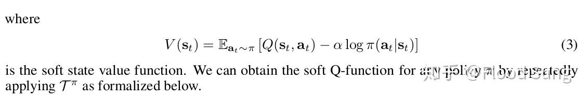
   
  
BP Network

 

并且（7）的做法直接证明了Lemma 1 Soft Policy Evaluation (**这个lemma为下一部分的soft policy iteration提供支撑**）:

 

  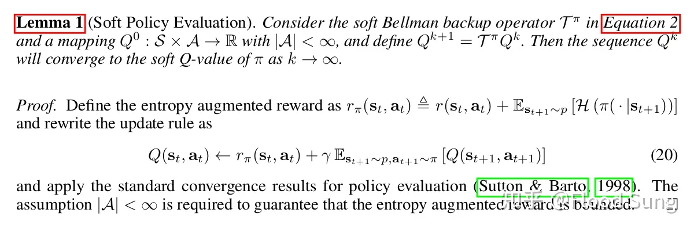
   
  
BP Network

 

但是，我们注意到上面的整个推导过程都是围绕maximum entropy，和soft 好像没有什么直接关系。所以，

**为什么称为soft？哪里soft了？以及为什么soft Q function能够实现maximum entropy？**

理解清楚这个问题是理解明白soft q-learning及sac的关键！

SAC这篇paper直接跳过了soft Q-function的定义问题，因此，要搞清楚上面的问题，我们从Soft Q-Learning的paper来寻找答案。

参考[Learning Diverse Skills via Maximum Entropy Deep Reinforcement Learning](https://link.zhihu.com/?target=https%3A//bair.berkeley.edu/blog/2017/10/06/soft-q-learning/)

 

  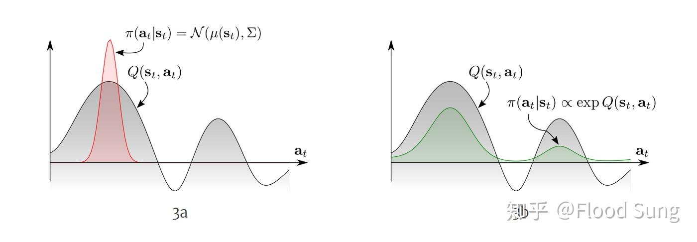
   
  
BP Network

 

上面的曲线很明显的说明了stochastic policy的重要性，面对多模的（multimodal）的Q function，传统的RL只能收敛到一个选择（左图），而更优的办法是右图，让policy也直接符合Q的分布。这里，最直接的一种办法就是定义这样的energy-based policy：

\pi(a_t|s_t)\propto exp(-\mathcal{E}(s_t,a_t)) （11）

其中 \mathcal{E} 是能量函数，上面的形式就是Boltzmann Distribution [玻尔兹曼分布](https://link.zhihu.com/?target=https%3A//zh.wikipedia.org/wiki/%E7%8E%BB%E5%B0%94%E5%85%B9%E6%9B%BC%E5%88%86%E5%B8%83) 。下图的 -f(x)=\mathcal{E}

 

  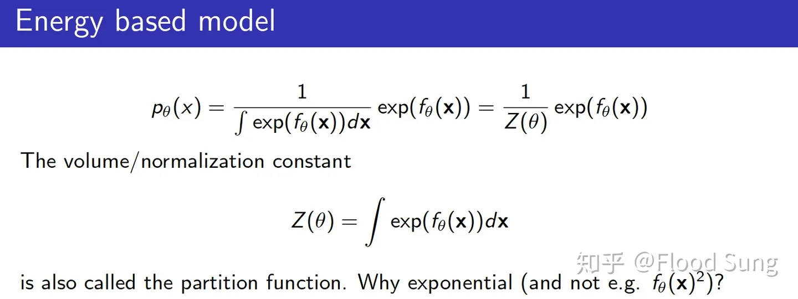
   
  
BP Network

 

https://deepgenerativemodels.github.io/assets/slides/cs236_lecture13.pdf

为了连接soft Q function，我们可以设定

$$\mathcal{E}(s\_t,a\_t)=-\frac{1}{\alpha}Q\_{soft}(s\_t,a\_t)\tag{12}$$

因此，我们有

$$\pi(a\_t|s\_t)\propto exp(Q\_{soft}(s\_t,a\_t))\tag{13}$$

这样的policy能够为每一个action赋值一个特定的概率符合Q值的分布，也就满足了stochastic policy的需求。

下面我们要**发现(13)的形式正好就是最大熵RL的optimal policy最优策略的形式，而这实现了soft q function和maximum entropy的连接。**

 

  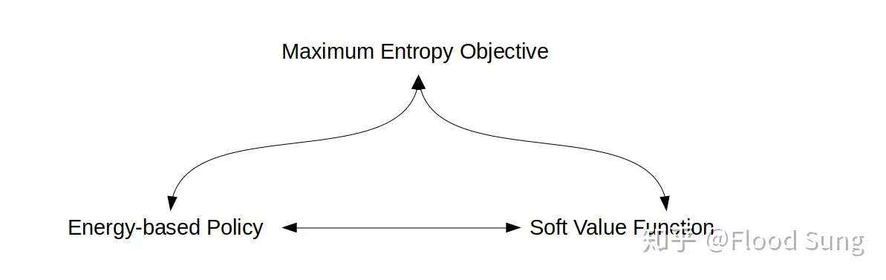
   
  
BP Network

 

实际上我们理解Soft Q-Learning及Soft Actor Critic，要清楚上图三者的关系。在Soft Q-Learning那篇paper中，他是从Soft Value Function的定义出发去连接Energy-Based Policy 和Maximum Entropy Objective的关系。而在本blog中，我们从Maximum Entropy Objective出发，来连接其他两部分。

前面我们已经推导得到了公式（10），那么根据公式（10），我们可以直接推导得到policy的形式：

$$\begin{aligned}\pi(s\_{t},a\_{t})&=\exp(\frac1\alpha(Q\_{soft}(s\_t,a\_t)-V\_{soft}(s\_t)))\\\\&&\text{(14)}\\\\&=\frac{\exp(\frac1\alpha Q\_{soft}(s\_t,a\_t))}{\exp(\frac1\alpha V\_{soft}(s\_t))}\end{aligned}$$

（14）符合了（13）， $\frac{1}{\alpha}V\_{soft}(s\_t)$ 可以看做是对应的log partition function. 由此，就连接了Maximum Entropy Objective和Energy Based Policy的关系。

下面我们要连接Soft Value Function。从（14）的 $\frac{1}{\alpha}V\_{soft}(s\_t)$ 已经很明显了：

$$\exp(\frac1\alpha V\_{soft}(s\_t))=\int\exp(\frac1\alpha Q\_{soft}(s\_t,a))d\mathbf{a} (15)$$

因此，我们可以定义 $V\_{soft}(s\_t)$ :

$$V\_{soft}(s\_t)\triangleq\alpha\log\int\exp(\frac1\alpha Q\_{soft}(s\_t,a))d\mathbf{a}\tag{16}$$

这和soft 有什么关系呢？(16）其实是LogSumExp的积分形式，就是smooth maximum/soft maximum (软的最大）。参考[https://en.wikipedia.org/wiki/LogSumExp](https://link.zhihu.com/?target=https%3A//en.wikipedia.org/wiki/LogSumExp)

所以就可以定义

$$\mathrm{soft}\max\_af(a):=\log\int\exp f(a)da\tag{17}$$

因此我们也就可以根据公式（9）定义soft的Q-function：

$$Q\_{soft}(s\_t,a\_t)=\mathbb{E}\left[r\_t+\gamma\text{ soft}\max\_aQ(s\_{t+1},a)\right]\text{(18)}$$

所以，为什么称为soft是从这里来的。

这里有一个常见的疑问就是这里的soft max和我们常见的softmax好像不一样啊。是的，我们在神经网络中常用的activation function softmax 实际上是soft argmax，根据一堆logits找到对应的软的最大值对应的index。具体参看：[https://en.wikipedia.org/wiki/Softmax_function](https://link.zhihu.com/?target=https%3A//en.wikipedia.org/wiki/Softmax_function)

上面的推导还只是面向policy的value和Q，我们下面要说明optimal policy也必然是energy-based policy的形式。

这一部分的证明依靠 Policy improvement theorem：

 

  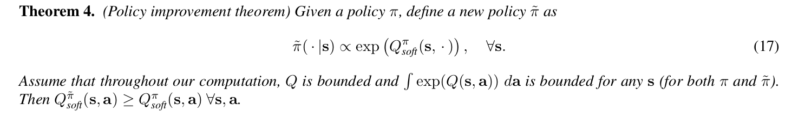
   
  
BP Network

 

具体证明过程见soft q-learning原文的A.1。

有了Theorem 4，

 

  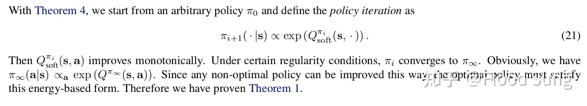
   
  
BP Network

 

我们就可以看到optimal policy必然是energy based policy，也因此，我们有了soft q learning paper中最开始的定义：

$$\pi\_{MaxEnt}^*(a\_t|s\_t)=\exp(\frac{1}{\alpha}(Q\_{soft}^*(s\_t,a\_t)-V\_{soft}^*(s\_t)))\text{(19)}$$

## 4 Policy Iteration

理清楚了上面的基本定义和联系，我们就可以研究怎么更新policy了，也就是policy iteration。

回顾一下一般的[Policy Iteration](https://link.zhihu.com/?target=http%3A//www0.cs.ucl.ac.uk/staff/d.silver/web/Teaching_files/DP.pdf)：

 

  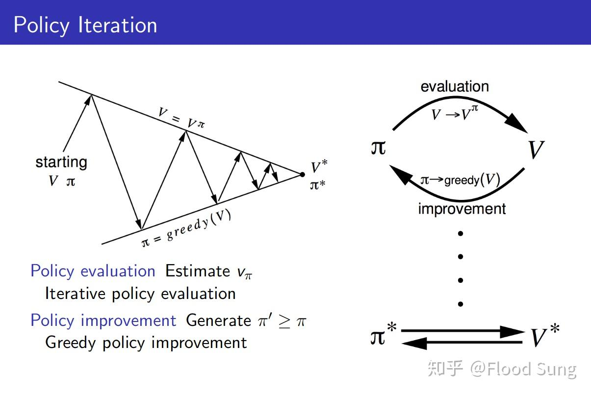
   
  
BP Network

 

在两步中进行循环迭代（我们直接使用Q值来说明）：

1. Policy evaluation：固定policy，使用Bellman方程更新Q值直到收敛：

$$Q\_\pi(s,a)=r(s,a)+\lambda\mathbb{E}\_{s^{\prime},a^{\prime}}Q\_\pi(s^{\prime},a^{\prime})\tag{20}$$

2. Policy improvement: 更新policy：

$$\pi^{\prime}(s)=\arg\max\_aQ\_\pi(s,a)\tag{21}$$

基于同样的方法，我们有Soft Policy Iteration：

1. Soft policy evaluation:固定policy，使用Bellman方程更新Q值直到收敛:

$$\begin{aligned}&Q\_{soft}^\pi(s\_t,a\_t)=r(s\_t,a\_t)+\lambda\mathbb{E}\_{s\_{t+1},a\_{t+1}}\left[Q\_{soft}^\pi(s\_{t+1},a\_{t+1})-\alpha\log(\pi(a\_{t+1}|s\_{t+1}))\right]\tag{22}\end{aligned}$$

2. Soft policy improvement: 更新policy：

$$\pi^{\prime}=\arg\min\_{\pi\_k\in\Pi}D\_{KL}(\pi\_k(\cdot|s\_t)||\frac{\exp(\frac{1}{\alpha}Q\_{soft}^{\pi}(s\_t,\cdot))}{Z\_{soft}^{\pi}(s\_t)}) \tag{23}$$

(22)基于上一部分说的Lemma 1 Soft Policy Evaluation, 可收敛。

(23)则基于上一部分的Theorem 4 Policy Improvement Theorem。只是这里的做法不是直接赋值，而是通过KL divergence来趋近 $\exp(Q^{\pi}\_{soft}(s\_t,\cdot))$ 。在SAC的paper原文中，我们可以看到这么做的原因是为了限制policy在一定范围的policies $\Pi$ 中从而tractable，policy的分布可以是高斯分布。

 

  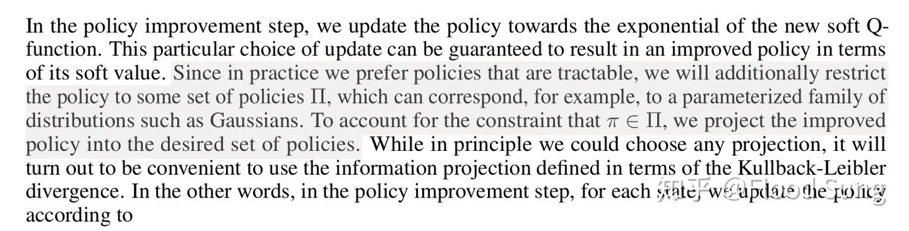
   
  
BP Network

 

同样的，作者也专门证明了采用KL divergence的方法一样能够保证policy improvement，也就是Lemma 2：

 

  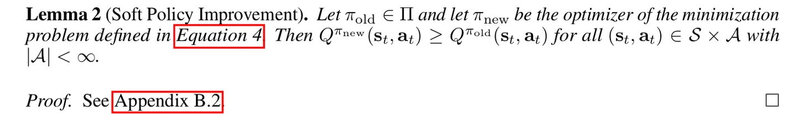
   
  
BP Network

 

最后，就是证明上面的Soft Policy Iteration过程能保证policy收敛到最优，即Theorem 1：

 

  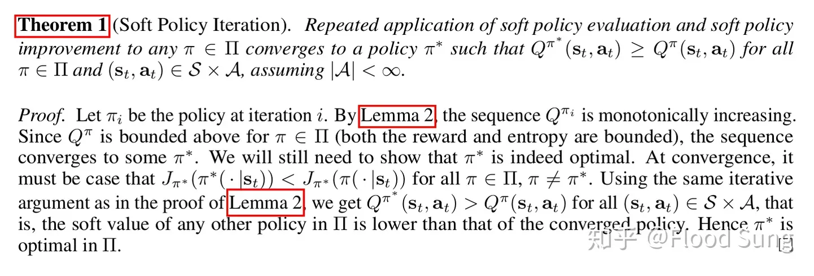
   
  
BP Network

 

由此，基本的理论建设也就结束了，下面进入Soft Actor-Critic的算法设计。

## 5 Soft Actor-Critic

SAC算法的构建首先是神经网络化，我们用神经网络来表示Q和Policy： $Q\_{\theta}(s\_t,a\_t)$ 和 $\pi\_{\phi}(a\_t|s\_t)$ 。Q网络比较简单，几层的MLP最后输出一个单值表示Q就可以了，Policy网络需要输出一个分布，一般是输出一个Gaussian 包含mean和covariance。下面就是构建神经网络的更新公式。

对于Q网络的更新，我们根据（10）可以得到：

$$\begin{aligned}
J\_{Q}(\theta)& =\mathbb{E}\_{(s\_t,a\_t,s\_{t+1})\sim\mathcal{D}}[\frac{1}{2}(Q\_\theta(s\_t,a\_t)-(r(s\_t,a\_t)+\gamma V\_{\bar{\theta}}(s\_{t+1})))^2] \\\\
&=\mathbb{E}\_{(s\_t,a\_t,s\_{t+1})\sim\mathcal{D},a\_{t+1}\sim\pi\_\phi}[\frac12(Q\_\theta(s\_t,a\_t)-(r(s\_t,a\_t)+\gamma(Q\_{\bar{\theta}}(s\_{t+1},a\_{t+1})-\alpha\log(\pi\_\phi(a\_{t+1}|s\_{t+1})))))^2] \tag{24}
\end{aligned}$$

这里和DDPG一样，构造了一个target soft Q 网络带参数 $\overline{\theta}$ ，这个参数通过exponentially moving average Q网络的参数 $\theta$ 得到。(ps:在第一个版本的SAC中，他们单独定义了V网络进行更新，说是更稳定，到新版的SAC中，由于自动更新temperature $\alpha$ 就直接使用Q网络更新）

对于Policy 网络参数的更新，就是最小化KL divergence：

$$\begin{aligned}
J\_{\pi}(\phi)& =D\_{\mathrm{KL}}\left(\pi\_\phi(.\left|s\_t\right)\|\exp(\frac1\alpha Q\_\theta(s\_t,.)-\log Z(s\_t))\right) \\\\
&=\mathbb{E}\_{s\_t\sim\mathcal{D},a\_t\sim\pi\_\phi}\Big[\log\big(\frac{\pi\_\phi(a\_t|s\_t)}{\exp(\frac{1}{\alpha}Q\_\theta(s\_t,a\_t)-\log Z(s\_t))}\big)\Big] \\\\
&=\mathbb{E}\_{s\_t\sim\mathcal{D},a\_t\sim\pi\_\phi}[\log\pi\_\phi(a\_t|s\_t)-\frac1\alpha Q\_\theta(s\_t,a\_t)+\log Z(s\_t)] \tag{25}
\end{aligned}$$

这里的action我们采用reparameterization trick来得到，即

$$a\_t=f\_\phi(\varepsilon\_t;s\_t)=f\_\phi^\mu(s\_t)+\varepsilon\_t\odot f\_\phi^\sigma(s\_t)\tag{26}$$

f函数输出平均值和方差，然后 $\varepsilon$ 是noise，从标准正态分布采样。使用这个trick，整个过程就是完全可微的(loss 乘以 $\alpha$ 并去掉不影响梯度的常量log partition function Z(s_t)) ：

$$J\_\pi(\phi)=\mathbb{E}\_{s\_t\sim\mathcal{D},\varepsilon\sim\mathcal{N}}[\alpha\log\pi\_\phi(f\_\phi(\varepsilon\_t;s\_t)|s\_t)-Q\_\theta(s\_t,f\_\phi(\varepsilon\_t;s\_t))] \tag{27}$$

这样基本的Soft Actor-Critic的更新方法也就得到了。

## 6 Temperature Hyperparameter Auto-Adjustment

前面的SAC中，我们只是人为给定一个固定的temperature $\alpha$ 作为entropy的权重，但实际上由于reward的不断变化，采用固定的temperature并不合理，会让整个训练不稳定，因此，有必要能够自动调节这个temperature。当policy探索到新的区域时，最优的action还不清楚，应该调整temperature $\alpha$ 去探索更多的空间。当某一个区域已经探索得差不多，最优的action基本确定了，那么这个temperature就可以减小。

这里，SAC的作者构造了一个带约束的优化问题，让平均的entropy权重是有限制的，但是在不同的state下entropy的权重是可变的，即

$$\max\_{\pi\_0,\ldots,\pi\_T}\mathbb{E}\bigg[\sum\_{t=0}^Tr(s\_t,a\_t)\bigg]\mathrm{s.t.~}\forall t, \mathcal{H}(\pi\_t)\geq\mathcal{H}\_0\tag{28}$$

对于这部分内容，[Policy Gradient Algorithms](https://link.zhihu.com/?target=https%3A//lilianweng.github.io/lil-log/2018/04/08/policy-gradient-algorithms.html%23sac) 这个openai小姐姐的blog介绍得极其清楚，大家可以参考，最后得到temperature的loss：

$$J(\alpha)=\mathbb{E}\_{a\_t\sim\pi\_t}[-\alpha\log\pi\_t(a\_t\mid\pi\_t)-\alpha\mathcal{H}\_0]\tag{29}$$

由此，我们可以得到完整的Soft Actor-Critic算法：

 

  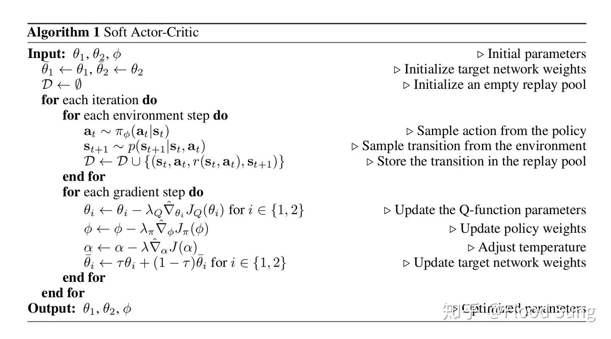
   
  
BP Network

 

为了更快速稳定的训练，作者引入了两个Q网络，然后每次选择Q值小的一个作为target Q值。更新Q，Policy及 \alpha 使用上文的（24）（27）（29）三个公式。

## 7 神经网络结构

虽然上面把算法流程确定了，但是如何构造policy的神经网络还是比较复杂的。下图是带V网络的神经网络结构图：

 

  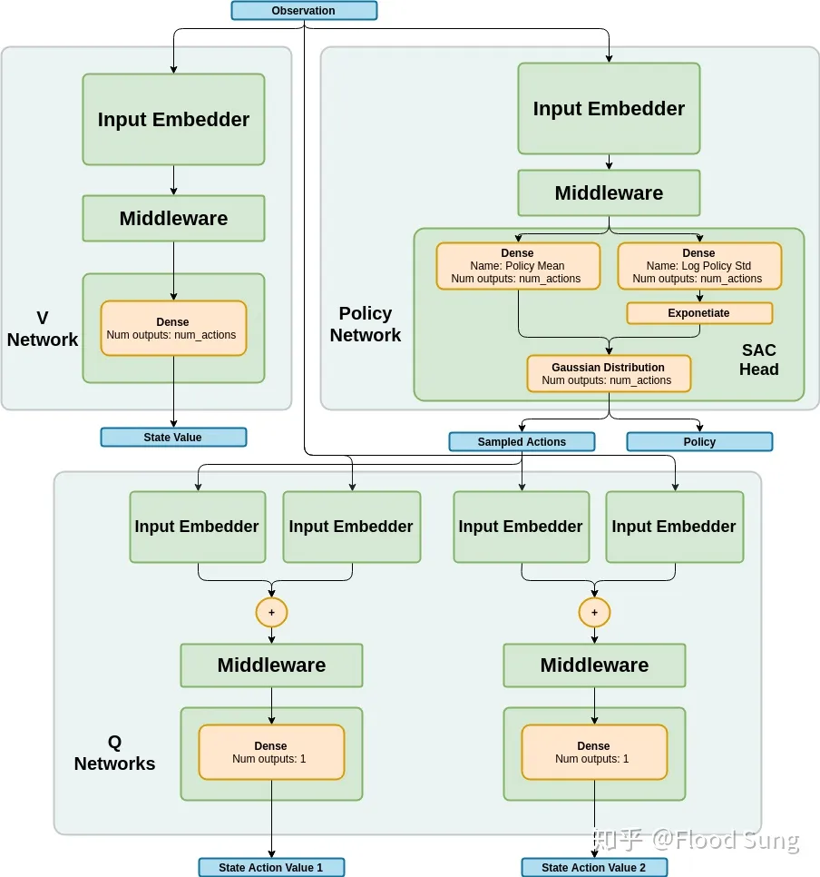
   
  
BP Network

 

https://nervanasystems.github.io/coach/components/agents/policy_optimization/sac.html

我们主要来探究一下Policy网络的设计。

见上图右上角的Policy网络，前面的input embedder和Middleware不用说，就是几层的MLP。然后，接下来神经网络分成两个分支，分别输出平均值mean $\mu$ 和log 标准差 log std 。然后使用exp得到std。

$$\pi\_\phi(s\_t) = \mu\_t,\log \sigma\_t \tag{30}$$

$$\sigma\_t = \exp(\log \sigma\_t)$$

正常输出这样的高斯分布作为action 的分布distribution是OK的，但是在实际中，这个action需要限定在一定范围内。因此，这里作者使用了squashing function tanh，将action限制在（-1,1）之间，即

$$\mathbf{u}\_t =\mu\_t + \varepsilon\_t \odot \sigma\_t $$

$$a\_t = \tanh (\mathbf{u}) \tag{31}$$

这里和上文的公式（26）对应，多了一个tanh。

那么这会导致分布的变化，从而影响log likelihood的计算，而这是我们计算SAC的loss必须的。作者在paper中给出了计算方法如下：

$$\log \pi(a|s)=\log \mu(\mathbf{u}|s)-\sum\_{i=1}^{D}{\log(1-\tanh^2(u\_i))} \tag{32}$$

其中 u_i 是 $\mathbf{u}$ 的第i个元素。这里的 $\mu(\mathbf{u}|s)$ 是没有加限制时的likelihood function也就是高斯分布的likelihood function似然函数。高斯分布的log likelihood直接使用pytorch的[Normal](https://link.zhihu.com/?target=https%3A//pytorch.org/docs/stable/_modules/torch/distributions/normal.html) class就可以获得。

## 8 其他细节

1）SAC里的target entropy 设计为

$$\mathcal{H}\_0 = -\dim (\mathcal{A}) \tag{33}$$

即-动作数量。

2）SAC paper里完全没有说明的训练时的episode设置。SAC设置为每一个episode采样1000次然后训练1000次。

3）在代码中SAC使用 log alpha作为更新的参数，而不是直接使用alpha如公式（25），这和输出log std是一样的，使用log有很大的正负范围，更方便网络输出。否则alpha或者std都是正值。

4）SAC有一个很大的问题，它的policy的目的是趋近于玻尔兹曼分布，但是实际实现的时候，为了能够tractable，选择了输出一个高斯，也就是让高斯趋近于玻尔兹曼分布。这意味着SAC本质上还是unimodal的算法，而不是soft q-learning的multi-modal。这使得SAC的创新性打了很大的折扣。但是算法效果确实还是不错的。

## 9 小结

本文从理论到具体实现层面剖析了Soft Actor-Critic这一目前极强的DRL算法，基本上理解了本文的分析，对于代码的实现也就可以了然一胸了。

由于本人水平有限，前面的理论分析恐有错误，望批评指正！

ref:
[1]. https://zhuanlan.zhihu.com/p/70360272

---

> 作者: [Jian YE](https://github.com/jianye0428)  
> URL: https://jianye0428.github.io/posts/sac/  

