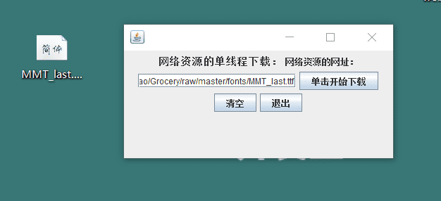

# java 实现一个单线程的资源下载器


> 实现一个简单的基于单线程的资源下载器，如图所示，用户可以任意指定下载资源的链接地址，系统根据该地址判断资源是否存在，如果存在，则将该资源下载到本地。

<!--more-->

## GUI 设计基本流程

先记录一下 GUI 设计的基本流程：

1. 根据需要从相应的顶层容器继承（如果创建窗体就继承 JFrame，对话框就继承 JDialog），新建一个子类。
2. 然后设置顶层容器的属性，包括大小、位置、标题和关闭事件等。
3. 设置界面上 GUI 组件的事件响应。 `public void actionPerformed(ActionEvent e) {}`
4. 向顶层容器上添加 GUI 组件，并设置布局。（通常利用 JPanel 组件先作为微型容器）
5. 创建新建子类的实例，调用 setVisible(true) 方法显示页面。（也可以直接在子类中设置 setVisible(true)）

## 实现代码

```java
package cn.lruihao.base;

import java.awt.FlowLayout;
import java.awt.Font;
import java.awt.HeadlessException;
import java.awt.event.ActionEvent;
import java.awt.event.ActionListener;
import java.io.FileOutputStream;
import java.io.InputStream;
import java.net.URL;
import java.net.URLConnection;

import javax.swing.JButton;
import javax.swing.JFrame;
import javax.swing.JLabel;
import javax.swing.JOptionPane;
import javax.swing.JPanel;
import javax.swing.JTextField;

public class SingleThreadDown extends JFrame implements ActionListener {
	private final JPanel panel=new JPanel();
	private final JLabel label1=new JLabel("网络资源的单线程下载：");
	private final JLabel label2=new JLabel("网络资源的网址：");
	JButton StartButton = new JButton("单击开始下载");
	JButton resetButton = new JButton("清空");
	JButton exitButton = new JButton("退出");
	JTextField urlField  = new JTextField(20);

	public SingleThreadDown() {
		panel.setLayout(new FlowLayout()); //布局管理器
		label1.setFont(new Font("雅黑",Font.BOLD,15));
		panel.add(label1);
		panel.add(label2);
		panel.add(urlField);
		panel.add(StartButton);
		panel.add(resetButton);
		panel.add(exitButton);
		setContentPane(panel);
		setSize(400,200);
		setLocation(400,400);
		setVisible(true); //面板可视化，也可以在 main 中通过 JFrame 子类对象调用方法设置
		setDefaultCloseOperation(JFrame.EXIT_ON_CLOSE); //默认关闭事件
		StartButton.addActionListener(this);//添加点击事件，传入 ActionListener 对象，由于子类继承了 ActionListener 接口，所以 this
		resetButton.addActionListener(this);
		exitButton.addActionListener(this);
	}

	public void download(String address) throws Exception {
		URL url = new URL(address);
		URLConnection urlcon = url.openConnection();
		urlcon.connect();
		InputStream in=urlcon.getInputStream();//获取的字节流对象
		String filePath = url.getFile();
		int pos=filePath.lastIndexOf("/"); //"/"分割的最后一个串的下标
		String fileName = filePath.substring(pos+1);
		FileOutputStream out = new FileOutputStream("C:\\Users\\李瑞豪、\Desktop\\"+fileName);
		byte[] b = new byte[1024];
		int len=0;
		while((len=in.read(b,0,1024))!=-1) {
			out.write(b,0,len);
		}
		out.close();
		in.close();
		JOptionPane.showMessageDialog(this, "下载完毕");
	}

	@Override
	public void actionPerformed(ActionEvent e) {
		if(e.getSource()==StartButton) {
			if("".equals(urlField.getText())){
				JOptionPane.showMessageDialog(this, "请输入资源地址");
			}
			String url = urlField.getText();
			try {
				download(url);
			} catch (Exception e1) {
				JOptionPane.showMessageDialog(this, "资源地址有误，请检查~");
				e1.printStackTrace();
			}
		}else if(e.getSource()==resetButton) {
			urlField.setText("");
		}else {
			System.exit(0);
		}

	}

	public static void main(String[] args) {
		new SingleThreadDown();

	}

}
```

## 运行结果测试

通过`https://github.com/Lruihao/Grocery/raw/master/fonts/MMT_last.ttf`下载沐目体 ttf 字体文件，稍微等待一下弹出对话框“下载完毕”，经检查下载内容正常。




---

> 作者: [Jian YE](https://github.com/jianye0428)  
> URL: https://lruihao.cn/posts/singlethreaddown/  

